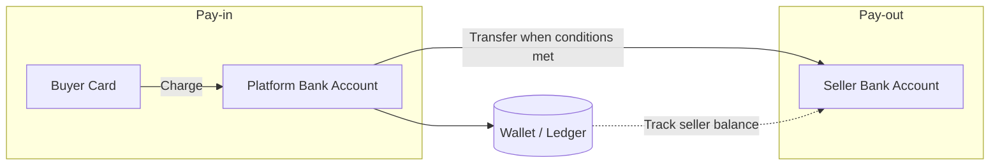
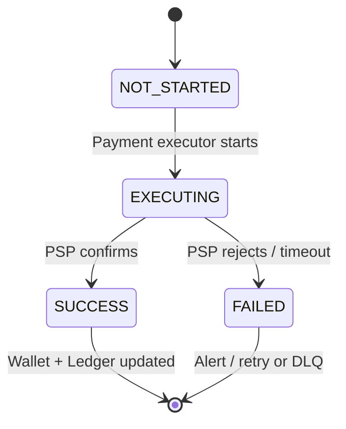
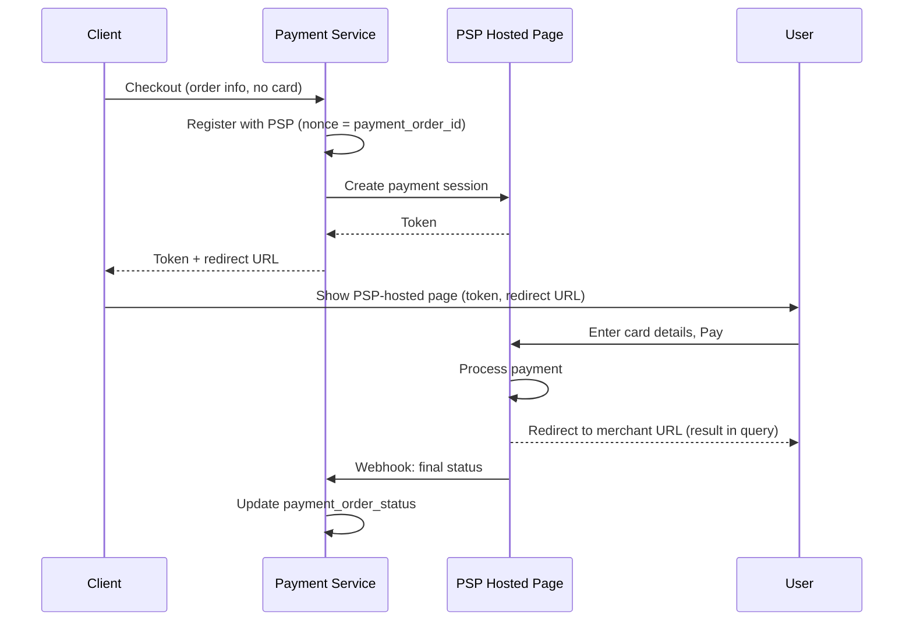
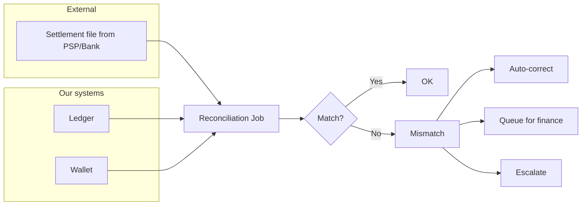
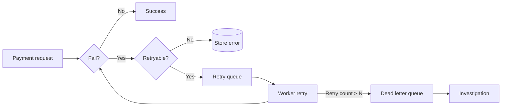
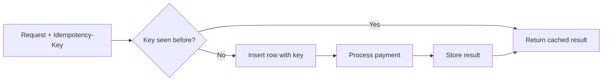

E-commerce runs on payments. Every "Place order" needs a system that moves money from buyer to seller—reliably, without charging twice or losing track of money. This post walks through how to design that: what to build, how money flows (pay-in vs pay-out), which parts do what, and how to handle failures and retries without double-charging.

---

# Payment Gateway & Payment System: How It Fits Together

A **payment system** is what moves money in a transaction—the rules, services, and tech that make paying and getting paid work. For a site like Amazon, the payment backend does two main things: (1) take money from the customer when they pay (pay-in), and (2) send money to sellers later (pay-out). If we get it wrong, we can lose money, charge people twice, or lose trust. So we focus on doing it correctly and handling failures well, not just on handling huge volume.

Below we look at what to build, how money flows, which parts do what (payment service, executor, PSP, ledger, wallet), and how to handle failures and retries without charging customers twice.

---

## 1. What Are We Building? (Scope and Requirements)

"Payment system" can mean different things: a wallet (Apple Pay, Google Pay), a backend that processes payments (like PayPal or Stripe), or the whole checkout flow. So we need to be clear about scope first.

**Questions to clarify:**

- **What are we building?** A payment backend for an e-commerce site. When a customer places an order, this system handles all money movement.
- **What payment methods?** In real life: credit cards, PayPal, bank cards, etc. Here we use credit card as the main example.
- **Do we process cards ourselves?** No. We use a third-party payment provider (Stripe, Braintree, Square, etc.—often called a PSP).
- **Do we store card numbers?** No. For security and compliance (e.g. PCI DSS), the PSP handles card data; we don’t store it.
- **How much traffic?** Example: 1 million transactions per day.
- **Do we pay sellers?** Yes. We need to send money from the platform’s account to sellers’ bank accounts (e.g. monthly).
- **What if our data and the PSP’s don’t match?** We have many internal services (accounting, ledger) and external ones (PSP, banks). When something fails, our records can get out of sync. We need **reconciliation**—periodically comparing and fixing mismatches.

From that we get a clear list of what the system must do (functional) and how reliable it must be (non-functional).

### What the system must do (functional)

- **Pay-in**: Take money from the customer (e.g. charge the card) and have it land in the platform’s account.
- **Pay-out**: Send money from the platform’s account to sellers (e.g. to their bank accounts).

### How reliable it must be (non-functional)

- **Reliability**: When a payment fails, we handle it clearly—retry when it makes sense, put repeatedly failing ones in a “failed” queue for people to check, and keep a clear status for each payment.
- **Reconciliation**: Regularly compare our records (payment system, accounting, ledger) with the PSP’s and banks’, and fix any mismatches.

### Rough scale (back-of-the-envelope)

- **1 million transactions per day** → about **10 transactions per second** (1,000,000 ÷ 100,000 seconds).
- 10 per second is not huge for a database. The hard part is **getting every payment right and keeping data consistent**, not handling massive traffic.

---

## 2. Big Picture: Pay-In and Pay-Out

The design has two main flows, matching how money actually moves.

### Pay-in vs pay-out (e.g. Amazon)

- **Pay-in**: Buyer pays → money goes from the buyer’s card to the **platform’s** bank account. The platform holds the money; the seller’s share is tracked internally (e.g. in a wallet/ledger).
- **Pay-out**: When conditions are met (e.g. goods delivered), the platform sends the seller’s share from the platform’s account to the **seller’s** bank account.

So: pay-in = money in; pay-out = money out to sellers.

---

## 3. Pay-In Flow: Parts and Steps

The pay-in flow uses several parts that work together.

### 3.1. Main parts

| Part | What it does |
|------|----------------|
| **Payment service** | Receives payment requests, runs risk checks (e.g. anti-fraud, anti–money laundering), and runs the whole flow. Only continues if the payment passes checks. |
| **Payment executor** | Does one payment order at a time via the PSP. One “place order” can have several orders (e.g. cart with items from different sellers). |
| **Payment Service Provider (PSP)** | The company that actually moves the money (e.g. charges the card). They talk to card networks (Visa, Mastercard, etc.) and banks. |
| **Card schemes** | Visa, Mastercard, Discover, etc.—the networks that run card payments. |
| **Ledger** | The book of all transactions (who paid whom, how much). Used for reports, revenue, and reconciliation. |
| **Wallet** | Stores each seller’s balance (and can track how much a user has paid in total). |

### 3.2. Step-by-step pay-in

1. User clicks “Place order” → we create a **payment event** and send it to the payment service.
2. Payment service saves the event and runs **risk checks** (e.g. anti-fraud).
3. One event can include **several payment orders** (e.g. one checkout with items from several sellers). For each order, the payment service calls the **payment executor**.
4. Payment executor saves the order and asks the **PSP** to charge the card.
5. If that succeeds, the payment service updates the **wallet** (seller’s balance).
6. Then it updates the **ledger** (double-entry: debit buyer, credit seller).
7. When all orders in that checkout are done, we mark the payment event complete. A **scheduled job** can watch for orders that are stuck and alert the team.

---

## 4. APIs and Data Stored

### 4.1. Payment API

**POST /v1/payments** — Create and run a payment (one “place order”).

| Field | Description | Type |
|-------|-------------|------|
| buyer_info | Buyer information | json |
| checkout_id | Globally unique checkout ID | string |
| credit_card_info | Encrypted card data or PSP token | json |
| payment_orders | List of payment orders | list |

Each **payment_order**:

| Field | Description | Type |
|-------|-------------|------|
| seller_account | Who receives the money | string |
| amount | Transaction amount | string |
| currency | ISO 4217 currency | string |
| payment_order_id | Unique ID for this payment; also used so we never charge twice (idempotency key) | string |

**Why is amount a string?** So we don’t run into rounding errors with decimals across different systems, and we can support very large or very small amounts. We store and send it as text; we only convert to numbers when we show or calculate.

**GET /v1/payments/{:id}** — Get the status of a payment order.

### 4.2. What we store (payment service)

Two main tables: **payment event** (one per “place order”) and **payment order** (one per seller/order in that checkout). For payments we care more about **stability and clear audit trail** than raw speed, so a normal relational database with transactions (ACID) is a good fit.

**Payment event**

| Name | Type |
|------|------|
| checkout_id | string (PK) |
| buyer_info | string |
| seller_info | string |
| credit_card_info | (PSP-dependent) |
| is_payment_done | boolean |

**Payment order**

| Name | Type |
|------|------|
| payment_order_id | string (PK) |
| buyer_account | string |
| amount | string |
| currency | string |
| checkout_id | string (FK) |
| payment_order_status | enum: NOT_STARTED, EXECUTING, SUCCESS, FAILED |
| wallet_updated | boolean |
| ledger_updated | boolean |

Status goes: NOT_STARTED → EXECUTING → SUCCESS or FAILED. When we get SUCCESS, we update the wallet and then the ledger. When every order in that checkout is successful, we set `is_payment_done` to true.

---

## 5. Double-Entry Ledger and Hosted Payment Page

### 5.1. Double-entry ledger (two sides to every transaction)

Every transaction is written **twice** with the same amount: one side is a debit, the other a credit. Example: user pays a seller $1:

| Account | Debit | Credit |
|---------|-------|--------|
| buyer | $1 | |
| seller | | $1 |

The total of all entries is always zero (every debit has a matching credit). That way we can trace every cent and keep the books consistent. In code we often use a ledger where we only ever *add* new rows and never change or delete old ones.

### 5.2. Hosted payment page (security and PCI)

Most companies **do not** store real card numbers (PCI DSS rules are strict). Instead they use a **hosted payment page** from the PSP: the customer types their card details on the PSP’s page (or in the PSP’s app/SDK). Our system never sees the card number. The PSP gives us a **token** or confirmation; we only store that token and use it for later charges or for reconciliation.

---

## 6. Pay-Out Flow

Pay-out is the opposite direction of pay-in:

- **Pay-in**: PSP moves money from buyer’s card → platform’s bank account.
- **Pay-out**: A **pay-out provider** (e.g. Tipalti or similar) moves money from the platform’s bank account → each seller’s bank account. This usually runs when conditions are met (e.g. goods delivered, or a monthly batch).

We don’t do pay-out ourselves because it comes with a lot of rules and paperwork. Pay-out providers handle things like: **tax** (withholding, reporting, different rules per country), **compliance** (anti-money laundering, know-your-customer for sellers), **reporting** (statements, audit trails), and **multi-currency / international transfers** (exchange rates, local payment methods, bank details in many countries). Using a dedicated provider keeps the platform out of that complexity and regulatory risk.

---

## 7. Making It Reliable: Failures, Retries, No Double Charge

In real systems, things fail and users sometimes click “Pay” twice. The design has to handle: duplicate clicks, timeouts, retries, and keeping our data in sync with the PSP’s.

### 7.1. Hosted payment page: step-by-step

With a **hosted payment page**:

1. Our app calls the payment service with order info (no card data).
2. Payment service **registers** the payment with the PSP: amount, currency, where to redirect the user after pay, and a **unique ID** (often the payment_order_id) so we only register once.
3. PSP returns a **token**; we save it.
4. We show the user the PSP’s payment page (or use the PSP’s SDK), with that token and the redirect URL. The user enters their card on the PSP’s page; the PSP charges the card.
5. When done, the PSP sends the user back to our site (e.g. with success/fail in the URL).
6. **In the background**, the PSP calls our **webhook** (a URL we gave them) with the final status. We update the payment status in our database from that webhook.

Because networks and systems can fail, we still need **reconciliation** to make sure our records match the PSP’s.

### 7.2. Reconciliation

**Reconciliation** means we regularly compare our records (ledger, wallet) with the PSP’s and the bank’s. Banks and PSPs often send a **settlement file** every day (list of transactions and balances). We load that and compare it to our ledger. When something doesn’t match, we either fix it automatically, send it to the finance team to fix, or escalate for investigation. This is how we catch and fix mismatches.  

### 7.3. When payments take a long time (e.g. 3D Secure, manual review)

Some payments don’t finish in a few seconds (e.g. extra security step like 3D Secure, or the PSP flags it for human review). The PSP gives us a “pending” status; we show that to the user and can offer a “check status” page. When the result is ready, the PSP tells us via **webhook** (or we poll them). So we have to support payments that stay “pending” for a while.

### 7.4. Calling other services: wait for reply vs fire-and-forget

- **Wait for reply (synchronous, e.g. HTTP)**: Simple, but if one service is slow or down, the whole request waits or fails.
- **Fire-and-forget (asynchronous, e.g. message queue like Kafka)**: We send a message and other services process it when they can. One payment can trigger several things (run payment, update analytics, send notification, etc.). For a payment system with many dependencies, this approach often scales and fails more gracefully.

### 7.5. When a payment fails: retry and “failed” queue

- **Clear status at every step**: We save the payment status at each stage. Then we always know whether to retry or refund.
- **Retry queue**: If the failure looks temporary (e.g. network blip), we put the request in a **retry queue**. Workers try again later, with increasing delay between attempts.
- **Dead letter queue (DLQ)**: If we’ve retried too many times, we move the request to a **failed queue** (DLQ) for people to look at. That way we don’t retry forever and we can isolate bad or stuck requests.

### 7.6. No double charges: “exactly once”

We want each payment to be charged **exactly once**—not zero times (lost) and not twice (double charge). We get there with two ideas:

- **Don’t miss a charge**: Use **retries** (with backoff) so we eventually process the payment if something failed temporarily.
- **Don’t charge twice**: Use **idempotency**: the same request always leads to the same result. If the user (or app) sends the same request again, we don’t charge again—we just return the result we already have.

**How idempotency works**: The client sends a unique **idempotency key** with each payment (e.g. checkout_id or payment_order_id). If we’ve already seen that key, we don’t charge again; we return the stored result. We also send that same key to the PSP so they can deduplicate on their side. In the database, we use a unique constraint on that key so we can only have one row per payment.

So: **retries** make sure we don’t lose a payment; **idempotency** makes sure we don’t charge twice. Together = exactly once from the customer’s point of view.

### 7.7. Keeping our data in sync

- **Inside our system**: Use idempotency + retries and a clear status for each order so we process each payment exactly once.
- **With the PSP**: Use the same idempotency key when we retry; plus **reconciliation** because the PSP’s data can be delayed or wrong sometimes.
- **If we use database replicas**: We either read and write only from the primary, or use a database that keeps replicas in sync, so we don’t make decisions on outdated data.

### 7.8. Security in short

| Risk | What we do |
|------|------------|
| Someone reads or changes data in transit | HTTPS, encryption, integrity checks |
| Someone intercepts between client and server | TLS, certificate pinning |
| Data loss | Replication, backups, snapshots |
| Too many requests (DDoS) | Rate limiting, firewall |
| Storing card numbers / PCI | Don’t store real card numbers; use tokens and hosted payment page (or a compliant vault) |
| Fraud | Address checks (AVS), CVV, risk scoring, behavior analysis |

---

## 8. Wrap-Up

A payment gateway for e-commerce is built around **pay-in** (money from customer to platform) and **pay-out** (money from platform to sellers). The main ideas:

- **Be clear on scope**: Who charges, who gets paid, who holds the money in between.
- **Use a PSP and hosted payment page**: Let the PSP handle card data and PCI; we use tokens and webhooks.
- **Double-entry ledger** and **wallet** to keep internal books and seller balances right.
- **Reconciliation** with the PSP and banks to find and fix mismatches.
- **No double charges**: idempotency keys (e.g. payment_order_id) plus retries and clear payment status.
- **Handle failures well**: Retry queue, failed queue (DLQ), clear status at each step, and support for payments that stay “pending” for a while.

Traffic (e.g. 10 payments per second) is not the main challenge; the hard part is **getting every payment right and keeping data consistent**. This post summarized how to think about designing a reliable payment gateway and backend.

