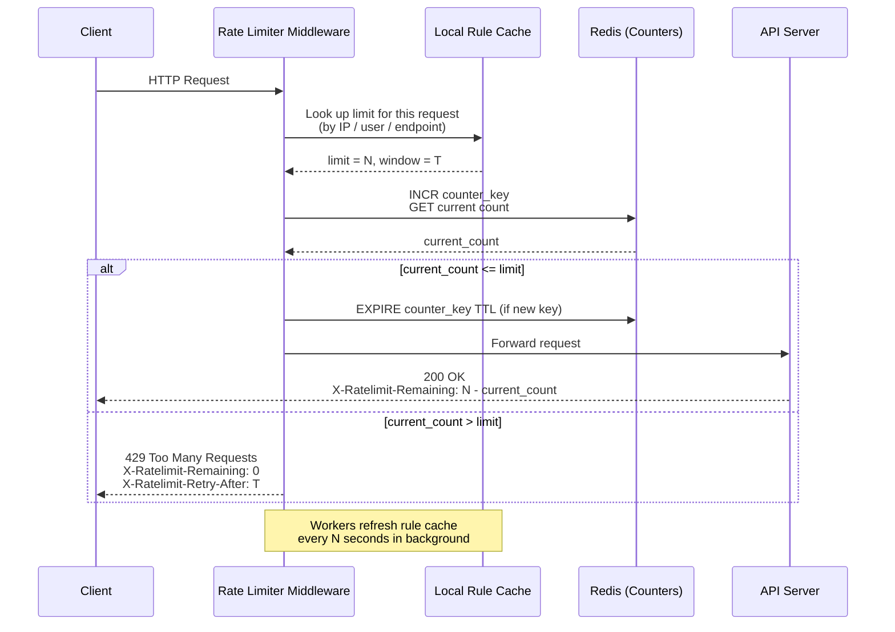

Rate limiting is everywhere. Twitter won't let you tweet more than 300 times in 3 hours. GitHub caps API requests at 5,000 per hour. Your login endpoint probably blocks anyone who tries 100 wrong passwords in a row. And yet, despite being so common, building a rate limiter that actually works in a distributed system is surprisingly nuanced.

This post walks through how to design one from scratch—from picking where to put it, to understanding the five major algorithms and their trade-offs, to dealing with the real headaches of distributed systems like race conditions and data synchronization.

---

# Designing a Rate Limiter

A rate limiter sits between clients and your servers. Its job: count how many requests a user (or IP, or API key) has made in a given time window, and reject anything that exceeds the limit.

Simple enough in concept. But the devil is in the details.

## 1. What Are We Actually Building?

Before jumping into algorithms, it's worth nailing down exactly what we need. Rate limiters can live in many places and serve many purposes, so scope matters.

**The core questions:**

- **Client-side or server-side?** Client-side rate limiting is unreliable—anyone can forge headers or bypass it. We want server-side enforcement.
- **What do we throttle on?** IP address, user ID, API key, endpoint, or some combination. The system should support flexible rules, not just one strategy.
- **Does this need to work across multiple servers?** Yes—in any real deployment, you'll have multiple rate limiter instances, so they need to stay in sync.
- **What does the user see when they're throttled?** A clear HTTP 429 response with headers telling them how long to wait.
- **Can it fail gracefully?** If the rate limiter itself goes down, we don't want to block all traffic. Fail open (let requests through) is usually preferred over fail closed.

With those requirements clear, let's figure out where to put the thing.

---

## 2. Where Does the Rate Limiter Live?

There are three broad options, each with real trade-offs.

### Option A: Inside the server

You implement rate limiting logic directly in your application code. This works fine for a simple service.


### Option B: As middleware

You add a rate limiter component that sits in front of your API servers, intercepting requests before they reach your business logic.


Here's how it looks in practice—when a client exceeds their limit, the middleware returns 429 before the request ever reaches your application:


### Option C: At the API Gateway (recommended for microservices)

Cloud API gateways (AWS API Gateway, Kong, Nginx, Cloudflare) have rate limiting built in. If you're already using one, this is often the easiest path—you get rate limiting without writing any code, and the gateway handles cross-cutting concerns in one place.

**When each makes sense:**
- Building a simple monolith? Middleware in your app is fine.
- Running microservices with an existing API gateway? Use the gateway.
- Need very custom rate limiting logic per service? Implement it in your language/framework.

---

## 3. The Five Algorithms

This is the core of the problem. Each algorithm makes different trade-offs between accuracy, memory usage, and implementation complexity. Knowing which to use—and why—is what actually matters.

### 3.1 Token Bucket

The most widely used algorithm. Think of it as a literal bucket:

- The bucket holds tokens, up to a maximum capacity.
- Tokens are added at a fixed rate (e.g., 2 per second).
- Each request consumes one token.
- If the bucket is empty, the request is rejected.


The request flow looks like this: check if there's a token, if yes consume it and allow the request, if no reject it.


What this looks like concretely with a full bucket at the start:


**The key property of token bucket**: it allows **bursting**. If a user makes no requests for a while, their bucket fills up. Then they can send a burst of requests all at once. This is often desirable behavior—it matches how humans actually use APIs (idle for a bit, then a flurry of activity).

**Where it's used**: Amazon and Stripe both use token bucket for their API rate limiting.

**Parameters you need to tune**:
- Bucket capacity (max burst size)
- Refill rate (sustained throughput)

You'll typically have a separate bucket per user/IP/key, not one global bucket. Getting the right capacity and refill rate for your use case requires thought.

**Trade-offs**: Simple, memory-efficient, allows bursts. But two parameters to tune, and getting them wrong can either allow too much traffic or frustrate users with unnecessary throttling.

---

### 3.2 Leaking Bucket

Think of a bucket with a hole in the bottom. Requests come in and get queued. A worker drains the queue at a fixed rate.


If the queue fills up, new requests are dropped.

**The key property of leaking bucket**: it produces **stable, predictable outflow**. The downstream system always sees a consistent request rate, regardless of how bursty the input is. This is great for protecting services that can only handle a fixed load.

**Where it's used**: Shopify uses a variant of leaking bucket for their storefront API.

**The downside**: Bursts fill the queue with "old" requests. Under heavy load, new requests might be waiting behind stale ones. If a user sends a burst, their most recent request might be stuck behind requests from 10 seconds ago—which feels bad.

**Trade-offs**: Stable outflow, memory-efficient. But burst handling is poor, and users may experience high latency under load.

---

### 3.3 Fixed Window Counter

Divide time into fixed windows (e.g., each minute). Keep a counter per window. Increment on each request; reject if over the limit.


Easy to implement, easy to reason about. The problem is at window boundaries:


Say your limit is 5 requests per minute. A user sends 5 requests at 00:59, then 5 more at 01:01. Each window shows 5 requests—within limit. But in the span of 2 seconds, they actually sent 10 requests. This is the **boundary burst problem**.

**Trade-offs**: Simple and memory-efficient. But vulnerable to boundary bursts that can double your effective throughput. For strict rate limiting, this is a real issue.

---

### 3.4 Sliding Window Log

Instead of counters, keep a log of all request timestamps. When a request comes in:

1. Remove all timestamps older than `now - window_size`
2. Check how many timestamps remain
3. If under the limit, add the current timestamp and allow the request
4. If over, reject


**The key property**: this is the most **accurate** algorithm. No boundary burst problem. At any moment, the count reflects exactly how many requests happened in the last N seconds.

**The downside**: memory. You store every request timestamp, even for rejected requests. Under high load with many users, this adds up fast.

**Trade-offs**: Most accurate, no boundary issues. But memory-intensive—poor fit for high-traffic systems or when you have many unique clients.

---

### 3.5 Sliding Window Counter (The Hybrid)

This is the sweet spot for most production systems. It combines fixed window counters with a weighted approximation of the sliding window:

```
requests_in_current_window = current_window_count + previous_window_count × (overlap_ratio)
```

Where `overlap_ratio` is how much of the previous window overlaps with the current sliding window.

Example: limit is 7 req/min. Previous window had 5 requests. Current window (so far) has 3. The window is 30% into the current minute, so 70% of the previous window overlaps.

```
estimated_count = 3 + 5 × 0.7 = 3 + 3.5 = 6.5 → under limit → allow
```


**The key property**: smooths out the boundary burst problem without storing individual timestamps. Uses far less memory than sliding window log.

**The caveat**: it's an approximation. It assumes requests in the previous window were evenly distributed, which may not be true. In practice, this approximation is close enough—Cloudflare found less than 0.003% error in their testing.

**Trade-offs**: Good accuracy, low memory, smoothed traffic. But it's an approximation, not exact.

---

### Which Algorithm Should You Use?

| Algorithm | Burst handling | Memory | Accuracy | Best for |
|-----------|---------------|--------|----------|----------|
| Token bucket | Excellent | Low | Good | APIs that allow bursting (most use cases) |
| Leaking bucket | Poor (queued) | Low | Good | Stable outflow to downstream services |
| Fixed window counter | Poor (boundary) | Low | Moderate | Simple cases where boundary bursts are acceptable |
| Sliding window log | Good | High | Excellent | Low-traffic, high-accuracy requirements |
| Sliding window counter | Good | Low | Very good | Most production rate limiters |

---

## 4. High-Level Architecture

With an algorithm chosen, the architecture is straightforward. Rate limiters need fast reads and writes, so they use an in-memory cache—Redis is the standard choice.


Two Redis commands do the heavy lifting:
- **INCR**: Atomically increment a counter
- **EXPIRE**: Set a TTL so counters auto-delete when their window ends

The flow: request arrives → rate limiter checks Redis → if under limit, increment counter and forward to API server → if over limit, return 429.

---

## 5. Detailed System Design

The full picture has a few more moving parts: the rules engine, the middleware, and the cache layer.


There are four distinct components here, and they each play a specific role. Let's walk through how they fit together.

### Components

**Rules store (disk)**: A database or file system that holds rate limiting rules—things like "the login endpoint allows 5 requests per minute per IP" or "marketing messages are capped at 5 per day." These are not hardcoded; they live as config so you can update limits without a code deploy. Lyft's open-source rate limiter uses YAML:

```yaml
domain: messaging
descriptors:
  - key: message_type
    value: marketing
    rate_limit:
      unit: day
      requests_per_unit: 5
```

```yaml
domain: auth
descriptors:
  - key: auth_type
    value: login
    rate_limit:
      unit: minute
      requests_per_unit: 5
```

**Workers**: Background processes that periodically pull rules from the store and push them into the rate limiter's local cache. The key point is that workers do this asynchronously—they don't block request handling. Rules are stale by at most one polling interval, which is usually fine. If you need instant rule propagation, you can use a pub/sub mechanism instead of polling.

**Cache (local)**: An in-memory store inside the rate limiter middleware itself (not Redis—this is a local process-level cache). It holds a copy of the rules so the middleware can look up limits without any network call. This is what makes rule lookup fast: no disk, no Redis, just memory.

**Redis (shared counter store)**: The single source of truth for request counts. All rate limiter instances share the same Redis, so counters are consistent regardless of which server handles a request. Redis is a good fit here because it's fast, supports atomic operations (INCR), and TTL-based expiry (EXPIRE) cleans up stale keys automatically.

### How a Request Flows Through the System

Here's the full request path:



Step by step:

1. **Request arrives** at the rate limiter middleware. The middleware extracts the relevant identity from the request—this could be the user ID from a JWT, the IP address, the API key, or a combination.

2. **Rule lookup**: The middleware looks up the applicable limit in its local cache. "What's the limit for this endpoint + this user type?" This is a pure in-memory operation—microseconds, no network.

3. **Counter check**: The middleware builds a Redis key for the current window (e.g., `rate:user:42:login:2026033109` for user 42 on the login endpoint in the 9am window). It calls `INCR` on that key. Redis returns the new counter value after incrementing.

4. **Decision**:
   - If the new counter value is ≤ the limit: the request is allowed. The middleware sets a TTL on the key if it was just created (so it auto-deletes at window end), then forwards the request to the API server.
   - If the new counter exceeds the limit: return 429 immediately, without touching the API server at all.

5. **Headers on the way out**: Whether allowed or rejected, the middleware adds rate limit headers to the response so the client knows where they stand.

6. **Background**: Workers are continuously (every N seconds) checking the rules store for updates and refreshing the local cache. This runs completely independently of request handling.

### Why This Separation Matters

The rules cache and the counter store are kept separate intentionally:

- **Rules** change infrequently (maybe a few times a day), are read-heavy, and can tolerate being slightly stale. Local memory is perfect.
- **Counters** change on every single request, need to be consistent across all servers, and must support atomic increments. Centralized Redis is required.

Mixing the two—e.g., putting counters and rules both in Redis—would work, but it couples configuration management to the hot path and adds unnecessary load to Redis for something that doesn't need to be there.

### Response Headers

When a request is throttled, return HTTP **429 Too Many Requests** with headers that tell the client exactly what's happening:

```
X-Ratelimit-Remaining: 0
X-Ratelimit-Limit: 100
X-Ratelimit-Retry-After: 30
```

These headers matter for client behavior. A well-behaved client reads `Retry-After` and backs off the appropriate amount of time. A poorly written client ignores it and hammers your 429 endpoint—which creates its own load problem and achieves nothing for the client.

---

## 6. Distributed System Challenges

This is where things get interesting. A single-server rate limiter is easy. A distributed one has two nasty problems: race conditions and synchronization.

### 6.1 Race Conditions

Consider what happens when two requests arrive simultaneously for the same user:


Both requests read the counter (say, 4). Both check: 4 < limit (5)? Yes, allow. Both increment to 5. But we just allowed two requests when only one should have gone through if the counter was already at 4.

This read-check-write sequence is a classic race condition. In Redis, you'd normally use transactions or atomic operations to solve this.

**Two solutions:**

**Lua scripts**: Redis executes Lua scripts atomically. You can write the entire "read, check, increment" logic as a Lua script, and Redis guarantees no other command runs between your reads and writes.

```lua
local key = KEYS[1]
local limit = tonumber(ARGV[1])
local current = redis.call('GET', key)
if current and tonumber(current) >= limit then
  return 0
else
  redis.call('INCR', key)
  redis.call('EXPIRE', key, ARGV[2])
  return 1
end
```

**Redis sorted sets**: For sliding window log, store timestamps as scores in a sorted set. Use `ZREMRANGEBYSCORE` to remove old entries and `ZCARD` to count current ones—all atomically with a pipeline.

### 6.2 Synchronization

If you run multiple rate limiter servers (which you will, for availability), they need to share state. Without coordination, each server keeps its own counter—and a user can exceed the limit by hitting different servers.


The naive solution—sticky sessions—forces a user to always hit the same server. This works but creates hot spots and makes scaling awkward.

The right solution: **centralized Redis** (or a Redis cluster):


All rate limiter servers read from and write to the same Redis. The counters are shared, so it doesn't matter which server handles a request. Redis's single-threaded command execution makes the atomic operations work correctly across all servers.

---

## 7. Performance at Scale

### Multi-Region / Multi-Datacenter

Centralized Redis is great for correctness, but it creates a bottleneck and adds latency if your users are globally distributed. A user in Tokyo routing to a Redis in Virginia adds ~150ms to every rate limit check—that's unacceptable.

The solution: deploy rate limiters at edge nodes close to users, with eventual consistency between regions.


This trades strict accuracy for performance. A user might temporarily exceed their limit if they're bouncing between regions, but the counters will sync eventually. For most use cases, this is an acceptable trade-off.

### Local Cache

Beyond centralized Redis, rate limiters should also keep a local in-process cache of the rules (updated periodically). This avoids the overhead of a Redis call just to look up what the limit is—only the counter lookup/increment needs to hit Redis.

### Monitoring

Once deployed, you need to track:
- **Throttle rate per endpoint/user**: Are legitimate users being blocked?
- **Algorithm effectiveness**: Is the current algorithm actually preventing abuse?
- **Redis latency**: The rate limiter adds latency to every request; you want this in the single-digit milliseconds

If you see too many valid requests getting throttled, your limits might be too tight. If you're still seeing abuse get through, your limits are too loose or the algorithm isn't the right fit.

---

## 8. Things the Basics Don't Cover

### Hard vs. Soft Rate Limiting

- **Hard limit**: Strictly enforce the cap. Request 101 when the limit is 100? Rejected.
- **Soft limit**: Allow brief overages. Maybe you allow 110% of the limit for a short window before throttling. Useful for bursty legitimate traffic (end of a sale, viral content).

Most implementations do hard limiting because it's simpler to reason about and enforce.

### Layer 3 vs. Layer 7

Most discussion of rate limiting assumes Layer 7 (HTTP, application layer). But you can also rate limit at Layer 3 (IP packet level) using firewall rules or BGP-based filtering. Layer 3 rate limiting is useful for blocking volumetric DDoS attacks before they even hit your application—you're filtering raw packet floods, not HTTP requests.

For most application rate limiting use cases, Layer 7 is what you want.

### Client Best Practices

The rate limiter is one side of the story. Well-behaved clients should:
- **Read rate limit headers** and respect `Retry-After`
- **Use exponential backoff** when retrying on 429—don't immediately hammer the endpoint again
- **Cache responses** where possible to reduce unnecessary API calls
- **Batch requests** where the API supports it, instead of firing one request per item

A client that ignores 429s and retries immediately creates a feedback loop—it keeps getting throttled and keeps retrying, generating load without getting any useful work done.

### Idempotency for Retries

One subtle issue: if a request succeeds but the client doesn't get the response (network failure), the client might retry. Without idempotency, you process the request twice. For write operations (payments, posts, etc.), this is a problem.

Rate limiting doesn't solve this directly—that's what idempotency keys are for—but it's worth thinking about in the same breath, since both deal with "what happens when clients send the same request multiple times."

---

## 9. Summary

Designing a rate limiter comes down to a few key decisions:

**Where does it live?** API gateway is the pragmatic choice for most microservice setups. Middleware in your app if you're keeping it simple.

**Which algorithm?** Token bucket for most APIs (allows bursting, easy to implement). Sliding window counter if you need better accuracy without high memory cost. Leaking bucket if you need stable outflow to protect a downstream service.

**How do you handle distributed state?** Centralized Redis solves synchronization. Lua scripts or sorted sets solve race conditions. Edge-local counters with eventual consistency solve the global latency problem (at the cost of strict accuracy).

**What do you communicate to clients?** Always return 429 with `X-Ratelimit-Remaining`, `X-Ratelimit-Limit`, and `X-Ratelimit-Retry-After`. Make it easy for clients to behave well.

The hardest part of rate limiting isn't the algorithm—it's getting the parameters right. Limits that are too tight frustrate users. Limits that are too loose don't actually protect you. Monitor, iterate, and tune based on real traffic patterns.
