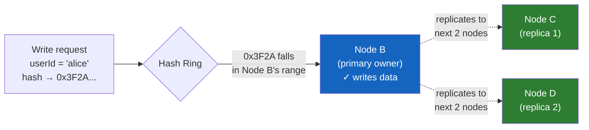
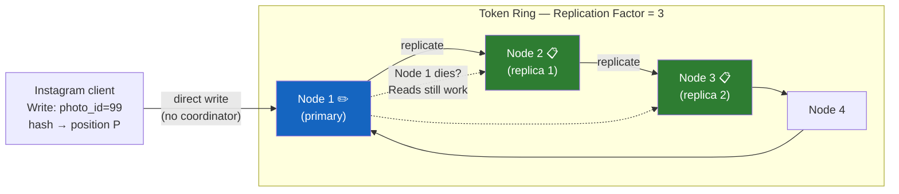
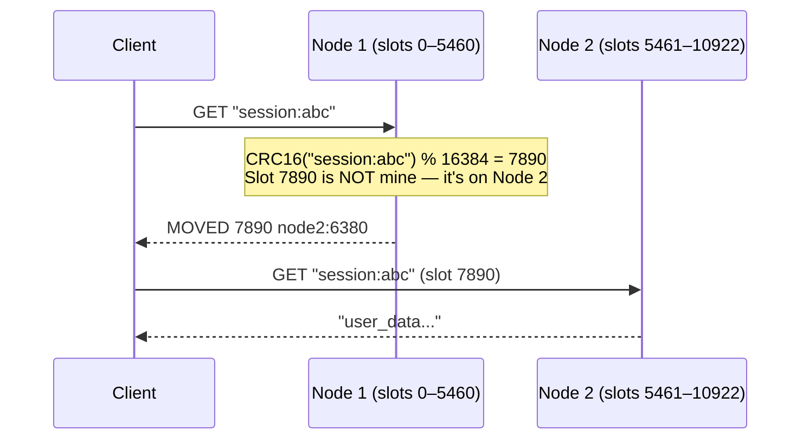
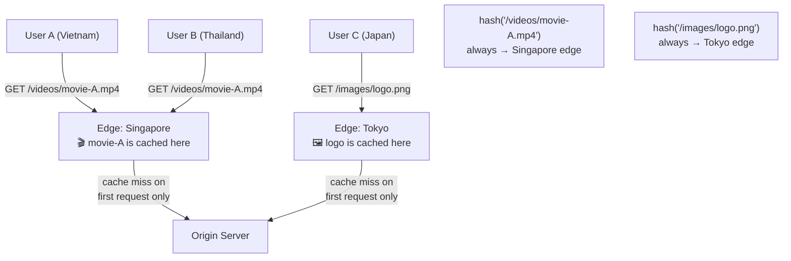
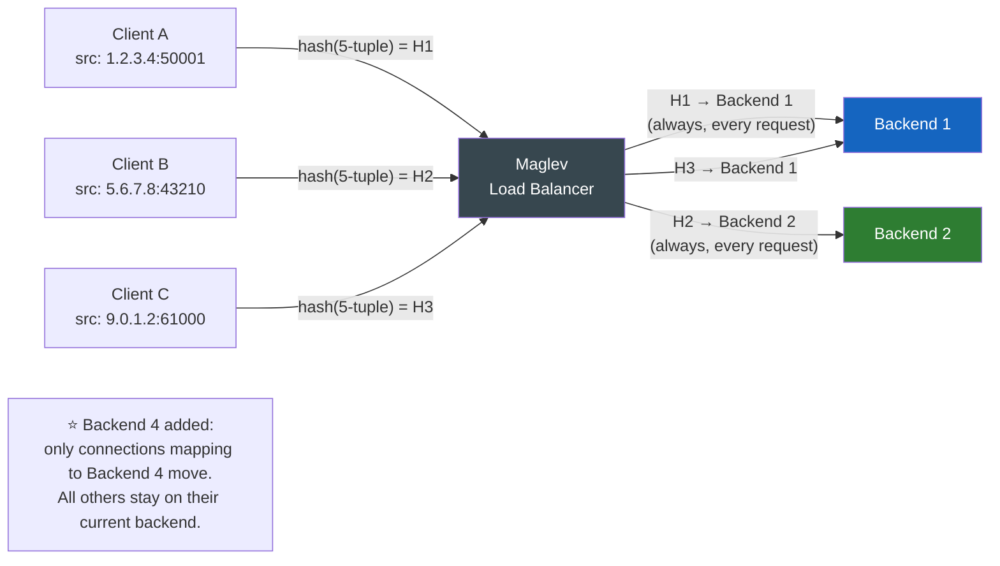
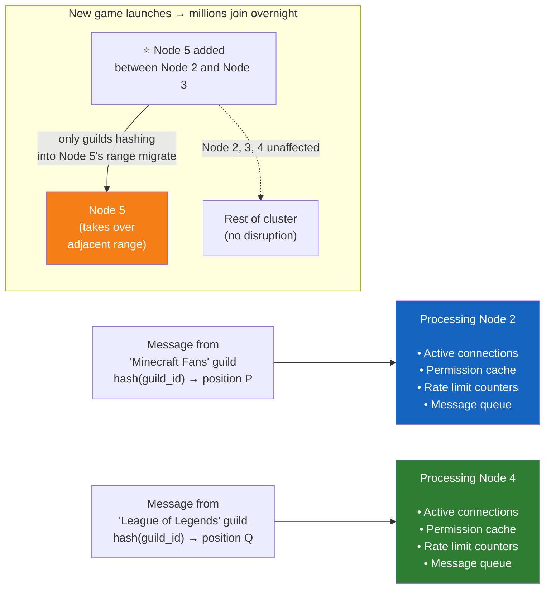

Here's a question that sounds simple: you have 4 cache servers and a million keys. How do you decide which key goes to which server?

The obvious answer is modulo hashing: `serverIndex = hash(key) % N`. Hash the key, take the remainder when divided by the number of servers, and you know where the key lives. Elegant, fast, works great.

Until you need to add a fifth server.

Or until one of your four servers crashes at 3am.

At that point, N changes — and almost every single key now maps to a different server than it did before. Your entire cache becomes useless in an instant. Every cache miss hits your database simultaneously. Your on-call engineer's phone starts screaming. This is a cache storm, and it's one of the more unpleasant distributed systems failure modes.

Consistent hashing is the technique that solves this. It's the reason you can add servers to DynamoDB, resize a Cassandra cluster, or lose a node in a Redis cluster without your entire system collapsing. This post walks through how it works from first principles — and then goes into how it actually shows up in the systems you use today.

---

# The Rehashing Problem

Let's make the problem concrete. Say you have 4 servers and you're using `serverIndex = hash(key) % 4` to distribute keys.

With 8 keys, the distribution might look like this:

Each server handles roughly 2 keys. This is great — balanced load, everyone's happy.

Now server 1 goes down. You have 3 servers left, so the formula becomes `hash(key) % 3`. Here's what the distribution looks like now:

Look at how many keys moved. Most of them. Key0, which was perfectly happy on server 1, now maps to a different server. Key3, key4, key5, key7 — they all moved. The only way a key stays on the same server is by coincidence, if `hash(key) % 4` and `hash(key) % 3` happen to give the same remainder.

**This is the rehashing problem.** When N changes, nearly all keys must be remapped. For a cache, this means a sudden wave of cache misses all hitting your database at once — exactly what caching was supposed to prevent.

What we want instead is a system where adding or removing a server only causes the *minimum necessary* keys to move. If you add a server, only the keys that should now live on that new server should move. If you remove a server, only the keys that *were* on that server need to find a new home. Everything else should stay put.

That's exactly what consistent hashing delivers.

---

# The Core Idea: A Hash Ring

Consistent hashing starts with a simple conceptual shift. Instead of thinking about the hash space as a line from 0 to some maximum value, we bend it into a circle.

Take SHA-1 as our hash function. It produces values from 0 to 2^160 - 1 — a very large number, but still a finite range. Normally you'd picture this as a number line:

Now connect the two ends. The smallest value and the largest value become neighbors:

This is the **hash ring**. Both servers and keys will be placed on this ring using the same hash function. The position of a server on the ring is determined by hashing the server's identifier — its name or IP address.

## Placing Servers on the Ring

Hash each server's identifier to get its position on the ring. With four servers, you might get a distribution like this:

Server 0, 1, 2, and 3 are now spread around the ring. The exact positions depend on the hash function — they won't be evenly spaced, but that's okay for now.

## Placing Keys on the Ring

Keys get hashed onto the same ring using the same hash function:

## The Lookup Rule

Here's the clever part. To find which server a key belongs to, you start at the key's position on the ring and **move clockwise** until you hit a server. That server owns the key.

- key0 moves clockwise and hits server 0
- key1 moves clockwise and hits server 1
- key2 moves clockwise and hits server 2
- key3 moves clockwise and hits server 3

No modulo. No N. The lookup only cares about which server is next in the clockwise direction.

---

# Why This Solves the Rehashing Problem

Now watch what happens when the cluster changes.

## Adding a Server

You add server 4, which hashes to a position between server 3 and server 0 on the ring:

Only key0 is affected. Before server 4 existed, key0 moved clockwise and hit server 0 first. Now server 4 is in the way, so key0 goes to server 4 instead. Every other key still hits the same server it always did — nothing else changed.

## Removing a Server

Server 1 goes offline:

Only key1 is affected. It used to land on server 1; now it keeps moving clockwise and hits server 2. Key0, key2, key3 — their clockwise journeys are completely unchanged.

This is the fundamental guarantee of consistent hashing: **when you add or remove a server, only the keys in the adjacent range need to move.** Everything else stays exactly where it was.

According to Wikipedia's definition:

> "When a hash table is re-sized and consistent hashing is used, only k/n keys need to be remapped on average, where k is the number of keys, and n is the number of slots. In contrast, in most traditional hash tables, a change in the number of array slots causes nearly all keys to be remapped."

---

# Two Problems with the Naive Approach

The basic ring idea is elegant, but it has two practical problems.

**Problem 1: Uneven partitions.** Because server positions are determined by hashing their identifiers, there's no guarantee they'll be evenly spaced around the ring. You can end up with one server responsible for half the ring and another responsible for 5% of it:

This creates imbalanced load — one server handles far more requests than others, becoming a bottleneck.

**Problem 2: Non-uniform key distribution.** Even if your servers happen to be positioned reasonably on the ring, the keys themselves might cluster in one region, overloading that region's server while leaving others idle.

The solution to both problems is the same: **virtual nodes**.

---

# Virtual Nodes

Instead of placing each physical server once on the ring, you place it multiple times — under different identifiers. Each placement is called a **virtual node** (or replica). A single physical server might have 100 or 200 virtual nodes scattered around the ring.

Here's what the ring looks like with two servers and three virtual nodes each:

Server 0's virtual nodes are labeled s0_0, s0_1, s0_2. Server 1's are s1_0, s1_1, s1_2. They interleave around the ring.

The lookup rule is the same: move clockwise from the key to the nearest virtual node, then look up which physical server that virtual node belongs to:

## Why This Works

With more virtual nodes, each server's "territory" on the ring becomes many smaller, interleaved segments instead of one large arc. As the number of virtual nodes increases, the load distribution becomes more uniform — the law of large numbers working in your favor.

Research shows that with 100–200 virtual nodes per server, the standard deviation of load distribution is between 5% (at 200 virtual nodes) and 10% (at 100 virtual nodes). That's acceptable for most production systems.

The trade-off: more virtual nodes means more memory to store the ring mapping. You're trading memory for balance. In practice, 100–200 virtual nodes per server is the sweet spot.

---

# Finding Affected Keys

When you add or remove a server with virtual nodes, which keys need to move?

**Adding server 4:** The affected range is from the new virtual node's position **counter-clockwise** until you hit the previous virtual node. Keys in that arc move from their old owner to the new server:

**Removing server 1:** The keys that were owned by server 1's virtual nodes each need to find the next clockwise server. The affected range is the arc covered by each of server 1's virtual nodes, counter-clockwise to the previous virtual node:

In both cases, only the keys in the immediately adjacent arc need to move. The rest of the ring is completely unaffected.

---

# Wrap-Up: What Consistent Hashing Gives You

To summarize the properties:

- **Minimal redistribution on resize.** When servers are added or removed, only the keys in the adjacent range need to move — not the entire dataset.
- **Horizontal scalability.** Because data is distributed more evenly across nodes (especially with virtual nodes), you can scale out by adding servers without rebalancing everything.
- **Hotspot mitigation.** Virtual nodes spread each server's load across many small arcs, preventing a single server from becoming responsible for a disproportionate number of hot keys.

These three properties together make consistent hashing the standard technique for distributed data partitioning. Now let's look at where it actually shows up in production.

---

# How Consistent Hashing Works in Real Systems

The theory is clean. But what does it look like when Amazon, Discord, or Google actually use it? Here's how consistent hashing solves real problems in production systems — explained from the ground up.

## Amazon DynamoDB: Partitioning a Database That Never Goes Down

DynamoDB is Amazon's managed NoSQL database, built to be always available even when hardware fails. The core problem it solves: how do you store petabytes of data across hundreds or thousands of servers, and still be able to add or remove servers without taking the database offline?

The answer is consistent hashing. Each item in DynamoDB has a partition key, and that key gets hashed onto a ring. The ring is divided into ranges, and each DynamoDB node is responsible for a range. When you write an item, DynamoDB computes `hash(partition_key)`, finds where that value sits on the ring, and routes the write to the correct node.

The critical advantage shows up during failures. DynamoDB is designed to handle node failures gracefully: it replicates each key range to multiple nodes, so if one node dies, the others can take over immediately without remapping anything. If you add capacity — say, you're running a sale and need more write throughput — DynamoDB can bring in new nodes. Those nodes take over adjacent ranges on the ring. Only the keys in those ranges move. The other 90% of your data doesn't budge.

This is the foundation of DynamoDB's "always-on" guarantee. If traditional modulo hashing were used, every scaling event would require reshuffling the entire dataset — effectively taking the database offline. Consistent hashing makes zero-downtime scaling possible.

## Apache Cassandra: Spreading Your Data Like Peanut Butter

Cassandra is a distributed database used by Instagram, Netflix, and Spotify. It takes consistent hashing further by making every node a peer — there's no master, no coordinator, just a ring of equals.

When you write data to Cassandra, the client hashes the row's partition key and finds the position on the ring. Then it goes to the node responsible for that position — directly, without asking a coordinator first. Cassandra calls this the **token ring**. Each node owns a "token" (a position on the ring), and is responsible for all data whose hash falls before that token (going clockwise).

The interesting part is how Cassandra handles replication. You typically want 3 copies of each piece of data. So Cassandra doesn't just send data to the first node clockwise from the key — it sends it to the *next 3 nodes* clockwise. If any of those nodes go offline, the other two still have the data. When the failed node comes back, it syncs the data it missed from its neighbors on the ring.

This is why Cassandra can handle a node failure without any operator intervention. The ring knows which nodes are responsible for which data, and the adjacency is used for both routing *and* replication recovery.

When Cassandra clusters grow, new nodes join the ring at a position between two existing nodes. They take over part of their neighbor's token range. Only the data in that range moves — automatically, in the background, while the cluster continues serving reads and writes. For Instagram, which uses Cassandra for millions of photo metadata lookups per second, this means scaling up without ever going offline.

## Redis Cluster: Splitting a Cache Without Losing Data

Redis Cluster takes a slightly different approach. Instead of a continuous ring, it divides the hash space into **16,384 fixed slots** (called hash slots). Each key gets assigned to a slot via `CRC16(key) % 16384`, and each Redis node owns a subset of those slots.

Why 16,384? It's large enough that a cluster of 1,000 nodes still has ~16 slots per node (statistically balanced), but small enough that the slot-to-node mapping can be stored and shared efficiently.

This is consistent hashing in spirit, even if the implementation is discrete. When you add a node to a Redis Cluster, you move some slots from existing nodes to the new one. The keys in those slots get migrated. Keys in other slots don't move at all. During migration, clients that request a key in a slot being moved get a MOVED redirect — the cluster tells them "that key is now on this other node, go ask there."

For Discord, which used Redis Cluster for presence data (tracking which users are online), this meant they could scale their cache horizontally as their user base grew — without having to flush the entire cache and rebuild it from scratch.

## Akamai CDN: Getting Your Video to Load Fast

When you watch a video or load a webpage, the content often comes from a CDN (Content Delivery Network) server near you, not from the origin server. Akamai has thousands of edge servers spread around the world. The problem: when a user requests a video, which edge server should serve it?

Consistent hashing maps each piece of content (identified by its URL) to a specific set of edge servers. When a user requests `video-12345.mp4`, Akamai hashes the URL, looks it up on the ring, and finds the edge server cluster responsible for that content. The request gets routed to the nearest server in that cluster.

Here's why this matters: if each request were routed to a random edge server, the same video would need to be cached on every single edge server worldwide to guarantee a cache hit. That's astronomically expensive. With consistent hashing, each piece of content has a predictable home — a small set of edge servers where it's cached. Requests for that content always go to those servers, so the cache stays warm.

The "adding a server" property matters here too. When Akamai adds new edge servers to a region (say, to handle growing traffic in Southeast Asia), only the content that maps to those new servers needs to be fetched and cached there. Everything else continues to be served from where it already lives. The cache doesn't go cold.

## Google's Maglev: Load Balancing Without Sessions Breaking

Maglev is Google's software load balancer, handling traffic for services like Google Search and YouTube. Load balancing sounds simple — split incoming requests across a pool of servers — but there's a subtle problem: **connection affinity**.

For protocols like HTTP/2 or gRPC, a client may establish a long-lived connection and send many requests over it. You want all requests on that connection to go to the same backend server. And when backends are added or removed (which happens constantly at Google scale), you want to minimize the number of connections that get disrupted.

Maglev uses consistent hashing on the 5-tuple (source IP, source port, destination IP, destination port, protocol) to map each connection to a backend server. As long as the backend pool is stable, the same connection always hashes to the same backend. When a backend is added — because traffic is spiking and Google is spinning up capacity — only the connections that hash to that new backend need to be moved. The other 99% of connections keep flowing to the same backends, uninterrupted.

Without consistent hashing, every backend pool change would require rehashing all connections to different servers — breaking sessions and causing a noticeable quality-of-service degradation for users. At Google's scale, that would mean millions of connection resets every time a new server comes online.

## Discord: Routing Chat Messages to the Right Server

Discord handles millions of simultaneous voice and text conversations. Each Discord server (a "guild") is a logical grouping of channels and users. The physical servers running Discord's infrastructure need to know: for any message sent to guild X, which machine is responsible for processing it?

Discord uses consistent hashing to map guild IDs to processing nodes. When guild X sends a message, it gets hashed to a position on the ring, which points to the node responsible for that guild's state. That node holds the guild's in-memory state — active connections, permissions, rate limits — and processes the message.

When Discord needs to add capacity (say, a new popular game launches and brings millions of new users), new nodes join the ring. The guilds that hash to those nodes are migrated over. Since each guild's state is self-contained, migrating a guild to a new node means moving only its data, not everyone else's.

The alternative — a static assignment like "guild IDs 0–1000000 go to node A, IDs 1000001–2000000 go to node B" — would require a full redistribution whenever the number of nodes changed, taking Discord offline for the duration. Consistent hashing lets them scale while the system keeps running.

---

# The Underlying Insight

Every one of these systems — DynamoDB, Cassandra, Akamai, Maglev, Discord — is solving the same fundamental problem: **how do you distribute work across many machines without having to redo all the work when the number of machines changes?**

Traditional hashing gives you an answer that breaks badly when N changes. Consistent hashing gives you an answer that degrades gracefully: only the work adjacent to the change needs to move. Everything else stays put.

That's the insight worth holding onto. The hash ring is just the mechanism. The principle is minimum disruption during change — and that principle is what makes distributed systems operable at scale.

If you're designing a system where data is spread across multiple nodes and nodes can be added or removed, consistent hashing should be the first technique you reach for. It's not always the final answer — some systems use fixed-slot approaches like Redis, others layer sharding on top — but understanding why it exists and what problem it solves will guide you to the right choice.
