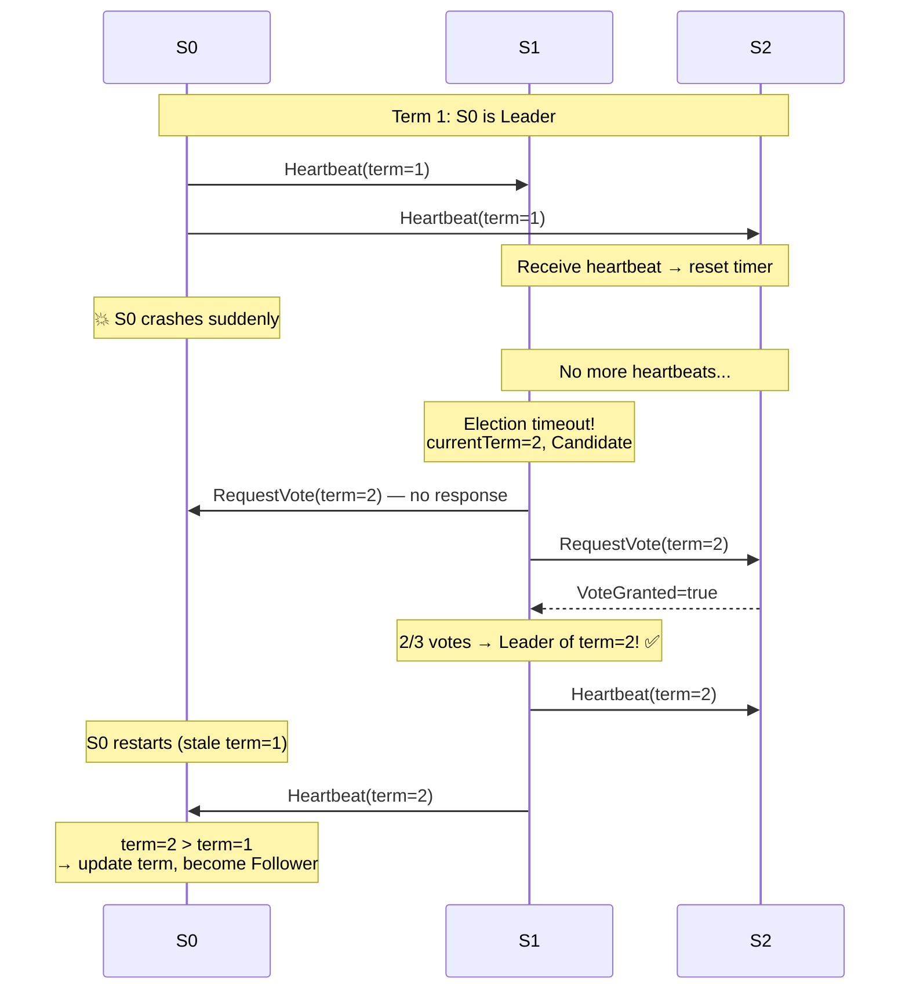
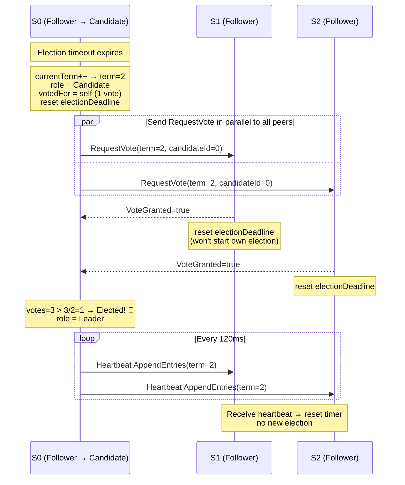
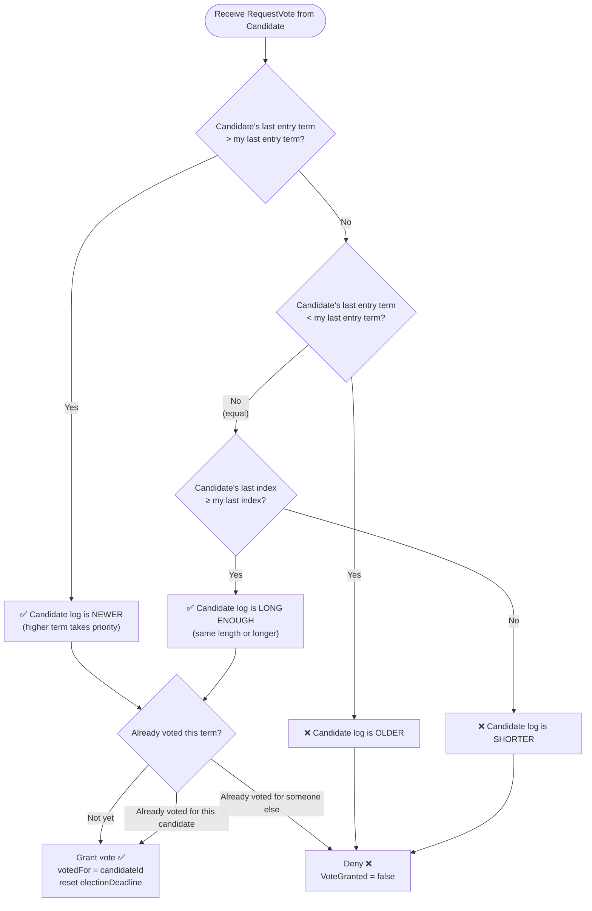
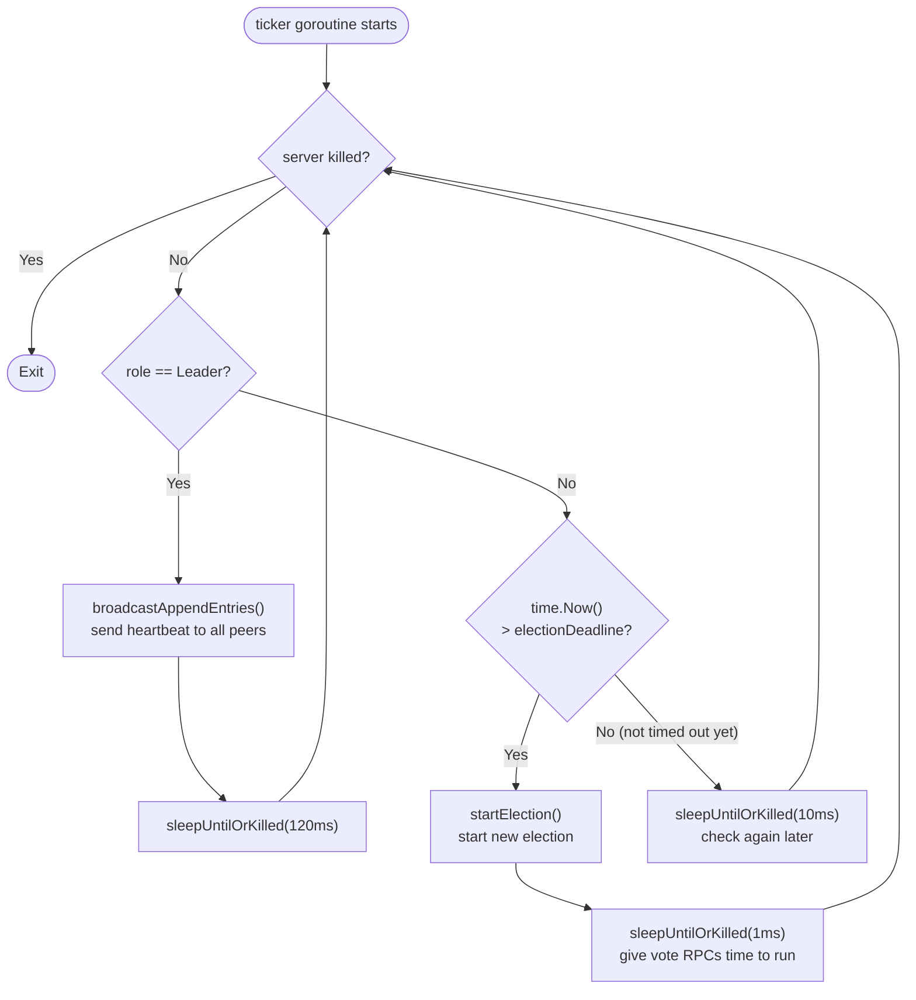
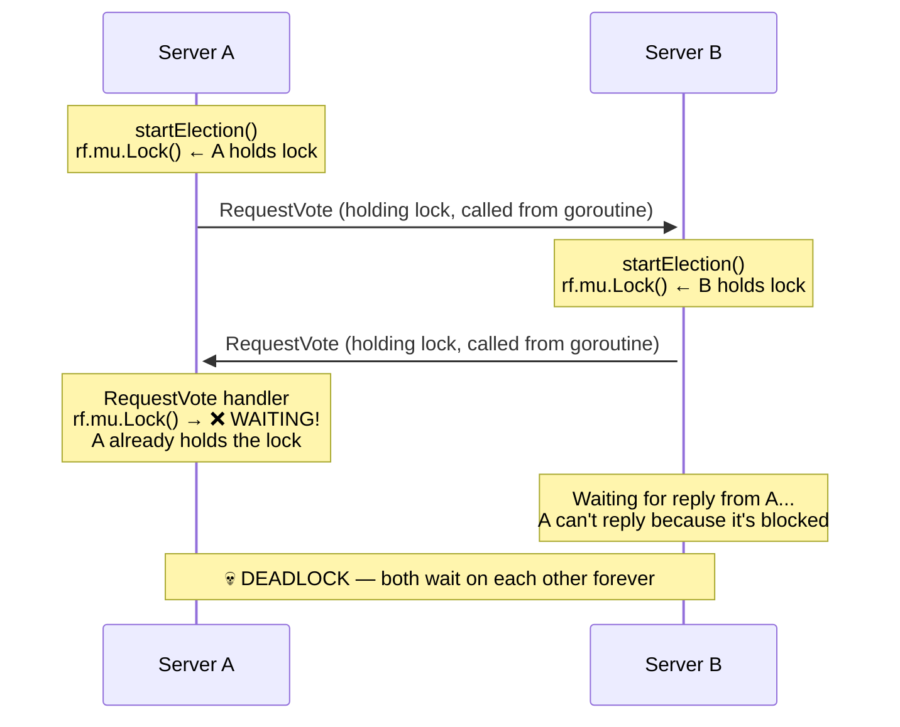
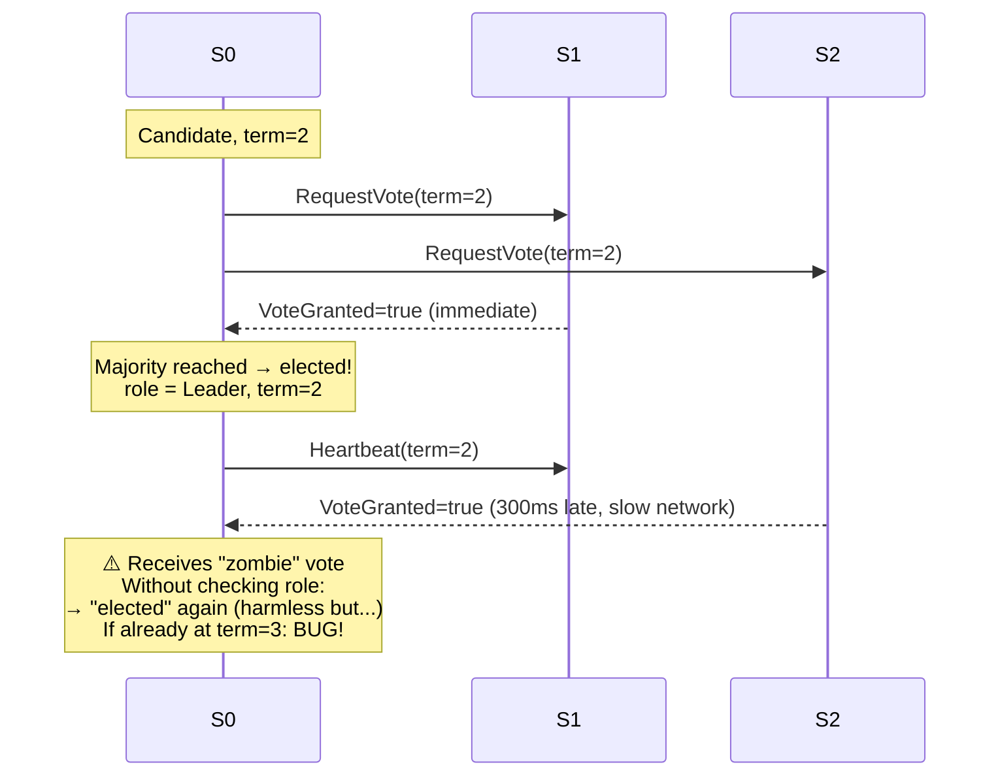
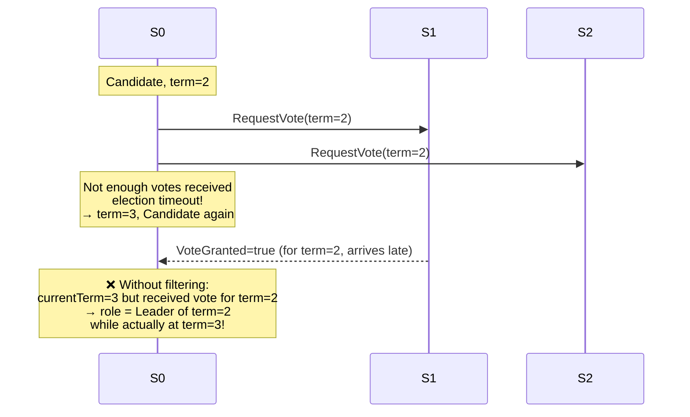
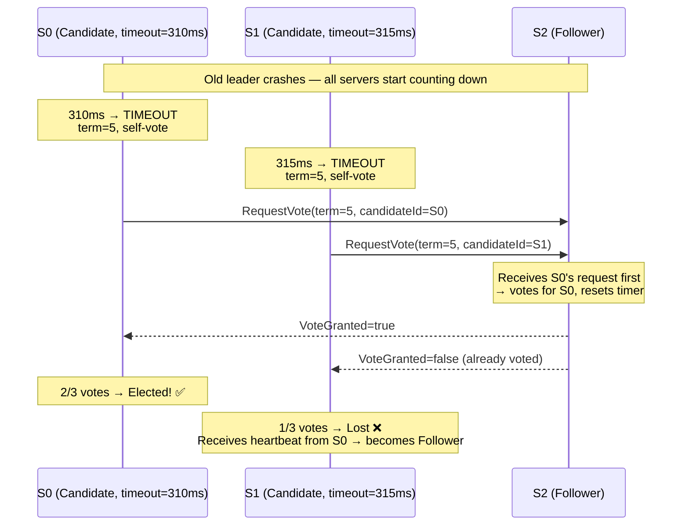
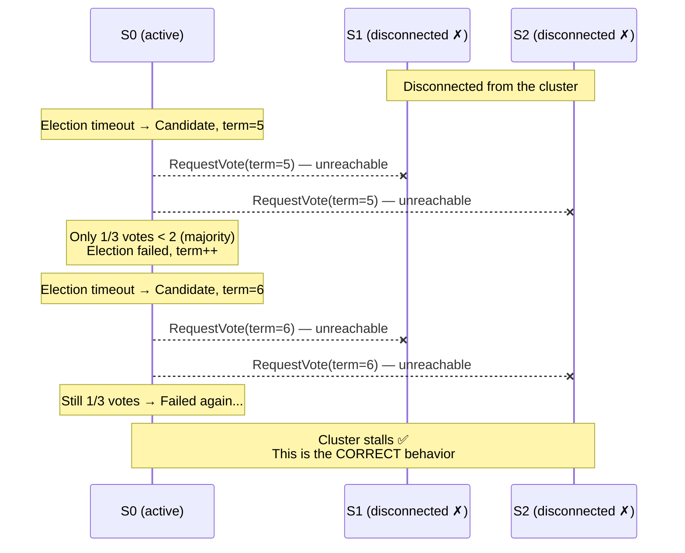

In previous posts, we built a MapReduce framework (Lab 1) and a single-node key/value server with linearizability (Lab 2). Both systems had one thing in common: they ran on **a single machine**. That means if the machine goes down, the entire system stops working.

Lab 3 asks: how do we build a system that keeps running **even when some machines in the cluster fail**? The answer is the **Raft consensus algorithm**.

Lab 3 is quite large, so I'll split it into several posts. This one focuses on **Part 3A: leader election** — the first and most important step toward building a correct Raft cluster.

## 1. What is Raft and why do we need it?

Let's start with a real problem. In Lab 2, our key/value server stored data in one machine's memory. If that machine crashed, all data was lost. To fix this, we need to **replicate data** across multiple machines.

But replicating data across multiple machines raises a new problem: **how do we keep all copies consistent?** If a client writes to machine A, how do we make sure machines B and C also receive that write, in the right order, even when the network has issues?

This is the **distributed consensus** problem, and **Raft** is an algorithm designed to solve it as understandably as possible. The original paper — [*In Search of an Understandable Consensus Algorithm*](https://raft.github.io/raft.pdf) by Diego Ongaro and John Ousterhout — was created specifically to make distributed consensus more approachable than Paxos.

Raft's core idea is: instead of letting all machines have equal decision-making power (which is very hard to keep consistent), **only one machine — called the leader — accepts and processes client requests**. The leader replicates every operation to the remaining machines (called followers) and only confirms completion once a majority have acknowledged it.

The question then becomes: **who gets to be leader?** And if the current leader fails, how do we elect a new one? This is the **leader election** problem — the topic of Lab 3A.

## 2. Three Roles in Raft

In a Raft cluster, each server is always in exactly one of three states:

- **Follower**: the default state. Followers listen for messages from the leader and candidates. If no message arrives within a certain time (election timeout), the follower nominates itself as a candidate.
- **Candidate**: the transitional state during an election. A candidate sends vote requests to other servers; if it receives votes from a majority, it becomes the leader.
- **Leader**: the server currently in charge. The leader periodically sends **heartbeats** to all followers to signal that it is still alive and active.


## 3. Terms — Raft's "Epochs"

Raft divides time into **terms** numbered with consecutive integers. Each term begins with an election. If the election succeeds, the leader serves for the rest of that term. If it fails (e.g., no one wins a majority), the term ends immediately and a new one begins.

Terms act as a **logical clock** in Raft. Whenever a server receives a message, it compares the message's term with its own:
- If the incoming term is **higher**: the server knows it is stale, immediately updates its term and reverts to follower.
- If the incoming term is **lower**: the message is outdated; the server rejects it.

This mechanism detects and eliminates "ghost leaders" — leaders that believe they are still in charge while the cluster has long since elected someone new.

The diagram below shows how terms change when a leader crashes and the cluster elects a new one:



## 4. How Does Leader Election Work?

### 4.1. Election Timeout — Triggering an Election

Each follower maintains a countdown timer called the **election timeout**. The timer resets whenever the follower receives a heartbeat or grants a vote to a candidate.

If the timer expires with no message from a leader, the follower concludes: _"The leader is gone — time for a new election!"_ and transitions to candidate.

To prevent all followers from starting elections simultaneously (which leads to **split votes**), the timeout is chosen **randomly** within a range. Whichever server times out first starts its election first, giving it a head start to collect votes and win before others even begin.

### 4.2. The Election Process

When a follower decides to start an election, it takes these steps:

1. **Increment term by 1** (start a new epoch).
2. **Transition to candidate** and **vote for itself**.
3. **Reset its own election timeout**.
4. **Send `RequestVote` RPCs** to all other servers in the cluster.

When another server receives a `RequestVote`, it grants a vote only if **both** conditions hold:
- It **has not voted for anyone else** in this term.
- The **candidate's log is at least as up-to-date** as its own (the "log up-to-date" rule — ensures only candidates with the latest information can become leader).

If the candidate receives votes from **a majority** (quorum) of servers, it becomes the **leader** of the new term. Majority means `n/2 + 1` for a cluster of `n` servers — e.g., a 3-server cluster needs 2 votes, a 5-server cluster needs 3.

The full flow from timeout to the leader sending its first heartbeat looks like this:



### 4.3. The "Log Up-to-Date" Rule

This is an important detail in Raft: not every candidate is allowed to become leader — **only those with the most up-to-date log** can win.

The comparison works as follows: first compare the **term of the last log entry**; if equal, compare **log length**. The log with a higher last-entry term, or longer length (when terms are equal), is considered "more up-to-date."

This guarantees that after an election, the new leader will have all entries that were previously committed — an essential property for preventing data loss.

The comparison logic encoded in `isLogUpToDate` follows this decision tree:



### 4.4. Heartbeats — Maintaining Authority

Once elected, the leader immediately begins sending **heartbeats** (AppendEntries RPCs with no log entries) to all followers on a fixed interval. This serves two purposes:
1. **Assert authority**: _"I am still the leader — don't start a new election."_
2. **Reset followers' election timers**, preventing them from triggering an election.

## 5. Implementation

Let's now look at how to implement each component in Go.

(Note: the code in this post is the 3A version — leader election only, no log replication yet.)

### 5.1. Data Structures

First, we define the state each server needs to track.

```go
// RaftRole is this server's role in leader election (Figure 2).
type RaftRole int

const (
    RoleFollower  RaftRole = iota // Follower: the default state
    RoleCandidate                 // Candidate: currently in an election
    RoleLeader                    // Leader: currently in charge
)

// LogEntry is one entry in the Raft log.
// In 3A, the log isn't used for replication yet, but is needed for the "log up-to-date" check.
type LogEntry struct {
    Term    int
    Command interface{}
}

// Raft represents a single server in the cluster.
type Raft struct {
    mu        sync.Mutex          // Mutex protecting shared state
    peers     []*labrpc.ClientEnd // RPC endpoints for all peers
    persister *tester.Persister   // Persistent storage (used in 3C)
    me        int                 // This server's index in peers[]
    dead      int32               // Set by Kill()

    // Election state (Figure 2)
    currentTerm int      // Latest term this server has seen
    votedFor    int      // CandidateId voted for in current term, or -1
    role        RaftRole // follower, candidate, or leader

    // log[0] is a dummy entry (term 0); real entries start at index 1.
    log []LogEntry

    // electionDeadline is when a follower/candidate may start a new election.
    electionDeadline time.Time
}
```

**Notes:**
- `currentTerm`: The most critical field — every RPC carries this term so servers can detect who is stale.
- `votedFor`: Who this server voted for in the current term. `-1` (`noVote`) means no vote yet. This prevents a server from voting for two different candidates in the same term.
- `role`: Current role — follower, candidate, or leader.
- `electionDeadline`: The deadline for starting an election. If this passes without a heartbeat, the server starts an election.

We also need a few constants to tune timing:

```go
const (
    // electionTimeout is chosen uniformly from [base, base+range) milliseconds.
    electionTimeoutBaseMs  int64 = 300
    electionTimeoutRangeMs int64 = 300

    // heartbeatInterval: the tester caps heartbeats at ~10/s → need at least ~100ms.
    heartbeatInterval = 120 * time.Millisecond

    noVote = -1 // rf.votedFor when this server has not voted in currentTerm
)
```

Note: the Raft paper suggests election timeouts of 150–300ms. The tester allows up to 1 second for an election to complete, and a 120ms heartbeat interval is sufficient to keep followers from timing out spuriously.

### 5.2. Helper Functions

Before diving into the main logic, let's look at a few small but important helpers.

```go
// becomeFollower transitions the server to follower state for a given term.
// If newTerm > currentTerm: update term and clear the vote.
// If newTerm == currentTerm: just demote to follower (e.g., valid heartbeat received).
// Caller must hold rf.mu.
func (rf *Raft) becomeFollower(newTerm int) {
    if newTerm < rf.currentTerm {
        return // Stale term, do nothing
    }
    if newTerm > rf.currentTerm {
        rf.currentTerm = newTerm
        rf.votedFor = noVote // New term → clear previous vote
    }
    rf.role = RoleFollower
}
```

```go
// resetElectionTimerLocked picks a new random election deadline.
// Caller must hold rf.mu.
func (rf *Raft) resetElectionTimerLocked() {
    ms := electionTimeoutBaseMs + rand.Int63n(electionTimeoutRangeMs)
    rf.electionDeadline = time.Now().Add(time.Duration(ms) * time.Millisecond)
}
```

```go
// isLogUpToDate reports whether a candidate's log is at least as current as ours (§5.4.1).
// Caller must hold rf.mu.
func (rf *Raft) isLogUpToDate(lastLogIndex, lastLogTerm int) bool {
    myLastTerm := rf.log[len(rf.log)-1].Term
    myLastIdx  := len(rf.log) - 1

    // Compare the term of the last entry first
    if lastLogTerm != myLastTerm {
        return lastLogTerm > myLastTerm
    }
    // If terms are equal, compare log length
    return lastLogIndex >= myLastIdx
}
```

`isLogUpToDate` correctly implements Raft's "more up-to-date" rule: last-entry term takes priority, then log length.

### 5.3. Handling the RequestVote RPC

This handler is called when a server receives a vote request from a candidate.

```go
// RequestVoteArgs: RPC arguments for RequestVote (Figure 2).
type RequestVoteArgs struct {
    Term         int // Candidate's term
    CandidateId  int // Candidate's index in peers[]
    LastLogIndex int // Index of candidate's last log entry
    LastLogTerm  int // Term of candidate's last log entry
}

// RequestVoteReply: RPC reply for RequestVote.
type RequestVoteReply struct {
    Term        int  // Responder's currentTerm (so candidate can update if stale)
    VoteGranted bool // true if the candidate received a vote
}
```

```go
// RequestVote is the RPC handler for vote requests.
func (rf *Raft) RequestVote(args *RequestVoteArgs, reply *RequestVoteReply) {
    rf.mu.Lock()
    defer rf.mu.Unlock()

    // Step 1: Reject if the candidate's term is older than ours.
    if args.Term < rf.currentTerm {
        reply.Term = rf.currentTerm
        reply.VoteGranted = false
        return
    }

    // Step 2: If the candidate has a higher term, update and step down to follower.
    if args.Term > rf.currentTerm {
        rf.becomeFollower(args.Term)
    }
    reply.Term = rf.currentTerm

    // Step 3: Check the "log up-to-date" condition.
    // Only vote for a candidate whose log is at least as current as ours.
    if !rf.isLogUpToDate(args.LastLogIndex, args.LastLogTerm) {
        reply.VoteGranted = false
        return
    }

    // Step 4: Grant vote if we haven't voted yet, or already voted for this candidate.
    if rf.votedFor == noVote || rf.votedFor == args.CandidateId {
        rf.votedFor = args.CandidateId
        reply.VoteGranted = true
        // Important: reset the election timer so we don't start a competing election
        // while a valid candidate is collecting votes.
        rf.resetElectionTimerLocked()
    } else {
        reply.VoteGranted = false
    }
}
```

**Why reset the election timer when granting a vote?**
When a server votes for a candidate, it is acknowledging that a valid election is in progress. Without resetting the timer, that server might start its own competing election shortly after — which makes no sense if it just endorsed someone else.

### 5.4. Handling the AppendEntries RPC (Heartbeat)

In 3A, `AppendEntries` acts purely as a **heartbeat** — a signal from the leader that it is still alive. There is no actual log replication logic yet (that comes in 3B).

```go
// AppendEntriesArgs: RPC arguments for AppendEntries.
// In 3A, only Term is needed; other fields will be added in 3B.
type AppendEntriesArgs struct {
    Term int // Leader's term
}

// AppendEntriesReply: RPC reply for AppendEntries.
type AppendEntriesReply struct {
    Term    int  // Responder's currentTerm
    Success bool // true if the follower accepted
}
```

```go
// AppendEntries is the RPC handler for heartbeats (and log replication in 3B).
// Valid RPC (args.Term >= currentTerm): step down to follower, reset timer.
// Stale args.Term: reject so the caller learns our term.
func (rf *Raft) AppendEntries(args *AppendEntriesArgs, reply *AppendEntriesReply) {
    rf.mu.Lock()
    defer rf.mu.Unlock()

    // Reject heartbeats from a stale leader.
    if args.Term < rf.currentTerm {
        reply.Term = rf.currentTerm
        reply.Success = false
        return
    }

    // Accept valid heartbeat: step down to follower and reset election timer.
    rf.becomeFollower(args.Term)
    reply.Term = rf.currentTerm
    reply.Success = true
    rf.resetElectionTimerLocked()
}
```

**Why call `becomeFollower` even when `args.Term == rf.currentTerm`?**

This case is specifically for **candidates**. If a candidate is waiting for votes and another server already won the election and sent a heartbeat, the candidate must recognize it lost and step down to follower.

Example: S0 and S1 both time out and start elections in term `T`. S1 collects enough votes first, becomes leader, and sends `AppendEntries(term=T)`. S0 receives this heartbeat while still a candidate with `currentTerm = T`. Without calling `becomeFollower`, S0 would stay stuck as a candidate even though the cluster already has a valid leader.

Calling `becomeFollower(args.Term)` for every valid heartbeat (rather than branching per role) keeps the code clean: for a follower it just reinforces the current role; for a candidate it correctly steps it down.

Without `becomeFollower`, we would need to branch manually like this:

```go
// ❌ Manual branching — verbose and easy to get wrong
if args.Term > rf.currentTerm {
    rf.currentTerm = args.Term
    rf.votedFor = noVote
    rf.role = RoleFollower
} else if args.Term == rf.currentTerm {
    if rf.role == RoleCandidate {
        // Candidate receives heartbeat with same term → there's already a leader, step down
        rf.role = RoleFollower
    }
    // If already Follower → nothing to do
}
```

Compared to the single unified call:

```go
// ✅ Using becomeFollower — handles every case correctly
rf.becomeFollower(args.Term)
```

### 5.5. Starting an Election: `startElection`

This is the core function triggered when the election timeout expires.

```go
// startElection starts a new election if the election deadline has passed.
// Does not hold rf.mu across RPC calls.
func (rf *Raft) startElection() {
    rf.mu.Lock()

    // Don't start an election if already leader, or the deadline hasn't passed.
    if rf.role == RoleLeader {
        rf.mu.Unlock()
        return
    }
    if !time.Now().After(rf.electionDeadline) {
        rf.mu.Unlock()
        return
    }

    // Step 1: Increment term, become Candidate, vote for self.
    rf.currentTerm++
    rf.role = RoleCandidate
    rf.votedFor = rf.me
    rf.resetElectionTimerLocked() // Reset timer to avoid immediately re-triggering

    // Copy all data needed for RequestVote before releasing the lock.
    term        := rf.currentTerm
    lastIdx     := len(rf.log) - 1
    lastLogTerm := rf.log[len(rf.log)-1].Term
    n           := len(rf.peers)
    me          := rf.me
    rf.mu.Unlock()

    // Step 2: Send RequestVote to all peers.
    var votes int32 = 1 // Already have our own vote

    for peer := 0; peer < n; peer++ {
        if peer == me {
            continue
        }
        go func(p int) {
            args := &RequestVoteArgs{
                Term:         term,
                CandidateId:  me,
                LastLogIndex: lastIdx,
                LastLogTerm:  lastLogTerm,
            }
            reply := &RequestVoteReply{}

            if !rf.sendRequestVote(p, args, reply) {
                return // No response (network error or server down)
            }
            if rf.killed() {
                return
            }

            rf.mu.Lock()
            defer rf.mu.Unlock()

            // Step 3: Process the reply.

            // If the responder has a higher term → we are stale, step down.
            if reply.Term > rf.currentTerm {
                rf.becomeFollower(reply.Term)
                return
            }

            // If term changed or we're no longer a candidate → this election is stale.
            if rf.currentTerm != term || rf.role != RoleCandidate {
                return
            }

            if !reply.VoteGranted {
                return
            }

            // Step 4: Got a vote — check if we have a majority.
            if atomic.AddInt32(&votes, 1) > int32(n/2) {
                rf.role = RoleLeader // Elected!
            }
        }(peer)
    }

    // Edge case: single-server cluster → elect self immediately.
    if n == 1 {
        rf.mu.Lock()
        if rf.currentTerm == term && rf.role == RoleCandidate {
            rf.role = RoleLeader
        }
        rf.mu.Unlock()
    }
}
```

A few design decisions worth noting:

**Copy data outside the lock before calling RPCs:**
RPC calls can block for a long time (slow network, busy target). Holding `rf.mu` during that time blocks every other goroutine waiting for the lock — including incoming RPC handlers. So we copy everything we need (`term`, `lastIdx`, `lastLogTerm`, ...) into local variables, release the lock, and only then issue the RPCs.

**Validate term and role after receiving a reply:**
When the goroutine wakes up with a reply, a lot may have changed — we might have lost the election, or a new election might have started. The check `rf.currentTerm != term || rf.role != RoleCandidate` filters out "stale" votes that no longer mean anything.

**Use `atomic.AddInt32` to count votes:**
Because multiple goroutines may process replies concurrently (one per peer), we use `atomic.AddInt32` for safety. As soon as we hit a majority, we transition to `RoleLeader`.

### 5.6. Sending Heartbeats: `broadcastAppendEntries`

Once elected, the leader must continuously send heartbeats to maintain authority and prevent followers from starting new elections.

```go
// broadcastAppendEntries sends AppendEntries heartbeats to all peers (3A).
// Does not hold rf.mu across RPCs.
// Steps down to follower if reply.Term > currentTerm.
func (rf *Raft) broadcastAppendEntries() {
    rf.mu.Lock()
    if rf.role != RoleLeader {
        rf.mu.Unlock()
        return // Only the leader sends heartbeats
    }
    term := rf.currentTerm
    me   := rf.me
    n    := len(rf.peers)
    rf.mu.Unlock()

    for p := 0; p < n; p++ {
        if p == me {
            continue
        }
        peer := p
        go func() {
            args  := &AppendEntriesArgs{Term: term}
            reply := &AppendEntriesReply{}

            if !rf.sendAppendEntries(peer, args, reply) {
                return
            }
            if rf.killed() {
                return
            }

            rf.mu.Lock()
            defer rf.mu.Unlock()

            // If the follower has a higher term, we are stale → step down.
            if reply.Term > rf.currentTerm {
                rf.becomeFollower(reply.Term)
            }
        }()
    }
}
```

The pattern here is identical to `startElection`: copy data outside the lock, issue RPCs in separate goroutines, then process results under the lock.

### 5.7. The Main Loop: `ticker`

The `ticker` goroutine acts as the server's coordinator, continuously checking state and deciding what to do next.

```go
func (rf *Raft) ticker() {
    for !rf.killed() {
        rf.mu.Lock()
        role := rf.role
        rf.mu.Unlock()

        if role == RoleLeader {
            // Send heartbeats, then sleep until the next cycle.
            rf.broadcastAppendEntries()
            rf.sleepUntilOrKilled(heartbeatInterval)
            continue
        }

        // Follower or candidate: check the election timeout.
        rf.mu.Lock()
        if rf.killed() {
            rf.mu.Unlock()
            return
        }
        if time.Now().After(rf.electionDeadline) {
            rf.mu.Unlock()
            rf.startElection()
            // Sleep briefly to give vote RPC goroutines a chance to complete.
            rf.sleepUntilOrKilled(time.Millisecond)
            continue
        }
        rf.mu.Unlock()

        // Deadline not reached yet — sleep a bit and check again.
        rf.sleepUntilOrKilled(10 * time.Millisecond)
    }
}
```

**Why not use `time.Sleep` directly?**
`time.Sleep` cannot be interrupted. If we used `time.Sleep(heartbeatInterval)`, a goroutine would keep sleeping for 120ms after `Kill()` is called. This can make tests run slower and produce confusing results.

`sleepUntilOrKilled` solves this by checking `killed()` in small increments:

```go
// sleepUntilOrKilled sleeps for at most d, but returns early if Kill() is called.
func (rf *Raft) sleepUntilOrKilled(d time.Duration) {
    if d <= 0 {
        return
    }
    deadline := time.Now().Add(d)
    for time.Now().Before(deadline) {
        if rf.killed() {
            return
        }
        rem  := time.Until(deadline)
        step := 10 * time.Millisecond // Check every 10ms
        if rem < step {
            step = rem
        }
        if step > 0 {
            time.Sleep(step)
        }
    }
}
```

Here is the full control flow of the `ticker` goroutine:



### 5.8. Initialization: `Make`

Finally, `Make` initializes a Raft server and starts the ticker goroutine.

```go
func Make(peers []*labrpc.ClientEnd, me int,
    persister *tester.Persister, applyCh chan raftapi.ApplyMsg) raftapi.Raft {

    // Register types with labgob so RPCs work correctly.
    labgob.Register(LogEntry{})
    labgob.Register(RequestVoteArgs{})
    labgob.Register(RequestVoteReply{})
    labgob.Register(AppendEntriesArgs{})
    labgob.Register(AppendEntriesReply{})

    rf := &Raft{}
    rf.peers     = peers
    rf.persister = persister
    rf.me        = me

    // Initial state: term 0, no vote, follower.
    rf.currentTerm = 0
    rf.votedFor    = noVote
    rf.role        = RoleFollower

    // log[0] is a dummy entry with term 0.
    // Real entries start at index 1 (used in 3B onward).
    rf.log = []LogEntry{{Term: 0}}

    // Restore previously persisted state after a crash (3C).
    rf.readPersist(persister.ReadRaftState())

    // Set a randomized election timer immediately so servers in the cluster
    // don't all start elections simultaneously on startup.
    rf.mu.Lock()
    rf.resetElectionTimerLocked()
    rf.mu.Unlock()

    // Start the ticker goroutine.
    go rf.ticker()

    return rf
}
```

**Why is log[0] a dummy entry?**
This is a common trick in Raft implementations to avoid special-casing an empty log. With a dummy entry at index 0, real entries start at index 1, matching how the Raft paper indexes the log. This makes index arithmetic (`lastLogIndex`, `prevLogIndex`, ...) simpler and less bug-prone in later parts.

## 6. Understanding the 3A Test Cases

Lab 3A has three main test cases. Let's walk through each one.

### 6.1. `TestInitialElection3A`

```
- Start a 3-server cluster.
- Check: is exactly 1 leader elected?
- Wait 50ms, check: do all servers agree on the same term?
- Wait 2 seconds (2x RaftElectionTimeout), check: did the term change?
- Check: is there still exactly 1 leader?
```

This tests the most fundamental property: when a cluster starts up, exactly one leader must be elected. Then, with no failures, that leader must remain in power (heartbeats work correctly) and the term must not increase.

### 6.2. `TestReElection3A`

```
- Start a 3-server cluster, wait for leader1.
- Disconnect leader1.
- Check: a new leader (leader2) is elected among the remaining servers.
- Reconnect leader1.
- Check: leader1 has become a follower (it recognizes it is stale).
- Disconnect leader2 and one other server (only 1 of 3 remains).
- Wait 2 seconds, check: no leader is elected (no quorum).
- Reconnect one server → now 2/3 servers → quorum reached.
- Check: a new leader is elected.
- Reconnect the last server.
- Check: still exactly 1 leader.
```

This tests realistic scenarios: leader disconnection, split-brain, and recovery once quorum is restored.

Key invariant to verify: in a 3-server cluster, if 2 servers are disconnected, the remaining 1 cannot elect itself as leader — it lacks quorum (needs at least 2/3 votes).

### 6.3. `TestManyElections3A`

```
- Start a 7-server cluster.
- Repeat 10 times:
  - Disconnect 3 random servers.
  - Check: among the remaining 4, exactly 1 leader exists.
  - Reconnect the 3 servers.
- Check: there is still exactly 1 leader at the end.
```

This tests stability under continuous topology changes. With 7 servers, quorum is 4. Disconnecting only 3 leaves 4 servers — enough to elect a leader.

## 7. Common Implementation Pitfalls

### 7.1. Race Condition on the `votes` Counter

Multiple goroutines concurrently process `RequestVote` replies and all read/write the `votes` variable. Here is the buggy version:

```go
// ❌ Bug: votes++ is not thread-safe
var votes int = 1
for peer := 0; peer < n; peer++ {
    go func(p int) {
        // ... RPC call ...
        if reply.VoteGranted {
            votes++ // RACE CONDITION! Multiple goroutines read-increment-write
            if votes > n/2 {
                rf.role = RoleLeader
            }
        }
    }(peer)
}
```

The problem: `votes++` is actually three steps — read, add 1, write back. If two goroutines both read `votes = 1` at the same time, both write `votes = 2`, and one increment is lost. Running with the `-race` flag, Go's race detector catches this immediately and the test fails:

```
--- FAIL: TestInitialElection3A (0.23s)
    DATA RACE
    Write at 0x... by goroutine ...:
        raft.(*Raft).startElection.func1()
    Previous write at 0x... by goroutine ...:
        raft.(*Raft).startElection.func1()
```

The fix is `atomic.AddInt32`, which makes the read-add-write happen atomically:

```go
// ✅ Fix: use atomic for thread-safe vote counting
var votes int32 = 1
for peer := 0; peer < n; peer++ {
    go func(p int) {
        // ... RPC call ...
        if reply.VoteGranted {
            if atomic.AddInt32(&votes, 1) > int32(n/2) {
                rf.mu.Lock()
                rf.role = RoleLeader
                rf.mu.Unlock()
            }
        }
    }(peer)
}
```

### 7.2. Never Hold the Lock While Calling an RPC

This is the golden rule for concurrent Go code. Here is what happens if you violate it:

```go
// ❌ Bug: holding lock while calling RPC
func (rf *Raft) startElection() {
    rf.mu.Lock()
    // ... prepare args ...
    for peer := 0; peer < n; peer++ {
        go func(p int) {
            // rf.mu is still held by the caller!
            rf.sendRequestVote(p, args, reply) // Blocks until a reply arrives

            // While this goroutine waits, a RequestVote from another peer arrives
            // → its handler also needs rf.mu.Lock()
            // → DEADLOCK: both are waiting on each other forever
        }(peer)
    }
    rf.mu.Unlock()
}
```

Concrete deadlock scenario:



Both servers wait on each other and neither releases their lock. The cluster freezes. In practice, labrpc has a timeout so it won't deadlock forever, but performance will be terrible and the test will fail because elections don't complete in time.

The correct pattern is to copy all needed data, release the lock, then call the RPC:

```go
// ✅ Fix: release lock before calling RPC
func (rf *Raft) startElection() {
    rf.mu.Lock()
    // Copy all needed data into local variables
    term        := rf.currentTerm
    lastIdx     := rf.lastLogIndex()
    lastLogTerm := rf.lastLogTerm()
    rf.mu.Unlock() // ← Release lock BEFORE calling RPC

    for peer := 0; peer < n; peer++ {
        go func(p int) {
            args := &RequestVoteArgs{Term: term, ...}
            rf.sendRequestVote(p, args, reply) // No lock held → no deadlock

            rf.mu.Lock() // Re-acquire lock to process result
            defer rf.mu.Unlock()
            // ... handle reply ...
        }(peer)
    }
}
```

### 7.3. Always Validate Term After Receiving a Reply

This is the subtlest pitfall. While a goroutine is waiting for an RPC reply, many things may have changed — and if we don't check, we might act on a "stale" vote that is no longer meaningful.

First scenario — late vote arrives after the election is already won:



Dangerous scenario — late vote arrives after moving to a new term:



```go
// ❌ Bug: not checking term after receiving a reply
go func(p int) {
    rf.sendRequestVote(p, args, reply)

    rf.mu.Lock()
    defer rf.mu.Unlock()

    if reply.VoteGranted {
        // This vote is for term=2, but we are now at term=3!
        // This is a "zombie vote" — no longer valid
        if atomic.AddInt32(&votes, 1) > int32(n/2) {
            rf.role = RoleLeader // BUG: becomes leader of term=2 while at term=3
        }
    }
}(peer)
```

```go
// ✅ Fix: always validate term and role after receiving a reply
go func(p int) {
    rf.sendRequestVote(p, args, reply)

    rf.mu.Lock()
    defer rf.mu.Unlock()

    // Check 1: does the responder have a higher term?
    if reply.Term > rf.currentTerm {
        rf.becomeFollower(reply.Term)
        return
    }

    // Check 2: are term and role still what they were when we sent the RPC?
    // If not → this election is stale; discard the vote.
    if rf.currentTerm != term || rf.role != RoleCandidate {
        return // "Zombie vote" — ignore
    }

    if reply.VoteGranted {
        if atomic.AddInt32(&votes, 1) > int32(n/2) {
            rf.role = RoleLeader // Safe: we are still the candidate for this exact term
        }
    }
}(peer)
```

### 7.4. Split Vote vs. No Quorum

These two situations look similar from the outside — no leader gets elected — but their causes and how the system handles them are very different.

**Split vote**: Happens when multiple candidates start elections in the same term and votes are divided such that nobody reaches a majority.



> If S2 had received S1's request first, S1 would win instead. The outcome depends on network latency — but only one can win. A larger random timeout gap between S0 and S1 gives S0 more time to collect votes before S1 even starts.

Raft avoids split votes through **randomized** election timeouts. If S0 times out at 310ms and S1 at 380ms, S0 has a 70ms head start to collect votes before S1 even becomes a candidate.

**No quorum**: Happens when the number of reachable servers is smaller than a majority — not an algorithmic failure, just a physical constraint.



This is **the right and desired behavior**. If 1 out of 3 servers could still crown itself leader, it would have no knowledge of changes that happened on the other 2 — leading to data loss when the cluster recovers. Raft accepts being unavailable (unable to make progress) rather than making a wrong decision.

## Conclusion

In this post, we walked through implementing Raft's leader election — the foundation of a fault-tolerant distributed system. Despite being only Part 3A, this is conceptually the hardest part, requiring careful handling of concurrent goroutines, unreliable networks, and servers that can crash at any moment.

Key takeaways:
- **Term** is Raft's logical clock — any server with a lower term must update and become a follower.
- **Randomized election timeouts** prevent split votes in most cases.
- **Quorum (majority)** guarantees at most one leader per term.
- **Log up-to-date check** ensures the new leader always has all previously committed entries.
- **Never hold the lock while calling an RPC** — this is essential to avoid deadlocks.

In the next post (Lab 3B), we will extend this system to actually replicate log entries — taking Raft from "electing a leader" to "reaching consensus on the order of commands." The election mechanism we built here will serve as a solid foundation for that.
