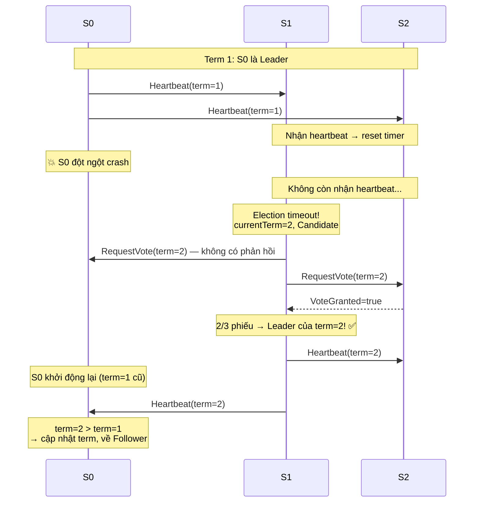
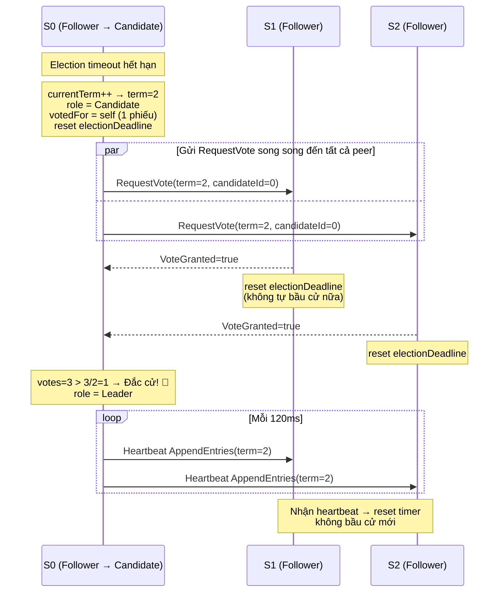
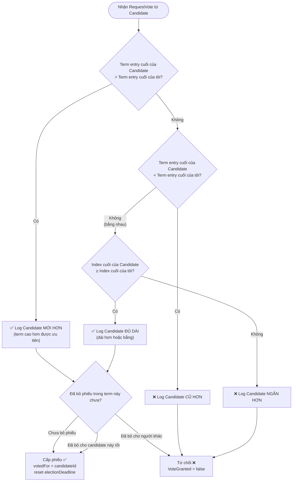
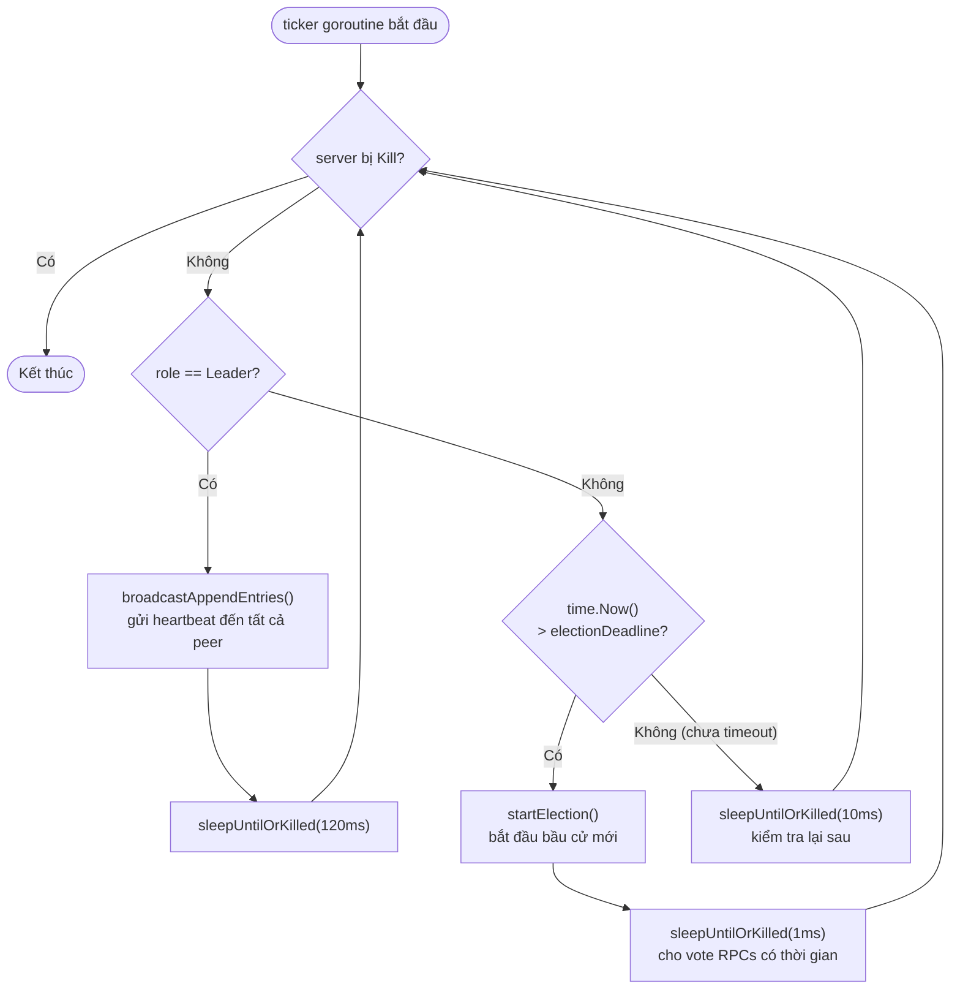
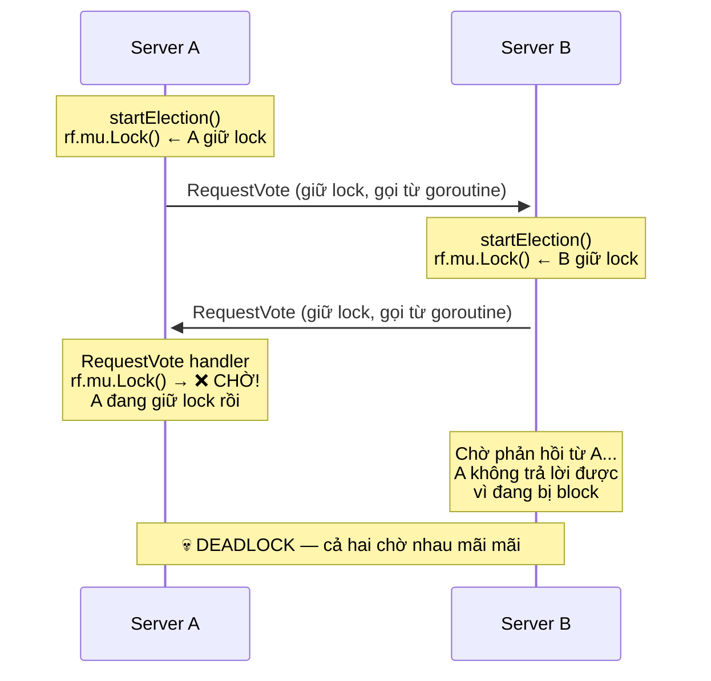
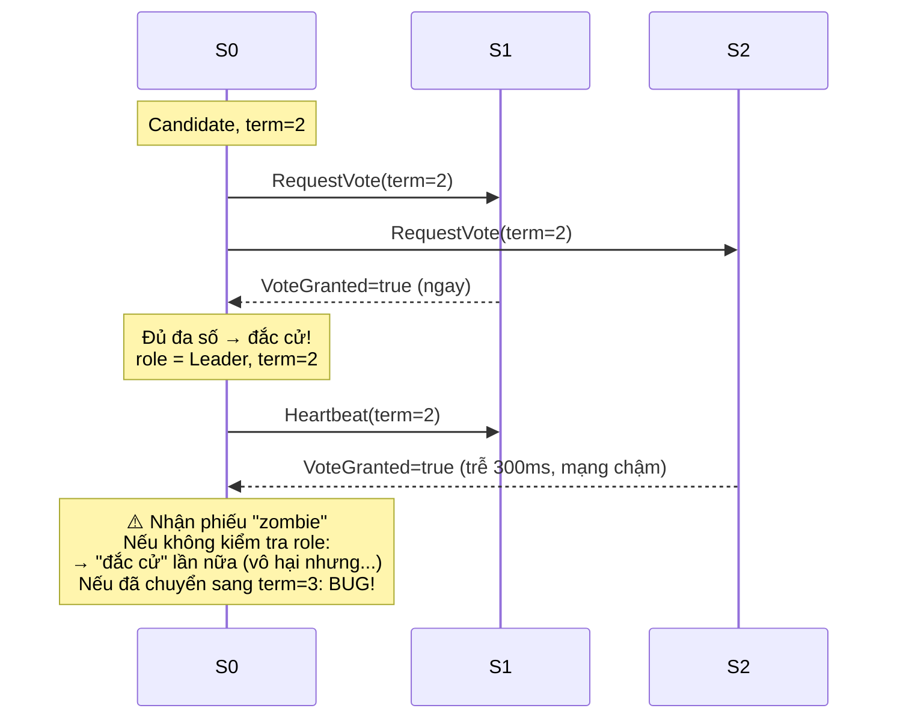
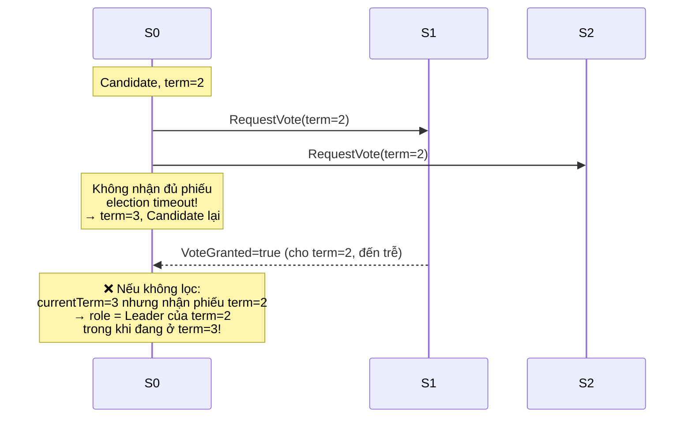
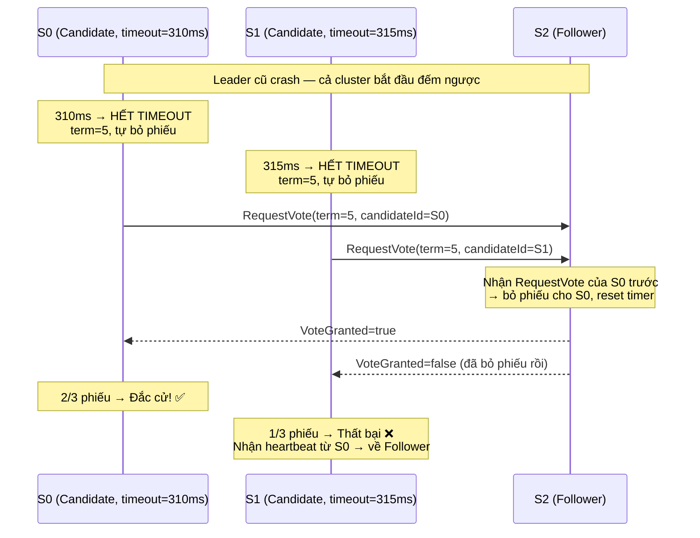
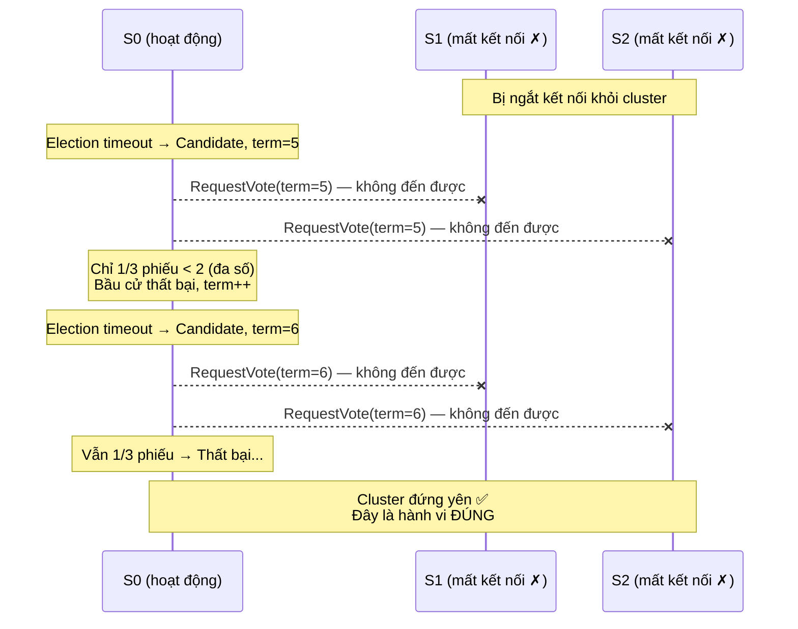

Ở các bài viết trước, chúng ta đã xây dựng một framework MapReduce (Lab 1) và một key/value server đơn node với tính nhất quán tuyến tính (Lab 2). Cả hai hệ thống đó đều có một điểm chung: chúng chạy trên **một máy duy nhất**. Điều đó có nghĩa là nếu máy đó gặp sự cố, toàn bộ hệ thống ngừng hoạt động.

Lab 3 đặt ra câu hỏi: làm thế nào để xây dựng một hệ thống vẫn tiếp tục hoạt động **ngay cả khi một số máy trong cluster gặp lỗi**? Câu trả lời nằm ở **thuật toán đồng thuận Raft**.

Lab 3 khá lớn, vì vậy mình sẽ chia nó thành nhiều bài viết nhỏ. Bài này tập trung vào **phần 3A: cơ chế bầu cử leader** — bước đầu tiên và quan trọng nhất để xây dựng một cluster Raft hoạt động đúng đắn.

## 1. Raft là gì và tại sao cần nó?

Hãy bắt đầu bằng một vấn đề thực tế. Trong Lab 2, key/value server của chúng ta lưu dữ liệu trong bộ nhớ của một máy. Nếu máy đó bị tắt đột ngột, mọi dữ liệu đều mất. Để giải quyết, ta cần **sao chép dữ liệu** sang nhiều máy khác.

Nhưng sao chép dữ liệu sang nhiều máy lại nảy sinh một vấn đề mới: **làm sao để đảm bảo tất cả các bản sao luôn nhất quán với nhau?** Nếu client ghi vào máy A, làm thế nào để máy B và C cũng nhận được bản ghi đó, đúng thứ tự, ngay cả khi mạng có vấn đề?

Đây chính là bài toán **đồng thuận phân tán (distributed consensus)**, và **Raft** là một thuật toán được thiết kế để giải quyết nó theo cách dễ hiểu nhất có thể. Bài báo gốc — [*In Search of an Understandable Consensus Algorithm*](https://raft.github.io/raft.pdf) của Diego Ongaro và John Ousterhout — ra đời với mục tiêu làm cho đồng thuận phân tán trở nên dễ tiếp cận hơn so với Paxos.

Ý tưởng cốt lõi của Raft là: thay vì để tất cả các máy đều có quyền quyết định như nhau (điều này rất khó đảm bảo tính nhất quán), **chỉ một máy duy nhất — gọi là leader — có quyền nhận và xử lý các yêu cầu từ client**. Leader sẽ sao chép mọi thao tác sang các máy còn lại (gọi là follower) và chỉ xác nhận hoàn thành khi đa số máy đã ghi nhận thành công.

Vậy câu hỏi đặt ra là: **ai sẽ làm leader?** Và nếu leader hiện tại gặp sự cố, làm sao để chọn ra leader mới? Đây chính là bài toán **bầu cử leader (leader election)** — nội dung của Lab 3A.

## 2. Ba vai trò trong Raft

Trong một cluster Raft, mỗi server tại một thời điểm luôn ở một trong ba trạng thái:

- **Follower**: trạng thái mặc định. Follower lắng nghe các tin nhắn từ leader và candidate. Nếu không nhận được tin nhắn trong một khoảng thời gian nhất định (election timeout), follower sẽ tự mình ứng cử trở thành leader.
- **Candidate**: trạng thái trung gian khi server đang trong quá trình bầu cử. Candidate gửi yêu cầu bỏ phiếu đến các server khác, nếu nhận được đa số phiếu thì trở thành leader.
- **Leader**: server đang nắm quyền điều phối. Leader định kỳ gửi **heartbeat** (tin hiệu sống) đến các follower để thông báo rằng mình vẫn còn sống và đang hoạt động.


## 3. Khái niệm Term — "nhiệm kỳ" trong Raft

Raft chia thời gian thành các **term** (nhiệm kỳ) được đánh số nguyên tăng dần. Mỗi term bắt đầu bằng một cuộc bầu cử. Nếu bầu cử thành công, leader sẽ phục vụ trong suốt phần còn lại của term đó. Nếu thất bại (ví dụ: không ai giành được đa số phiếu), term kết thúc và một term mới bắt đầu ngay lập tức.

Term đóng vai trò như một **đồng hồ logic** trong Raft. Mỗi khi một server nhận được tin nhắn, nó so sánh term của tin nhắn với term hiện tại của mình:
- Nếu term trong tin nhắn **cao hơn**: server biết rằng mình đã lỗi thời, lập tức cập nhật term và chuyển về trạng thái follower.
- Nếu term trong tin nhắn **thấp hơn**: tin nhắn đó đã cũ, server từ chối xử lý.

Cơ chế này giúp phát hiện và loại bỏ các leader "ma" — những leader tưởng rằng mình vẫn đang nắm quyền trong khi thực ra cluster đã bầu ra leader mới từ lâu.

Sơ đồ dưới đây minh họa cách term thay đổi khi leader bị crash và cluster bầu ra leader mới:



## 4. Cơ chế bầu cử hoạt động như thế nào?

### 4.1. Election Timeout — kích hoạt bầu cử

Mỗi follower duy trì một bộ đếm thời gian gọi là **election timeout**. Khi nhận được heartbeat hoặc bỏ phiếu cho một candidate, follower đặt lại bộ đếm này.

Nếu bộ đếm hết hạn mà không nhận được tin nhắn nào từ leader, follower kết luận: _"Leader đã mất, đã đến lúc bầu cử mới!"_ và chuyển sang trạng thái candidate.

Để tránh tình trạng tất cả các follower khởi động bầu cử cùng một lúc (dẫn đến "phiếu bị phân tán" — split vote), thời gian timeout được chọn **ngẫu nhiên** trong một khoảng nhất định. Server nào hết timeout trước sẽ bắt đầu bầu cử trước, có cơ hội thu thập phiếu và đắc cử trước khi các server khác kịp bắt đầu.

### 4.2. Quá trình bầu cử

Khi một follower quyết định bắt đầu bầu cử, nó thực hiện các bước sau:

1. **Tăng term lên 1** (bắt đầu nhiệm kỳ mới).
2. **Chuyển sang trạng thái candidate** và **tự bỏ phiếu cho mình**.
3. **Đặt lại election timeout** của chính mình.
4. **Gửi `RequestVote` RPC** đến tất cả các server khác trong cluster.

Khi một server khác nhận được `RequestVote`, nó sẽ cấp phiếu nếu thỏa mãn **cả hai điều kiện**:
- **Chưa bỏ phiếu trong term này** cho ai khác.
- **Log của candidate ít nhất "mới" bằng** log của mình (điều kiện "log up-to-date" — để đảm bảo chỉ những candidate có đủ thông tin mới nhất mới trở thành leader).

Nếu candidate nhận được phiếu từ **đa số** (quorum) server trong cluster, nó trở thành **leader** của term mới. Số đa số là `n/2 + 1` với cluster gồm `n` server. Ví dụ: cluster 3 server cần 2 phiếu, cluster 5 server cần 3 phiếu.

Toàn bộ quá trình từ lúc timeout đến khi leader gửi heartbeat đầu tiên diễn ra như sau:



### 4.3. Điều kiện "log up-to-date"

Đây là một chi tiết quan trọng trong Raft: không phải candidate nào cũng được phép trở thành leader, mà **chỉ những candidate có log "mới" nhất** mới được bầu.

Cách so sánh log của hai server: so sánh **term của entry cuối cùng** trước, nếu bằng nhau thì so sánh **độ dài log**. Log nào có entry cuối cùng với term cao hơn, hoặc dài hơn (với term bằng nhau), được coi là "mới hơn".

Điều này đảm bảo rằng sau khi bầu cử, leader mới sẽ có tất cả các entry đã được commit trước đó — một tính chất thiết yếu để đảm bảo dữ liệu không bị mất.

Quy tắc so sánh log được mã hóa trong hàm `isLogUpToDate` theo đúng logic sau:



### 4.4. Heartbeat — duy trì quyền lực

Sau khi đắc cử, leader lập tức bắt đầu gửi **heartbeat** (thực chất là AppendEntries RPC rỗng, không chứa log entry nào) đến tất cả follower theo chu kỳ. Việc này nhằm hai mục đích:
1. **Thông báo quyền lực**: _"Tôi vẫn là leader, đừng bắt đầu bầu cử mới."_
2. **Đặt lại election timeout** của các follower, ngăn chúng tự ý bầu cử.

## 5. Triển khai

Bây giờ hãy cùng xem xét cách triển khai từng thành phần trên bằng Go.

(Lưu ý: Code trong bài này là phiên bản 3A — chỉ xử lý leader election, chưa có log replication.)

### 5.1. Cấu trúc dữ liệu

Trước hết, ta cần định nghĩa những trạng thái mà mỗi server cần theo dõi.

```go
// RaftRole là vai trò hiện tại của server trong quá trình bầu cử (Figure 2).
type RaftRole int

const (
    RoleFollower  RaftRole = iota // Follower: trạng thái mặc định
    RoleCandidate                 // Candidate: đang trong quá trình bầu cử
    RoleLeader                    // Leader: đang nắm quyền
)

// LogEntry là một entry trong log của Raft.
// Ở 3A, log chưa được sử dụng cho replication, nhưng cần để kiểm tra "log up-to-date".
type LogEntry struct {
    Term    int
    Command interface{}
}

// Raft là đối tượng biểu diễn một server trong cluster.
type Raft struct {
    mu        sync.Mutex          // Mutex bảo vệ truy cập đồng thời
    peers     []*labrpc.ClientEnd // Các endpoint RPC của tất cả peer
    persister *tester.Persister   // Lưu trữ trạng thái persistent (3C)
    me        int                 // Index của server này trong peers[]
    dead      int32               // Set bởi Kill()

    // Trạng thái bầu cử (Figure 2)
    currentTerm int      // Term mới nhất mà server này đã thấy
    votedFor    int      // CandidateId đã được bỏ phiếu trong term hiện tại, hoặc -1
    role        RaftRole // follower, candidate, hay leader

    // log[0] là entry giả (term 0); các entry thực bắt đầu từ index 1.
    log []LogEntry

    // electionDeadline là thời điểm follower/candidate có thể bắt đầu bầu cử mới.
    electionDeadline time.Time
}
```

**Giải thích:**
- `currentTerm`: Số term hiện tại. Đây là thông tin quan trọng nhất — mọi RPC đều đính kèm term này để các server nhận biết ai "mới hơn".
- `votedFor`: Server này đã bỏ phiếu cho ai trong term hiện tại. Giá trị `-1` (ký hiệu `noVote`) có nghĩa là chưa bỏ phiếu. Điều này ngăn server bỏ phiếu cho hai candidate khác nhau trong cùng một term.
- `role`: Vai trò hiện tại — follower, candidate, hoặc leader.
- `electionDeadline`: Thời điểm "deadline" để bầu cử. Nếu đến thời điểm này mà chưa nhận được heartbeat, server sẽ bắt đầu bầu cử.

Ngoài ra, ta cần một số hằng số để tinh chỉnh thời gian:

```go
const (
    // electionTimeout được chọn ngẫu nhiên trong khoảng [base, base+range) milliseconds.
    electionTimeoutBaseMs  int64 = 300
    electionTimeoutRangeMs int64 = 300

    // heartbeatInterval: tester giới hạn tối đa ~10 heartbeat/giây → cần ít nhất ~100ms.
    heartbeatInterval = 120 * time.Millisecond

    noVote = -1 // rf.votedFor khi server chưa bỏ phiếu trong currentTerm
)
```

Lưu ý: Bài báo Raft gợi ý election timeout trong khoảng 150–300ms. Tuy nhiên, tester cho phép tới 1 giây để bầu cử hoàn tất, và heartbeat mỗi 120ms là đủ để follower không bị timeout nhầm.

### 5.2. Hàm tiện ích

Trước khi đi vào logic chính, hãy xem một số hàm tiện ích nhỏ nhưng quan trọng.

```go
// becomeFollower chuyển server sang trạng thái follower với term mới.
// Nếu newTerm > currentTerm: cập nhật term và xóa phiếu bầu.
// Nếu newTerm == currentTerm: chỉ hạ cấp về follower (ví dụ: nhận heartbeat hợp lệ).
// Caller phải giữ rf.mu.
func (rf *Raft) becomeFollower(newTerm int) {
    if newTerm < rf.currentTerm {
        return // Term cũ hơn, không làm gì
    }
    if newTerm > rf.currentTerm {
        rf.currentTerm = newTerm
        rf.votedFor = noVote // Term mới → xóa phiếu bầu cũ
    }
    rf.role = RoleFollower
}
```

```go
// resetElectionTimerLocked chọn ngẫu nhiên một election deadline mới.
// Caller phải giữ rf.mu.
func (rf *Raft) resetElectionTimerLocked() {
    ms := electionTimeoutBaseMs + rand.Int63n(electionTimeoutRangeMs)
    rf.electionDeadline = time.Now().Add(time.Duration(ms) * time.Millisecond)
}
```

```go
// isLogUpToDate kiểm tra xem log của candidate có "mới" ít nhất bằng log của server này không (§5.4.1).
// Caller phải giữ rf.mu.
func (rf *Raft) isLogUpToDate(lastLogIndex, lastLogTerm int) bool {
    myLastTerm := rf.log[len(rf.log)-1].Term
    myLastIdx  := len(rf.log) - 1

    // So sánh term của entry cuối cùng trước
    if lastLogTerm != myLastTerm {
        return lastLogTerm > myLastTerm
    }
    // Nếu term bằng nhau, so sánh độ dài log
    return lastLogIndex >= myLastIdx
}
```

Hàm `isLogUpToDate` thực hiện đúng quy tắc so sánh log "mới hơn" trong Raft: ưu tiên term của entry cuối, sau đó đến độ dài log.

### 5.3. Xử lý RPC: RequestVote

Đây là handler mà mỗi server sẽ gọi đến khi nhận được yêu cầu bỏ phiếu từ một candidate.

```go
// RequestVoteArgs: Tham số của RequestVote RPC (Figure 2).
type RequestVoteArgs struct {
    Term         int // Term của candidate
    CandidateId  int // Index của candidate trong peers[]
    LastLogIndex int // Index của entry cuối cùng trong log của candidate
    LastLogTerm  int // Term của entry cuối cùng trong log của candidate
}

// RequestVoteReply: Phản hồi của RequestVote RPC.
type RequestVoteReply struct {
    Term        int  // currentTerm của server phản hồi (để candidate cập nhật nếu lỗi thời)
    VoteGranted bool // true nếu candidate nhận được phiếu
}
```

```go
// RequestVote là handler RPC cho yêu cầu bỏ phiếu.
func (rf *Raft) RequestVote(args *RequestVoteArgs, reply *RequestVoteReply) {
    rf.mu.Lock()
    defer rf.mu.Unlock()

    // Bước 1: Từ chối nếu candidate đang dùng term cũ hơn.
    if args.Term < rf.currentTerm {
        reply.Term = rf.currentTerm
        reply.VoteGranted = false
        return
    }

    // Bước 2: Nếu candidate có term cao hơn, cập nhật term và về follower.
    if args.Term > rf.currentTerm {
        rf.becomeFollower(args.Term)
    }
    reply.Term = rf.currentTerm

    // Bước 3: Kiểm tra điều kiện "log up-to-date".
    // Chỉ bỏ phiếu cho candidate có log ít nhất "mới" bằng log của mình.
    if !rf.isLogUpToDate(args.LastLogIndex, args.LastLogTerm) {
        reply.VoteGranted = false
        return
    }

    // Bước 4: Cấp phiếu nếu chưa bỏ phiếu trong term này, hoặc đã bỏ phiếu cho candidate này.
    if rf.votedFor == noVote || rf.votedFor == args.CandidateId {
        rf.votedFor = args.CandidateId
        reply.VoteGranted = true
        // Quan trọng: đặt lại election timer để không kích hoạt bầu cử mới trong khi
        // đang có candidate hợp lệ.
        rf.resetElectionTimerLocked()
    } else {
        reply.VoteGranted = false
    }
}
```

**Tại sao cần reset election timer khi cấp phiếu?**
Khi một server bỏ phiếu cho một candidate, nó đang công nhận rằng đó là một cuộc bầu cử hợp lệ. Nếu không reset timer, server này có thể tự khởi động một cuộc bầu cử khác ngay sau đó, cạnh tranh với candidate vừa được nó bỏ phiếu — điều này không hợp lý.

### 5.4. Xử lý RPC: AppendEntries (Heartbeat)

Ở phần 3A, `AppendEntries` chỉ đóng vai trò là **heartbeat** — một tín hiệu từ leader rằng nó vẫn còn sống. Chưa có logic sao chép log thực sự (sẽ làm ở 3B).

```go
// AppendEntriesArgs: Tham số của AppendEntries RPC.
// Ở 3A, chỉ cần Term; các field khác sẽ được thêm vào ở 3B.
type AppendEntriesArgs struct {
    Term int // Term của leader
}

// AppendEntriesReply: Phản hồi của AppendEntries RPC.
type AppendEntriesReply struct {
    Term    int  // currentTerm của server phản hồi
    Success bool // true nếu follower chấp nhận
}
```

```go
// AppendEntries là handler RPC cho heartbeat (và log replication ở 3B).
// Nếu RPC hợp lệ (args.Term >= currentTerm): bước xuống follower, reset timer.
// Nếu args.Term cũ hơn: từ chối để caller biết term của mình.
func (rf *Raft) AppendEntries(args *AppendEntriesArgs, reply *AppendEntriesReply) {
    rf.mu.Lock()
    defer rf.mu.Unlock()

    // Từ chối heartbeat từ leader lỗi thời.
    if args.Term < rf.currentTerm {
        reply.Term = rf.currentTerm
        reply.Success = false
        return
    }

    // Chấp nhận heartbeat hợp lệ: về follower và reset election timer.
    rf.becomeFollower(args.Term)
    reply.Term = rf.currentTerm
    reply.Success = true
    rf.resetElectionTimerLocked()
}
```

**Tại sao một leader hiện tại cũng cần gọi `becomeFollower` khi nhận AppendEntries có cùng term?**
**Tại sao gọi `becomeFollower` ngay cả khi `args.Term == rf.currentTerm`?**

Đây là trường hợp quan trọng dành cho **candidate**. Nếu một candidate đang chờ phiếu mà có server khác đã thắng bầu cử trước và gửi heartbeat về, candidate đó phải nhận ra mình đã thua và bước xuống follower.

Ví dụ: S0 và S1 đều hết timeout, cùng bắt đầu bầu cử ở term `T`. S1 thu đủ phiếu trước, trở thành leader và gửi `AppendEntries(term=T)`. S0 nhận được heartbeat này trong khi vẫn còn là candidate với `currentTerm = T`. Nếu không gọi `becomeFollower`, S0 sẽ kẹt ở trạng thái candidate dù cluster đã có leader hợp lệ.

Việc gọi `becomeFollower(args.Term)` cho mọi heartbeat hợp lệ (thay vì rẽ nhánh riêng cho từng role) giúp code gọn hơn: với follower thì vẫn giữ nguyên role, với candidate thì hạ xuống đúng trạng thái.

Nếu không dùng `becomeFollower`, ta phải tự rẽ nhánh như sau:

```go
// ❌ Cách rẽ nhánh thủ công — dài dòng và dễ bỏ sót case
if args.Term > rf.currentTerm {
    rf.currentTerm = args.Term
    rf.votedFor = noVote
    rf.role = RoleFollower
} else if args.Term == rf.currentTerm {
    if rf.role == RoleCandidate {
        // Candidate nhận heartbeat cùng term → có leader rồi, bước xuống
        rf.role = RoleFollower
    }
    // Nếu là Follower → không làm gì
}
```

So với một lời gọi duy nhất:

```go
// ✅ Dùng becomeFollower — xử lý đúng mọi trường hợp
rf.becomeFollower(args.Term)
```


### 5.5. Bắt đầu bầu cử: `startElection`

Đây là hàm cốt lõi kích hoạt khi election timeout hết hạn.

```go
// startElection bắt đầu một cuộc bầu cử mới nếu election deadline đã qua.
// Không giữ rf.mu khi thực hiện các RPC call.
func (rf *Raft) startElection() {
    rf.mu.Lock()

    // Không bầu cử nếu đang là leader, hoặc deadline chưa qua.
    if rf.role == RoleLeader {
        rf.mu.Unlock()
        return
    }
    if !time.Now().After(rf.electionDeadline) {
        rf.mu.Unlock()
        return
    }

    // Bước 1: Tăng term, chuyển sang Candidate, tự bỏ phiếu.
    rf.currentTerm++
    rf.role = RoleCandidate
    rf.votedFor = rf.me
    rf.resetElectionTimerLocked() // Đặt lại timer để tránh bầu cử lại ngay lập tức

    // Lấy các thông tin cần thiết cho RequestVote trước khi nhả lock.
    term        := rf.currentTerm
    lastIdx     := len(rf.log) - 1
    lastLogTerm := rf.log[len(rf.log)-1].Term
    n           := len(rf.peers)
    me          := rf.me
    rf.mu.Unlock()

    // Bước 2: Gửi RequestVote đến tất cả peer.
    var votes int32 = 1 // Đã có 1 phiếu từ chính mình

    for peer := 0; peer < n; peer++ {
        if peer == me {
            continue
        }
        go func(p int) {
            args := &RequestVoteArgs{
                Term:         term,
                CandidateId:  me,
                LastLogIndex: lastIdx,
                LastLogTerm:  lastLogTerm,
            }
            reply := &RequestVoteReply{}

            if !rf.sendRequestVote(p, args, reply) {
                return // Không nhận được phản hồi (mạng lỗi, server chết)
            }
            if rf.killed() {
                return
            }

            rf.mu.Lock()
            defer rf.mu.Unlock()

            // Bước 3: Xử lý phản hồi.

            // Nếu server phản hồi có term cao hơn → ta đã lỗi thời, về follower.
            if reply.Term > rf.currentTerm {
                rf.becomeFollower(reply.Term)
                return
            }

            // Nếu term đã thay đổi hoặc ta đã không còn là candidate → cuộc bầu cử này đã lỗi thời.
            if rf.currentTerm != term || rf.role != RoleCandidate {
                return
            }

            if !reply.VoteGranted {
                return
            }

            // Bước 4: Nhận được phiếu, kiểm tra có đủ đa số chưa.
            if atomic.AddInt32(&votes, 1) > int32(n/2) {
                rf.role = RoleLeader // Đắc cử!
            }
        }(peer)
    }

    // Trường hợp đặc biệt: cluster chỉ có 1 server → tự đắc cử.
    if n == 1 {
        rf.mu.Lock()
        if rf.currentTerm == term && rf.role == RoleCandidate {
            rf.role = RoleLeader
        }
        rf.mu.Unlock()
    }
}
```

Có một số điểm thiết kế đáng chú ý ở đây:

**Sao chép dữ liệu ra ngoài lock trước khi gọi RPC:**
RPC call có thể mất nhiều thời gian (vì mạng chậm, hoặc server đích bận). Nếu giữ `rf.mu` trong suốt thời gian đó, mọi goroutine khác đang chờ lock sẽ bị chặn, bao gồm cả các handler RPC đến. Vì vậy, ta copy tất cả thông tin cần thiết (`term`, `lastIdx`, `lastLogTerm`, ...) ra các biến local, nhả lock, rồi mới gọi RPC.

**Kiểm tra term và role sau khi nhận phản hồi:**
Khi goroutine xử lý phản hồi thức dậy, rất nhiều thứ có thể đã thay đổi — ta có thể đã thua cuộc bầu cử, hoặc một cuộc bầu cử khác đã bắt đầu. Điều kiện `rf.currentTerm != term || rf.role != RoleCandidate` lọc ra những phiếu "cũ" không còn ý nghĩa.

**Sử dụng `atomic.AddInt32` để đếm phiếu:**
Vì việc đếm phiếu có thể xảy ra đồng thời từ nhiều goroutine (mỗi goroutine xử lý phản hồi của một peer), ta dùng `atomic.AddInt32` để đảm bảo an toàn. Khi đủ đa số, server chuyển sang `RoleLeader` ngay lập tức.

### 5.6. Gửi Heartbeat: `broadcastAppendEntries`

Sau khi đắc cử, leader cần liên tục gửi heartbeat để duy trì quyền lực và ngăn các follower bắt đầu bầu cử mới.

```go
// broadcastAppendEntries gửi heartbeat AppendEntries đến tất cả các peer (3A).
// Không giữ rf.mu khi thực hiện RPC.
// Nếu nhận được reply.Term > currentTerm, bước xuống follower.
func (rf *Raft) broadcastAppendEntries() {
    rf.mu.Lock()
    if rf.role != RoleLeader {
        rf.mu.Unlock()
        return // Chỉ leader mới gửi heartbeat
    }
    term := rf.currentTerm
    me   := rf.me
    n    := len(rf.peers)
    rf.mu.Unlock()

    for p := 0; p < n; p++ {
        if p == me {
            continue
        }
        peer := p
        go func() {
            args  := &AppendEntriesArgs{Term: term}
            reply := &AppendEntriesReply{}

            if !rf.sendAppendEntries(peer, args, reply) {
                return
            }
            if rf.killed() {
                return
            }

            rf.mu.Lock()
            defer rf.mu.Unlock()

            // Nếu follower có term cao hơn, ta đã lỗi thời → về follower.
            if reply.Term > rf.currentTerm {
                rf.becomeFollower(reply.Term)
            }
        }()
    }
}
```

Pattern ở đây giống hệt `startElection`: copy dữ liệu ra ngoài lock, gọi RPC trong goroutine riêng, rồi xử lý kết quả dưới lock.

### 5.7. Vòng lặp chính: `ticker`

Goroutine `ticker` đóng vai trò như một bộ điều phối chính, liên tục kiểm tra trạng thái và quyết định hành động tiếp theo của server.

```go
func (rf *Raft) ticker() {
    for !rf.killed() {
        rf.mu.Lock()
        role := rf.role
        rf.mu.Unlock()

        if role == RoleLeader {
            // Nếu đang là leader: gửi heartbeat rồi ngủ đến lần gửi tiếp theo.
            rf.broadcastAppendEntries()
            rf.sleepUntilOrKilled(heartbeatInterval)
            continue
        }

        // Nếu là follower hoặc candidate: kiểm tra election timeout.
        rf.mu.Lock()
        if rf.killed() {
            rf.mu.Unlock()
            return
        }
        if time.Now().After(rf.electionDeadline) {
            rf.mu.Unlock()
            rf.startElection()
            // Ngủ một chút để các goroutine vote RPC có cơ hội hoàn thành.
            rf.sleepUntilOrKilled(time.Millisecond)
            continue
        }
        rf.mu.Unlock()

        // Chưa đến deadline: ngủ thêm một chút rồi kiểm tra lại.
        rf.sleepUntilOrKilled(10 * time.Millisecond)
    }
}
```

**Tại sao không dùng `time.Sleep` thông thường?**
`time.Sleep` không thể bị gián đoạn. Nếu dùng `time.Sleep(heartbeatInterval)`, khi server bị Kill(), goroutine ticker sẽ còn "ngủ" trong `heartbeatInterval` (120ms) nữa trước khi dừng. Điều này có thể làm các test chạy lâu hơn và ảnh hưởng đến kết quả.

Hàm `sleepUntilOrKilled` giải quyết vấn đề này bằng cách kiểm tra `killed()` trong từng khoảng nhỏ:

```go
// sleepUntilOrKilled ngủ tối đa d, nhưng thoát sớm nếu Kill() được gọi.
func (rf *Raft) sleepUntilOrKilled(d time.Duration) {
    if d <= 0 {
        return
    }
    deadline := time.Now().Add(d)
    for time.Now().Before(deadline) {
        if rf.killed() {
            return
        }
        rem  := time.Until(deadline)
        step := 10 * time.Millisecond // Kiểm tra mỗi 10ms
        if rem < step {
            step = rem
        }
        if step > 0 {
            time.Sleep(step)
        }
    }
}
```

Nhìn lại toàn bộ, luồng điều phối của `ticker` có thể được tóm tắt qua sơ đồ sau:



### 5.8. Khởi tạo: `Make`

Cuối cùng, hàm `Make` khởi tạo một Raft server và bắt đầu goroutine ticker.

```go
func Make(peers []*labrpc.ClientEnd, me int,
    persister *tester.Persister, applyCh chan raftapi.ApplyMsg) raftapi.Raft {

    // Đăng ký các kiểu dữ liệu với labgob để RPC hoạt động đúng.
    labgob.Register(LogEntry{})
    labgob.Register(RequestVoteArgs{})
    labgob.Register(RequestVoteReply{})
    labgob.Register(AppendEntriesArgs{})
    labgob.Register(AppendEntriesReply{})

    rf := &Raft{}
    rf.peers     = peers
    rf.persister = persister
    rf.me        = me

    // Trạng thái ban đầu: term 0, chưa bỏ phiếu, follower.
    rf.currentTerm = 0
    rf.votedFor    = noVote
    rf.role        = RoleFollower

    // log[0] là entry giả với term 0.
    // Entry thực bắt đầu từ index 1 (sẽ được sử dụng ở 3B).
    rf.log = []LogEntry{{Term: 0}}

    // Khôi phục trạng thái đã lưu (nếu có) sau khi crash (3C).
    rf.readPersist(persister.ReadRaftState())

    // Đặt election timer ngẫu nhiên ngay từ đầu để các server trong cluster
    // không đồng loạt bầu cử cùng lúc khi khởi động.
    rf.mu.Lock()
    rf.resetElectionTimerLocked()
    rf.mu.Unlock()

    // Bắt đầu goroutine ticker.
    go rf.ticker()

    return rf
}
```

**Tại sao log[0] là entry giả?**
Đây là một trick phổ biến trong các implementation Raft để tránh xử lý trường hợp đặc biệt "log rỗng". Với entry giả ở index 0, index của log entry thực sự bắt đầu từ 1, khớp với cách Raft paper đánh index. Điều này giúp các phép tính index (`lastLogIndex`, `prevLogIndex`, ...) trở nên đơn giản hơn và ít bug hơn ở các phần sau.

## 6. Hiểu các test cases của 3A

Lab 3A có 3 test cases chính. Hãy cùng phân tích từng cái.

### 6.1. `TestInitialElection3A`

```
- Khởi động 3-server cluster.
- Kiểm tra: có đúng 1 leader được bầu không?
- Chờ 50ms, kiểm tra: tất cả server có cùng term không?
- Chờ 2 giây (2x RaftElectionTimeout), kiểm tra: term có thay đổi không?
- Kiểm tra: vẫn còn đúng 1 leader không?
```

Test này kiểm tra điều cơ bản nhất: khi cluster khởi động, phải có một leader được bầu ra. Sau đó, nếu không có gì thay đổi, leader cũ phải tiếp tục nắm quyền (heartbeat hoạt động đúng), term không được tăng thêm.

### 6.2. `TestReElection3A`

```
- Khởi động 3-server cluster, chờ leader1 được bầu.
- Ngắt kết nối leader1.
- Kiểm tra: leader mới (leader2) được bầu trong cluster còn lại.
- Kết nối lại leader1.
- Kiểm tra: leader1 đã trở thành follower (nhận ra mình lỗi thời).
- Ngắt kết nối leader2 và một server nữa (chỉ còn 1 trong 3 server).
- Chờ 2 giây, kiểm tra: không có leader nào được bầu (không đủ quorum).
- Kết nối lại một server → giờ có 2/3 server → đủ quorum.
- Kiểm tra: leader mới được bầu.
- Kết nối lại server cuối cùng.
- Kiểm tra: vẫn còn đúng 1 leader.
```

Test này kiểm tra các tình huống thực tế: leader bị ngắt kết nối, split-brain (chia đôi cluster), và phục hồi sau khi có đủ quorum.

Điểm quan trọng cần đảm bảo: với cluster 3 server, nếu ngắt 2 server, server còn lại không thể tự bầu làm leader vì không đủ quorum (cần ít nhất 2/3 phiếu).

### 6.3. `TestManyElections3A`

```
- Khởi động 7-server cluster.
- Lặp 10 lần:
  - Ngắt ngẫu nhiên 3 trong 7 server.
  - Kiểm tra: trong 4 server còn lại, có đúng 1 leader không.
  - Kết nối lại 3 server.
- Kiểm tra: cuối cùng vẫn còn đúng 1 leader.
```

Test này kiểm tra tính ổn định khi cluster liên tục thay đổi. Với 7 server, cần quorum là 4. Khi chỉ ngắt 3, còn 4 server — đủ để bầu leader.

## 7. Một số vấn đề cần chú ý khi triển khai

### 7.1. Race condition với biến `votes`

Nhiều goroutine đồng thời xử lý phản hồi `RequestVote` và cùng đọc/ghi biến `votes`. Hãy xem đoạn code lỗi sau:

```go
// ❌ Code lỗi: votes++ không thread-safe
var votes int = 1
for peer := 0; peer < n; peer++ {
    go func(p int) {
        // ... gọi RPC ...
        if reply.VoteGranted {
            votes++ // RACE CONDITION! Nhiều goroutine cùng đọc-tăng-ghi
            if votes > n/2 {
                rf.role = RoleLeader
            }
        }
    }(peer)
}
```

Vấn đề xảy ra khi hai goroutine cùng thực hiện `votes++` gần như đồng thời. Bên dưới, `votes++` thực ra là ba bước: đọc giá trị hiện tại, cộng 1, ghi lại. Nếu cả hai goroutine cùng đọc được `votes = 1` rồi cùng ghi lại `votes = 2`, một lần tăng sẽ bị mất — kết quả là server nghĩ mình nhận được 2 phiếu trong khi thực tế đã nhận 3. Trong trường hợp tệ hơn, chạy với `-race` flag, Go sẽ báo lỗi race condition và test sẽ fail ngay.

```
--- FAIL: TestInitialElection3A (0.23s)
    DATA RACE
    Write at 0x... by goroutine ...:
        raft.(*Raft).startElection.func1()
    Previous write at 0x... by goroutine ...:
        raft.(*Raft).startElection.func1()
```

Giải pháp đúng là dùng `atomic.AddInt32` để đảm bảo cả ba bước đọc-tăng-ghi xảy ra nguyên tử, không thể bị gián đoạn:

```go
// ✅ Code đúng: dùng atomic để đếm phiếu thread-safe
var votes int32 = 1
for peer := 0; peer < n; peer++ {
    go func(p int) {
        // ... gọi RPC ...
        if reply.VoteGranted {
            if atomic.AddInt32(&votes, 1) > int32(n/2) {
                rf.mu.Lock()
                rf.role = RoleLeader
                rf.mu.Unlock()
            }
        }
    }(peer)
}
```

### 7.2. Không bao giờ giữ lock khi gọi RPC

Đây là nguyên tắc vàng khi làm việc với concurrent code trong Go. Hãy xem điều gì xảy ra nếu vi phạm nó:

```go
// ❌ Code lỗi: giữ lock trong khi gọi RPC
func (rf *Raft) startElection() {
    rf.mu.Lock()
    // ... chuẩn bị args ...
    for peer := 0; peer < n; peer++ {
        go func(p int) {
            // rf.mu vẫn đang bị giữ ở ngoài!
            rf.sendRequestVote(p, args, reply) // Block ở đây cho đến khi có phản hồi

            // Trong khi goroutine này đang chờ, một RequestVote RPC từ peer khác
            // gửi đến server này → handler RequestVote cũng cần rf.mu.Lock()
            // → DEADLOCK: cả hai đều chờ nhau mãi mãi
        }(peer)
    }
    rf.mu.Unlock()
}
```

Kịch bản deadlock cụ thể:



Cả hai server đều chờ nhau, không ai nhả lock. Cluster đóng băng hoàn toàn, không còn bầu cử được nữa. Trên thực tế, labrpc có cơ chế timeout nên sẽ không deadlock mãi, nhưng hiệu năng sẽ rất tệ và test sẽ fail vì bầu cử không hoàn tất đúng hạn.

Pattern đúng là copy dữ liệu ra ngoài lock trước, rồi mới gọi RPC:

```go
// ✅ Code đúng: nhả lock trước khi gọi RPC
func (rf *Raft) startElection() {
    rf.mu.Lock()
    // Copy tất cả dữ liệu cần thiết ra biến local
    term        := rf.currentTerm
    lastIdx     := rf.lastLogIndex()
    lastLogTerm := rf.lastLogTerm()
    rf.mu.Unlock() // ← Nhả lock TRƯỚC khi gọi RPC

    for peer := 0; peer < n; peer++ {
        go func(p int) {
            args := &RequestVoteArgs{Term: term, ...}
            rf.sendRequestVote(p, args, reply) // Giờ không còn giữ lock → không deadlock

            rf.mu.Lock() // Lấy lại lock để xử lý kết quả
            defer rf.mu.Unlock()
            // ... xử lý reply ...
        }(peer)
    }
}
```

### 7.3. Kiểm tra lại term sau khi nhận phản hồi

Đây là lỗi tinh vi nhất. Khi goroutine đang chờ phản hồi RPC, rất nhiều thứ có thể đã thay đổi — và nếu không kiểm tra, ta có thể xử lý một phiếu "cũ" không còn ý nghĩa, thậm chí gây ra hai leader cùng lúc.

Hãy xem tình huống cụ thể với cluster 3 server (S0, S1, S2):



Trường hợp nguy hiểm hơn xảy ra khi server đã chuyển sang term mới:



```go
// ❌ Code lỗi: không kiểm tra term sau khi nhận phản hồi
go func(p int) {
    rf.sendRequestVote(p, args, reply)

    rf.mu.Lock()
    defer rf.mu.Unlock()

    if reply.VoteGranted {
        // Phiếu này là cho term=2, nhưng hiện tại ta đang ở term=3!
        // Đây là phiếu "zombie" — không còn hợp lệ
        if atomic.AddInt32(&votes, 1) > int32(n/2) {
            rf.role = RoleLeader // BUG: trở thành leader của term=2 trong khi đang ở term=3
        }
    }
}(peer)
```

Hậu quả: server có thể trở thành leader của một term đã cũ — một điều hoàn toàn vô nghĩa và có thể gây ra hành vi sai trong toàn cluster.

```go
// ✅ Code đúng: luôn kiểm tra term và role sau khi nhận phản hồi
go func(p int) {
    rf.sendRequestVote(p, args, reply)

    rf.mu.Lock()
    defer rf.mu.Unlock()

    // Kiểm tra 1: server phản hồi có term cao hơn không?
    if reply.Term > rf.currentTerm {
        rf.becomeFollower(reply.Term)
        return
    }

    // Kiểm tra 2: term và role có còn như lúc gửi RPC không?
    // Nếu không → cuộc bầu cử này đã lỗi thời, bỏ qua phiếu.
    if rf.currentTerm != term || rf.role != RoleCandidate {
        return // "Zombie vote" — bỏ qua
    }

    if reply.VoteGranted {
        if atomic.AddInt32(&votes, 1) > int32(n/2) {
            rf.role = RoleLeader // An toàn: ta vẫn là candidate của đúng term này
        }
    }
}(peer)
```

### 7.4. Phân biệt "bầu cử chia phiếu" và "không đủ quorum"

Hai tình huống này trông giống nhau ở bề ngoài — đều không có leader được bầu — nhưng nguyên nhân và cách hệ thống xử lý rất khác nhau.

**Bầu cử chia phiếu (split vote)**: Xảy ra khi nhiều candidate cùng khởi động bầu cử trong cùng một term, và các phiếu bị chia đều, không ai đạt đa số.



> Nếu S2 nhận RequestVote của S1 trước thì S1 đắc cử thay. Thứ tự nào xảy ra phụ thuộc vào độ trễ mạng — nhưng chỉ một trong hai sẽ thắng. Timeout ngẫu nhiên giúp tạo ra khoảng cách giữa S0 và S1, càng lớn thì S0 càng có nhiều cơ hội thu thập phiếu trước khi S1 kịp bắt đầu.

Raft tránh split vote bằng election timeout **ngẫu nhiên**. Nếu S0 hết timeout ở 310ms và S1 ở 380ms, S0 có 70ms để thu thập phiếu trước khi S1 kịp khởi động. Với khoảng cách đó, S0 thường đã đắc cử trước khi S1 trở thành candidate.

**Không đủ quorum**: Xảy ra khi số server hoạt động nhỏ hơn đa số — không phải lỗi của thuật toán, mà là giới hạn vật lý.



Đây là hành vi **đúng và mong muốn**! Nếu chỉ có 1 trong 3 server hoạt động mà vẫn để nó tự phong làm leader, nó sẽ không biết những thay đổi xảy ra ở 2 server kia — dẫn đến mất dữ liệu khi cluster phục hồi. Raft chấp nhận "đứng yên" (không tiến lên được) thay vì đưa ra quyết định sai.

## Lời kết

Qua bài viết này, chúng ta đã cùng nhau tìm hiểu và triển khai cơ chế bầu cử leader trong Raft — nền tảng của một hệ thống phân tán có khả năng chịu lỗi. Mặc dù chỉ là phần 3A, đây là phần khó về mặt tư duy nhất vì cần xử lý rất nhiều tình huống đồng thời, mạng không ổn định, và server có thể crash bất kỳ lúc nào.

Những điểm chính cần ghi nhớ:
- **Term** là đồng hồ logic của Raft — server nào có term thấp hơn sẽ phải cập nhật và về follower.
- **Election timeout ngẫu nhiên** giúp tránh split vote trong hầu hết trường hợp.
- **Quorum (đa số)** đảm bảo chỉ có tối đa một leader trong mỗi term.
- **Log up-to-date check** đảm bảo leader mới luôn có đầy đủ thông tin cần thiết.
- **Không giữ lock khi gọi RPC** là nguyên tắc thiết yếu để tránh deadlock.

Ở phần tiếp theo (Lab 3B), chúng ta sẽ mở rộng hệ thống này để thực sự sao chép log — đưa Raft từ "chọn được leader" thành "đồng thuận về thứ tự các lệnh". Cơ chế bầu cử đã xây dựng ở đây sẽ là nền tảng vững chắc cho bước đó.
