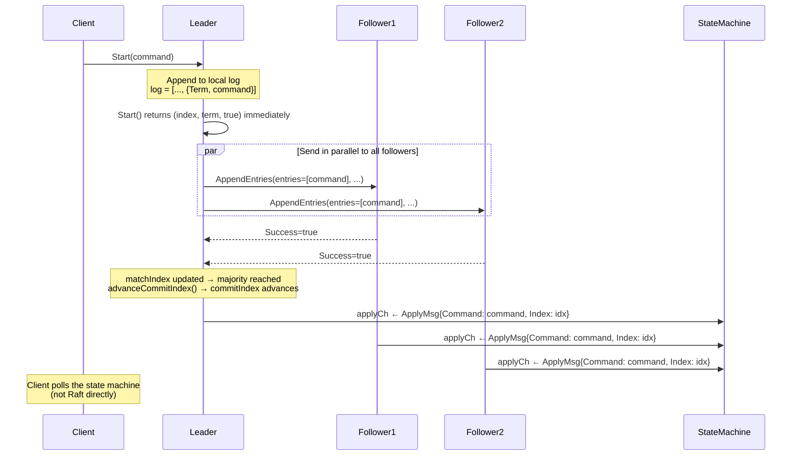
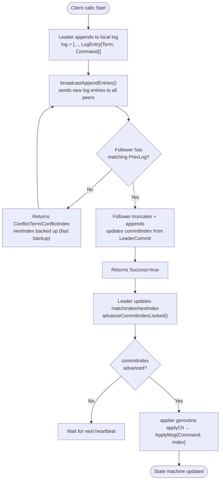
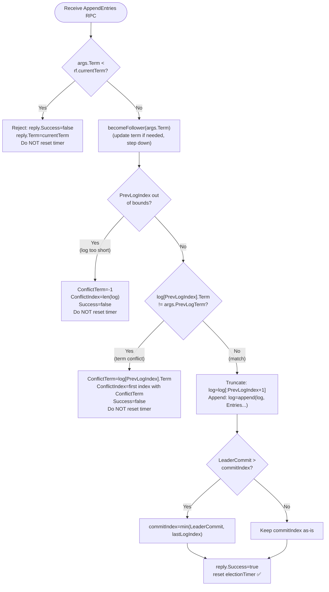
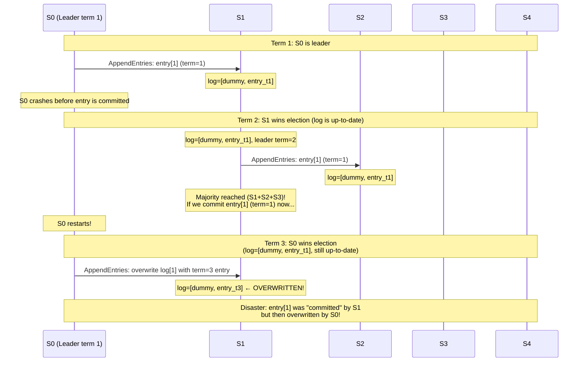
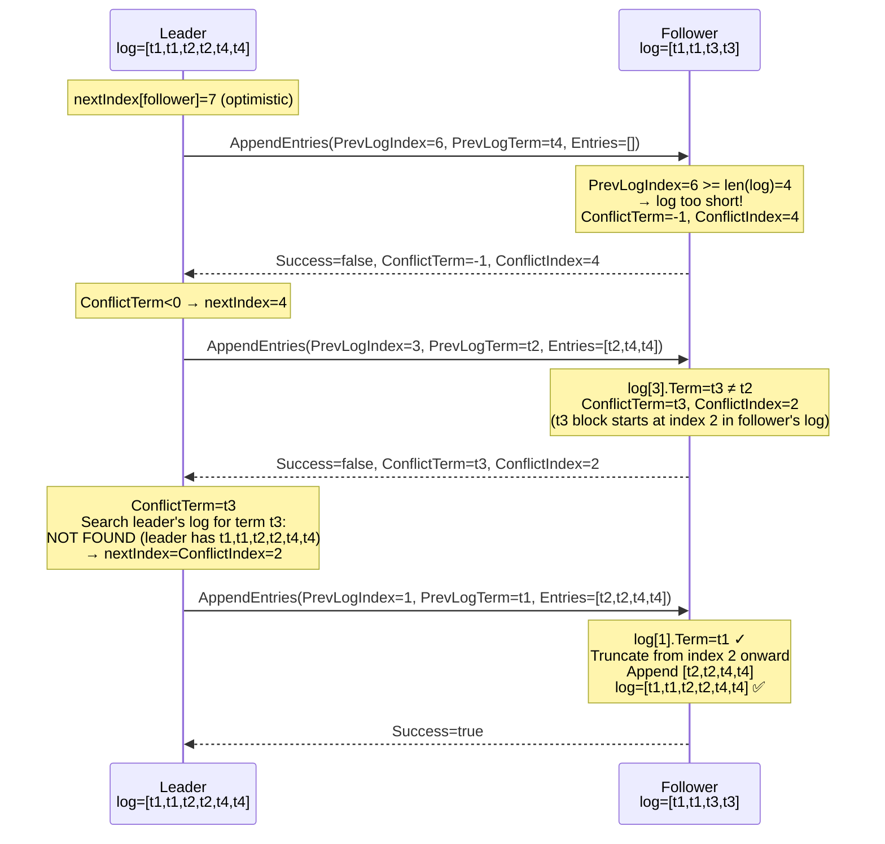
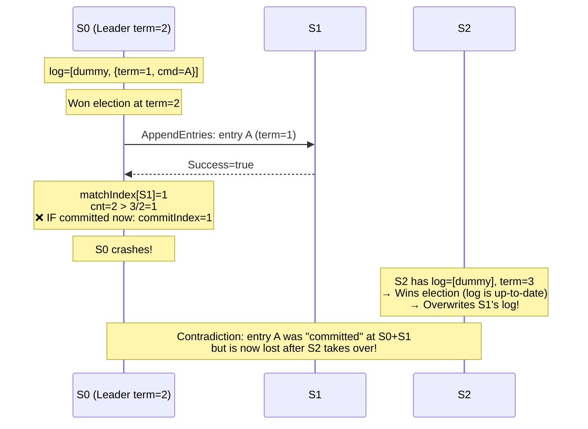

In the previous post (Lab 3A), we built Raft's leader election mechanism. The cluster can now elect a single leader, detect and recover from leader crashes, and maintain authority through heartbeats. But there is a catch: **the newly elected leader cannot actually do anything yet**.

If a client sends a command to the leader — say "set x = 5" — the current leader has no way to propagate that command to followers, no way to know when it is safe to confirm the command to the client, and no way to apply the command to a state machine.

Lab 3B solves exactly these problems: **replicating the log from leader to followers, committing entries once a quorum agrees, and applying them to the state machine**. This is the core of Raft — the mechanism that turns a cluster of independent servers into a genuine consensus system.

## 1. From Leader Election to Real Consensus

### 1.1. 3A Only Got Us Halfway

Let us look back at what 3A accomplished — and what it left unfinished.

3A answered the question: _"Who is the leader?"_ A server becomes leader when it receives a majority of votes. After that, the leader sends heartbeats to maintain authority and prevent followers from starting new elections.

But 3A never answered the more important question: _"What do all servers agree on?"_ Consensus in Raft is not about who the leader is — that is merely a means. The actual goal is: **all servers must agree on the same sequence of commands (the log), in exactly the same order**.

Only then can every server's state machine be guaranteed to stay consistent — and that is what clients actually need.

### 1.2. The 3B Pipeline

3B adds the following end-to-end pipeline:



**Explanation:**
- `Start(command)` is called by the leader and **returns immediately** — it does not wait for replication to complete. The client must poll to learn when the command has been applied.
- The leader sends `AppendEntries` in parallel to all followers — each in its own goroutine.
- After receiving successful replies from a majority, the leader advances `commitIndex`.
- Both leader and followers apply committed commands to the state machine via `applyCh` — this guarantees every node reaches the same state.

## 2. The Big Picture: Log Replication

Before diving into code, let us understand the full pipeline and the core concepts.



**Explanation:**
- This entire process runs **asynchronously** — each step can proceed in parallel across different peers.
- **`commitIndex`**: the highest log index the leader knows has been acknowledged by a majority — safe to apply.
- **`lastApplied`**: the highest log index actually applied to the state machine. Always `lastApplied <= commitIndex`.
- **`nextIndex[i]`**: the next log index to send to peer `i`. The leader tracks this independently per follower.
- **`matchIndex[i]`**: the highest log index the leader knows peer `i` has replicated. Used to compute `commitIndex`.

The key distinction between `commitIndex` and `lastApplied`:

> `commitIndex` can advance before `lastApplied` — because commitment happens as soon as a quorum responds, while applying requires an additional step of writing to `applyCh`. The `applier` goroutine closes this gap incrementally.

## 3. Extending the Data Structures from 3A

### 3.1. New Fields in the Raft Struct

Compared to 3A, the `Raft` struct gains six new fields:

```go
// Volatile state on all servers (Figure 2).
commitIndex int // highest log index known to be committed
lastApplied int // highest log index applied to the state machine

// Volatile state on leaders only; reinitialized after each election (Figure 2).
nextIndex  []int // for each peer: index of next entry to send
matchIndex []int // for each peer: highest index known to be replicated
```

**Explanation:**
- `commitIndex` and `lastApplied` are initialized to 0 (the index of the dummy entry). They only increase, never decrease.
- `nextIndex` and `matchIndex` only exist when the server is leader. When a leader loses authority and is re-elected, these arrays are reinitialized from scratch.
- Separating `commitIndex` (cluster-wide) from `lastApplied` (local state machine) allows applying to happen asynchronously — the lock does not need to be held while writing to `applyCh`.

### 3.2. Extended AppendEntriesArgs

In 3A, `AppendEntriesArgs` only contained `Term`. In 3B it is extended to:

```go
type AppendEntriesArgs struct {
    Term         int
    LeaderId     int        // leader's ID (reserved for client redirects)
    PrevLogIndex int        // index of the entry BEFORE the new ones
    PrevLogTerm  int        // term of the entry at PrevLogIndex
    Entries      []LogEntry // entries to append (empty = heartbeat)
    LeaderCommit int        // leader's current commitIndex
}

type AppendEntriesReply struct {
    Term    int
    Success bool
    // Used when Success=false for faster nextIndex adjustment:
    ConflictTerm  int // term of conflicting entry (-1 if log too short)
    ConflictIndex int // first index in follower's log with ConflictTerm
}
```

**Explanation:**
- `PrevLogIndex` and `PrevLogTerm`: the "join point." The leader tells the follower: _"Before these new entries, your log must have an entry at PrevLogIndex with term PrevLogTerm."_ If it does not match, the follower rejects and reports the conflict.
- `Entries`: the list of entries to append. If empty, the RPC is a pure heartbeat — it only resets the election timer and updates `commitIndex`.
- `LeaderCommit`: the leader shares its `commitIndex` so followers can update their own without waiting for the next round-trip.
- `ConflictTerm` and `ConflictIndex`: these two fields are the heart of **fast backup** — an optimization that lets the leader find the divergence point quickly instead of backing up one entry at a time (covered in detail in Section 9).

### 3.3. Leader Replication Initialization: `initLeaderReplicationLocked`

As soon as a candidate wins an election and becomes leader, it must initialize `nextIndex` and `matchIndex`:

```go
func (rf *Raft) initLeaderReplicationLocked() {
    n := len(rf.peers)
    rf.nextIndex = make([]int, n)
    rf.matchIndex = make([]int, n)
    next := rf.lastLogIndex() + 1
    for i := 0; i < n; i++ {
        rf.nextIndex[i] = next
        rf.matchIndex[i] = 0
    }
}
```

**Explanation:**
- `nextIndex[i] = lastLogIndex + 1`: per Figure 2, the leader starts with the optimistic assumption that every follower has a complete log identical to its own. If that assumption is wrong, the follower will reject and the leader adjusts `nextIndex` downward.
- `matchIndex[i] = 0`: the leader does not yet know how far any follower has replicated. 0 is a safe initial value — the worst outcome is that the leader cannot commit immediately, but it will update through subsequent successful AppendEntries replies.
- This function is called while holding `rf.mu`, right inside `startElection` after `rf.role = RoleLeader`.

## 4. The AppendEntries Handler — Heart of 3B

The `AppendEntries` handler is the most complex part of 3B. Each follower receives this RPC and must decide: accept or reject, and how to update its state.

### 4.1. Decision Flow



**The most important point:** the election timer is **only reset when AppendEntries succeeds**. If rejected (stale term, log too short, or term conflict), the timer is not reset. This ensures the follower will start an election if the leader sends invalid information, rather than blindly following a bad leader forever.

### 4.2. Full Implementation

```go
func (rf *Raft) AppendEntries(args *AppendEntriesArgs, reply *AppendEntriesReply) {
    rf.mu.Lock()
    defer rf.mu.Unlock()

    // Step 1: Reject if leader's term is stale.
    if args.Term < rf.currentTerm {
        reply.Term = rf.currentTerm
        reply.Success = false
        return
    }

    // Step 2: Adopt leader's term, step down to follower.
    // If args.Term == currentTerm and we are Candidate → step down to Follower.
    rf.becomeFollower(args.Term)
    reply.Term = rf.currentTerm

    // Step 3: Check if PrevLogIndex is within our log.
    if args.PrevLogIndex < 0 || args.PrevLogIndex >= len(rf.log) {
        reply.Success = false
        reply.ConflictTerm = -1
        reply.ConflictIndex = len(rf.log)
        return
    }

    // Step 4: Check if the term at PrevLogIndex matches.
    if rf.log[args.PrevLogIndex].Term != args.PrevLogTerm {
        reply.Success = false
        ct := rf.log[args.PrevLogIndex].Term
        reply.ConflictTerm = ct
        // Find the first index in our log with term == ct (fast backup hint).
        idx := args.PrevLogIndex
        for idx > 0 && rf.log[idx-1].Term == ct {
            idx--
        }
        reply.ConflictIndex = idx
        return
    }

    // Step 5: Truncate conflicting suffix, then append new entries.
    // Copy to avoid aliasing the RPC buffer (important!).
    rf.log = rf.log[:args.PrevLogIndex+1]
    if len(args.Entries) > 0 {
        toAppend := make([]LogEntry, len(args.Entries))
        copy(toAppend, args.Entries)
        rf.log = append(rf.log, toAppend...)
    }

    // Step 6: Update commitIndex from LeaderCommit.
    if args.LeaderCommit > rf.commitIndex {
        last := rf.lastLogIndex()
        c := args.LeaderCommit
        if c > last {
            c = last
        }
        rf.commitIndex = c
    }

    // Step 7: Success — reset election timer.
    reply.Success = true
    rf.resetElectionTimerLocked()
}
```

**Explanation:**
- **Step 3**: If `PrevLogIndex >= len(rf.log)`, the follower's log is too short — it does not have an entry at that position. Returning `ConflictTerm=-1` and `ConflictIndex=len(rf.log)` tells the leader exactly how short the follower is.
- **Step 4**: If the term at `PrevLogIndex` does not match, the logs diverged at or before that point. The algorithm finds `ConflictIndex` — the first index in the follower's log that has `ConflictTerm`. This lets the leader skip an entire "block" of a conflicting term in one step.
- **Step 5**: `rf.log = rf.log[:args.PrevLogIndex+1]` truncates all entries from `PrevLogIndex+1` onward — discarding anything inconsistent with the leader. Then new entries are appended. `copy(toAppend, args.Entries)` prevents the follower from accidentally holding a reference to the RPC framework's buffer, which could be overwritten later.
- **Step 6**: The follower does not compute `commitIndex` itself. It simply takes `min(LeaderCommit, lastLogIndex)` — ensuring it never commits entries it does not actually have in its log.
- **Step 7**: Only reset the timer after **all** of the above steps succeed. Resetting too early would let the follower "trust" a leader that is sending incorrect information.

## 5. Start() — Accepting Commands from Clients

When a client wants to write a command to Raft, it calls `Start()` on whatever server it believes is the leader:

```go
func (rf *Raft) Start(command interface{}) (int, int, bool) {
    rf.mu.Lock()
    // Check: is the server killed? Is it currently the leader?
    if rf.killed() || rf.role != RoleLeader {
        t := rf.currentTerm
        rf.mu.Unlock()
        return startIndexNotReady, t, false
    }

    // Append to the leader's local log.
    rf.log = append(rf.log, LogEntry{Term: rf.currentTerm, Command: command})
    idx := rf.lastLogIndex()
    t := rf.currentTerm

    // Try to advance commitIndex immediately (for single-node clusters).
    rf.advanceCommitIndexLocked()
    rf.mu.Unlock()

    // Trigger async replication to all peers.
    go rf.broadcastAppendEntries()

    return idx, t, true
}
```

**Explanation:**
- `Start()` **returns immediately** without waiting for replication. The return value `(index, term, isLeader)` conveys: if this command is eventually committed, it will appear at `index` in the log under `term`.
- `index` is a promise — the client uses it to track whether the command was applied by waiting for `ApplyMsg` with `CommandIndex == index` to appear on `applyCh`.
- `go rf.broadcastAppendEntries()`: replication runs in a separate goroutine — `Start()` is never blocked by network latency.
- The call to `advanceCommitIndexLocked()` inside `Start()` handles the single-server case: when the leader is the only server, it is also the entire majority — so a new entry can be committed immediately without waiting for any follower.

> Note: if the server loses leadership between the time `Start()` returns and the entry is replicated, the returned `isLeader=true` is stale. The entry may never be committed if the leader loses quorum. Clients must handle this possibility.

## 6. advanceCommitIndexLocked() — The Safe Commit Rule

After receiving enough successful replies from followers, the leader must decide which entries can be committed. But this is not a simple calculation.

### 6.1. Why Can a Leader Never Commit Entries from Old Terms?

This is one of Raft's subtlest rules — illustrated by **Figure 8** in the original paper. Let us see what goes wrong if a leader tries to commit an entry from an old term:



**Explanation:** If the term-2 leader (S1) commits the entry at index 1 with term=1 as soon as it has a majority, it is still possible for a new leader with a higher term (S0 at term 3) to overwrite that entry — violating consistency.

Raft solves this with the rule: **a leader may only commit entries belonging to its own current term**. Entries from old terms are committed indirectly — when a new entry from the current term is committed, all preceding entries are committed along with it.

### 6.2. The `advanceCommitIndexLocked` Implementation

```go
func (rf *Raft) advanceCommitIndexLocked() {
    if rf.role != RoleLeader {
        return
    }
    // Scan backwards from the end of the log toward commitIndex.
    for n := rf.lastLogIndex(); n > rf.commitIndex; n-- {
        // Critical rule: only commit entries from the current term.
        if rf.log[n].Term != rf.currentTerm {
            continue
        }
        // Count servers that have replicated up to index n (including self).
        cnt := 1 // leader always has it
        for i := range rf.peers {
            if i == rf.me {
                continue
            }
            if rf.matchIndex[i] >= n {
                cnt++
            }
        }
        // If a majority has it, commit.
        if cnt > len(rf.peers)/2 {
            rf.commitIndex = n
            return
        }
    }
}
```

**Explanation:**
- The loop scans from `lastLogIndex` down to `commitIndex` — finding the highest index `n` that satisfies the commit condition.
- `rf.log[n].Term != rf.currentTerm`: skip entries from old terms. This enforces the Figure 8 rule.
- `cnt > len(rf.peers)/2`: for a 3-server cluster, this requires `cnt >= 2` (including the leader). For 5 servers, `cnt >= 3`.
- The function returns as soon as the first qualifying `n` is found from the top — that is the highest committable index, and all preceding entries are automatically committed by the Log Matching Property.

## 7. The Applier Goroutine

When `commitIndex` advances, the `applier` goroutine sends newly committed entries to `applyCh` for the state machine above to process:

```go
func (rf *Raft) applier(applyCh chan raftapi.ApplyMsg) {
    for !rf.killed() {
        rf.mu.Lock()
        if rf.killed() {
            rf.mu.Unlock()
            return
        }
        // Nothing new to apply: wait.
        if rf.lastApplied >= rf.commitIndex {
            rf.mu.Unlock()
            time.Sleep(applierPollSleep)
            continue
        }
        // Advance lastApplied and read the entry.
        rf.lastApplied++
        idx := rf.lastApplied
        cmd := rf.log[idx].Command
        rf.mu.Unlock() // ← MUST release lock BEFORE sending to channel!

        applyCh <- raftapi.ApplyMsg{
            CommandValid: true,
            Command:      cmd,
            CommandIndex: idx,
        }
    }
}
```

**Explanation:**
- The goroutine runs in a continuous loop, polling every `applierPollSleep` (10ms) when there is nothing new.
- `rf.lastApplied++` is incremented **before** releasing the lock — ensuring that even if another goroutine checks `lastApplied`, it sees the correct value.
- **The lock must be released before sending to `applyCh`**: this is one of the most common mistakes. If the lock is held while sending to a channel and the channel is full (or the consumer is blocked), the entire Raft instance deadlocks — no other goroutine can acquire `rf.mu`. See Section 10.2 for details.
- Each entry is applied exactly once: `lastApplied` only increases. The loop condition `lastApplied >= commitIndex` ensures every entry is sent to the channel exactly one time.

## 8. broadcastAppendEntries — The Replication Orchestrator

`broadcastAppendEntries` is the "general coordinator" — it prepares arguments for each peer, fires RPCs, and processes the results:

```go
func (rf *Raft) broadcastAppendEntries() {
    rf.mu.Lock()
    if rf.killed() || rf.role != RoleLeader {
        rf.mu.Unlock()
        return
    }
    term := rf.currentTerm
    me   := rf.me
    n    := len(rf.peers)
    lc   := rf.commitIndex

    // Snapshot: build args for each peer while holding the lock.
    type aeSnap struct {
        peer int
        args *AppendEntriesArgs
    }
    var snaps []aeSnap
    for p := 0; p < n; p++ {
        if p == me { continue }
        next := rf.nextIndex[p]
        if next < 1 { next = 1 }
        prev := next - 1
        prevTerm := rf.log[prev].Term
        // Only send log[next:] — not the entire log!
        rest := len(rf.log) - next
        if rest < 0 { rest = 0 }
        ents := make([]LogEntry, rest)
        copy(ents, rf.log[next:])
        snaps = append(snaps, aeSnap{p, &AppendEntriesArgs{
            Term:         term,
            PrevLogIndex: prev,
            PrevLogTerm:  prevTerm,
            Entries:      ents,
            LeaderCommit: lc,
        }})
    }
    rf.mu.Unlock() // ← Release lock BEFORE RPC calls

    for _, s := range snaps {
        peer := s.peer
        args := s.args
        go func() {
            reply := &AppendEntriesReply{}
            if !rf.sendAppendEntries(peer, args, reply) { return }
            if rf.killed() { return }

            rf.mu.Lock()
            defer rf.mu.Unlock()

            // Validate the reply.
            if reply.Term > rf.currentTerm {
                rf.becomeFollower(reply.Term)
                return
            }
            if rf.currentTerm != term || rf.role != RoleLeader { return }

            if reply.Success {
                // Success: update matchIndex and nextIndex.
                last := args.PrevLogIndex + len(args.Entries)
                if last > rf.matchIndex[peer] {
                    rf.matchIndex[peer] = last
                    rf.nextIndex[peer] = last + 1
                    rf.advanceCommitIndexLocked()
                }
            } else if reply.Term == rf.currentTerm {
                // Failure due to log mismatch: adjust nextIndex (fast backup).
                if rf.nextIndex[peer] != args.PrevLogIndex+1 { return } // stale reply
                if reply.ConflictTerm < 0 {
                    // Follower's log is too short.
                    rf.nextIndex[peer] = reply.ConflictIndex
                } else {
                    // Find last entry in leader's log with ConflictTerm.
                    lastSame := 0
                    for i := len(rf.log) - 1; i > 0; i-- {
                        if rf.log[i].Term == reply.ConflictTerm {
                            lastSame = i
                            break
                        }
                    }
                    if lastSame > 0 {
                        rf.nextIndex[peer] = lastSame + 1
                    } else {
                        rf.nextIndex[peer] = reply.ConflictIndex
                    }
                }
                if rf.nextIndex[peer] < 1 { rf.nextIndex[peer] = 1 }
            }
        }()
    }
}
```

**Explanation:**
- **Snapshot pattern**: All necessary information (args per peer) is prepared before releasing the lock. Each RPC then runs in its own goroutine without holding the lock. This is the critical pattern that prevents holding a lock during an RPC call.
- **Incremental replication**: `copy(ents, rf.log[next:])` — only the suffix starting at `nextIndex[peer]` is sent, not the full log. This is what makes `TestRPCBytes3B` pass — the test verifies that total RPC bytes stay within a proportional bound.
- **Success handling**: Update only if `last > rf.matchIndex[peer]` — this prevents a stale (out-of-order) reply from rolling back progress.
- **Stale reply check**: `if rf.nextIndex[peer] != args.PrevLogIndex+1 { return }` — discards replies from older RPCs whose `nextIndex` has already been superseded by a newer reply.

## 9. Fast Backup with ConflictTerm

### 9.1. The Problem with Naive Backup

When a follower rejects AppendEntries, the leader must decrease `nextIndex[peer]` to find the point of agreement. The naive approach: decrease by one each time. This can be very slow when logs have diverged significantly.

Example: leader has log `[t1,t1,t2,t2,t4,t4]` (6 entries), follower has `[t1,t1,t3,t3]` (4 entries, diverged at index 3). Naive backup requires 4 RPCs (try index 6, 5, 4, 3) before finding the matching point.

### 9.2. Fast Backup with ConflictTerm



**Explanation:** Instead of 4 RPCs (one-by-one backup), fast backup converges in 3:
1. First RPC: discovers the follower's log is too short → jump to `ConflictIndex=4`.
2. Second RPC: discovers a term conflict (t3 vs t2) → follower reports `ConflictTerm=t3, ConflictIndex=2`. Leader does not have term t3 at all, so it jumps directly to `ConflictIndex=2`.
3. Third RPC: matches at index 1 → replication succeeds.

The logic inside `broadcastAppendEntries` for handling `reply.ConflictTerm >= 0`:

```go
// Case: leader HAS entries with ConflictTerm:
// → nextIndex = (last index with that term in leader's log) + 1
// Case: leader does NOT have ConflictTerm:
// → nextIndex = ConflictIndex (trust the follower's hint)

lastSame := 0
for i := len(rf.log) - 1; i > 0; i-- {
    if rf.log[i].Term == reply.ConflictTerm {
        lastSame = i
        break
    }
}
if lastSame > 0 {
    rf.nextIndex[peer] = lastSame + 1
} else {
    rf.nextIndex[peer] = reply.ConflictIndex
}
```

**Explanation:**
- If the leader has an entry with `ConflictTerm`: the actual divergence point is somewhere after the leader's block of that term. Set `nextIndex = lastSame + 1`.
- If the leader does not have `ConflictTerm`: the leader does not share any entry of that term with the follower — the follower's entire block of that term must be replaced. `ConflictIndex` is the start of that block → set `nextIndex = ConflictIndex`.

## 10. Common Pitfalls

### 10.1. Race Condition on nextIndex/matchIndex (Stale Reply)

**Problem**: When multiple RPCs run concurrently for the same peer, replies can arrive out of order — an older reply (sent earlier) arrives after a newer reply (sent later). Without a guard, the older reply can overwrite the progress made by the newer one.

```go
// ❌ Buggy code: no check for stale replies
if reply.Success {
    last := args.PrevLogIndex + len(args.Entries)
    // If an old reply arrives AFTER a new one, last < current matchIndex!
    rf.matchIndex[peer] = last        // Rolls back progress → BUG
    rf.nextIndex[peer] = last + 1
}
```

**Fix**: Check `last > rf.matchIndex[peer]` before updating:

```go
// ✅ Correct: only update if it represents actual forward progress
if reply.Success {
    last := args.PrevLogIndex + len(args.Entries)
    if last > rf.matchIndex[peer] {
        rf.matchIndex[peer] = last
        rf.nextIndex[peer] = last + 1
        rf.advanceCommitIndexLocked()
    }
}
```

Similarly for failure handling — check `rf.nextIndex[peer] == args.PrevLogIndex+1` before adjusting:

```go
// ✅ Discard failure replies if nextIndex has already moved on
if rf.nextIndex[peer] != args.PrevLogIndex+1 {
    return // Stale reply, no longer relevant
}
```

### 10.2. Deadlock: Holding the Lock While Sending to applyCh

**Problem**: `applyCh` is a buffered channel, but it can still fill up if the consumer (state machine above) is slow. If a goroutine holds the lock while writing to a full channel, it blocks indefinitely — and every other goroutine that needs `rf.mu` is also blocked.

```go
// ❌ Buggy code: lock held while writing to channel
func (rf *Raft) applier(applyCh chan raftapi.ApplyMsg) {
    for !rf.killed() {
        rf.mu.Lock() // lock is held
        if rf.lastApplied < rf.commitIndex {
            rf.lastApplied++
            idx := rf.lastApplied
            cmd := rf.log[idx].Command
            // If channel is full: blocks here forever while holding the lock
            // Every other goroutine that needs rf.mu is also blocked → DEADLOCK
            applyCh <- raftapi.ApplyMsg{...}
        }
        rf.mu.Unlock()
    }
}
```

**Fix**: Release the lock BEFORE writing to the channel — copy the necessary values under the lock, release, then send:

```go
// ✅ Correct: release lock before channel send
func (rf *Raft) applier(applyCh chan raftapi.ApplyMsg) {
    for !rf.killed() {
        rf.mu.Lock()
        if rf.lastApplied >= rf.commitIndex {
            rf.mu.Unlock()
            time.Sleep(applierPollSleep)
            continue
        }
        rf.lastApplied++
        idx := rf.lastApplied
        cmd := rf.log[idx].Command
        rf.mu.Unlock() // Release first!

        applyCh <- raftapi.ApplyMsg{ // Now safe: no lock held, channel blocks are harmless
            CommandValid: true,
            Command:      cmd,
            CommandIndex: idx,
        }
    }
}
```

### 10.3. Committing Entries from Old Terms (Figure 8 Violation)

**Problem**: If the `rf.log[n].Term != rf.currentTerm` check is omitted in `advanceCommitIndexLocked`, a leader may commit an entry from an old term as soon as it has a majority. This can lead to the contradiction shown in Section 6.1.



**Fix**: Always check the entry's term before committing:

```go
// ✅ Correct: skip entries from old terms
for n := rf.lastLogIndex(); n > rf.commitIndex; n-- {
    if rf.log[n].Term != rf.currentTerm { // ← Figure 8 rule
        continue
    }
    // ... count majority ...
}
```

When a leader needs to commit entries from an old term, the correct approach is: first commit a new entry from the current term — this automatically "pulls forward" all preceding entries.

## 11. Understanding the 3B Test Cases

Lab 3B includes a comprehensive test suite covering every aspect of log replication:

| Test | Description | Pass Condition |
|------|-------------|----------------|
| `TestBasicAgree3B` | Basic pipeline: start 3 commands, all servers commit in order | ApplyMsg has correct Command and CommandIndex |
| `TestRPCBytes3B` | Efficiency: no re-sending the full log on each heartbeat | Total RPC bytes ≤ servers × payload + slack |
| `TestFollowerFailure3B` | Only commit with majority | With 2/3 followers disconnected, no commit |
| `TestLeaderFailure3B` | New leader continues replication | Old leader crashes, new leader commits correctly |
| `TestFailAgree3B` | Follower catch-up on rejoin | Disconnected follower syncs log after reconnecting |
| `TestFailNoAgree3B` | No commit without majority | 5-server cluster, disconnect 3 → no commit |
| `TestConcurrentStarts3B` | Thread-safe `Start()` | 5 goroutines call `Start()` simultaneously → unique indices |
| `TestRejoin3B` | Old leader does not overwrite committed entries | Old leader rejoins and defers to new leader |
| `TestBackup3B` | Fast backup ConflictTerm optimization | Large log divergence resolved quickly |
| `TestCount3B` | RPC efficiency | RPC count for N entries stays within allowed bound |

### 11.1. TestBasicAgree3B and TestRPCBytes3B

`TestBasicAgree3B` verifies the complete pipeline from `Start()` to `ApplyMsg`. It is the simplest test but the most fundamental — if it fails, none of the others are likely to pass.

`TestRPCBytes3B` tests **efficiency**, not just correctness. If `broadcastAppendEntries` sends the entire `rf.log` every time instead of only `rf.log[nextIndex:]`, total RPC bytes grow quadratically with the number of entries — and this test fails. This is why the `copy(ents, rf.log[next:])` pattern matters.

### 11.2. TestBackup3B

This is the hardest and most important test in 3B. It creates a complex network partition scenario with 5 servers:

1. Start a 5-server cluster, elect a leader.
2. Partition into 2+3, have the old leader append 50 entries in the smaller partition (2 servers) — these cannot be committed because there is no majority.
3. Reconnect the larger partition (3 servers), elect a new leader, append 50 different entries — these are committed.
4. Partition again in a different configuration.
5. Finally reconnect all servers and verify everyone agrees.

This test directly validates that fast backup works: without the `ConflictTerm` optimization, the RPC count needed to synchronize diverged logs would exceed the test's allowed threshold.

### 11.3. TestConcurrentStarts3B

This test is particularly important for verifying that `Start()` is thread-safe. Five goroutines call `Start()` concurrently on the same leader — the result must be five **distinct** indices (no two commands assigned the same log position).

This is naturally guaranteed because `Start()` holds `rf.mu` while executing both `append(rf.log, ...)` and reading `len(rf.log)-1` — the entire "append + read index" sequence is atomic under the lock.

## Closing Thoughts

In this post, we implemented the complete log replication mechanism of Raft — from how followers check and accept entries, to how the leader decides when it is safe to commit, and finally how entries are applied to the state machine correctly.

Key takeaways from Lab 3B:

- **`commitIndex` vs `lastApplied`**: commit and apply are two separate steps — commit happens when a quorum responds, apply happens asynchronously through the `applier` goroutine.
- **Only commit entries from the current term**: the Figure 8 rule is mandatory — violating it leads to data loss on committed entries.
- **Election timer resets only on successful AppendEntries**: followers must not trust a leader sending incorrect information.
- **Incremental replication**: only send `log[nextIndex:]`, not the full log — a requirement for efficient operation with large logs.
- **Fast backup with ConflictTerm**: reduces the number of RPCs from O(n) to O(number of diverging terms) when logs have diverged significantly.
- **Never hold the lock while sending to a channel or calling an RPC**: the golden rule for avoiding deadlocks.

In the next post (Lab 3C), we will add **persistence** — ensuring Raft does not lose critical state when a server crashes and restarts. The log replication mechanism built here will be the foundation for that step.
