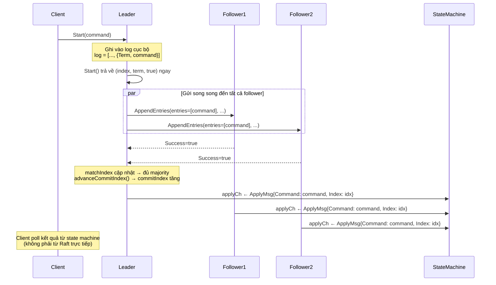
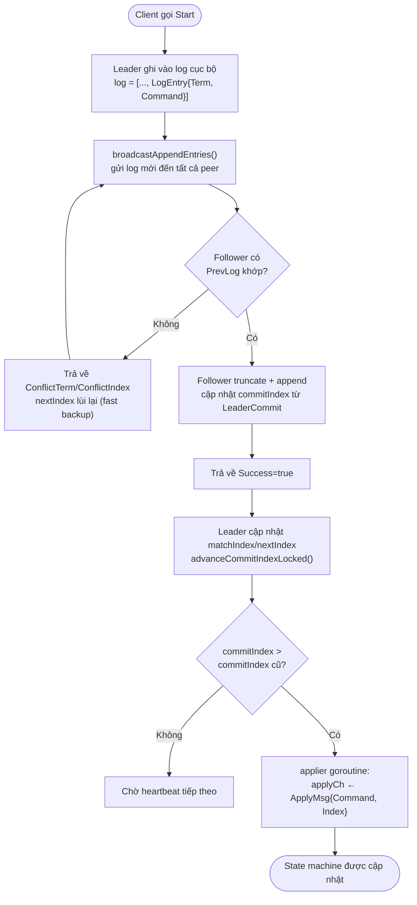
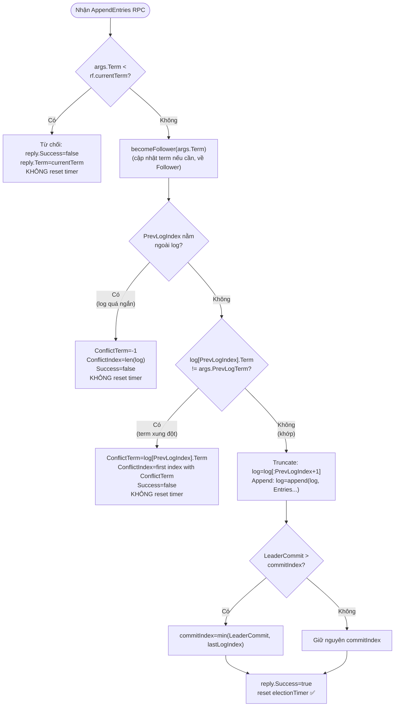
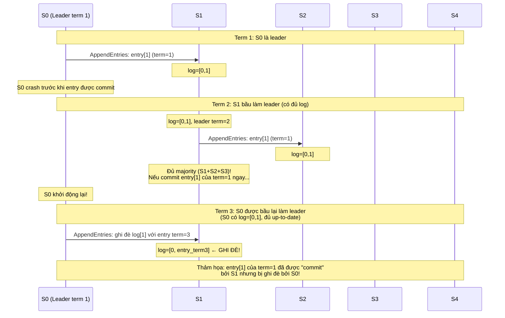
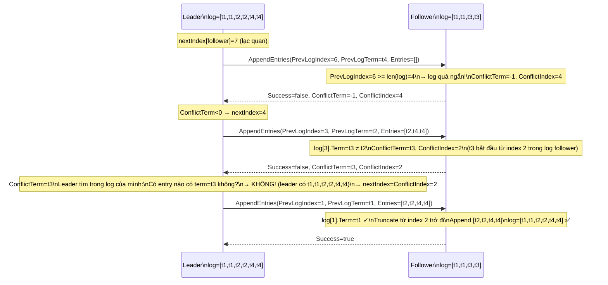
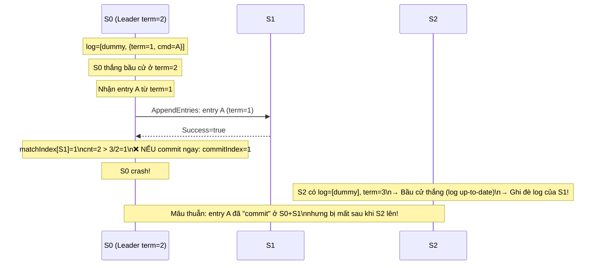

Ở bài trước (Lab 3A), chúng ta đã xây dựng xong cơ chế bầu cử leader trong Raft. Cluster giờ đây có thể chọn ra một leader duy nhất, phát hiện và xử lý các tình huống leader crash, và duy trì quyền lực qua heartbeat. Nhưng có một vấn đề: **leader mới được bầu ra chưa thực sự làm được gì cả**.

Nếu client gửi một lệnh đến leader — ví dụ "set x = 5" — leader hiện tại chỉ biết... im lặng. Nó chưa có cách nào để lan truyền lệnh đó sang các follower, chưa biết khi nào thì "đủ an toàn" để xác nhận với client rằng lệnh đã được ghi nhận, và cũng chưa có cách nào để áp dụng lệnh vào state machine.

Lab 3B giải quyết đúng những vấn đề này: **sao chép log từ leader sang follower, commit khi đủ quorum, và apply vào state machine**. Đây là phần cốt lõi của Raft — cơ chế biến một cluster các server rời rạc thành một hệ thống đồng thuận thực sự.

## 1. Từ bầu cử đến đồng thuận thực sự

### 1.1. 3A chỉ mới đi được nửa đường

Hãy nhìn lại những gì 3A đã làm được và chưa làm được.

3A đã giải quyết câu hỏi: _"Ai là leader?"_ Một server được bầu làm leader khi nhận được đa số phiếu. Sau đó, leader gửi heartbeat để duy trì vị thế và ngăn các follower bắt đầu bầu cử mới.

Nhưng 3A chưa trả lời được câu hỏi quan trọng hơn: _"Tất cả server đồng thuận về điều gì?"_ Đồng thuận trong Raft không phải là "ai là leader" — đó chỉ là phương tiện. Mục đích thực sự là: **tất cả server phải đồng thuận về một chuỗi lệnh (log) theo đúng cùng một thứ tự**.

Chỉ khi đó, state machine của mọi server mới đảm bảo nhất quán với nhau — và đó là điều mà client thực sự cần.

### 1.2. Pipeline của 3B

3B bổ sung toàn bộ pipeline sau:



**Giải thích:**
- `Start(command)` được leader gọi và **trả về ngay lập tức** — nó không chờ replication hoàn tất. Client phải tự poll để biết lệnh đã được apply chưa.
- Leader gửi `AppendEntries` song song đến tất cả follower — mỗi follower trong một goroutine riêng.
- Sau khi nhận phản hồi từ đa số follower, leader tăng `commitIndex`.
- Cả leader lẫn follower đều áp dụng lệnh vào state machine thông qua `applyCh` — điều này đảm bảo mọi node đều có cùng state.

## 2. Bức tranh toàn cảnh: Log Replication

Trước khi đi vào code, hãy hiểu rõ toàn bộ pipeline của log replication và các khái niệm cốt lõi.



**Giải thích:**
- Toàn bộ quy trình này xảy ra **bất đồng bộ** — mỗi bước có thể chạy song song cho nhiều peer khác nhau.
- **`commitIndex`**: chỉ số log cao nhất mà leader biết đã được đa số server ghi nhận — an toàn để apply.
- **`lastApplied`**: chỉ số log cao nhất đã thực sự được apply vào state machine. Luôn `lastApplied <= commitIndex`.
- **`nextIndex[i]`**: chỉ số log tiếp theo cần gửi cho peer `i`. Leader giữ riêng cho từng follower.
- **`matchIndex[i]`**: chỉ số log cao nhất mà leader biết peer `i` đã có. Dùng để tính `commitIndex`.

Sự khác biệt quan trọng giữa `commitIndex` và `lastApplied`:

> `commitIndex` có thể tiến lên trước khi `lastApplied` — vì commit xảy ra ngay khi đủ quorum, còn apply cần thêm một bước gửi vào `applyCh`. Khoảng chênh lệch này được goroutine `applier` xử lý dần dần.

## 3. Mở rộng cấu trúc dữ liệu từ 3A

### 3.1. Các trường mới trong Raft struct

So với 3A, struct `Raft` cần thêm sáu trường sau (thực tế đã được đặt sẵn trong code để hỗ trợ 3B):

```go
// Volatile state trên tất cả server (Figure 2).
commitIndex int // chỉ số log cao nhất được biết là đã committed
lastApplied int // chỉ số log cao nhất đã được apply vào state machine

// Volatile state chỉ dành cho leader; được khởi tạo lại sau mỗi lần đắc cử (Figure 2).
nextIndex  []int // với mỗi peer: chỉ số log tiếp theo cần gửi
matchIndex []int // với mỗi peer: chỉ số log cao nhất đã được xác nhận là replicated
```

**Giải thích:**
- `commitIndex` và `lastApplied` được khởi tạo bằng 0 (index của dummy entry). Chúng chỉ tăng, không bao giờ giảm.
- `nextIndex` và `matchIndex` chỉ tồn tại khi server là leader. Khi leader mất quyền rồi được bầu lại, các mảng này được khởi tạo lại từ đầu.
- Sự tách biệt giữa `commitIndex` (của cluster) và `lastApplied` (của local state machine) cho phép apply xảy ra bất đồng bộ — không cần giữ lock khi gửi vào `applyCh`.

### 3.2. AppendEntriesArgs mở rộng

Ở 3A, `AppendEntriesArgs` chỉ có trường `Term`. Ở 3B, nó được mở rộng thành:

```go
type AppendEntriesArgs struct {
    Term         int
    LeaderId     int        // ID của leader (dùng cho follower redirect, reserved)
    PrevLogIndex int        // chỉ số của entry TRƯỚC các entry mới
    PrevLogTerm  int        // term của entry tại PrevLogIndex
    Entries      []LogEntry // các entry cần append (rỗng = heartbeat)
    LeaderCommit int        // commitIndex hiện tại của leader
}

type AppendEntriesReply struct {
    Term    int
    Success bool
    // Dùng khi Success=false để leader điều chỉnh nextIndex nhanh hơn:
    ConflictTerm  int // term của entry xung đột (-1 nếu log quá ngắn)
    ConflictIndex int // chỉ số đầu tiên có ConflictTerm trong log của follower
}
```

**Giải thích:**
- `PrevLogIndex` và `PrevLogTerm`: đây là "điểm nối" — leader nói với follower: _"Trước các entry mới này, log của bạn phải có entry tại index PrevLogIndex với term PrevLogTerm."_ Nếu không khớp, follower từ chối và báo lỗi.
- `Entries`: danh sách các entry cần append. Nếu rỗng, RPC là heartbeat thuần túy — chỉ để reset election timer và cập nhật `commitIndex`.
- `LeaderCommit`: leader chia sẻ `commitIndex` của mình để follower có thể tự cập nhật — follower không cần chờ round-trip tiếp theo để biết entry nào đã an toàn để apply.
- `ConflictTerm` và `ConflictIndex`: hai trường này là trái tim của **fast backup** — tối ưu hóa giúp leader tìm điểm phân kỳ nhanh hơn thay vì lùi từng bước một (sẽ giải thích chi tiết ở mục 9).

### 3.3. Khởi tạo trạng thái leader: `initLeaderReplicationLocked`

Ngay khi một candidate đắc cử trở thành leader, nó phải khởi tạo `nextIndex` và `matchIndex`:

```go
func (rf *Raft) initLeaderReplicationLocked() {
    n := len(rf.peers)
    rf.nextIndex = make([]int, n)
    rf.matchIndex = make([]int, n)
    next := rf.lastLogIndex() + 1
    for i := 0; i < n; i++ {
        rf.nextIndex[i] = next
        rf.matchIndex[i] = 0
    }
}
```

**Giải thích:**
- `nextIndex[i] = lastLogIndex + 1`: theo Figure 2 của Raft paper, leader khởi đầu bằng giả thiết lạc quan rằng mọi follower đều có log đầy đủ như mình. Nếu sai, follower sẽ từ chối và leader điều chỉnh `nextIndex` xuống thấp hơn.
- `matchIndex[i] = 0`: leader chưa biết follower nào đã replicate đến đâu. Giá trị 0 là an toàn — điều tệ nhất xảy ra là leader không thể commit ngay, nhưng sẽ dần cập nhật qua các lần AppendEntries thành công.
- Hàm này chỉ được gọi khi đang giữ `rf.mu`, ngay trong `startElection` sau khi `rf.role = RoleLeader`.

## 4. AppendEntries Handler — Trái tim của 3B

Handler `AppendEntries` là nơi xử lý phức tạp nhất trong 3B. Mỗi follower nhận RPC này và phải quyết định: chấp nhận hay từ chối, và cập nhật trạng thái như thế nào.

### 4.1. Luồng quyết định



**Điểm quan trọng nhất:** election timer **chỉ được reset khi AppendEntries thành công**. Nếu bị từ chối (do term cũ, log quá ngắn, hoặc term xung đột), timer không được reset. Điều này đảm bảo follower sẽ bắt đầu bầu cử nếu leader gửi thông tin sai, thay vì tiếp tục nghe một leader không hợp lệ mãi mãi.

### 4.2. Code đầy đủ

```go
func (rf *Raft) AppendEntries(args *AppendEntriesArgs, reply *AppendEntriesReply) {
    rf.mu.Lock()
    defer rf.mu.Unlock()

    // Bước 1: Từ chối nếu leader đang dùng term cũ hơn.
    if args.Term < rf.currentTerm {
        reply.Term = rf.currentTerm
        reply.Success = false
        return
    }

    // Bước 2: Cập nhật term nếu cần, về Follower.
    // Nếu args.Term == currentTerm và đang là Candidate → hạ xuống Follower.
    rf.becomeFollower(args.Term)
    reply.Term = rf.currentTerm

    // Bước 3: Kiểm tra PrevLogIndex có nằm trong log không.
    if args.PrevLogIndex < 0 || args.PrevLogIndex >= len(rf.log) {
        reply.Success = false
        reply.ConflictTerm = -1
        reply.ConflictIndex = len(rf.log)
        return
    }

    // Bước 4: Kiểm tra term tại PrevLogIndex có khớp không.
    if rf.log[args.PrevLogIndex].Term != args.PrevLogTerm {
        reply.Success = false
        ct := rf.log[args.PrevLogIndex].Term
        reply.ConflictTerm = ct
        // Tìm chỉ số đầu tiên trong log có term == ct (fast backup).
        idx := args.PrevLogIndex
        for idx > 0 && rf.log[idx-1].Term == ct {
            idx--
        }
        reply.ConflictIndex = idx
        return
    }

    // Bước 5: Truncate suffix xung đột, append entries mới.
    // Copy để tránh aliasing RPC buffer (quan trọng!).
    rf.log = rf.log[:args.PrevLogIndex+1]
    if len(args.Entries) > 0 {
        toAppend := make([]LogEntry, len(args.Entries))
        copy(toAppend, args.Entries)
        rf.log = append(rf.log, toAppend...)
    }

    // Bước 6: Cập nhật commitIndex từ LeaderCommit.
    if args.LeaderCommit > rf.commitIndex {
        last := rf.lastLogIndex()
        c := args.LeaderCommit
        if c > last {
            c = last
        }
        rf.commitIndex = c
    }

    // Bước 7: Thành công! Reset election timer.
    reply.Success = true
    rf.resetElectionTimerLocked()
}
```

**Giải thích:**
- **Bước 3**: Nếu `PrevLogIndex >= len(rf.log)`, log của follower quá ngắn — nó chưa có entry tại vị trí đó. Trả về `ConflictTerm=-1` và `ConflictIndex=len(rf.log)` để leader biết follower thiếu bao nhiêu.
- **Bước 4**: Nếu term tại `PrevLogIndex` không khớp, có nghĩa là tại vị trí đó follower và leader có các entry khác nhau — cần tìm điểm phân kỳ thực sự. Thuật toán tìm `ConflictIndex` là chỉ số đầu tiên trong log follower có term bằng `ConflictTerm` — điều này giúp leader bỏ qua toàn bộ "block" của term xung đột trong một lần.
- **Bước 5**: `rf.log = rf.log[:args.PrevLogIndex+1]` truncate tất cả entries từ `PrevLogIndex+1` trở về sau — đây là cách xóa các entries không nhất quán. Sau đó append entries mới từ leader. `copy(toAppend, args.Entries)` tránh follower vô tình giữ tham chiếu vào buffer của RPC framework — bug tinh vi có thể gây ra dữ liệu bị ghi đè sau này.
- **Bước 6**: Follower không tự tính `commitIndex`. Nó đơn giản là lấy `min(LeaderCommit, lastLogIndex)` — đảm bảo không commit quá những gì nó thực sự có trong log.
- **Bước 7**: Chỉ reset timer sau khi **tất cả** các bước trên đều thành công. Đây là điểm khác biệt quan trọng so với cách nhiều người hay implement sai: reset timer sớm quá sẽ khiến follower "hài lòng" với một leader gửi thông tin sai.

## 5. Start() — Nhận lệnh từ client

Khi client muốn ghi một lệnh vào Raft, nó gọi `Start()` trên server mà nó nghĩ là leader:

```go
func (rf *Raft) Start(command interface{}) (int, int, bool) {
    rf.mu.Lock()
    // Kiểm tra: server có bị kill không? Có đang là leader không?
    if rf.killed() || rf.role != RoleLeader {
        t := rf.currentTerm
        rf.mu.Unlock()
        return startIndexNotReady, t, false
    }

    // Ghi vào log cục bộ của leader.
    rf.log = append(rf.log, LogEntry{Term: rf.currentTerm, Command: command})
    idx := rf.lastLogIndex()
    t := rf.currentTerm

    // Thử advance commitIndex ngay (cho cluster 1 node).
    rf.advanceCommitIndexLocked()
    rf.mu.Unlock()

    // Kích hoạt replication bất đồng bộ đến tất cả peer.
    go rf.broadcastAppendEntries()

    return idx, t, true
}
```

**Giải thích:**
- `Start()` **trả về ngay lập tức** mà không chờ replication hoàn tất. Giá trị trả về `(index, term, isLeader)` chỉ cho biết: nếu lệnh này cuối cùng được commit, nó sẽ xuất hiện tại `index` trong log với `term` là term hiện tại.
- `index` này là "lời hứa" — client dùng nó để theo dõi xem lệnh đã được apply chưa bằng cách chờ `ApplyMsg` với `CommandIndex == index` xuất hiện trên `applyCh`.
- `go rf.broadcastAppendEntries()`: replication chạy trong goroutine riêng — `Start()` không bị block bởi độ trễ mạng.
- Lý do gọi `advanceCommitIndexLocked()` ngay trong `Start()`: với cluster chỉ có 1 server, leader cũng là đa số — nên entry mới có thể được commit ngay lập tức mà không cần chờ phản hồi từ follower nào.

> Lưu ý: nếu server mất đi vai trò leader giữa chừng (ví dụ: mạng phân tách), `isLeader=true` vẫn được trả về vì tại thời điểm gọi, server đúng là leader. Tuy nhiên, entry có thể không bao giờ được commit nếu leader đó mất quorum. Client phải xử lý khả năng này.

## 6. advanceCommitIndexLocked() — Quy tắc commit an toàn

Sau khi nhận đủ phản hồi thành công từ follower, leader cần quyết định entry nào có thể được commit. Nhưng đây không phải là phép tính đơn giản.

### 6.1. Tại sao không thể commit entry từ term cũ?

Đây là một trong những quy tắc tinh tế nhất của Raft — được minh họa bởi **Figure 8** trong paper gốc. Hãy xem điều gì xảy ra nếu leader cố gắng commit một entry từ term cũ:



**Giải thích:** Nếu leader của term 2 (S1) commit entry tại index 1 với term=1 ngay khi có đủ majority, vẫn có thể xảy ra trường hợp một leader mới với term cao hơn (S0 ở term 3) ghi đè entry đó — vi phạm tính nhất quán.

Raft giải quyết bằng quy tắc: **leader chỉ được commit entry thuộc term hiện tại của mình**. Entry từ term cũ chỉ được commit gián tiếp — khi có một entry mới của term hiện tại được commit, tất cả các entry trước đó cũng được commit theo.

### 6.2. Code `advanceCommitIndexLocked`

```go
func (rf *Raft) advanceCommitIndexLocked() {
    if rf.role != RoleLeader {
        return
    }
    // Duyệt từ cuối log ngược về commitIndex.
    for n := rf.lastLogIndex(); n > rf.commitIndex; n-- {
        // Quy tắc quan trọng: chỉ commit entry thuộc term hiện tại.
        if rf.log[n].Term != rf.currentTerm {
            continue
        }
        // Đếm số server đã có entry tại n (kể cả leader).
        cnt := 1 // leader đã có
        for i := range rf.peers {
            if i == rf.me {
                continue
            }
            if rf.matchIndex[i] >= n {
                cnt++
            }
        }
        // Nếu đủ majority: commit!
        if cnt > len(rf.peers)/2 {
            rf.commitIndex = n
            return
        }
    }
}
```

**Giải thích:**
- Vòng lặp duyệt từ cuối log (`lastLogIndex`) ngược về `commitIndex` — tìm index `n` cao nhất thỏa mãn điều kiện commit.
- `rf.log[n].Term != rf.currentTerm`: bỏ qua entry thuộc term cũ. Đây là phần thực thi quy tắc Figure 8.
- `cnt > len(rf.peers)/2`: với cluster 3 server, cần `cnt > 1` tức là `cnt >= 2` (kể cả leader). Với 5 server, cần `cnt >= 3`.
- Hàm `return` ngay khi tìm thấy `n` đầu tiên thỏa mãn — đây là index cao nhất có thể commit, vì tất cả entry trước đó cũng tự động được commit theo (Raft log matching property).

## 7. applier goroutine — Áp dụng lệnh vào state machine

Khi `commitIndex` tăng, goroutine `applier` có nhiệm vụ gửi các entry đã committed vào `applyCh` để state machine phía trên xử lý:

```go
func (rf *Raft) applier(applyCh chan raftapi.ApplyMsg) {
    for !rf.killed() {
        rf.mu.Lock()
        if rf.killed() {
            rf.mu.Unlock()
            return
        }
        // Chưa có entry mới để apply: chờ.
        if rf.lastApplied >= rf.commitIndex {
            rf.mu.Unlock()
            time.Sleep(applierPollSleep)
            continue
        }
        // Tăng lastApplied và lấy thông tin entry.
        rf.lastApplied++
        idx := rf.lastApplied
        cmd := rf.log[idx].Command
        rf.mu.Unlock() // ← NHẤT THIẾT phải nhả lock TRƯỚC khi gửi vào channel!

        applyCh <- raftapi.ApplyMsg{
            CommandValid: true,
            Command:      cmd,
            CommandIndex: idx,
        }
    }
}
```

**Giải thích:**
- Goroutine này chạy liên tục trong vòng lặp, poll mỗi `applierPollSleep` (10ms) khi chưa có entry mới.
- `rf.lastApplied++` được tăng **trước** khi nhả lock — điều này đảm bảo rằng ngay cả khi có goroutine khác kiểm tra `lastApplied`, nó sẽ thấy giá trị đúng.
- **Phải nhả lock trước khi gửi vào `applyCh`**: đây là một trong những lỗi phổ biến nhất. Nếu giữ lock trong khi gửi vào channel và channel đã đầy (hoặc consumer bị block), toàn bộ Raft sẽ deadlock vì không goroutine nào khác có thể lấy `rf.mu`. Xem thêm ở mục 10.2.
- Một entry được apply chính xác một lần: `lastApplied` chỉ tăng, không giảm. Vì vòng lặp kiểm tra `lastApplied >= commitIndex`, mỗi entry chỉ được gửi đúng một lần vào channel.

## 8. broadcastAppendEntries — Bộ điều phối replication

`broadcastAppendEntries` là hàm "tổng chỉ huy" — nó chuẩn bị args cho từng peer, gửi RPC, và xử lý kết quả:

```go
func (rf *Raft) broadcastAppendEntries() {
    rf.mu.Lock()
    if rf.killed() || rf.role != RoleLeader {
        rf.mu.Unlock()
        return
    }
    term := rf.currentTerm
    me   := rf.me
    n    := len(rf.peers)
    lc   := rf.commitIndex

    // Snapshot: chuẩn bị args cho từng peer trong khi đang giữ lock.
    type aeSnap struct {
        peer int
        args *AppendEntriesArgs
    }
    var snaps []aeSnap
    for p := 0; p < n; p++ {
        if p == me { continue }
        next := rf.nextIndex[p]
        if next < 1 { next = 1 }
        prev := next - 1
        prevTerm := rf.log[prev].Term
        // Chỉ gửi log[next:] — không phải toàn bộ log!
        rest := len(rf.log) - next
        if rest < 0 { rest = 0 }
        ents := make([]LogEntry, rest)
        copy(ents, rf.log[next:])
        snaps = append(snaps, aeSnap{p, &AppendEntriesArgs{
            Term:         term,
            PrevLogIndex: prev,
            PrevLogTerm:  prevTerm,
            Entries:      ents,
            LeaderCommit: lc,
        }})
    }
    rf.mu.Unlock() // ← Nhả lock TRƯỚC khi gọi RPC

    for _, s := range snaps {
        peer := s.peer
        args := s.args
        go func() {
            reply := &AppendEntriesReply{}
            if !rf.sendAppendEntries(peer, args, reply) { return }
            if rf.killed() { return }

            rf.mu.Lock()
            defer rf.mu.Unlock()

            // Kiểm tra reply có còn hợp lệ không.
            if reply.Term > rf.currentTerm {
                rf.becomeFollower(reply.Term)
                return
            }
            if rf.currentTerm != term || rf.role != RoleLeader { return }

            if reply.Success {
                // Thành công: cập nhật matchIndex và nextIndex.
                last := args.PrevLogIndex + len(args.Entries)
                if last > rf.matchIndex[peer] {
                    rf.matchIndex[peer] = last
                    rf.nextIndex[peer] = last + 1
                    rf.advanceCommitIndexLocked()
                }
            } else if reply.Term == rf.currentTerm {
                // Thất bại do log mismatch: điều chỉnh nextIndex (fast backup).
                if rf.nextIndex[peer] != args.PrevLogIndex+1 { return } // stale reply
                if reply.ConflictTerm < 0 {
                    // Log follower quá ngắn.
                    rf.nextIndex[peer] = reply.ConflictIndex
                } else {
                    // Tìm entry cuối cùng trong log leader có cùng ConflictTerm.
                    lastSame := 0
                    for i := len(rf.log) - 1; i > 0; i-- {
                        if rf.log[i].Term == reply.ConflictTerm {
                            lastSame = i
                            break
                        }
                    }
                    if lastSame > 0 {
                        rf.nextIndex[peer] = lastSame + 1
                    } else {
                        rf.nextIndex[peer] = reply.ConflictIndex
                    }
                }
                if rf.nextIndex[peer] < 1 { rf.nextIndex[peer] = 1 }
            }
        }()
    }
}
```

**Giải thích:**
- **Snapshot pattern**: Toàn bộ thông tin cần thiết (args cho từng peer) được chuẩn bị trước khi nhả lock. Sau đó, mỗi RPC chạy trong goroutine riêng mà không cần giữ lock. Đây là pattern quan trọng để tránh giữ lock khi gọi RPC.
- **Incremental replication**: `copy(ents, rf.log[next:])` — chỉ gửi phần log từ `nextIndex[peer]` trở về sau, không phải toàn bộ log. Đây là điều kiện để pass `TestRPCBytes3B` — test kiểm tra tổng byte RPC không vượt quá ngưỡng cho phép.
- **Success handling**: Khi thành công, chỉ cập nhật nếu `last > rf.matchIndex[peer]` — tránh trường hợp reply cũ (stale reply) làm lùi `matchIndex`.
- **Failure handling với ConflictTerm**: Logic khá phức tạp — xem chi tiết ở mục 9.
- **Stale reply check**: `if rf.nextIndex[peer] != args.PrevLogIndex+1 { return }` — lọc các reply đến trễ từ RPC cũ hơn. Nếu `nextIndex` đã thay đổi kể từ khi gửi RPC, phản hồi này đã lỗi thời.

## 9. Fast Backup với ConflictTerm

### 9.1. Vấn đề với backup ngây thơ

Khi follower từ chối AppendEntries, leader cần giảm `nextIndex[peer]` để tìm điểm đồng thuận. Cách đơn giản nhất: giảm một bước mỗi lần. Nhưng điều này có thể rất chậm nếu log phân kỳ nhiều.

Ví dụ: leader có log `[t1,t1,t2,t2,t4,t4]` (6 entries), follower có `[t1,t1,t3,t3]` (4 entries, phân kỳ từ index 3). Backup ngây thơ cần 4 RPC (thử index 6, 5, 4, 3) trước khi tìm được điểm khớp.

### 9.2. Fast backup với ConflictTerm



**Giải thích:** Thay vì mất 4 RPC (backup từng bước), fast backup chỉ cần 3 RPC:
1. RPC đầu: phát hiện log follower quá ngắn → nhảy xuống `ConflictIndex=4`.
2. RPC thứ hai: phát hiện term xung đột (t3 vs t2) → follower báo `ConflictTerm=t3, ConflictIndex=2`. Leader biết mình không có term t3, nên nhảy thẳng đến `ConflictIndex=2`.
3. RPC thứ ba: khớp tại index 1 → replication thành công.

Logic trong `broadcastAppendEntries` khi xử lý `reply.ConflictTerm >= 0`:

```go
// Trường hợp leader CÓ entry với ConflictTerm:
// → nextIndex = (last index có term đó trong log leader) + 1
// Trường hợp leader KHÔNG có entry với ConflictTerm:
// → nextIndex = ConflictIndex (follower biết rõ điểm phân kỳ hơn)

lastSame := 0
for i := len(rf.log) - 1; i > 0; i-- {
    if rf.log[i].Term == reply.ConflictTerm {
        lastSame = i
        break
    }
}
if lastSame > 0 {
    rf.nextIndex[peer] = lastSame + 1
} else {
    rf.nextIndex[peer] = reply.ConflictIndex
}
```

**Giải thích:**
- Nếu leader có entry với `ConflictTerm`: điểm phân kỳ thực sự nằm sau entry đó trong log leader. Leader nhảy đến `lastSame + 1`.
- Nếu leader không có `ConflictTerm`: leader không chia sẻ bất kỳ entry nào của term đó với follower — vậy thì toàn bộ "block" term đó của follower cần bị xóa. `ConflictIndex` là điểm đầu tiên của block đó → leader đặt `nextIndex = ConflictIndex`.

## 10. Các lỗi thường gặp

### 10.1. Race condition trên nextIndex/matchIndex (stale reply)

**Vấn đề**: Khi nhiều RPC chạy song song cho cùng một peer, reply đến có thể không theo thứ tự — một reply cũ (gửi trước) đến sau một reply mới (gửi sau). Nếu không kiểm tra, reply cũ có thể ghi đè tiến trình của reply mới.

```go
// ❌ Code lỗi: không kiểm tra reply có còn hợp lệ không
if reply.Success {
    last := args.PrevLogIndex + len(args.Entries)
    // Nếu reply cũ đến SAU reply mới, last có thể < matchIndex hiện tại!
    rf.matchIndex[peer] = last       // Ghi đè tiến trình mới bằng tiến trình cũ → BUG
    rf.nextIndex[peer] = last + 1
}
```

**Fix**: Kiểm tra `last > rf.matchIndex[peer]` trước khi cập nhật:

```go
// ✅ Code đúng: chỉ cập nhật nếu tiến bộ hơn trạng thái hiện tại
if reply.Success {
    last := args.PrevLogIndex + len(args.Entries)
    if last > rf.matchIndex[peer] {   // Chỉ cập nhật nếu thực sự tiến lên
        rf.matchIndex[peer] = last
        rf.nextIndex[peer] = last + 1
        rf.advanceCommitIndexLocked()
    }
}
```

Tương tự với failure handling — kiểm tra `rf.nextIndex[peer] == args.PrevLogIndex+1` trước khi điều chỉnh:

```go
// ✅ Bỏ qua failure reply nếu nextIndex đã thay đổi kể từ khi gửi RPC
if peer >= len(rf.nextIndex) || rf.nextIndex[peer] != args.PrevLogIndex+1 {
    return // Reply cũ, không còn relevant
}
```

### 10.2. Deadlock: giữ lock khi gửi vào applyCh

**Vấn đề**: `applyCh` là một buffered channel, nhưng vẫn có thể đầy nếu consumer (state machine phía trên) chậm. Nếu gửi vào channel trong khi giữ lock, và channel đầy, goroutine sẽ block mãi mãi — trong khi đó, mọi goroutine khác cần lock cũng bị block theo.

```go
// ❌ Code lỗi: giữ lock khi gửi vào channel
func (rf *Raft) applier(applyCh chan raftapi.ApplyMsg) {
    for !rf.killed() {
        rf.mu.Lock() // Lock được giữ
        if rf.lastApplied < rf.commitIndex {
            rf.lastApplied++
            idx := rf.lastApplied
            cmd := rf.log[idx].Command
            // Nếu channel đầy: block ở đây mãi mãi với lock đang giữ
            // Mọi goroutine khác cần rf.mu đều bị chặn → DEADLOCK
            applyCh <- raftapi.ApplyMsg{...}
        }
        rf.mu.Unlock()
    }
}
```

**Fix**: Nhả lock TRƯỚC khi gửi vào channel — lấy thông tin cần thiết trong khi giữ lock, nhả lock, rồi mới gửi:

```go
// ✅ Code đúng: nhả lock trước khi gửi vào channel
func (rf *Raft) applier(applyCh chan raftapi.ApplyMsg) {
    for !rf.killed() {
        rf.mu.Lock()
        if rf.lastApplied >= rf.commitIndex {
            rf.mu.Unlock()
            time.Sleep(applierPollSleep)
            continue
        }
        rf.lastApplied++
        idx := rf.lastApplied
        cmd := rf.log[idx].Command
        rf.mu.Unlock() // Nhả lock trước!

        applyCh <- raftapi.ApplyMsg{ // Gửi sau khi nhả lock → không thể deadlock
            CommandValid: true,
            Command:      cmd,
            CommandIndex: idx,
        }
    }
}
```

### 10.3. Commit entries từ term cũ (Figure 8 violation)

**Vấn đề**: Nếu bỏ kiểm tra `rf.log[n].Term != rf.currentTerm` trong `advanceCommitIndexLocked`, leader có thể commit entry từ term cũ ngay khi có đủ majority. Điều này dẫn đến mâu thuẫn như đã minh họa ở mục 6.1.



**Fix**: Luôn kiểm tra term của entry trước khi commit:

```go
// ✅ Code đúng: bỏ qua entry từ term cũ
for n := rf.lastLogIndex(); n > rf.commitIndex; n-- {
    if rf.log[n].Term != rf.currentTerm { // ← Quy tắc Figure 8
        continue
    }
    // ... đếm majority ...
}
```

Khi leader cần commit entry từ term cũ, cách đúng là: commit một entry mới của term hiện tại trước — điều này tự động "kéo theo" tất cả entry trước đó.

## 11. Các test cases của 3B

Lab 3B có một bộ test toàn diện kiểm tra từng khía cạnh của log replication:

| Test | Mô tả | Điều kiện pass |
|------|-------|---------------|
| `TestBasicAgree3B` | Pipeline cơ bản: Start 3 lệnh, tất cả server commit đúng thứ tự | ApplyMsg có đúng Command và CommandIndex |
| `TestRPCBytes3B` | Replication tăng dần: không gửi lại toàn bộ log mỗi heartbeat | Tổng byte RPC ≤ số_server × tổng_payload + slack |
| `TestFollowerFailure3B` | Chỉ commit khi có majority | Khi 2/3 follower disconnect, không commit |
| `TestLeaderFailure3B` | Leader mới tiếp tục replication | Leader cũ crash, leader mới commit đúng |
| `TestFailAgree3B` | Follower catch-up khi rejoin | Follower bị phân tách, khi reconnect tự đồng bộ lại |
| `TestFailNoAgree3B` | Không commit khi < majority | 5-server cluster, disconnect 3 server → không commit |
| `TestConcurrentStarts3B` | Thread-safe `Start()` | 5 goroutine gọi `Start()` đồng thời → index duy nhất, không trùng |
| `TestRejoin3B` | Old leader không ghi đè committed entries | Leader cũ quay lại phải nhận leader mới, không ghi đè |
| `TestBackup3B` | Fast backup ConflictTerm optimization | Log phân kỳ lớn phải được đồng bộ nhanh (TestRPCBytes pass) |
| `TestCount3B` | RPC efficiency | Số RPC cho N entries ≤ ngưỡng cho phép |

### 11.1. TestBasicAgree3B và TestRPCBytes3B

`TestBasicAgree3B` kiểm tra pipeline hoàn chỉnh từ `Start()` đến `ApplyMsg`. Test này đơn giản nhưng quan trọng — nếu fail ở đây, tất cả test khác sẽ không chạy được.

`TestRPCBytes3B` là test kiểm tra **hiệu năng** chứ không chỉ tính đúng đắn. Nếu `broadcastAppendEntries` gửi toàn bộ `rf.log` mỗi lần thay vì chỉ `rf.log[nextIndex:]`, tổng byte RPC sẽ tỷ lệ bậc 2 với số entry — và test này sẽ fail. Đây là lý do tại sao pattern `copy(ents, rf.log[next:])` quan trọng.

### 11.2. TestBackup3B

Đây là test khó nhất và quan trọng nhất của 3B. Nó tạo ra một kịch bản phân vùng mạng phức tạp với 5 server:

1. Tạo cluster 5 server, elect leader.
2. Phân tách 3 server (2+3), cho leader cũ ghi 50 entry vào phân vùng nhỏ (2 server) — không commit được vì không đủ majority.
3. Kết nối lại phân vùng lớn (3 server), elect leader mới, ghi 50 entry mới vào phân vùng lớn — commit được.
4. Phân tách lại, kết nối lại theo cách khác.
5. Cuối cùng kết nối tất cả, kiểm tra mọi server đồng thuận.

Test này kiểm tra trực tiếp rằng fast backup hoạt động: nếu không có ConflictTerm optimization, số RPC cần để đồng bộ log sau nhiều lần phân vùng sẽ vượt quá giới hạn.

### 11.3. TestConcurrentStarts3B

Test này đặc biệt quan trọng để kiểm tra rằng `Start()` là thread-safe. Năm goroutine gọi `Start()` đồng thời trên cùng một leader — kết quả phải là 5 index **khác nhau** (không có index nào bị gán trùng cho hai lệnh khác nhau).

Điều này được đảm bảo tự nhiên bởi việc `Start()` giữ `rf.mu` khi thực hiện `append(rf.log, ...)` và `len(rf.log)-1` — toàn bộ chuỗi "append + lấy index" xảy ra nguyên tử dưới lock.

## Lời kết

Qua bài viết này, chúng ta đã cùng nhau triển khai toàn bộ cơ chế log replication của Raft — từ cách follower kiểm tra và chấp nhận entries, đến cách leader quyết định khi nào thì an toàn để commit, và cuối cùng là cách apply entries vào state machine một cách đúng đắn.

Những điểm chính cần ghi nhớ từ 3B:

- **`commitIndex` vs `lastApplied`**: commit và apply là hai bước riêng biệt — commit xảy ra khi đủ quorum, apply xảy ra bất đồng bộ qua goroutine `applier`.
- **Chỉ commit entry của term hiện tại**: quy tắc Figure 8 là bắt buộc — vi phạm nó dẫn đến mất dữ liệu đã committed.
- **Election timer chỉ reset khi AppendEntries thành công**: follower không được "tin tưởng" một leader gửi thông tin sai.
- **Incremental replication**: chỉ gửi `log[nextIndex:]`, không phải toàn bộ log — điều kiện để hệ thống hoạt động hiệu quả với log lớn.
- **Fast backup với ConflictTerm**: giảm số RPC từ O(n) xuống O(số term phân kỳ) khi log phân kỳ.
- **Không bao giờ giữ lock khi gửi vào channel hoặc gọi RPC**: nguyên tắc vàng để tránh deadlock.

Ở phần tiếp theo (Lab 3C), chúng ta sẽ thêm **persistence** — đảm bảo Raft không mất trạng thái quan trọng khi server crash và khởi động lại. Cơ chế log replication đã xây dựng ở đây sẽ là nền tảng cho bước đó.
