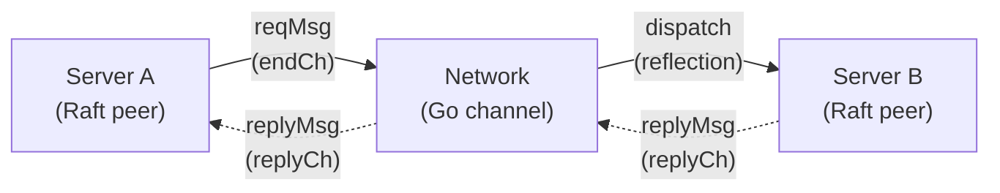
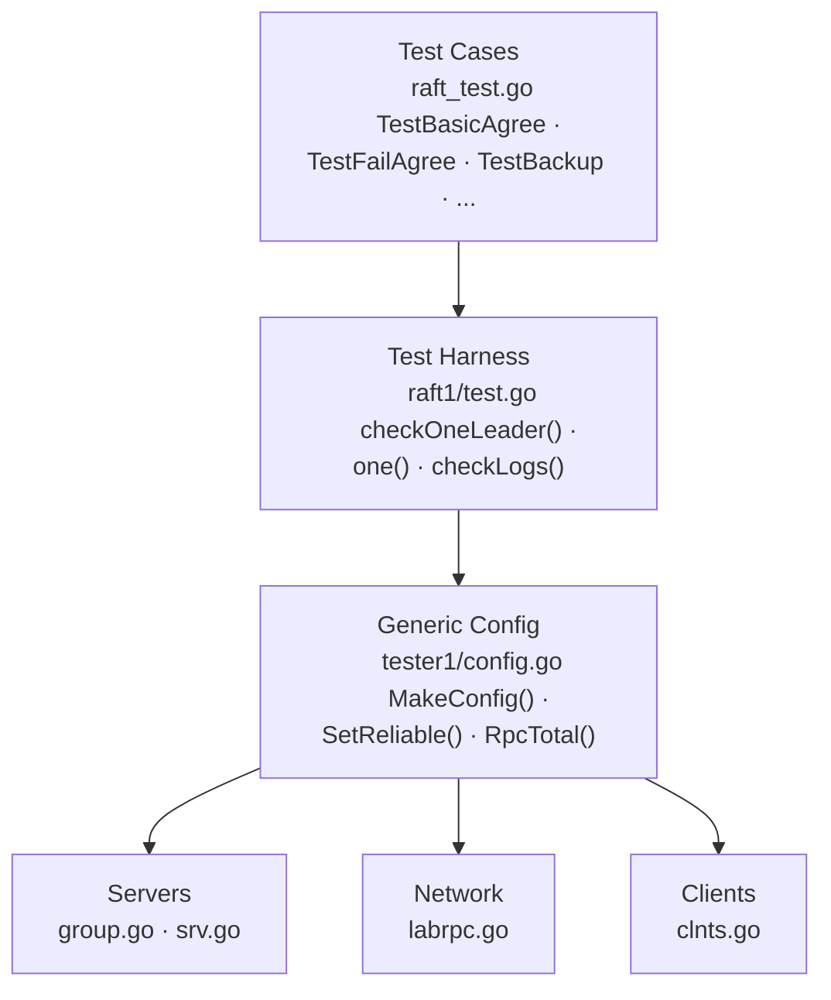
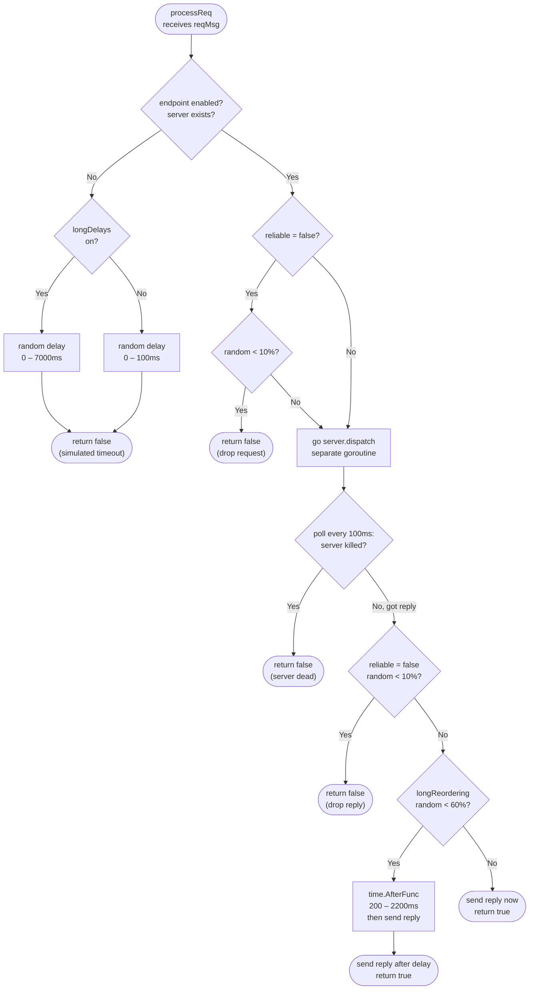
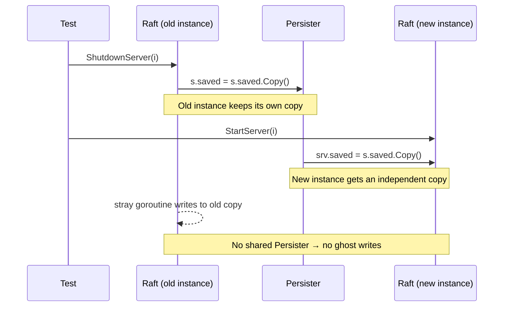
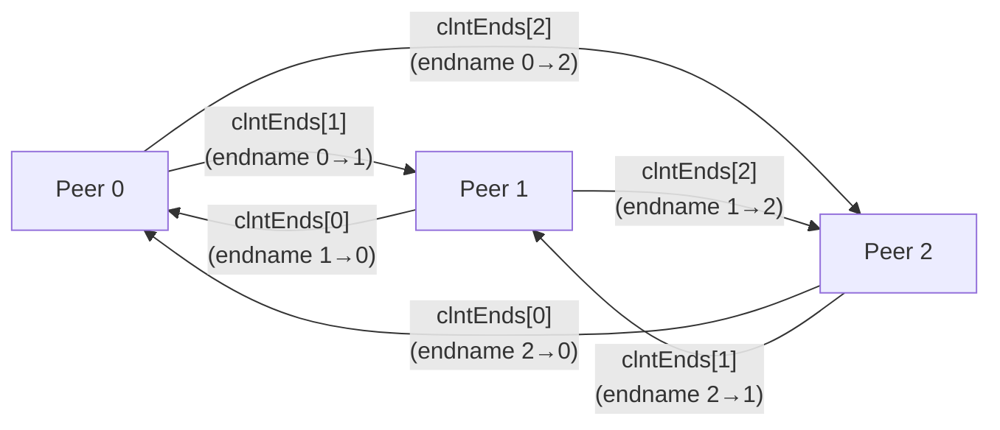
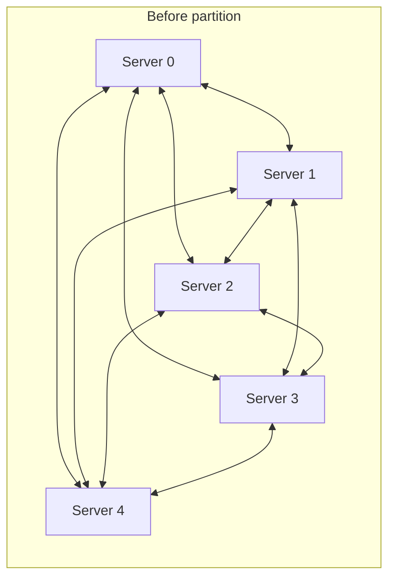
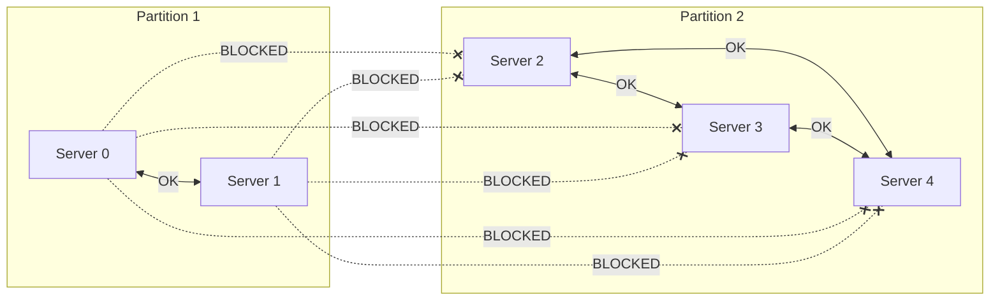
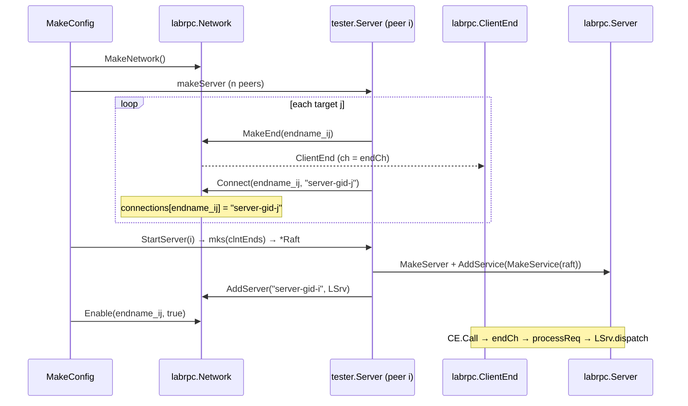
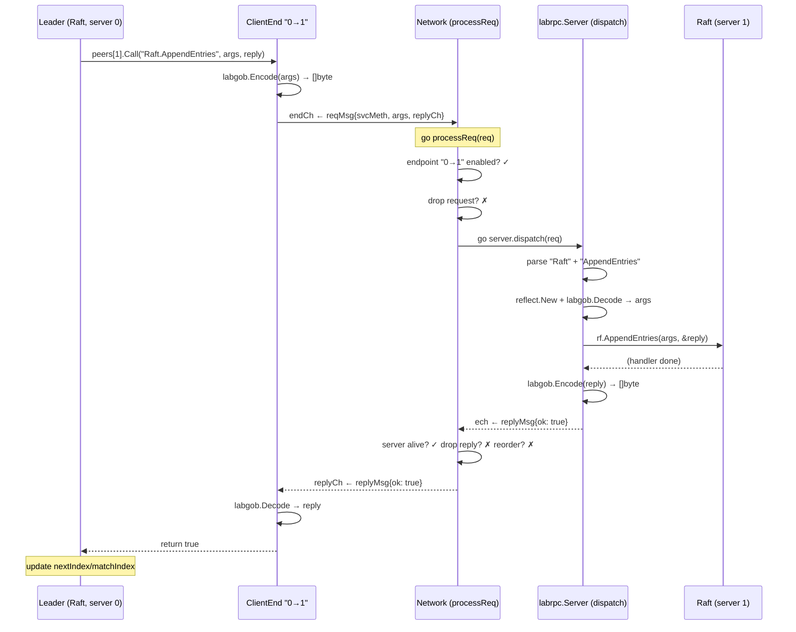

When you work through the Raft labs in MIT 6.5840, a practical question shows up immediately: *how do you test a distributed algorithm?* You cannot boot five real servers, wire the network, and wait for them to talk on every test run. You need a way to simulate the whole cluster—including network faults—in one Go process.

That is why `labrpc` and `tester1` exist: a fully in-memory simulated network. This post goes from the problem statement through each module until you can picture a complete RPC call end to end.

## 1. The problem: distributed testing in one process

On a real network, when server A calls `AppendEntries` on server B:

1. A serializes arguments to bytes.
2. Sends them over a TCP socket.
3. B receives, deserializes, and invokes the handler.
4. B serializes the result and sends it back.
5. A receives the reply and continues.

The test stack replaces the TCP socket with **Go channels**. The entire “network” is a `Network` struct sitting between all servers:



The nice part of this design: `Network` can interfere with every message—drop it, delay it, or block it completely—while Raft code stays unaware.

To do that, the stack solves three smaller problems:

- **Transport**: How do you package a function call to send over a channel?
- **Dispatch**: How do you invoke the right handler on the receiver without hard-coding method names?
- **Failure injection**: How do you simulate loss, delay, and network partitions?

## 2. Overall architecture



Each layer has a role:

- **Test cases**: scenarios for specific situations.
- **Test harness**: shared helpers—find the leader, submit commands, check logs.
- **Config**: bootstraps and coordinates the whole system; exposes APIs to control the network.
- **Network (`labrpc`)**: simulated transport—every RPC goes through here.
- **Servers / clients**: manage server lifetimes and connection endpoints.

The following sections build bottom-up: `labrpc` first, then `tester1`, then how startup wires everything together.

## 3. Building the transport layer: `labrpc`

### 3.1. Smallest unit: RPC messages

Every RPC is wrapped in a pair of structs:

```go
type reqMsg struct {
    endname  interface{}   // sending endpoint id
    svcMeth  string        // "Raft.AppendEntries"
    argsType reflect.Type  // argument type (for deserialization)
    args     []byte        // serialized arguments
    replyCh  chan replyMsg // channel for the reply
}

type replyMsg struct {
    ok    bool   // true = success, false = loss / timeout
    reply []byte // serialized result
}
```

`args` and `reply` are `[]byte`, not raw structs—data must go through serialize/deserialize like on a real network. If you forget to export a field (lowercase name), it disappears on encode—the same class of bug you see in production. `replyCh` is per request, so concurrent RPCs do not mix up replies.

### 3.2. `ClientEnd` — the sending side

Each outbound path is represented by a `ClientEnd`:

```go
type ClientEnd struct {
    endname interface{}   // unique endpoint name
    ch      chan reqMsg   // shared channel into Network
    done    chan struct{} // closed when Network shuts down
}
```

When Raft issues an RPC, it calls `Call()`:

```go
func (e *ClientEnd) Call(svcMeth string, args interface{}, reply interface{}) bool {
    // 1. Serialize arguments to bytes
    qb := new(bytes.Buffer)
    qe := labgob.NewEncoder(qb)
    qe.Encode(args)

    // 2. Dedicated channel for this request’s reply
    replyCh := make(chan replyMsg)

    // 3. Send request to Network on the shared channel
    req := reqMsg{
        endname:  e.endname,
        svcMeth:  svcMeth,
        argsType: reflect.TypeOf(args),
        args:     qb.Bytes(),
        replyCh:  replyCh,
    }
    select {
    case e.ch <- req:
    case <-e.done:
        return false
    }

    // 4. Block for the reply
    rep := <-replyCh
    if rep.ok {
        rb := bytes.NewBuffer(rep.reply)
        rd := labgob.NewDecoder(rb)
        rd.Decode(reply)
        return true
    }
    return false
}
```

Important: `Call()` **always returns**; it never blocks forever. Even if the target dies or the link is cut, `Network` eventually sends `replyMsg{ok: false}` after some delay—matching RPC timeout behavior on a real network.

### 3.3. `labrpc.Server` — the receiving side with reflection

The receiver must map the string `"Raft.AppendEntries"` to the right method on a `Raft` struct without hard-coding names. The mechanism is **reflection**:

```go
type Server struct {
    mu       sync.Mutex
    services map[string]*Service // "Raft" → Service handler
    count    int
}

type Service struct {
    name    string
    rcvr    reflect.Value              // receiver, e.g. *Raft
    typ     reflect.Type
    methods map[string]reflect.Method  // "AppendEntries" → Method
}
```

When registering a service, the code walks exported methods and builds a map:

```go
func MakeService(rcvr interface{}) *Service {
    svc := &Service{}
    svc.typ = reflect.TypeOf(rcvr)
    svc.rcvr = reflect.ValueOf(rcvr)
    svc.name = reflect.Indirect(svc.rcvr).Type().Name()

    svc.methods = map[string]reflect.Method{}
    for m := 0; m < svc.typ.NumMethod(); m++ {
        method := svc.typ.Method(m)
        svc.methods[method.Name] = method
    }
    return svc
}
```

When a request arrives, `dispatch()` uses that map to call the right method:

```go
func (svc *Service) dispatch(methname string, req reqMsg) replyMsg {
    args := reflect.New(req.argsType)
    labgob.NewDecoder(bytes.NewBuffer(req.args)).DecodeValue(args)

    replyType := svc.methods[methname].Type.In(2).Elem()
    replyv := reflect.New(replyType)

    svc.methods[methname].Func.Call(
        []reflect.Value{svc.rcvr, args.Elem(), replyv},
    )

    rb := new(bytes.Buffer)
    labgob.NewEncoder(rb).EncodeValue(replyv)
    return replyMsg{ok: true, reply: rb.Bytes()}
}
```

The same framework works for Raft, KVServer, or any other struct—you do not need to know each method’s signature up front. `reflect.New(req.argsType)` allocates the correct type and decodes bytes into it—like `json.Unmarshal` but with `encoding/gob`.

### 3.4. `Network` — the coordinator

`Network` bridges every `ClientEnd` and `labrpc.Server`:

```go
type Network struct {
    mu             sync.Mutex
    reliable       bool
    longDelays     bool
    longReordering bool
    ends           map[interface{}]*ClientEnd
    enabled        map[interface{}]bool        // key: endname
    servers        map[interface{}]*Server
    connections    map[interface{}]interface{} // endname → servername
    endCh          chan reqMsg
    done           chan struct{}
    count          int32
    bytes          int64
}
```

A goroutine receives requests and dispatches them concurrently:

```go
go func() {
    for {
        select {
        case xreq := <-rn.endCh:
            go rn.processReq(xreq)
        case <-rn.done:
            return
        }
    }
}()
```

One central goroutine serializes *arrival* order; each request is then handled in its own goroutine—like a router that accepts packets in order but forwards without waiting for the previous one to finish.

## 4. Failure simulation: `processReq`

This is where each RPC’s fate is decided. High level:



Corresponding code:

```go
func (rn *Network) processReq(req reqMsg) {
    enabled, servername, server, reliable, longreordering :=
        rn.readEndnameInfo(req.endname)

    if enabled && servername != nil && server != nil {
        if !reliable {
            // 10% chance to drop REQUEST
            ms := rand.Int() % 27
            time.Sleep(time.Duration(ms) * time.Millisecond)
            if rand.Int()%1000 < 100 {
                req.replyCh <- replyMsg{false, nil}
                return
            }
        }

        ech := make(chan replyMsg)
        go func() {
            r := server.dispatch(req)
            ech <- r
        }()

        // Wait for reply; poll every 100ms to see if server is still alive
        var reply replyMsg
        replyOK := false
        serverDead := false
        for !replyOK && !serverDead {
            select {
            case reply = <-ech:
                replyOK = true
            case <-time.After(100 * time.Millisecond):
                serverDead = rn.isServerDead(req.endname, servername, server)
            }
        }

        serverDead = rn.isServerDead(req.endname, servername, server)
        if serverDead {
            req.replyCh <- replyMsg{false, nil}
            return
        }

        if !reliable && rand.Int()%1000 < 100 {
            // 10% chance to drop REPLY
            req.replyCh <- replyMsg{false, nil}
            return
        }

        if longreordering && rand.Int()%900 < 600 {
            // 60% chance to delay reply by 200–2200ms
            ms := 200 + rand.Intn(2000)
            time.AfterFunc(time.Duration(ms)*time.Millisecond, func() {
                req.replyCh <- reply
            })
            return
        }

        req.replyCh <- reply

    } else {
        // Endpoint disabled / no server → delay then return false
        ms := 0
        if rn.longDelays {
            ms = rand.Int() % 7000
        } else {
            ms = rand.Int() % 100
        }
        time.AfterFunc(time.Duration(ms)*time.Millisecond, func() {
            req.replyCh <- replyMsg{false, nil}
        })
    }
}
```

Each branch mirrors a real scenario:

| Scenario | Behavior |
|----------|----------|
| Endpoint disabled | Delay 0–7000ms then `false`—like a timeout |
| Unreliable, request lost | 10% drop before the handler runs |
| Server killed mid-RPC | Detected via 100ms polling, return `false` |
| Unreliable, reply lost | 10% drop after the handler finishes |
| Long reordering | 60% extra delay 200–2200ms before delivering reply |
| Normal | Dispatch and return reply immediately |

> **Why poll every 100ms?** If a test calls `ShutdownServer(i)` while an RPC is in flight, the server-side handler may never return—that goroutine is stuck. Instead of blocking forever, `Network` checks every 100ms whether the server is still alive; if not, it returns `false` and moves on.

## 5. Safe serialization: `labgob`

`labgob` wraps `encoding/gob` with one extra feature: **warnings for structs with unexported fields**.

```go
func (e *LabEncoder) Encode(x interface{}) error {
    checkValue(x)
    return e.enc.Encode(x)
}

func checkValue(x interface{}) {
    t := reflect.TypeOf(x)
    for i := 0; i < t.NumField(); i++ {
        field := t.Field(i)
        if !field.IsExported() {
            log.Printf("labgob warning: %s has unexported field %s",
                t.Name(), field.Name)
        }
    }
}
```

This catches a very common Raft mistake. If you write:

```go
type LogEntry struct {
    term    int        // ← lowercase: lost on serialize!
    Command interface{}
}
```

When `AppendEntries` sends log entries to a peer, `term` is not transmitted—the peer sees all zeros. `labgob` warns early instead of leaving you to debug silently wrong state.

## 6. The management layer: `tester1`

`labrpc` only knows endpoints and channels. It knows nothing about “three Raft servers” or “network partitions.” That is `tester1`’s job.

### 6.1. `Persister` — fake disk in RAM

Raft persists state (log, `currentTerm`, `votedFor`) to survive crashes. In tests, `Persister` stands in for real disk:

```go
type Persister struct {
    mu        sync.Mutex
    raftstate []byte
    snapshot  []byte
}

func (ps *Persister) SaveStateAndSnapshot(state []byte, snapshot []byte) {
    ps.mu.Lock()
    defer ps.mu.Unlock()
    ps.raftstate = clone(state)
    ps.snapshot = clone(snapshot)
}
```

When a test kills a server and restarts it, the new instance reads from the same `Persister`—like rebooting after a power loss.

One subtle detail: on shutdown, the code copies the persister:

```go
// On shutdown
s.saved = s.saved.Copy()

// On restart — new instance gets its own copy
srv.saved = s.saved.Copy()
```

Why `Copy()`? The old Raft instance may still have goroutines running after it is “killed.” If they keep writing to a shared `Persister`, they can overwrite the new instance’s state—a nasty race. `Copy()` draws a clear boundary:



### 6.2. `tester.Server` vs `labrpc.Server` — easy to confuse

Both structs are named `Server` but live in different packages with different roles:

- **`tester.Server`** (`tester1/srv.go`): manages one test peer’s lifecycle—`ClientEnd`s to other peers, persister, running services.
- **`labrpc.Server`** (`labrpc/labrpc.go`): reflection-based RPC dispatch—receives requests from `Network`, invokes handlers, returns replies.

`tester.Server` owns *scenario* (start/stop/restart); `labrpc.Server` implements *protocol* (decode args, call method, encode reply). They are not nested.

```go
// tester1/srv.go
type Server struct {
    mu       sync.Mutex
    net      *labrpc.Network
    saved    *Persister
    svcs     []IService
    endNames []string
    clntEnds []*labrpc.ClientEnd
}
```

`clntEnds[j]` on peer `i` is the outbound path **i → j**: peer `i` uses `clntEnds[j].Call(...)` to RPC peer `j`. That is the `peers[]` slice passed into Raft at startup.

With three nodes, each peer has two `ClientEnd`s to the other two—fully independent:



Each direction has its own `endname` and can be toggled independently—supporting **asymmetric failure**: e.g. 0→1 works but 1→0 does not. That happens in practice with one-way link faults.

### 6.3. `ServerGrp` — partitions

`ServerGrp` coordinates `n` peers on one `Network`. It does not send RPC bytes; it enables/disables endpoints, restarts servers, creates partitions, checks logs.

```go
type ServerGrp struct {
    net       *labrpc.Network
    srvs      []*Server
    connected []bool
    mu        sync.Mutex
}
```

Important: `Network` does not store a `connected[i][j]` matrix. It stores `enabled[endname]`—one flag per `ClientEnd`. To cut communication between peer `i` and `j`, `ServerGrp` disables **both** directions: i→j and j→i.

```go
func (sg *ServerGrp) disconnect(i int, from []int) {
    sg.connected[i] = false
    for _, j := range from {
        sg.net.Enable(sg.endname(i, j), false)
        sg.net.Enable(sg.endname(j, i), false)
    }
}

func (sg *ServerGrp) Partition(p1, p2 []int) {
    for _, i := range p1 {
        sg.disconnect(i, p2)
    }
    for _, i := range p2 {
        sg.disconnect(i, p1)
    }
}
```

`Partition([0,1], [2,3,4])` on a five-node cluster—before and after:





That is how `TestBackup3B` works: partition, let partition 2 (majority) elect a leader and append, heal, then verify Raft converges on the correct log.

### 6.4. `Config` — test entry point

```go
func MakeConfig(t *testing.T, n int, reliable bool, mks FstartServer) *Config {
    cfg := &Config{}
    cfg.net = labrpc.MakeNetwork()
    cfg.Groups = newGroups(cfg.net)
    cfg.MakeGroupStart(GRP0, n, mks)
    cfg.Clnts = makeClnts(cfg.net)
    cfg.net.Reliable(reliable)
    return cfg
}
```

With a `Config`, tests control the network via:

```go
cfg.SetReliable(false)
cfg.SetLongReordering(true)
cfg.SetLongDelays(true)

rpcsBefore := cfg.RpcTotal()
// ... run test ...
rpcsAfter := cfg.RpcTotal() // ensure Raft does not send excess RPCs
```

### 6.5. Startup: how the pieces fit

Once you know the pieces, reading `MakeConfig` + `StartServers` shows the wiring order.

**Step 1 — Create Network.** `labrpc.MakeNetwork()` builds a `Network` with empty maps and a goroutine listening on `endCh`.

**Step 2 — Create `tester.Server` and register routing.** `makeServer(net, gid, n)` creates `n` `tester.Server`s. For each peer `i` and each target `j`:

- `net.MakeEnd(endname)` — create `ClientEnd`; its `ch` points at the Network’s `endCh`.
- `net.Connect(endname, ServerName(gid, j))` — record in `connections`: this endname forwards to server `server-gid-j`. The target server may not exist yet; this is just routing metadata.

**Step 3 — Create Raft and register handlers.** `StartServer(i)` calls `mks` with peer `i`’s `clntEnds`, builds a real `*Raft`. Then:

- `labrpc.MakeServer()` + `AddService(MakeService(raft))` — build the reflection dispatcher.
- `net.AddServer(ServerName(gid, i), labsrv)` — register `server-gid-i` in `servers`.

**Step 4 — Enable links.** `ConnectAll` calls `net.Enable(endname, true)` for every endname.



Order matters: routing (`Connect`) can be registered before the real handler (`AddServer`) exists. On restart you `DeleteServer` then `AddServer` under the same name—other peers’ `ClientEnd`s stay valid; no need to recreate them or call `Connect` again.

## 7. End-to-end: one RPC call

Trace one `AppendEntries` from leader (server 0) to follower (server 1) on a reliable network:



All of this is in memory—no real network I/O—often finishing in microseconds, so tests can run thousands of RPCs cheaply.

## 8. Notable design choices

### 8.1. Channels instead of sockets

- `endCh`: central queue—all `ClientEnd`s send here.
- `replyCh`: per-request channel—replies do not mix under concurrency.
- `done`: closed on cleanup—closing a channel broadcasts in Go; every goroutine selecting on `done` exits.

### 8.2. Atomic counters for metrics

```go
atomic.AddInt32(&rn.count, 1)
atomic.AddInt64(&rn.bytes, int64(len(xreq.args)))
```

Atomics avoid mutexes for counting, so `RpcTotal()` needs no lock—important when many goroutines send RPCs at once.

### 8.3. Enabled flag per endpoint

```go
enabled map[interface{}]bool // key: endname
```

One flag per `ClientEnd` (per direction), not one flag per pair (i, j):

- **Symmetric partition**: disable both A→B and B→A.
- **Asymmetric failure**: disable only one direction—realistic for half-duplex link faults.

### 8.4. Persister copy avoids ghost writes

Old instances may still have goroutines after kill. `Copy()` ensures old writes cannot corrupt the new instance’s state—as in §6.1.

### 8.5. Two maps for flexible routing

```go
connections map[interface{}]interface{} // endname → servername
servers     map[interface{}]*Server     // servername → *labrpc.Server
```

Splitting into two maps helps in two ways:

**Arbitrary registration order.** `Connect(endname, servername)` can run before `AddServer(servername, ...)`—exactly what `MakeConfig` does. A missing server does not block recording routes.

**Restart without breaking endpoints.** `ShutdownServer` removes from `servers` only; `connections` is unchanged. `AddServer` under the same name makes all existing `Connect`ed `ClientEnd`s work again.

## Conclusion

`labrpc` is a good example of solving a real testing problem with simple Go primitives: channels, reflection, goroutines, and atomics. Each design choice has a clear rationale:

- Channels instead of sockets → no OS networking, but still forces serialize/deserialize to surface bugs early.
- Reflection for dispatch → one framework for every service.
- Per-endpoint enabled flags → fine-grained partitions, including asymmetric failures.
- Persister copy → a boundary between old and new instances on restart.
- Two separate maps → flexible init order; restarts do not invalidate endpoints.
- 100ms polling → `Call()` always returns; no infinite blocking.

When you read `TestBackup3B`—disconnect the leader, submit a command, partition, then heal—this entire stack is manipulating every packet underneath. If your Raft passes with `-race`, you can be reasonably confident it will behave correctly on a real network too.
