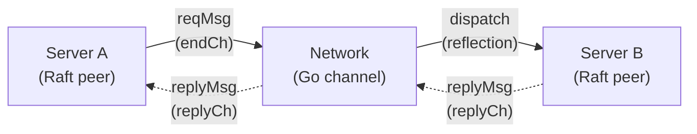
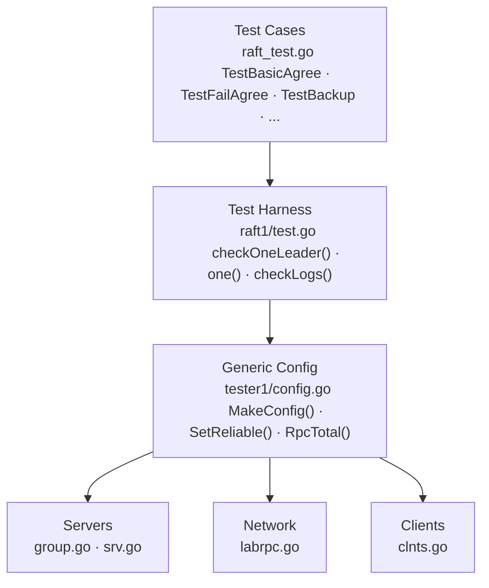
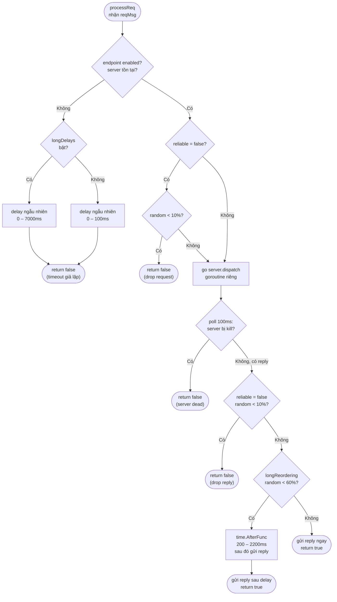
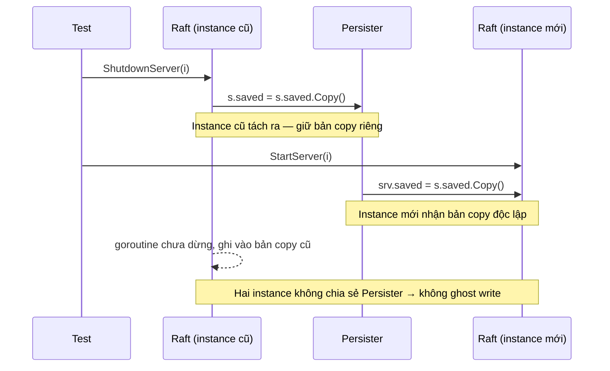
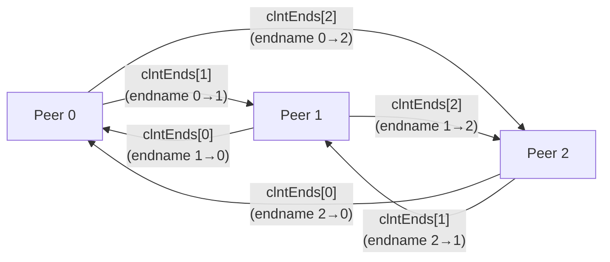
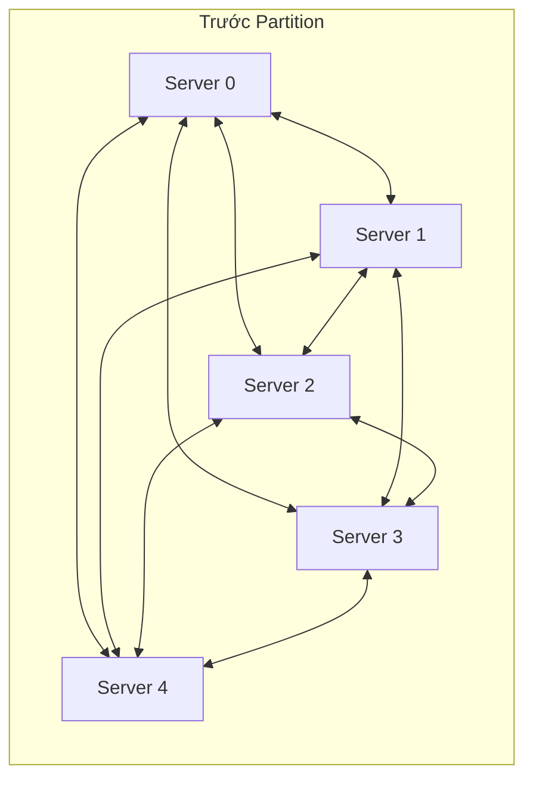
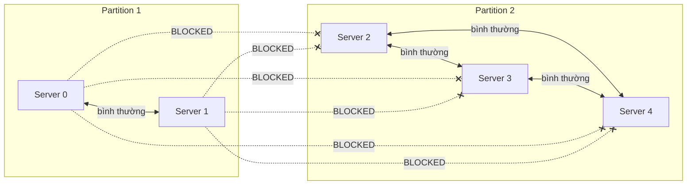
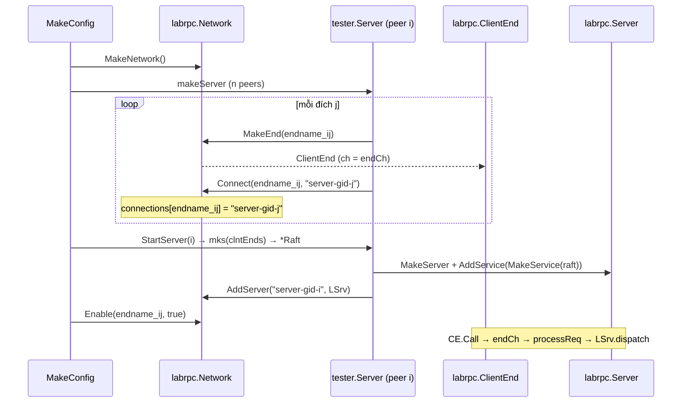
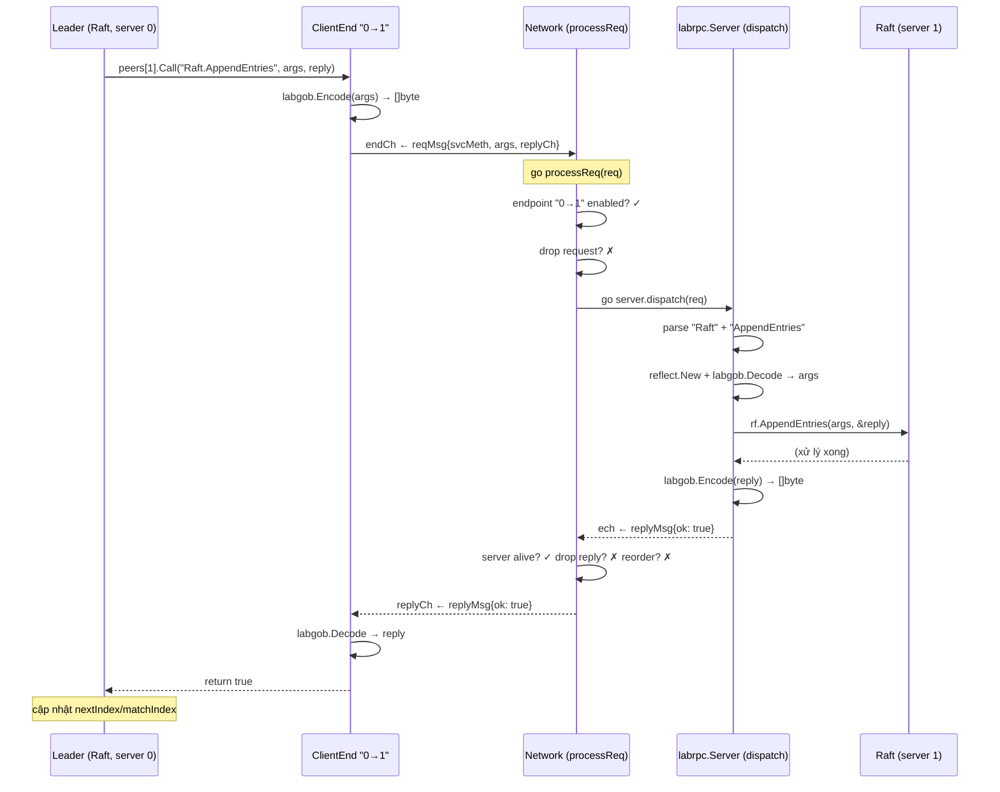

Khi làm lab Raft trong MIT 6.5840, có một câu hỏi khá thực tế nảy ra ngay từ đầu: *test một thuật toán phân tán như thế nào?* Không thể mỗi lần chạy test lại phải khởi động 5 máy chủ thật, cắm mạng, rồi chờ chúng trao đổi với nhau. Cần một cách để mô phỏng toàn bộ cụm server — kể cả lỗi mạng — trong một process Go duy nhất.

Đó là lý do `labrpc` và `tester1` ra đời: một hệ thống mạng giả lập hoàn toàn trong bộ nhớ. Bài viết đi từ bài toán ban đầu, qua từng module một, đến lúc bạn có thể hình dung trọn vẹn một RPC call đi qua hệ thống từ đầu đến cuối.

## 1. Bài toán: Kiểm thử phân tán trong một process

Trên mạng thật, khi server A gọi `AppendEntries` sang server B:

1. A serialize tham số thành bytes.
2. Gửi qua TCP socket.
3. B nhận, deserialize, gọi hàm handler.
4. B serialize kết quả và gửi về.
5. A nhận reply và tiếp tục.

Hệ thống test thay TCP socket bằng **Go channel**. Toàn bộ "mạng" là một struct `Network` nằm giữa mọi server:



Điểm hay của thiết kế này: `Network` có thể can thiệp vào mọi tin nhắn — đánh rơi, trì hoãn, chặn hoàn toàn — mà code Raft không cần biết gì về điều đó.

Để làm được vậy, hệ thống giải quyết ba bài toán nhỏ hơn:
- **Vận chuyển**: Làm sao đóng gói một function call để gửi qua channel?
- **Dispatch**: Làm sao gọi đúng handler ở phía nhận mà không hard-code tên hàm?
- **Failure injection**: Làm sao mô phỏng mất gói, trễ, phân vùng mạng?

## 2. Kiến trúc tổng thể



Mỗi tầng có nhiệm vụ riêng:
- **Test Cases**: kịch bản kiểm tra từng tình huống cụ thể.
- **Test Harness**: các tiện ích dùng lại giữa các test — tìm leader, gửi command, kiểm tra log.
- **Config**: khởi tạo và điều phối toàn bộ hệ thống, cung cấp API điều khiển mạng.
- **Network (`labrpc`)**: lớp vận chuyển giả lập — nơi mọi RPC call đi qua.
- **Servers / Clients**: quản lý vòng đời server và endpoint kết nối.

Các mục tiếp theo xây dựng từng tầng từ thấp lên cao: `labrpc` trước, sau đó `tester1`, cuối cùng là luồng khởi tạo gắn tất cả lại.

## 3. Xây dựng lớp vận chuyển: `labrpc`

### 3.1. Đơn vị nhỏ nhất: Tin nhắn RPC

Mọi RPC call đều được đóng gói thành một cặp struct:

```go
type reqMsg struct {
    endname  interface{}   // định danh của endpoint gửi
    svcMeth  string        // "Raft.AppendEntries"
    argsType reflect.Type  // kiểu tham số (dùng để deserialize)
    args     []byte        // tham số đã serialize
    replyCh  chan replyMsg // kênh để nhận reply
}

type replyMsg struct {
    ok    bool   // true = thành công, false = mất gói / timeout
    reply []byte // kết quả đã serialize
}
```

`args` và `reply` là `[]byte` chứ không phải struct trực tiếp — hệ thống buộc dữ liệu phải qua bước serialize/deserialize như trên mạng thật. Nếu bạn quên export một field (viết thường chữ cái đầu), nó biến mất khi encode — đúng lỗi sẽ gặp ngoài production. `replyCh` là channel riêng cho từng request, nên nhiều RPC chạy song song không bị lẫn reply của nhau.

### 3.2. `ClientEnd` — Đầu gửi

Mỗi chiều gửi trong mạng được đại diện bởi một `ClientEnd`:

```go
type ClientEnd struct {
    endname interface{}   // tên định danh duy nhất
    ch      chan reqMsg   // kênh dùng chung tới Network
    done    chan struct{} // đóng khi Network dọn dẹp
}
```

Khi Raft muốn gọi RPC, nó gọi `Call()`:

```go
func (e *ClientEnd) Call(svcMeth string, args interface{}, reply interface{}) bool {
    // 1. Serialize tham số thành bytes
    qb := new(bytes.Buffer)
    qe := labgob.NewEncoder(qb)
    qe.Encode(args)

    // 2. Tạo channel riêng để nhận reply cho request này
    replyCh := make(chan replyMsg)

    // 3. Gửi request đến Network qua kênh dùng chung
    req := reqMsg{
        endname:  e.endname,
        svcMeth:  svcMeth,
        argsType: reflect.TypeOf(args),
        args:     qb.Bytes(),
        replyCh:  replyCh,
    }
    select {
    case e.ch <- req:
    case <-e.done:
        return false
    }

    // 4. Block chờ reply
    rep := <-replyCh
    if rep.ok {
        rb := bytes.NewBuffer(rep.reply)
        rd := labgob.NewDecoder(rb)
        rd.Decode(reply)
        return true
    }
    return false
}
```

Một điểm đáng chú ý: `Call()` **luôn trả về**, không bao giờ block vô hạn. Dù server đích bị kill hay mạng bị ngắt, `Network` vẫn gửi `replyMsg{ok: false}` sau một khoảng delay — hành vi đúng với RPC timeout trên mạng thật.

### 3.3. `labrpc.Server` — Đầu nhận, dùng Reflection

Phía nhận cần ánh xạ chuỗi `"Raft.AppendEntries"` sang đúng method của struct `Raft`, mà không hard-code bất kỳ tên hàm nào. Cơ chế là **reflection**:

```go
type Server struct {
    mu       sync.Mutex
    services map[string]*Service // "Raft" → Service handler
    count    int
}

type Service struct {
    name    string
    rcvr    reflect.Value              // đối tượng nhận, ví dụ: *Raft
    typ     reflect.Type
    methods map[string]reflect.Method  // "AppendEntries" → Method
}
```

Khi đăng ký một service, hệ thống duyệt qua tất cả exported method và xây dựng map:

```go
func MakeService(rcvr interface{}) *Service {
    svc := &Service{}
    svc.typ = reflect.TypeOf(rcvr)
    svc.rcvr = reflect.ValueOf(rcvr)
    svc.name = reflect.Indirect(svc.rcvr).Type().Name()

    svc.methods = map[string]reflect.Method{}
    for m := 0; m < svc.typ.NumMethod(); m++ {
        method := svc.typ.Method(m)
        svc.methods[method.Name] = method
    }
    return svc
}
```

Khi request đến, `dispatch()` dùng map đó để gọi đúng method:

```go
func (svc *Service) dispatch(methname string, req reqMsg) replyMsg {
    args := reflect.New(req.argsType)
    labgob.NewDecoder(bytes.NewBuffer(req.args)).DecodeValue(args)

    replyType := svc.methods[methname].Type.In(2).Elem()
    replyv := reflect.New(replyType)

    svc.methods[methname].Func.Call(
        []reflect.Value{svc.rcvr, args.Elem(), replyv},
    )

    rb := new(bytes.Buffer)
    labgob.NewEncoder(rb).EncodeValue(replyv)
    return replyMsg{ok: true, reply: rb.Bytes()}
}
```

Nhờ cách này, cùng một framework hoạt động cho Raft, KVServer, hay bất kỳ struct nào — không cần biết trước signature của từng method. `reflect.New(req.argsType)` tạo giá trị đúng kiểu, decode bytes vào đó — giống `json.Unmarshal` nhưng dùng `encoding/gob`.

### 3.4. `Network` — Trái tim điều phối

`Network` là cầu nối giữa mọi `ClientEnd` và `labrpc.Server`:

```go
type Network struct {
    mu             sync.Mutex
    reliable       bool
    longDelays     bool
    longReordering bool
    ends           map[interface{}]*ClientEnd
    enabled        map[interface{}]bool        // key: endname
    servers        map[interface{}]*Server
    connections    map[interface{}]interface{} // endname → servername
    endCh          chan reqMsg
    done           chan struct{}
    count          int32
    bytes          int64
}
```

Network chạy một goroutine để nhận request rồi dispatch song song:

```go
go func() {
    for {
        select {
        case xreq := <-rn.endCh:
            go rn.processReq(xreq)
        case <-rn.done:
            return
        }
    }
}()
```

Một goroutine trung tâm serialize thứ tự *đến* của các request; mỗi request sau đó được xử lý song song trong goroutine riêng. Giống router nhận packet theo thứ tự vào nhưng forward ngay, không chờ packet trước xong.

## 4. Cơ chế mô phỏng lỗi: `processReq`

Đây là nơi hệ thống quyết định số phận mỗi RPC. Nhìn tổng thể trước:



Code tương ứng:

```go
func (rn *Network) processReq(req reqMsg) {
    enabled, servername, server, reliable, longreordering :=
        rn.readEndnameInfo(req.endname)

    if enabled && servername != nil && server != nil {
        if !reliable {
            // 10% cơ hội mất gói REQUEST
            ms := rand.Int() % 27
            time.Sleep(time.Duration(ms) * time.Millisecond)
            if rand.Int()%1000 < 100 {
                req.replyCh <- replyMsg{false, nil}
                return
            }
        }

        ech := make(chan replyMsg)
        go func() {
            r := server.dispatch(req)
            ech <- r
        }()

        // Chờ reply, poll 100ms một lần để kiểm tra server có còn sống không
        var reply replyMsg
        replyOK := false
        serverDead := false
        for !replyOK && !serverDead {
            select {
            case reply = <-ech:
                replyOK = true
            case <-time.After(100 * time.Millisecond):
                serverDead = rn.isServerDead(req.endname, servername, server)
            }
        }

        serverDead = rn.isServerDead(req.endname, servername, server)
        if serverDead {
            req.replyCh <- replyMsg{false, nil}
            return
        }

        if !reliable && rand.Int()%1000 < 100 {
            // 10% cơ hội mất gói REPLY
            req.replyCh <- replyMsg{false, nil}
            return
        }

        if longreordering && rand.Int()%900 < 600 {
            // 60% cơ hội trì hoãn reply thêm 200–2200ms
            ms := 200 + rand.Intn(2000)
            time.AfterFunc(time.Duration(ms)*time.Millisecond, func() {
                req.replyCh <- reply
            })
            return
        }

        req.replyCh <- reply

    } else {
        // Endpoint bị tắt / server không tồn tại → delay rồi trả về false
        ms := 0
        if rn.longDelays {
            ms = rand.Int() % 7000
        } else {
            ms = rand.Int() % 100
        }
        time.AfterFunc(time.Duration(ms)*time.Millisecond, func() {
            req.replyCh <- replyMsg{false, nil}
        })
    }
}
```

Mỗi nhánh tương ứng một tình huống thực tế:

| Tình huống | Hành vi |
|-----------|---------|
| Endpoint bị disable | Delay 0–7000ms rồi trả `false` — giống timeout |
| Unreliable, mất request | 10% drop ngay, trước khi gọi handler |
| Server bị kill giữa chừng | Phát hiện qua poll 100ms, trả `false` |
| Unreliable, mất reply | 10% drop sau khi handler đã xử lý xong |
| Long reordering | 60% delay thêm 200–2200ms trước khi gửi reply |
| Bình thường | Dispatch và trả reply ngay |

> **Poll 100ms để làm gì?** Nếu test gọi `ShutdownServer(i)` khi một RPC đang chạy, handler phía server sẽ không bao giờ trả về — goroutine đó bị treo. Thay vì block mãi, Network kiểm tra mỗi 100ms xem server còn sống không; nếu không thì trả `false` và tiếp tục.

## 5. Serialization an toàn: `labgob`

`labgob` là wrapper của `encoding/gob`, thêm một tính năng: **cảnh báo khi struct có field viết thường**.

```go
func (e *LabEncoder) Encode(x interface{}) error {
    checkValue(x)
    return e.enc.Encode(x)
}

func checkValue(x interface{}) {
    t := reflect.TypeOf(x)
    for i := 0; i < t.NumField(); i++ {
        field := t.Field(i)
        if !field.IsExported() {
            log.Printf("labgob warning: %s has unexported field %s",
                t.Name(), field.Name)
        }
    }
}
```

Đây là lỗi rất phổ biến khi viết Raft. Nếu bạn định nghĩa:

```go
type LogEntry struct {
    term    int        // ← viết thường: mất khi serialize!
    Command interface{}
}
```

Khi `AppendEntries` gửi log entries sang peer, field `term` không được truyền đi — peer nhận thấy toàn bộ `term = 0`. `labgob` cảnh báo ngay để bạn phát hiện sớm thay vì debug mãi sau.

## 6. Tầng quản lý: `tester1`

`labrpc` chỉ biết endpoint và channel. Nó không biết gì về "3 server Raft" hay "phân vùng mạng". Đó là nhiệm vụ của `tester1`.

### 6.1. `Persister` — Ổ đĩa giả lập trong RAM

Raft cần ghi state (log, currentTerm, votedFor) ra ổ đĩa để khôi phục sau crash. Trong test, `Persister` thay thế ổ đĩa thật:

```go
type Persister struct {
    mu        sync.Mutex
    raftstate []byte
    snapshot  []byte
}

func (ps *Persister) SaveStateAndSnapshot(state []byte, snapshot []byte) {
    ps.mu.Lock()
    defer ps.mu.Unlock()
    ps.raftstate = clone(state)
    ps.snapshot = clone(snapshot)
}
```

Khi test kill một server rồi restart, server mới đọc lại từ cùng `Persister` — giống khởi động lại sau khi mất điện và đọc từ ổ đĩa.

Có một chi tiết tinh tế: khi shutdown, code tạo bản copy của Persister:

```go
// Khi shutdown
s.saved = s.saved.Copy()

// Khi restart — instance mới nhận bản copy riêng
srv.saved = s.saved.Copy()
```

Tại sao phải `Copy()`? Vì instance cũ của Raft sau khi bị kill vẫn có thể còn goroutine đang chạy dở. Nếu nó tiếp tục ghi vào `Persister` dùng chung, nó ghi đè state của instance mới — bug race condition cực khó debug. `Copy()` tạo ranh giới rõ ràng:



### 6.2. `tester.Server` và `labrpc.Server` — Hai struct dễ nhầm

Đọc code sẽ thấy hai struct đều tên `Server` nhưng khác package và khác chức năng hoàn toàn:

- **`tester.Server`** (`tester1/srv.go`): quản lý vòng đời một peer trong test — giữ danh sách `ClientEnd` để gọi sang peer khác, persister, và các service đang chạy.
- **`labrpc.Server`** (`labrpc/labrpc.go`): cơ chế dispatch RPC bằng reflection — nhận request từ `Network`, gọi đúng handler, trả reply.

`tester.Server` quản lý *kịch bản* (start, stop, restart); `labrpc.Server` xử lý *protocol* (decode args, gọi method, encode reply). Hai struct không lồng nhau.

```go
// tester1/srv.go
type Server struct {
    mu       sync.Mutex
    net      *labrpc.Network
    saved    *Persister
    svcs     []IService
    endNames []string
    clntEnds []*labrpc.ClientEnd
}
```

Mảng `clntEnds[j]` trên peer `i` là đầu gửi theo chiều **i → j**: peer `i` dùng `clntEnds[j].Call(...)` khi cần RPC tới peer `j`. Đây chính là bộ `peers[]` mà Raft nhận khi khởi động.

Với cluster 3 node, mỗi peer có hai `ClientEnd` tới hai peer còn lại, mỗi cái hoàn toàn độc lập:



Mỗi chiều có `endname` riêng và có thể bật/tắt độc lập — cho phép mô phỏng **asymmetric failure**: chiều 0→1 sống nhưng chiều 1→0 chết. Loại lỗi này thực tế xảy ra khi thiết bị mạng hỏng một hướng.

### 6.3. `ServerGrp` — Phân vùng mạng

`ServerGrp` điều phối một cụm `n` peer trên cùng một `Network`. Nó không gửi byte RPC nào; nó bật/tắt endpoint, restart server, tạo partition, đếm log.

```go
type ServerGrp struct {
    net       *labrpc.Network
    srvs      []*Server
    connected []bool
    mu        sync.Mutex
}
```

Điểm quan trọng: `Network` không lưu ma trận `connected[i][j]` kiểu "peer i và peer j có kết nối không". Nó lưu `enabled[endname]` — một flag cho mỗi `ClientEnd`. Để ngắt liên lạc giữa peer `i` và peer `j`, `ServerGrp` tắt hai endname riêng: chiều i→j và chiều j→i.

```go
func (sg *ServerGrp) disconnect(i int, from []int) {
    sg.connected[i] = false
    for _, j := range from {
        sg.net.Enable(sg.endname(i, j), false)
        sg.net.Enable(sg.endname(j, i), false)
    }
}

func (sg *ServerGrp) Partition(p1, p2 []int) {
    for _, i := range p1 {
        sg.disconnect(i, p2)
    }
    for _, i := range p2 {
        sg.disconnect(i, p1)
    }
}
```

`Partition([0,1], [2,3,4])` trên cluster 5 node — trước và sau:





Đây là cách `TestBackup3B` hoạt động: tạo partition, để Partition 2 (majority) bầu leader và append log, heal partition, rồi kiểm tra Raft có đồng bộ log đúng không.

### 6.4. `Config` — Entry point cho test

```go
func MakeConfig(t *testing.T, n int, reliable bool, mks FstartServer) *Config {
    cfg := &Config{}
    cfg.net = labrpc.MakeNetwork()
    cfg.Groups = newGroups(cfg.net)
    cfg.MakeGroupStart(GRP0, n, mks)
    cfg.Clnts = makeClnts(cfg.net)
    cfg.net.Reliable(reliable)
    return cfg
}
```

Sau khi có `Config`, test điều khiển mạng qua:

```go
cfg.SetReliable(false)
cfg.SetLongReordering(true)
cfg.SetLongDelays(true)

rpcsBefore := cfg.RpcTotal()
// ... chạy test ...
rpcsAfter := cfg.RpcTotal() // kiểm tra Raft không gửi RPC thừa
```

### 6.5. Luồng khởi tạo: các thành phần được lắp ghép thế nào?

Biết từng thành phần rồi, giờ đọc `MakeConfig` + `StartServers` sẽ thấy rõ thứ tự lắp ghép.

**Bước 1 — Tạo Network.** `labrpc.MakeNetwork()` khởi tạo `Network` với các map rỗng và goroutine lắng nghe `endCh`.

**Bước 2 — Tạo tester.Server và đăng ký định tuyến.** `makeServer(net, gid, n)` tạo `n` `tester.Server`. Với mỗi peer `i`, với mỗi đích `j`:
- `net.MakeEnd(endname)` — tạo `ClientEnd`; `ch` của nó trỏ về `endCh` của Network.
- `net.Connect(endname, ServerName(gid, j))` — ghi vào `connections`: "endname này forward tới server tên `server-gid-j`". Server đích chưa tồn tại lúc này; đây chỉ là ghi nhãn định tuyến.

**Bước 3 — Tạo Raft và đăng ký handler.** `StartServer(i)` gọi callback `mks`, truyền vào `clntEnds` của peer `i`, tạo `*Raft` thật. Sau đó:
- `labrpc.MakeServer()` + `AddService(MakeService(raft))` — xây dựng dispatcher reflection.
- `net.AddServer(ServerName(gid, i), labsrv)` — ghi vào `servers`: tên `server-gid-i` giờ có handler thật.

**Bước 4 — Bật kết nối.** `ConnectAll` gọi `net.Enable(endname, true)` cho tất cả endname.



Thứ tự này có lý do: định tuyến (`Connect`) được đăng ký trước khi handler thật (`AddServer`) sẵn sàng. Nhờ vậy, khi restart server, chỉ cần `DeleteServer` rồi `AddServer` lại với cùng tên cũ — các `ClientEnd` trên peer khác không cần tạo lại, không cần gọi lại `Connect`.

## 7. Luồng hoàn chỉnh của một RPC call

Trace một lần `AppendEntries` từ leader (server 0) sang follower (server 1), mạng bình thường:



Toàn bộ diễn ra trong bộ nhớ, không có I/O mạng, thường xong trong vài microsecond — cho phép chạy hàng nghìn RPC trong một bài test mà không tốn nhiều thời gian.

## 8. Một số quyết định thiết kế đáng chú ý

### 8.1. Channel thay vì socket

- `endCh`: queue tập trung — mọi `ClientEnd` đổ vào đây.
- `replyCh`: channel riêng mỗi request — reply không lẫn nhau dù nhiều RPC chạy song song.
- `done`: close channel khi cleanup — close channel là cơ chế broadcast trong Go, mọi goroutine đang `select` trên `done` đều thoát.

### 8.2. Atomic counter cho metrics

```go
atomic.AddInt32(&rn.count, 1)
atomic.AddInt64(&rn.bytes, int64(len(xreq.args)))
```

Dùng atomic thay mutex khi đếm, nên `RpcTotal()` không cần lock — quan trọng khi nhiều goroutine đang gửi RPC đồng thời.

### 8.3. Enabled flag per-endpoint

```go
enabled map[interface{}]bool // key: endname
```

Một flag cho mỗi `ClientEnd` (mỗi chiều) thay vì một flag cho cả cặp (i, j):
- **Symmetric partition**: tắt cả hai chiều A→B và B→A.
- **Asymmetric failure**: chỉ tắt một chiều — lỗi thực tế khi thiết bị mạng hỏng một hướng.

### 8.4. Persister copy để tránh ghost write

Instance cũ sau khi bị kill có thể còn goroutine đang chạy. `Copy()` tạo ranh giới để ghi của instance cũ không ảnh hưởng state của instance mới — đã giải thích chi tiết ở 6.1.

### 8.5. Hai map tách biệt cho routing linh hoạt

```go
connections map[interface{}]interface{} // endname → servername
servers     map[interface{}]*Server     // servername → *labrpc.Server
```

Tách thành hai map thay vì một mang lại hai lợi ích thực tế:

**Đăng ký theo thứ tự tùy ý.** `Connect(endname, servername)` có thể gọi trước `AddServer(servername, ...)` — đúng thứ tự trong `MakeConfig`. Server chưa tồn tại không cản trở việc ghi định tuyến.

**Restart không phá vỡ endpoint.** `ShutdownServer` chỉ xóa khỏi `servers`. Map `connections` không thay đổi. Khi `AddServer` lại với cùng tên, tất cả `ClientEnd` đã `Connect` sẵn tiếp tục hoạt động ngay.

## Lời kết

`labrpc` là ví dụ hay về cách giải quyết một bài toán thực tế bằng những công cụ đơn giản của Go: channel, reflection, goroutine, atomic. Mỗi quyết định thiết kế đều có lý do rõ ràng:

- Channel thay socket → không cần OS networking, nhưng vẫn ép serialize/deserialize để bắt lỗi sớm.
- Reflection cho dispatch → một framework dùng chung cho mọi service.
- Enabled flag per-endpoint → phân vùng chi tiết, kể cả asymmetric failure.
- Persister copy → ranh giới giữa instance cũ và mới khi restart.
- Hai map tách biệt → thứ tự khởi tạo linh hoạt, restart không phá vỡ endpoint.
- Poll 100ms → `Call()` luôn trả về, không block vô hạn.

Khi bạn đọc `TestBackup3B` — disconnect leader, submit command, partition, rồi heal — đằng sau đó là toàn bộ hệ thống này đang can thiệp vào từng packet. Nếu Raft của bạn pass được với `-race`, bạn có thể khá tự tin rằng nó sẽ hoạt động đúng trên mạng thật.
