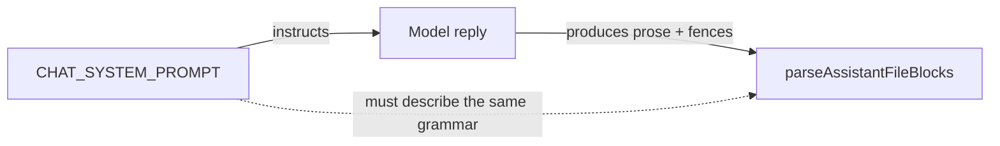
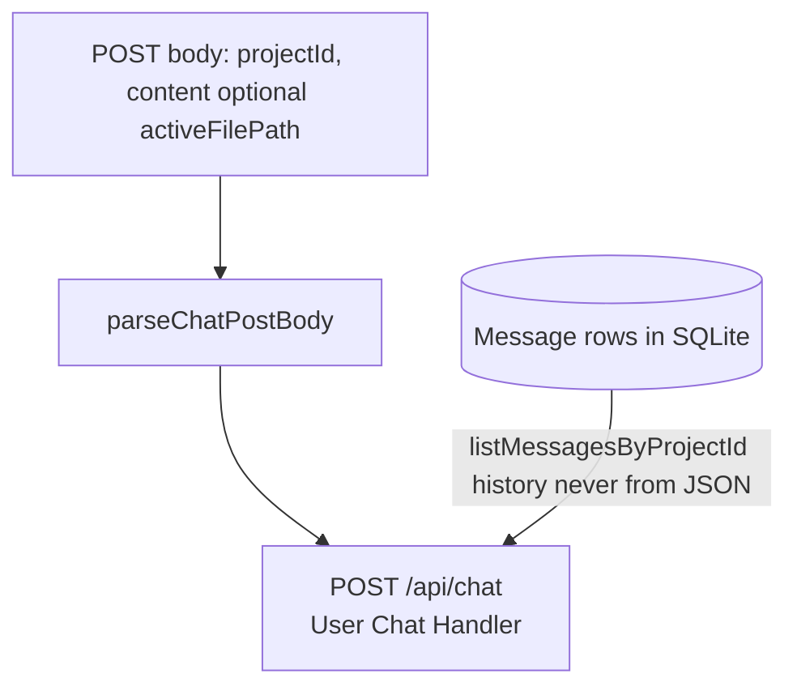
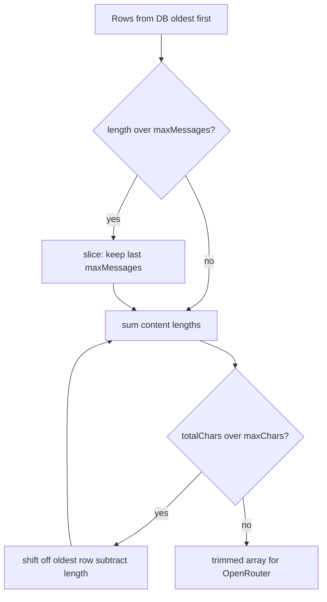

## What's in this post?

The system prompt and the file parser are two halves of a contract. Change one without the other and the pipeline silently produces garbage. This post builds everything that feeds into that contract:

- **`Message` model** — storing chat turns per project.
- **`parseChatPostBody`** — validating JSON input so you never accept client-provided history.
- **`getOpenRouterEnv`** — reading API keys with structured errors.
- **`CHAT_SYSTEM_PROMPT`** — the fence format contract between the model and the parser.
- **`trimMessageHistory` and `buildOpenRouterMessages`** — assembling the final payload the model receives.

---

## Goal

You want two things before you wire the streaming endpoint in Part 4:

1. **Persistence**: chat messages survive a page refresh.
2. **Format discipline**: the model's file output follows a structure the parser can safely consume.

Both require server-side design before you touch the client.

---

## Prerequisites

Parts 1–2 complete. You have an OpenRouter account if you want to test API calls when Part 4's endpoint exists.

**Estimated time:** about 60 minutes.

---

## The system prompt is the schema

Here is the mental model that makes this architecture coherent:

```
CHAT_SYSTEM_PROMPT  ←→  parseAssistantFileBlocks
     (producer)              (consumer)
```

The system prompt tells the model: "output file changes using this exact format." The parser reads that format. They share an implicit grammar.



If you change the fence prefix (say, from ` ```path ` to ` [file: path] `), you must update **both**—prompt and parser—plus all unit tests for the parser. There is no runtime validation that they agree. Drift between them produces assistant messages that parse silently to zero files, which is the worst kind of bug: no error, no files updated.

The practical implication: keep the format **simple, unambiguous, and uncommon enough** that the model will not accidentally use it for prose examples. Path-led triple-backtick fences on their own line are a reasonable choice—models treat them as code blocks, and a path token after the opening backticks is unusual enough to be unambiguous.

---

## Step 1 — `Message` model

```prisma
enum MessageRole {
  user
  assistant
}

model Message {
  id        String      @id @default(cuid())
  projectId String
  project   Project     @relation(fields: [projectId], references: [id], onDelete: Cascade)
  role      MessageRole
  content   String      @default("")
  createdAt DateTime    @default(now())

  @@index([projectId, createdAt])
}
```

The `@@index([projectId, createdAt])` matches the query you will run most often: "all messages for this project, ordered oldest to newest." The query is:

```ts
export async function listMessagesByProjectId(projectId: string): Promise<MessageRecord[]> {
  return prisma.message.findMany({
    where: { projectId },
    orderBy: { createdAt: "asc" },
    select: messageSelect,
  });
}
```

`orderBy: asc` serves two purposes: it reads naturally for humans, and it presents the model with conversation history in the correct temporal order—earlier turns before later ones.

```bash
npx prisma migrate dev --name add-message
```

---

## Step 2 — Never trust the client for history

**The wrong design:**

```ts
// client sends: { projectId, content, history: [...previousMessages] }
```

A client could forge message history, inject text into "previous" turns, or inflate context to extract information from the model's training. History must come from the database, keyed by `projectId` only.

**The correct design:**

```ts
// src/server/chat/parseChatPostBody.ts (excerpt)
export function parseChatPostBody(raw: unknown): ParseChatPostBodyResult {
  if (raw === null || typeof raw !== "object" || Array.isArray(raw)) {
    return { ok: false, code: "INVALID_BODY", message: "Body must be a JSON object." };
  }
  const o = raw as Record<string, unknown>;
  if (typeof o.projectId !== "string" || !o.projectId.trim()) {
    return { ok: false, code: "PROJECT_ID_REQUIRED", message: "projectId is required (non-empty string)." };
  }
  if (typeof o.content !== "string" || !o.content.trim()) {
    return { ok: false, code: "CONTENT_REQUIRED", message: "content is required (non-empty string)." };
  }
  const body: ChatPostBody = { projectId: o.projectId.trim(), content: o.content.trim() };
  return { ok: true, body };
}
```

The client sends `{ projectId, content }`. Optionally it sends `activeFilePath` (the file currently open in the workbench), which the server uses for snapshot prioritization in Part 6. History is loaded from the database server-side, after `projectId` is validated.

The discriminated union return type (`ok: true | false`) keeps the route handler readable: check `result.ok`, branch, proceed.



History only enters the pipeline after a **database read** keyed by `projectId`. The POST body never carries prior turns, so the client cannot forge the transcript.

---

## Step 3 — Environment variables for OpenRouter

```ts
export function getOpenRouterEnv(): GetOpenRouterEnvResult {
  const apiKey = process.env.OPENROUTER_API_KEY;
  const model = process.env.OPENROUTER_MODEL;

  if (!apiKey?.trim()) {
    return { ok: false, httpStatus: 503, code: "OPENROUTER_API_KEY_MISSING", message: "OPENROUTER_API_KEY is not set." };
  }
  if (!model?.trim()) {
    return { ok: false, httpStatus: 503, code: "OPENROUTER_MODEL_MISSING", message: "OPENROUTER_MODEL is not set." };
  }
  return { ok: true, apiKey: apiKey.trim(), model: model.trim() };
}
```

Return `503 Service Unavailable` when the configuration is missing—not `500 Internal Server Error`. The server is healthy; it is not configured. This distinction helps when you are debugging: a 503 from chat means "check your `.env`", whereas 500 means "read the stack trace."

---

## Step 4 — System prompt: the file fence contract

```ts
// src/server/llm/chatSystemPrompt.ts (excerpt)
export const CHAT_SYSTEM_PROMPT = `You are an AI coding agent helping the user edit a small web project (Vite + React + TypeScript).

## How to propose file changes (required format)
When you create or update project files, emit each file as a single Markdown fenced code block.
The opening fence MUST include the project-relative path (forward slashes), immediately after the opening backticks, with no space between the backticks and the path, followed by a newline before the file body.

Pattern:

\`\`\`src/App.tsx
FILE CONTENT GOES HERE
\`\`\`

Rules:
- Paths are relative to the project root. No leading slash.
- Each fence contains the FULL new file contents. Do not emit partial diffs.
- If you update multiple files, emit multiple fenced blocks.
- Do NOT nest triple-backtick fences inside a file body.
- Do NOT emit file blocks for files you did not change.
- Prose explanation is welcome before or after the blocks, but not inside them.
`;
```

Several rules here exist specifically because of parser edge cases:

- **"No leading slash"** — `normalizeProjectPath` (Part 5) rejects absolute paths. A leading slash would silently discard the block.
- **"Full new file contents"** — the parser stores the entire block as the new file content. Partial diffs would be stored literally, not applied as patches.
- **"Do NOT nest triple-backtick fences"** — the scanner stops at the first closing fence. Nested backticks would terminate the block early and corrupt the file content.
- **"Do NOT emit file blocks for files you did not change"** — reduces unnecessary `updatedAt` bumps, which Part 8's "Updated" badge uses to detect AI-touched files.

---

## Step 5 — History trimming

Long conversations overflow the model's context window. You trim from the oldest end:



```ts
export function trimMessageHistory(
  messages: MessageRecord[],
  options: ChatHistoryTrimOptions,
): MessageRecord[] {
  const { maxMessages, maxChars } = options;

  let result = messages;

  if (result.length > maxMessages) {
    result = result.slice(result.length - maxMessages);
  }

  let totalChars = result.reduce((sum, m) => sum + m.content.length, 0);
  while (result.length > 0 && totalChars > maxChars) {
    const removed = result.shift()!;
    totalChars -= removed.content.length;
  }

  return result;
}
```

Defaults come from environment variables so you can tune without a code change:

```ts
export function getChatHistoryTrimOptionsFromEnv(): ChatHistoryTrimOptions {
  return {
    maxMessages: parsePositiveInt(process.env.CHAT_HISTORY_MAX_MESSAGES, 32),
    maxChars: parsePositiveInt(process.env.CHAT_HISTORY_MAX_CHARS, 48_000),
  };
}
```

---

## Step 6 — Building the message array

`buildOpenRouterMessages` assembles everything the model receives:

```ts
// src/server/llm/buildChatMessages.ts (excerpt)
export async function buildOpenRouterMessages(
  projectId: string,
  options?: BuildOpenRouterMessagesOptions,
): Promise<BuildOpenRouterMessagesResult> {
  const [historyRaw, snapshotResult] = await Promise.all([
    listMessagesByProjectId(projectId),
    buildWorkspaceSnapshotUserContent(projectId, {
      activeFilePath: options?.activeFilePath,
    }),
  ]);

  const history = trimMessageHistory(historyRaw, getChatHistoryTrimOptionsFromEnv());
  const messages: OpenRouterChatMessage[] = [
    { role: "system", content: CHAT_SYSTEM_PROMPT },
  ];

  if (snapshotResult.markdown !== null) {
    messages.push({ role: "user", content: snapshotResult.markdown });
  }

  for (const row of history) {
    messages.push({
      role: row.role === "user" ? "user" : "assistant",
      content: row.content,
    });
  }

  return { messages, workspaceSnapshotLastRun: snapshotResult.lastRun };
}
```

The final message order is:

```
[system: CHAT_SYSTEM_PROMPT]
[user: workspace snapshot]   ← covered in Part 6
[user: oldest message]
[assistant: oldest reply]
[user: …]
[assistant: …]
[user: NEW MESSAGE]          ← already saved before this function runs
```

Two things matter about this order:

1. The **workspace snapshot** sits between the system prompt and the chat history. The model sees it as fresh context, not as an old turn. Part 6 explains why it is a `user` message rather than part of the `system` prompt.
2. The **new user message must already exist** in the database before `buildOpenRouterMessages` runs. The route (Part 4) will save the user message first, then call this function, so the new turn appears at the end of history naturally.

`Promise.all` loads history and the workspace snapshot concurrently—neither depends on the other before trimming.

---

## Check your work

You can verify most of this only after Part 4's route exists. For now:

- [ ] Migration applied; `Message` appears in Prisma Studio.
- [ ] Manual check: `parseChatPostBody` with `{}` returns `ok: false`.
- [ ] Manual check: `parseChatPostBody` with `{ projectId: "x", content: "hello" }` returns `ok: true`.

---

## Troubleshooting

| Problem | What to check |
|---------|---------------|
| `503` from chat route | `OPENROUTER_API_KEY` and `OPENROUTER_MODEL` set in `.env`; dev server restarted. |
| Model ignores file format | Re-read `CHAT_SYSTEM_PROMPT`; shorten unrelated instructions if the model drifts. |
| Parser finds zero files | Confirm no space between backticks and path in the fence opener; recheck prompt rules. |

---

## What comes next

[Part 4](https://github.com/minhmannh2001/minhmannh2001.github.io/blob/master/_posts/2026-04-12-build-your-own-app-builder-part-4-streaming-chat-endpoint-en.markdown) wires the streaming endpoint. The most interesting piece: you need two consumers of the same HTTP response body—one for the browser, one for database persistence—and you cannot read a stream twice.

---

*Next: [Part 4 — SSE streaming, the tee() trick, and the browser hook](https://github.com/minhmannh2001/minhmannh2001.github.io/blob/master/_posts/2026-04-12-build-your-own-app-builder-part-4-streaming-chat-endpoint-en.markdown).*
