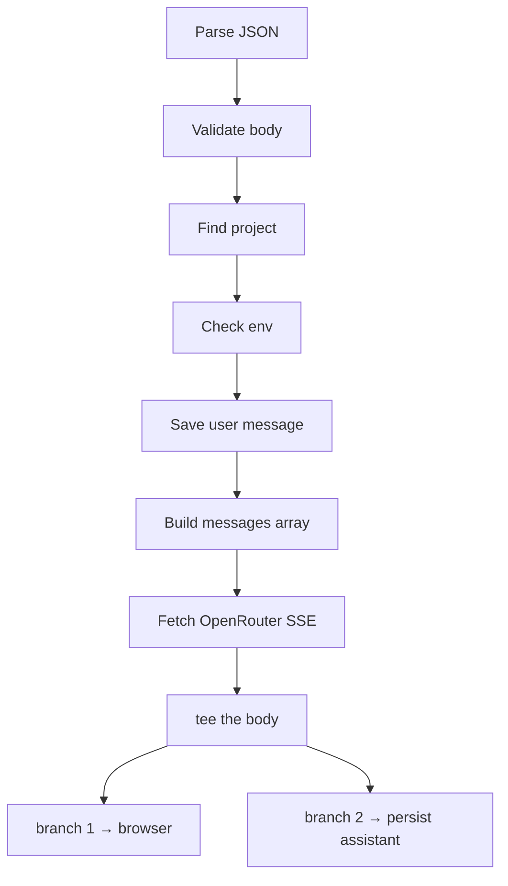

## What's in this post?

The streaming implementation has one non-obvious core problem: you cannot read an HTTP response body twice. This post solves it with `ReadableStream.prototype.tee()` and builds everything around that solution:

- **The route pipeline** — validate → save user message → build payload → fetch upstream → `tee()` → return to browser.
- **`tee()` explained** — how one stream becomes two independent readers.
- **`persistAssistantFromStream`** — accumulates the full text and saves it after the stream ends, without blocking the HTTP response.
- **`useProjectChat`** — the client hook that feeds SSE deltas into React state token by token.
- **`readOpenAiChatStream`** — shared SSE line parser: bytes → `onDelta` on both server and client.
- **Abort and error paths** — stop mid-stream, handle upstream failures.

---

## Goal

When this part is done:

1. The user types a message and submits.
2. The server saves a `user` row, calls OpenRouter with streaming enabled.
3. The browser shows tokens as they arrive.
4. When the stream ends, the server saves an `assistant` row with the full text.
5. A background call (Part 5) will parse file fences from that text—the hook is already there.

---

## Prerequisites

Parts 1–3 complete. Copy `.env.example` to `.env` in the app root and set at least `OPENROUTER_API_KEY` and `OPENROUTER_MODEL` (restart `npm run dev` after edits).

The template in the repo looks like this:

```dotenv
# Prisma SQLite — path resolved relative to the prisma/ directory
DATABASE_URL="file:./dev.db"

# --- OpenRouter — https://openrouter.ai/keys
OPENROUTER_API_KEY=

# Model id from https://openrouter.ai/models (examples: openai/gpt-4o-mini, anthropic/claude-3.5-sonnet)
OPENROUTER_MODEL=openai/gpt-4o-mini

# Optional: attribution headers recommended by OpenRouter
# OPENROUTER_SITE_URL=http://localhost:3000
# OPENROUTER_SITE_NAME=simple-app-builder

# Optional: default https://openrouter.ai/api/v1
# OPENROUTER_BASE_URL=https://openrouter.ai/api/v1

# Optional: abort chat/completions after this many ms (default 120000)
# OPENROUTER_TIMEOUT_MS=120000

# Optional: sampling (default temperature 0.4). max_tokens omitted unless set.
# OPENROUTER_TEMPERATURE=0.4
# OPENROUTER_MAX_OUTPUT_TOKENS=4096

# Optional: cap persisted chat history sent to the model (after system prompt)
# CHAT_HISTORY_MAX_MESSAGES=32
# CHAT_HISTORY_MAX_CHARS=48000

# Optional: workspace file snapshot injected before chat history (OpenRouter payload)
# CHAT_WORKSPACE_SNAPSHOT_MAX_FILES=48
# CHAT_WORKSPACE_SNAPSHOT_MAX_CHARS=120000

# Preview: enable “Run in browser” on the project workspace (stub until WebContainer is wired)
# NEXT_PUBLIC_PREVIEW_DEPLOY_ENABLED=true
```

**Estimated time:** about 90 minutes (streaming + error paths take care).

---

## The route pipeline

Run these steps in order. Each step can return early with a specific error response:

```
1. await request.json()       → 400 if invalid JSON
2. parseChatPostBody()        → 400 with code if wrong shape
3. getProjectById()           → 404 if project not found
4. getOpenRouterEnv()         → 503 if misconfigured
5. createMessage(user)        → persists new user turn
6. buildOpenRouterMessages()  → system + snapshot + trimmed history
7. fetchOpenRouterChatStream  → 504 timeout, 502 upstream error
8. rawBody.tee()              → two streams from one
9. void persistAssistantFromStream → fire and forget
10. return new NextResponse(toClient, sseHeaders)
```



---

## The core: `tee()`

**Why you cannot read a stream twice:**

An HTTP response body is a `ReadableStream<Uint8Array>`. Streams are pull-based: a reader requests data chunks, and chunks are consumed as they are read. Once a chunk is consumed, it is gone. If you have one reader for the browser and try to attach another for persistence, the second reader races with or misses chunks.

**`tee()` splits a stream into two:**

```ts
const [toClient, toPersist] = rawBody.tee();
```

Both `toClient` and `toPersist` are new `ReadableStream` instances. They are backed by the same source, but each maintains an independent read position and an internal buffer. When one reader is slower, the buffer grows. When both are consumed, the buffer is released.

**The result:**

```ts
const upstream = await fetchOpenRouterChatStream(env, messages, {
  signal: controller.signal,
});

const rawBody = upstream.body;
if (!rawBody) {
  return NextResponse.json({ error: { code: "NO_BODY" } }, { status: 502 });
}

const [toClient, toPersist] = rawBody.tee();
void persistAssistantFromStream(project.id, toPersist);

return new NextResponse(toClient, {
  status: 200,
  headers: {
    "Content-Type": upstream.headers.get("content-type") ?? "text/event-stream",
    "Cache-Control": "no-cache, no-transform",
    "Connection": "keep-alive",
    "X-Accel-Buffering": "no",
  },
});
```

The HTTP response returns immediately with `toClient` as the body. The browser starts receiving SSE chunks. Meanwhile `toPersist` is being read by the background persistence function.

**`void persistAssistantFromStream`** means you do not `await` it. The HTTP response does not wait for persistence to complete. This is intentional:
- The user sees the last token the moment the model finishes.
- Database work happens concurrently with the browser reading the last chunks.
- If persistence fails, you log it and the user still saw the answer in the UI.

The `X-Accel-Buffering: no` header prevents Nginx (and similar proxies) from buffering the stream before forwarding it to the browser—common cause of "stream never starts" bugs in production.

---

## Background persistence: `persistAssistantFromStream`

```ts
// src/server/chat/persistAssistantStream.ts
export async function persistAssistantFromStream(
  projectId: string,
  stream: ReadableStream<Uint8Array>,
): Promise<void> {
  let text = "";
  try {
    await readOpenAiChatStream(stream, (delta) => {
      text += delta;
    });
    await createMessage({ projectId, role: "assistant", content: text });
    await applyAssistantFileChangesFromText(projectId, text);
  } catch (err) {
    console.error("[chat] persist assistant failed", err);
  }
}
```

`readOpenAiChatStream` (in `src/lib/chat/readOpenAiChatStream.ts`) is the piece that turns **raw bytes** on the wire into **discrete text fragments** your UI and persistence code can append. The same helper runs in **`persistAssistantFromStream`** (server branch of `tee()`) and in **`useProjectChat`** (browser reading `fetch`’s `res.body`), so SSE parsing lives in one module.

The call to `applyAssistantFileChangesFromText` is a no-op until Part 5's parser exists. Placing the call site here means Part 5 only needs to implement the function—no need to revisit the route.

**Order matters:** `createMessage` runs before `applyAssistantFileChangesFromText`. If saving the message fails, file apply is skipped—you do not write files for a message that was not stored. If file apply fails, the message is already saved—the user's chat history is intact even if the file update failed.

---

## Timeouts and upstream errors

Wrap the OpenRouter fetch in an `AbortController` with a timeout:

```ts
const controller = new AbortController();
const timeoutId = setTimeout(() => controller.abort(), TIMEOUT_MS);

try {
  const upstream = await fetchOpenRouterChatStream(env, messages, {
    signal: controller.signal,
  });
  clearTimeout(timeoutId);
  // … proceed
} catch (err) {
  if (err instanceof DOMException && err.name === "AbortError") {
    return NextResponse.json({ error: { code: "OPENROUTER_TIMEOUT" } }, { status: 504 });
  }
  return NextResponse.json({ error: { code: "UPSTREAM_ERROR" } }, { status: 502 });
}
```

Map OpenRouter 401/402/429 to readable codes for the client—do not forward raw vendor error bodies. The client can display a specific message ("API key invalid", "quota exceeded") rather than a generic one.

---

## Client hook: `useProjectChat`

The client hook runs in the browser:

1. **Block double submits** with a ref (`isStreaming.current`).
2. **Optimistic update**: append the user message and an empty assistant bubble immediately—before the fetch completes. This makes the chat feel instant.
3. **Fetch** with `Accept: text/event-stream`.
4. **Pipe each delta** into the assistant bubble:

```ts
// src/components/project/chat/useProjectChat.ts (excerpt)
const res = await fetch("/api/chat", {
  method: "POST",
  headers: {
    "Content-Type": "application/json",
    Accept: "text/event-stream",
  },
  body: JSON.stringify(body),
  signal: ac.signal,
});

if (!res.ok) {
  // remove optimistic assistant bubble, show error
  return;
}

setLastAiContextRevision((n) => n + 1); // triggers context strip refresh (Part 9)

await readOpenAiChatStream(res.body!, (delta) => {
  setMessages((prev) =>
    prev.map((m) =>
      m.id === assistantId ? { ...m, content: m.content + delta } : m,
    ),
  );
});

scheduleWorkbenchRefresh(); // 250 ms delay before router.refresh() (Part 8)
```

**`key={message.id}`** on each message element is critical. Without stable keys, React would re-render (and potentially remount) all messages on every delta, causing visible flicker. With stable keys, only the specific assistant bubble re-renders.

**Stop button**: call `ac.abort()` on the `AbortController` passed to `fetch`. The in-flight request is cancelled; the partial assistant text stays visible. The background `persistAssistantFromStream` may still complete with the partial text—that is acceptable for MVP.

**`activeFilePath`** from the workbench is included in the request body when available. The server uses it to prioritize that file in the workspace snapshot (Part 6).

---

## `readOpenAiChatStream`: from SSE lines to growing text on screen

The hook above ends with `await readOpenAiChatStream(res.body!, (delta) => { … })`. That one `await` is doing more work than it looks like: it is the bridge between **whatever OpenRouter is currently pushing down the socket** and **the assistant bubble that keeps growing in your UI**. The same helper also runs on the server, on the second branch of `tee()`, so the database sees the same text the user saw—parsed from the same wire format once on each side.

When you call OpenRouter with `stream: true`, you do not get a single JSON document you could read with `response.json()`. You get an ordinary HTTP response whose **body stays open** and trickles in as **lines of text** in the Server-Sent Events style: a stream of `data: …` lines, then a final `data: [DONE]` when the model is finished. A toy version of what that looks like on the wire is:

```
data: {"choices":[{"delta":{"content":"Hel"}}]}
data: {"choices":[{"delta":{"content":"lo"}}]}
data: {"choices":[{"delta":{"content":" world"}}]}
data: [DONE]
```


Each line is a small JSON envelope. Inside it, `choices[0].delta.content` carries the **next slice** of assistant text—sometimes a syllable, sometimes a few characters, sometimes a short phrase. The provider does not wait until it has a full English word; it forwards text as the model produces it. From the UI’s point of view that does not matter: every time your callback runs, you append another slice to the same message, so the paragraph **looks** like it is being typed out even though the slices themselves are uneven.

`readOpenAiChatStream` in `src/lib/chat/readOpenAiChatStream.ts` is intentionally dull code. It runs a loop that **pulls byte chunks** from `ReadableStream<Uint8Array>` and turns them into text with `TextDecoder` (`stream: true` so UTF-8 cannot break across chunk boundaries). It keeps a running **string buffer** so it only handles lines once they are complete, because TCP can split a `data: {…}` line across two reads and you would otherwise try to parse half a line and give up. For each finished line it skips anything that is not a `data:` line, treats `[DONE]` as “we are finished,” otherwise parses JSON, pulls out `delta.content` when it is a string, and calls **`onDelta(piece)`** for that piece. The helper never touches React or Prisma; it only answers the question “given these bytes, what text fragments should I hand to my caller right now?”

That is why the answer appears gradually instead of popping in all at once. The model emits many small pieces over time. Your route forwards one leg of `tee()` straight to the browser (ideally without a proxy buffering the whole response—hence headers like `X-Accel-Buffering: no` when you deploy behind Nginx). The browser’s `fetch` exposes the same response body as another `ReadableStream`. Each time more bytes arrive, `readOpenAiChatStream` may fire `onDelta` one or more times; each call runs your `setMessages` updater and appends to the streaming assistant row. React then re-renders with longer text. There is no separate “streaming mode” in React here—just **many quick state updates** fed by **many small network events**. When the parser sees `[DONE]` or the stream ends, the `await` in your hook completes and you can run cleanup such as scheduling the workbench refresh. Meanwhile the other branch of `tee()` has been walking the **same** line format in `persistAssistantFromStream`, concatenating every `onDelta` into one string for `createMessage`.

Keeping that parser in **one module** matters because the edge cases are annoying in duplicate: partial lines, heartbeats, malformed `data:` lines, future vendor tweaks. Both the client hook and the server persistence path import `readOpenAiChatStream`; if the wire format changes, you fix one file.

---

## API summary

| Item | Detail |
|------|--------|
| **URL** | `/api/chat` |
| **Method** | `POST` |
| **Body** | `{ "projectId": string, "content": string, "activeFilePath"?: string }` |
| **Success** | `200` — `text/event-stream` body |
| **Errors** | `400` bad input · `404` unknown project · `503` missing env · `504` timeout · `502` upstream |

---

## Check your work

- [ ] After one chat turn, Prisma Studio shows `user` and `assistant` rows.
- [ ] Assistant text appears gradually in the UI—not all at once at the end.
- [ ] Missing API key → `503` with a clear code.
- [ ] Clicking **Stop** mid-stream leaves partial text visible.

---

## Troubleshooting

| Problem | What to check |
|---------|---------------|
| Empty assistant in DB but UI looked fine | Persistence runs in background—read server logs for DB errors inside `persistAssistantFromStream`. |
| Stream never starts | Confirm `Accept: text/event-stream` header; check `X-Accel-Buffering: no` if behind a proxy. |
| Immediate `504` | `OPENROUTER_TIMEOUT_MS` too low; increase for slow models in local dev. |
| Flicker on each token | Confirm `key={message.id}` on message elements—do not use array index as key. |

---

## What comes next

[Part 5](https://github.com/minhmannh2001/minhmannh2001.github.io/blob/master/_posts/2026-04-13-build-your-own-app-builder-part-5-parser-and-database-apply-en.markdown) implements `applyAssistantFileChangesFromText`—the call that already exists in `persistAssistantFromStream`. The parser must treat model output as adversarial: the model can repeat paths, use relative traversal, or include partial fences.

---

*Next: [Part 5 — Parsing LLM output into database rows, safely](https://github.com/minhmannh2001/minhmannh2001.github.io/blob/master/_posts/2026-04-13-build-your-own-app-builder-part-5-parser-and-database-apply-en.markdown).*
