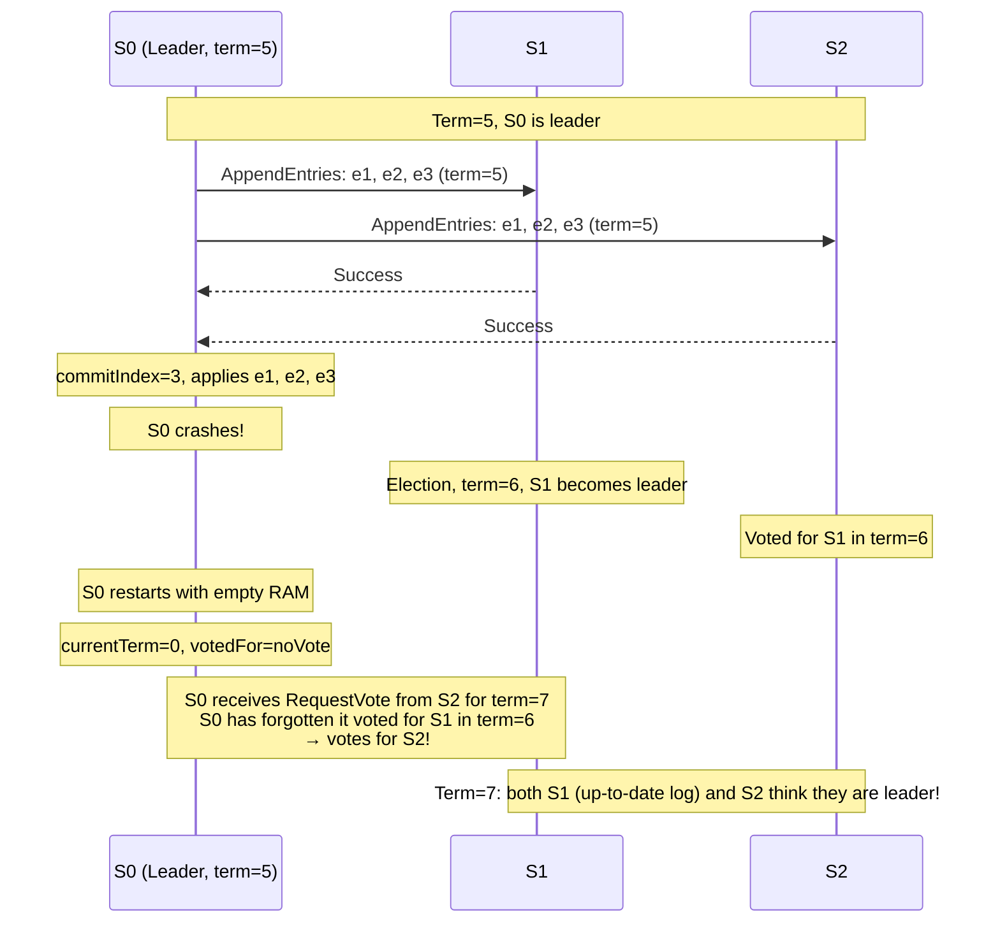
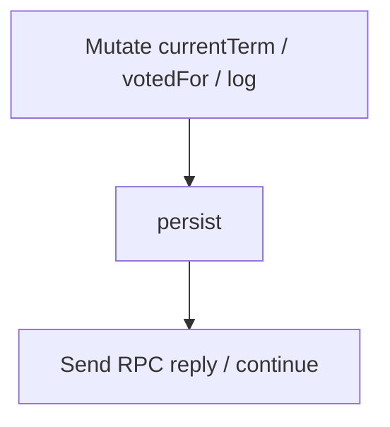
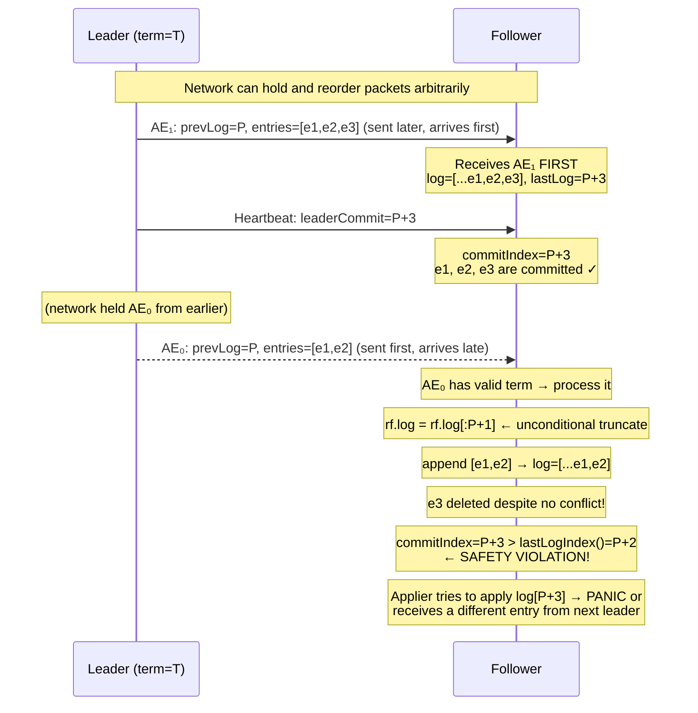
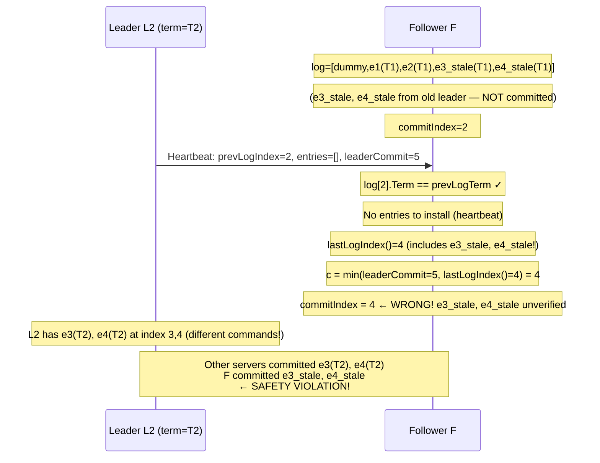

In the previous post (Lab 3B), we completed the log replication mechanism: the leader accepts commands, distributes them to followers, counts the quorum, commits, and applies entries to the state machine. The cluster now works correctly — **as long as no server crashes**.

But crashes are unavoidable in any real distributed system. When a server restarts after a crash, all in-memory state is gone. Without a mechanism to write critical state to disk, Raft immediately violates its most basic invariants:

- A server can vote for two different candidates in the same term.
- A server can forget committed log entries and accept conflicting entries from a new leader.
- The cluster can collectively "misremember" its entire history of agreement.

Lab 3C solves this with **persistence**: writing important fields to stable storage after every mutation, and reading them back on startup. But persistence is only the beginning — this lab also hides two subtle safety bugs that only appear under a highly unreliable network with long delays and arbitrary packet reordering.

## 1. Why Persistence?

### 1.1. The World Without Persistence

Imagine a 3-server cluster: S0 (leader, term=5), S1, S2. Here is what can go wrong:



This is an **election safety** violation — two leaders in the same term. The result: conflicting entries get committed, and the cluster loses consistency.

### 1.2. Figure 2: The Three Fields That Must Be Persisted

The Raft paper (Figure 2) precisely specifies three fields that must be written to stable storage before responding to any RPC:

| Field | Why It Must Be Persisted |
|-------|--------------------------|
| `currentTerm` | Ensures a server never accepts RPCs from a staler term after restart. If lost, a server might vote for two different candidates in the same term. |
| `votedFor` | Ensures a server never votes twice in the same term. If lost, two leaders can exist simultaneously. |
| `log` | Ensures committed entries are never lost. If lost, a restarted server might accept conflicting entries from a new leader. |

### 1.3. Why Other Fields Do Not Need Persistence

This is an equally important question:

| Field | Why It Does NOT Need Persistence |
|-------|----------------------------------|
| `commitIndex` | Can be reconstructed: the leader will update it via heartbeats. Starting at 0 only means some entries are re-applied — not that anything is inconsistent. |
| `lastApplied` | Same as `commitIndex`. The state machine above handles idempotency if needed. |
| `nextIndex` | Only exists on the leader. After a restart, the server starts as a follower — this field is not needed. |
| `matchIndex` | Same as `nextIndex`. |

General rule: **fields that affect the correctness of elections and log consistency must be persisted. Fields that only affect performance or can be reconstructed from the leader do not.**

## 2. Implementing persist() and readPersist()

### 2.1. persist()

The `persist()` function encodes the three durable fields using `labgob` (a binary encoder similar to `encoding/gob`) and saves the result to the `Persister`:

```go
func (rf *Raft) persist() {
    w := new(bytes.Buffer)
    e := labgob.NewEncoder(w)
    e.Encode(rf.currentTerm)
    e.Encode(rf.votedFor)
    e.Encode(rf.log)
    raftstate := w.Bytes()
    rf.persister.Save(raftstate, nil)
}
```

**Key points:**
- The encoding order must be identical to the decoding order in `readPersist`. This is an easy detail to get wrong.
- `rf.persister.Save(raftstate, nil)`: the second argument is for snapshots (used in Lab 3D). For now it is `nil`.
- **The caller must hold `rf.mu`** when calling `persist()` — it reads Raft state.

### 2.2. readPersist() — With Validation

`readPersist()` reads and decodes the saved state. But it must validate the decoded data before applying it, since the blob could be corrupt or from an incompatible version:

```go
func (rf *Raft) readPersist(data []byte) {
    if len(data) < 1 { // No persisted state: keep defaults
        return
    }
    r := bytes.NewBuffer(data)
    d := labgob.NewDecoder(r)
    var term int
    var voted int
    var log []LogEntry
    if d.Decode(&term) != nil ||
        d.Decode(&voted) != nil ||
        d.Decode(&log) != nil {
        return // Corrupt blob: apply nothing
    }
    // Invariant: log[0] is always a dummy entry with Term=0.
    // If violated: blob is malformed, keep defaults.
    if len(log) < 1 || log[0].Term != 0 {
        return
    }
    rf.currentTerm = term
    rf.votedFor = voted
    rf.log = log
}
```

**Why validate `log[0].Term == 0`?**

Our Raft implementation uses index 0 as a dummy entry (term=0) to simplify `PrevLogIndex` arithmetic. If the blob was written by a different version or was partially truncated, `log[0]` might have a non-zero term. Applying it blindly would cause a panic in `lastLogTerm()` or related calculations.

The principle: **`readPersist` is all-or-nothing** — either apply the entire valid blob, or keep the defaults. No partial state.

### 2.3. Initialization Order in Make()

The order of operations in `Make()` matters more than it might appear:

```go
func Make(peers []*labrpc.ClientEnd, me int,
    persister *tester.Persister, applyCh chan raftapi.ApplyMsg) raftapi.Raft {
    // ...
    rf := &Raft{}
    rf.peers = peers
    rf.persister = persister
    rf.me = me

    // Step 1: Set defaults FIRST — including the dummy log[0]
    rf.currentTerm = 0
    rf.votedFor = noVote
    rf.role = RoleFollower
    rf.log = []LogEntry{{Term: 0}} // ← dummy entry MUST exist before readPersist
    rf.commitIndex = 0
    rf.lastApplied = 0

    // Step 2: Overlay durable state on top of defaults
    rf.readPersist(persister.ReadRaftState())

    // Step 3: Reset election timer AFTER state is fully established
    rf.mu.Lock()
    rf.resetElectionTimerLocked()
    rf.mu.Unlock()

    go rf.ticker()
    go rf.applier(applyCh)

    return rf
}
```

**Why set defaults first?** If `readPersist` is called with an empty or corrupt blob, it returns without changing anything. If defaults were not set beforehand, `rf.log` would be `nil` — code would panic as soon as `lastLogTerm()` is called.

The correct order: **defaults → readPersist → timer reset**.

## 3. When to Call persist()

This is the most commonly missed aspect. The rule: **call `persist()` immediately after any change to `currentTerm`, `votedFor`, or `log`, before responding to any RPC**.



The specific call sites:

### 3.1. becomeFollower() — When Term Increases

```go
func (rf *Raft) becomeFollower(newTerm int) {
    if newTerm < rf.currentTerm {
        return
    }
    if newTerm > rf.currentTerm {
        rf.currentTerm = newTerm
        rf.votedFor = noVote
        rf.persist() // ← both currentTerm and votedFor changed
    }
    rf.role = RoleFollower
    // When newTerm == currentTerm: only role changes — not a durable field
    // → NO persist needed
}
```

**Important subtlety:** When `newTerm == currentTerm`, only `role` changes (e.g., Candidate → Follower). Since `role` is not a durable field, `persist()` is unnecessary. Calling it anyway wastes I/O and slows the system down.

### 3.2. RequestVote() — When a Vote Is Granted

```go
func (rf *Raft) RequestVote(args *RequestVoteArgs, reply *RequestVoteReply) {
    // ... check term, check log up-to-date ...
    if rf.votedFor == noVote || rf.votedFor == args.CandidateId {
        rf.votedFor = args.CandidateId
        reply.VoteGranted = true
        rf.resetElectionTimerLocked()
        rf.persist() // ← votedFor changed
    }
}
```

### 3.3. AppendEntries() — When Entries Are Installed

```go
func (rf *Raft) AppendEntries(args *AppendEntriesArgs, reply *AppendEntriesReply) {
    // ... check term, check PrevLog ...
    // install entries
    // update commitIndex
    reply.Success = true
    rf.persist() // ← log may have changed (term also changed via becomeFollower)
}
```

### 3.4. startElection() — When Term Is Bumped for Election

```go
func (rf *Raft) startElection() {
    rf.mu.Lock()
    // ...
    rf.currentTerm++       // term changes
    rf.role = RoleCandidate
    rf.votedFor = rf.me    // votedFor changes
    rf.resetElectionTimerLocked()
    rf.persist()           // ← persist immediately after mutation
    // ...
}
```

### 3.5. Start() — When the Leader Appends a New Entry

```go
func (rf *Raft) Start(command interface{}) (int, int, bool) {
    // ...
    rf.log = append(rf.log, LogEntry{Term: rf.currentTerm, Command: command}) // log changes
    // ...
    rf.persist() // ← persist immediately
    // ...
}
```

## 4. Safety Bug #1: Stale AppendEntries Truncating Committed Entries

This is the most dangerous bug we encountered in this lab. It never appears on a simple network, and only surfaces when `SetLongReordering(true)` is enabled — allowing the network to hold packets and deliver them in arbitrary order.

### 4.1. The Always-Truncate Approach and Its Flaw

Our Lab 3B implementation installs entries using the simplest possible approach: always truncate the log back to `PrevLogIndex+1` before appending:

```go
// ❌ Buggy code: always truncate, no conflict check
rf.log = rf.log[:args.PrevLogIndex+1]
if len(args.Entries) > 0 {
    toAppend := make([]LogEntry, len(args.Entries))
    copy(toAppend, args.Entries)
    rf.log = append(rf.log, toAppend...)
}
```

This works correctly on a reliable network: AEs always arrive in order, and each successive AE carries at least as many entries as the previous one. Truncating to `PrevLogIndex+1` never removes committed entries because the leader only advances `nextIndex` after receiving a success reply — the latest AE always covers everything already replicated.

The problem surfaces when the network can hold packets and deliver them in arbitrary order: an older AE (carrying fewer entries) can arrive **after** a newer one. The unconditional truncate to `PrevLogIndex+1` then removes entries that the newer AE had already installed — including entries that have already been committed.

### 4.2. The Scenario That Causes the Safety Violation



Result: server F has `commitIndex=P+3` but `len(log)=P+2`. The applier tries to apply the entry at index `P+3` — but it does not exist. The code included an extra guard `if rf.commitIndex > rf.lastLogIndex() { rf.commitIndex = rf.lastLogIndex() }` to avoid a panic here, but that guard only masks the symptom: commitIndex silently drops to P+2 instead of staying at P+3. Then, when the next leader sends a different entry at index P+3, the follower applies a different command at the same index — contradicting what other servers already applied.

Test failure: `apply error: commit index=42 server=4 4625 != server=1 5601` — two servers applied different commands at the same index.

### 4.3. Why Does This Only Appear with SetLongReordering?

With a reliable network or short delays:
- AEs arrive in order. AE₀ always arrives before AE₁.
- The unconditional truncate to `PrevLogIndex+1` never removes committed entries because the newer AE always supersedes the older one in this case.

With `SetLongReordering(true)`:
- The network can hold AE₀ for seconds, then deliver it.
- Meanwhile, AE₁ and heartbeats have arrived; AE₁'s entries have been installed and committed.
- When AE₀ finally arrives, the unconditional truncate to `PrevLogIndex+1` removes entries that AE₁ had installed — including committed ones — causing the safety violation.

### 4.4. The Fix: Implementing Figure 2 Rules 3–4 Precisely

Figure 2 of the Raft paper states two distinct rules:
- **Rule 3**: If an existing entry *conflicts* with a new one (same index, **different term**) → delete that entry and all that follow.
- **Rule 4**: Append any new entries not already in the log.

Neither rule says "truncate the log to `prevLogIndex + len(entries)`". Rule 3 only applies to **conflicts** (different terms). If an entry already exists with the same term, do nothing.

```go
// ✅ Correct code: only truncate on a genuine conflict
if len(args.Entries) > 0 {
    for j, entry := range args.Entries {
        idx := args.PrevLogIndex + 1 + j
        if idx >= len(rf.log) {
            // Past the end: append remaining entries and stop.
            rf.log = append(rf.log, args.Entries[j:]...)
            break
        }
        if rf.log[idx].Term != entry.Term {
            // Conflict: truncate at divergence point, append remaining.
            rf.log = append(rf.log[:idx], args.Entries[j:]...)
            break
        }
        // Entry already present with matching term: skip (do nothing).
    }
}
```

With this fix, applying the late AE₀ scenario:
- j=0: idx=P+1, `log[P+1].Term == e1.Term` → skip
- j=1: idx=P+2, `log[P+2].Term == e2.Term` → skip
- j=2 = len(entries) → loop exits naturally
- **No truncation. Log and commitIndex unchanged.** ✓

### 4.5. Validating the Fix Against Figure 2

Let's verify the new loop handles all cases correctly:

| Scenario | Behavior | Correct? |
|----------|----------|----------|
| AE with new entries beyond log end | Appends entries past end of log | ✓ |
| AE with conflict at position k | Truncates at k, appends remaining | ✓ |
| Stale AE with matching subset | Skips all matching entries, no truncation | ✓ |
| Heartbeat (empty entries) | Loop body never executes | ✓ |
| Partial match then conflict | Skips matching prefix, truncates at conflict | ✓ |

## 5. Safety Bug #2: Wrong commitIndex Formula Using lastLogIndex()

### 5.1. The Problem with the Naive Formula

The naive version of Figure 2 Rule 5 (updating `commitIndex` on the follower):

```go
// ❌ Wrong code: uses lastLogIndex() instead of lastNewEntry
if args.LeaderCommit > rf.commitIndex {
    last := rf.lastLogIndex()
    c := args.LeaderCommit
    if c > last {
        c = last
    }
    rf.commitIndex = c
}
// Extra guard added to prevent applier panic when always-truncate shrinks the log
if rf.commitIndex > rf.lastLogIndex() {
    rf.commitIndex = rf.lastLogIndex()
}
```

This sounds reasonable: do not commit beyond what is in the log. The extra guard at the end was added to prevent the applier from panicking when the always-truncate approach (Bug #1) shrank the log below `commitIndex`. But it only masks the symptom — and it is a subtle safety violation.

### 5.2. The Violation Scenario



The problem: a follower can have "extra" entries at the tail of its log from an old leader (entries that existed before the current leader won the election). A heartbeat from the new leader only verifies up to `PrevLogIndex` — anything after that is unverified. Using `lastLogIndex()` means committing into unverified territory.

### 5.3. The Fix: The Correct Formula

The correct formula is: **"last new entry" = the highest index verified by this AE** = `PrevLogIndex + len(Entries)`.

```go
// ✅ Correct code
// lastNewEntry: highest index verified by this AE's prevLog check.
// Only entries ≤ lastNewEntry are guaranteed to be consistent with the leader.
lastNewEntry := args.PrevLogIndex + len(args.Entries)
if args.LeaderCommit > rf.commitIndex && lastNewEntry > rf.commitIndex {
    c := args.LeaderCommit
    if c > lastNewEntry {
        c = lastNewEntry
    }
    rf.commitIndex = c
}
```

**Explanation:**
- For heartbeats (`len(Entries)=0`): `lastNewEntry = PrevLogIndex`. If `PrevLogIndex < commitIndex`, the condition `lastNewEntry > rf.commitIndex` is false → `commitIndex` stays. Correct — we know nothing more about entries beyond `PrevLogIndex`.
- For real AEs: `lastNewEntry = PrevLogIndex + len(Entries)` = the index of the last installed entry. All entries ≤ lastNewEntry have been verified through the chain of prevLog checks. Safe to commit up to here.

**The dual condition `lastNewEntry > rf.commitIndex`**: prevents stale heartbeats (with a low `PrevLogIndex`) from accidentally rolling `commitIndex` backward. If the heartbeat has `PrevLogIndex=P` but the follower already committed up to index `Q > P`, nothing changes.

### 5.4. Why Are the Two Bugs Coupled?

Our original Lab 3B code used **always-truncate** together with `lastLogIndex()` — and those two choices form a coherent pair:
- After always-truncate, `lastLogIndex() = PrevLogIndex + len(Entries) = lastNewEntry`.
- So `lastLogIndex()` and `lastNewEntry` yield the same result when always-truncate is in effect.

This means: with always-truncate, Bug #2 **does not manifest** — `lastLogIndex()` is equivalent to `lastNewEntry`. Bug #2 only surfaces **after** Bug #1 is fixed.

When we switch from always-truncate to "only truncate on a genuine conflict", `lastLogIndex()` is no longer equal to `lastNewEntry` — the follower may retain stale entries from an old leader beyond `PrevLogIndex`. Using `lastLogIndex()` now means committing into unverified territory, which is a safety violation.

The two bugs form a coupled pair:
- always-truncate + `lastLogIndex()` → our original code: Bug #2 is hidden, but Bug #1 is present (safety violation under reordering).
- only-truncate-on-conflict + `lastLogIndex()` → fixes Bug #1 but exposes Bug #2.
- only-truncate-on-conflict + `lastNewEntry` → fixes both.

## 6. Election Timer Reset: Before or After the Consistency Check?

### 6.1. Two Schools of Thought

**Conservative (reset only on success):**
```go
// ❌ Original code: reset timer only after success
// → timer is NOT reset when the consistency check fails
// ... PrevLog check, entry installation, commitIndex update ...
reply.Success = true
rf.resetElectionTimerLocked() // ← only reached on success
rf.persist()
```

**Aggressive (reset as soon as term is valid):**
```go
// Any AppendEntries with term >= currentTerm proves there is an active leader
// → reset immediately to prevent unnecessary elections during log resync
rf.becomeFollower(args.Term)
rf.resetElectionTimerLocked() // ← reset BEFORE consistency check
// ... continue with PrevLog check, entry installation ...
```

### 6.2. Which Is Correct?

The Raft paper §5.2 says: _"A server remains in follower state as long as it receives valid RPCs from a leader or candidate."_

When a follower receives `AppendEntries` with `args.Term >= currentTerm`, it **knows there is an active leader**. Whether the consistency check passes or not, the leader is alive and actively trying to synchronize the log. There is no reason to start an election — it would be a disruptive, unnecessary election.

**The aggressive approach (reset early) is semantically correct** and is critical for liveness under high network chaos. With `SetLongReordering(true)`:
- The leader sends an AE with an incorrect `PrevLogIndex` → follower rejects, but the leader is alive.
- Without timer reset, the follower might start an election → disrupts the leader unnecessarily.
- New election → new leader has to rebuild log sync from scratch → reduced liveness.

### 6.3. Correcting the Unit Test

The original test `prev_index_out_of_range_fails_no_timer_reset` asserted that the timer should NOT be reset when the consistency check fails. This reflects the conservative approach, which was the original implementation. When the timer reset was moved earlier (to improve liveness), this test started failing.

The fix is to update the test to document the correct behavior:

```go
// Old name: "prev_index_out_of_range_fails_no_timer_reset"
// New name: "prev_index_out_of_range_fails_resets_timer"
//
// Raft §5.2: any AppendEntries with term >= currentTerm proves there is an active
// leader → the election timer MUST be reset even if the consistency check fails.
// This prevents spurious elections during log resync.
t.Run("prev_index_out_of_range_fails_resets_timer", func(t *testing.T) {
    // ...
    if reply.Success {
        t.Fatal("want failure when PrevLogIndex beyond log")
    }
    if rf.electionDeadline.Equal(old) {
        t.Fatal("AppendEntries from current-term leader must reset timer even on failure")
    }
})
```

## 7. The Complete AppendEntries Handler After Lab 3C

Here is the full implementation incorporating all three fixes:

```go
func (rf *Raft) AppendEntries(args *AppendEntriesArgs, reply *AppendEntriesReply) {
    rf.mu.Lock()
    defer rf.mu.Unlock()

    // Rule 1: Reject if the leader's term is stale.
    if args.Term < rf.currentTerm {
        reply.Term = rf.currentTerm
        reply.Success = false
        return
    }

    // Adopt the leader's term, step down if necessary.
    rf.becomeFollower(args.Term)
    reply.Term = rf.currentTerm

    // Reset election timer immediately — we know there is an active leader.
    // This prevents unnecessary elections while log resync is in progress.
    rf.resetElectionTimerLocked()

    // Rule 2: Check if PrevLogIndex is within our log.
    if args.PrevLogIndex < 0 || args.PrevLogIndex >= len(rf.log) {
        reply.Success = false
        reply.ConflictTerm = -1
        reply.ConflictIndex = len(rf.log) // tells leader exactly how short we are
        return
    }

    // Rule 3: Check if the term at PrevLogIndex matches.
    if rf.log[args.PrevLogIndex].Term != args.PrevLogTerm {
        reply.Success = false
        ct := rf.log[args.PrevLogIndex].Term
        reply.ConflictTerm = ct
        idx := args.PrevLogIndex
        for idx > 0 && rf.log[idx-1].Term == ct {
            idx-- // find the start of this term's block
        }
        reply.ConflictIndex = idx
        return
    }

    // Rules 3–4 (Figure 2): Install entries correctly.
    // ONLY truncate on a genuine conflict (different term).
    // If an entry already exists with the same term → skip (do not truncate).
    // This prevents stale (reordered) AEs from removing committed entries.
    if len(args.Entries) > 0 {
        for j, entry := range args.Entries {
            idx := args.PrevLogIndex + 1 + j
            if idx >= len(rf.log) {
                // Past the end of our log: append remaining entries.
                rf.log = append(rf.log, args.Entries[j:]...)
                break
            }
            if rf.log[idx].Term != entry.Term {
                // Conflict: truncate at divergence point, append remaining.
                rf.log = append(rf.log[:idx], args.Entries[j:]...)
                break
            }
            // Entry already present with matching term: skip.
        }
    }

    // Rule 5: Advance commitIndex.
    // lastNewEntry = highest index verified by this AE's prevLog check.
    // Do NOT use lastLogIndex() — the follower may have stale unverified entries
    // beyond prevLogIndex from an old leader.
    lastNewEntry := args.PrevLogIndex + len(args.Entries)
    if args.LeaderCommit > rf.commitIndex && lastNewEntry > rf.commitIndex {
        c := args.LeaderCommit
        if c > lastNewEntry {
            c = lastNewEntry
        }
        rf.commitIndex = c
    }

    reply.Success = true
    rf.persist() // log may have changed
}
```

## 8. Lab 3C Test Cases

### 8.1. Unit Tests (TDD)

Before running integration tests, we wrote unit tests to validate each invariant individually:

**Persistence round-trip:**
```go
// TestPersistReadPersistRoundTrip3C: encode then decode must restore the same state
func TestPersistReadPersistRoundTrip3C(t *testing.T) {
    p := tester.MakePersister()
    src := &Raft{
        persister: p, currentTerm: 7, votedFor: 2,
        log: []LogEntry{{Term: 0}, {Term: 3, Command: 100}, {Term: 7, Command: "hello"}},
    }
    src.persist()
    dst := &Raft{currentTerm: 0, votedFor: noVote, log: []LogEntry{{Term: 0}}}
    dst.readPersist(p.ReadRaftState())
    // Assert: dst.currentTerm==7, dst.votedFor==2, dst.log==src.log
}
```

**readPersist is a no-op on empty or corrupt blobs:**
```go
func TestReadPersistEmpty3C(t *testing.T) {
    rf := &Raft{currentTerm: 5, votedFor: 1, log: ...}
    rf.readPersist(nil)        // must keep existing state
    rf.readPersist([]byte{})   // must keep existing state
}

func TestReadPersistCorrupt3C(t *testing.T) {
    rf := &Raft{currentTerm: 9, ...}
    rf.readPersist([]byte{0xff, 0xfe, 0xfd}) // corrupt blob → no-op
}
```

**persist() is called at the right times:**
```go
func TestBecomeFollowerHigherTermPersists3C(t *testing.T) {
    // After becomeFollower(5): Persister must contain term=5, votedFor=noVote
}

func TestBecomeFollowerSameTermDoesNotWritePersister3C(t *testing.T) {
    // becomeFollower(currentTerm): Persister must stay empty (no unnecessary I/O)
}
```

**Stale heartbeat must not change log or commitIndex:**
```go
func TestAppendEntriesHeartbeatPrevBelowCommitIndex3C(t *testing.T) {
    // Heartbeat with prevLogIndex < commitIndex: must succeed
    // but log and commitIndex must remain unchanged
}
```

### 8.2. Integration Tests

| Test | Description | Pass Condition |
|------|-------------|----------------|
| `TestPersist13C` | Server crash and restart during replication | After restart, server re-syncs log and continues correctly |
| `TestPersist23C` | Multiple servers crash simultaneously in a 5-node cluster | Cluster continues to commit entries after majority restarts |
| `TestPersist33C` | Leader and one follower crash together, leader restarts | Raft elects a new leader, crash recovery is correct |
| `TestFigure83C` | Figure 8 from the Raft paper (reliable network) | No safety violations |
| `TestUnreliableAgree3C` | Agreement under an unreliable network | All entries are eventually committed |
| `TestFigure8Unreliable3C` | Figure 8 with unreliable network, reordering, long delays | **The hardest test** — no apply errors |

### 8.3. TestFigure8Unreliable3C — The Ultimate Stress Test

This test constructs the most demanding scenario in Lab 3C:
1. 5-server cluster.
2. Network with packet reordering, long delays, and losses.
3. Multiple rounds of partition and reconnection.
4. Continuous command submission during each partition.
5. Final reconnection with all servers, then verification that every server agrees.

This test **simultaneously** verifies:
- **Safety**: no two servers apply different commands at the same index.
- **Liveness**: the cluster must eventually reach agreement within 10 seconds.

Without any of the three fixes described above, this test fails:
- Missing stale-AE fix → safety violation (apply error).
- Missing commitIndex formula fix → safety violation (apply error).
- Missing early timer reset → liveness failure (timeout).

## 9. Debugging Tips for Lab 3C

### 9.1. Distinguishing Safety Failures from Liveness Failures

**Safety failure** (most dangerous):
```
apply error: commit index=42 server=4 4625 != server=1 5601
```
Two servers applied different commands at the same index. **This is completely unacceptable** — Raft's core guarantee is broken.

**Liveness failure** (serious but different in nature):
```
one(2000) failed to reach agreement
```
The cluster failed to reach agreement within 10 seconds. Possibly caused by too-frequent elections, unstable leadership, or slow log synchronization.

### 9.2. Reproducing Non-Deterministic Failures

Bugs in Lab 3C are often non-deterministic — appearing in 1 out of 10 runs. To reproduce:

```bash
# Run 20 times with enough total timeout
go test -run TestFigure8Unreliable3C -count=20 -timeout 1200s
```

If the failure appears 1–2 times out of 20, focus on the apply error message to identify which index is inconsistent and trace backward: which server committed what, and when.

### 9.3. Debugging the commitIndex Formula

Add a temporary assertion at the end of `AppendEntries`:
```go
// Debug: commitIndex must never exceed lastLogIndex
if rf.commitIndex > rf.lastLogIndex() {
    panic(fmt.Sprintf("commitIndex %d > lastLogIndex %d after AE from %d",
        rf.commitIndex, rf.lastLogIndex(), args.LeaderId))
}
```

If this panics, the commitIndex formula is wrong.

### 9.4. Debugging the Stale AE Truncation

Add a guard before any truncation:
```go
// Debug: never truncate a committed entry
if idx <= rf.commitIndex {
    panic(fmt.Sprintf("about to truncate committed entry at %d (commitIndex=%d)",
        idx, rf.commitIndex))
}
```

## 10. Other Common Pitfalls in Lab 3C

### 10.1. Missing or Excessive Calls to persist()

**Missing persist**: typically caught by `TestPersist*` — server restart does not restore state correctly.

```go
// ❌ Forgetting persist after voting
if rf.votedFor == noVote || rf.votedFor == args.CandidateId {
    rf.votedFor = args.CandidateId
    reply.VoteGranted = true
    rf.resetElectionTimerLocked()
    // persist() omitted → after crash, votedFor is lost → can vote twice
}
```

**Excessive persist**: wastes I/O but does not cause incorrect behavior. The most common case is calling `persist()` in `becomeFollower` even when the term has not changed:

```go
// ❌ Unnecessary and incorrect persist
func (rf *Raft) becomeFollower(newTerm int) {
    if newTerm >= rf.currentTerm {
        rf.currentTerm = newTerm // If newTerm==currentTerm, no change
        rf.votedFor = noVote     // ← WRONG: should not clear votedFor if term unchanged!
        rf.persist()             // Unnecessary I/O + incorrect logic
    }
    rf.role = RoleFollower
}
```

Always check `newTerm > rf.currentTerm` before clearing `votedFor` and calling `persist()`.

### 10.2. readPersist Without Dummy Entry Validation

```go
// ❌ Missing validation
func (rf *Raft) readPersist(data []byte) {
    // ... decode ...
    // If blob has log[0].Term != 0, apply anyway → later panic in lastLogTerm()
    rf.currentTerm = term
    rf.votedFor = voted
    rf.log = log
}
```

Always check `len(log) >= 1 && log[0].Term == 0` before applying.

### 10.3. Race Between readPersist and initLeaderReplicationLocked

After restart and restoring the log from persisted state, if the server quickly wins an election and `initLeaderReplicationLocked` is called:

```go
func (rf *Raft) initLeaderReplicationLocked() {
    next := rf.lastLogIndex() + 1
    // next must reflect the log restored from persisted state
    // If readPersist hasn't completed, next = 1 (only the dummy)
    // → leader sends too few entries
}
```

Ensure `readPersist` completes and `rf.log` is correctly set before any goroutine can become leader.

## Closing Thoughts

Lab 3C delivers two lessons beyond implementing persistence itself.

**Lesson 1: An unreliable network is a source of hidden bugs**. Both safety bugs we encountered — stale AE truncation and the wrong commitIndex formula — never appear on a reliable network. Only when the network can hold, reorder, and deliver packets arbitrarily do the corner cases surface. This is why distributed systems testing is fundamentally different from ordinary unit testing. A system that passes every test on a reliable network may still harbor safety violations waiting to be triggered.

**Lesson 2: Figure 2 is a precise specification**. Every implementation bug can be traced back to not following one of Figure 2's rules exactly. The always-truncate bug was not caused by ambiguity in Figure 2 — Figure 2 clearly says "only if an existing entry conflicts." The code simply truncated unconditionally instead of checking for a conflict first. Reading the specification carefully and implementing each rule literally is the most reliable way to avoid these bugs.

Key takeaways from Lab 3C:

- **Persist exactly three fields (currentTerm, votedFor, log)**: this is necessary and sufficient for Raft safety across crashes.
- **readPersist is all-or-nothing**: validate before applying, no partial state.
- **Initialization order in Make(): defaults → readPersist → timer reset**: never let goroutines start with a nil log.
- **Only truncate the log on a genuine conflict**: if an entry already exists with the same term, skip it — never truncate the log unconditionally.
- **follower's commitIndex = min(leaderCommit, lastNewEntry)**: do not use `lastLogIndex()` — the follower may have stale, unverified entries beyond prevLogIndex.
- **Reset the election timer on any AppendEntries with a valid term, regardless of the consistency check**: prevents unnecessary elections while log resync is in progress.

In the next post (Lab 3D), we will add **snapshots** — allowing old log entries to be discarded to prevent unbounded log growth. The persistence infrastructure built here will be extended to save snapshots alongside the log.
