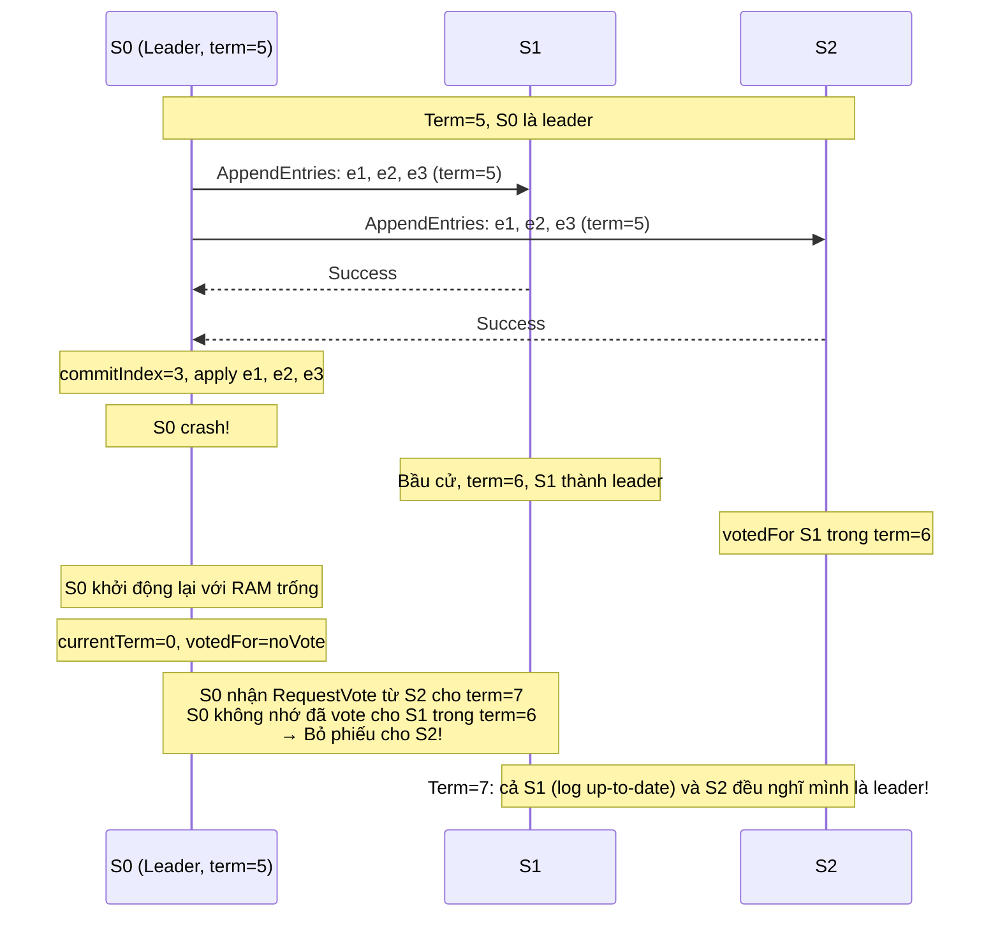
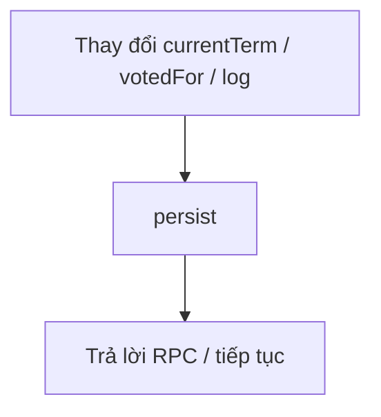
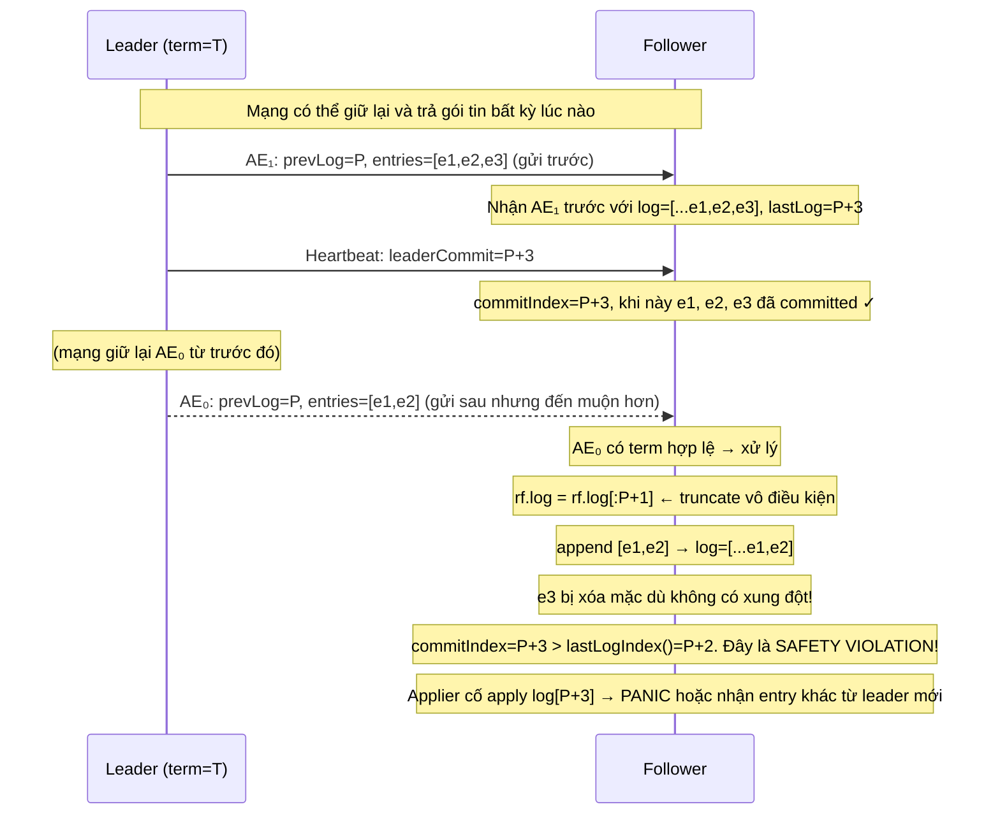
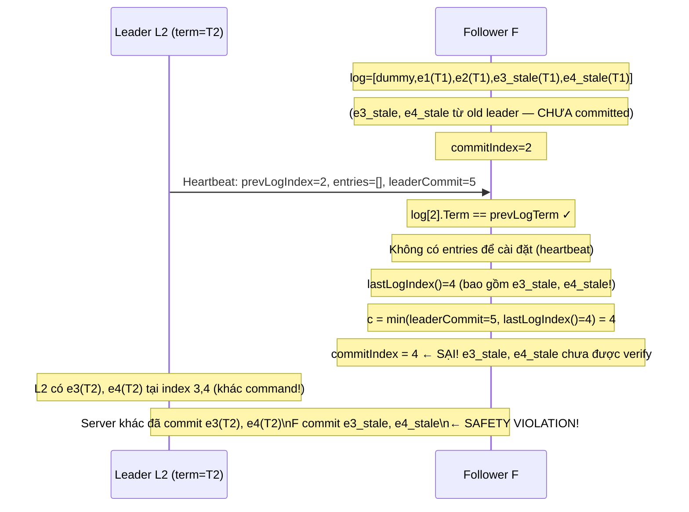

Ở bài trước (Lab 3B), chúng ta đã hoàn thiện cơ chế sao chép log: leader nhận lệnh, phân phối sang follower, đếm quorum, commit và apply vào state machine. Cluster giờ đây hoạt động đúng — **miễn là không có server nào crash**.

Nhưng crash là điều không thể tránh khỏi trong hệ thống phân tán thực tế. Khi server khởi động lại sau crash, nó mất toàn bộ trạng thái trong RAM. Nếu không có cơ chế ghi trạng thái ra đĩa, Raft sẽ vi phạm ngay các invariant cơ bản nhất:

- Server có thể bầu cho hai ứng viên khác nhau trong cùng một term.
- Server có thể quên đi các log entries đã committed và chấp nhận entries mâu thuẫn từ leader mới.
- Cluster có thể bị "nhớ nhầm" toàn bộ lịch sử đồng thuận.

Lab 3C giải quyết vấn đề này bằng **persistence**: ghi các trường quan trọng ra stable storage sau mỗi lần thay đổi, và đọc lại khi khởi động. Nhưng persistence chỉ là bước đầu — bài lab này còn ẩn chứa hai lỗi an toàn (safety bug) tinh vi chỉ xuất hiện dưới điều kiện mạng nhiễu với độ trễ và đảo thứ tự gói tin cao.

## 1. Tại sao cần Persistence?

### 1.1. Kịch bản không có persistence

Hãy tưởng tượng cluster 3 server: S0 (leader, term=5), S1, S2. Sequence xảy ra như sau:



Đây là vi phạm **election safety** — hai leader trong cùng một term. Hậu quả: commit entries xung đột nhau, cluster mất nhất quán.

### 1.2. Figure 2: Ba trường cần persist

Raft paper (Figure 2) chỉ định rõ ba trường phải được lưu ra stable storage trước khi phản hồi bất kỳ RPC nào:

| Trường | Lý do phải persist |
|--------|---------------------|
| `currentTerm` | Đảm bảo server không bao giờ chấp nhận RPC từ term cũ hơn sau khi restart. Nếu mất, server có thể bỏ phiếu cho hai ứng viên khác nhau trong cùng term. |
| `votedFor` | Đảm bảo server không bỏ phiếu hai lần trong cùng term. Nếu mất, có thể có hai leader. |
| `log` | Đảm bảo entries đã committed không bị mất. Nếu mất, server restart có thể nhận entries mâu thuẫn từ leader mới. |

### 1.3. Tại sao các trường khác không cần persist?

Đây là câu hỏi quan trọng không kém:

| Trường | Lý do KHÔNG cần persist |
|--------|--------------------------|
| `commitIndex` | Có thể tái xây dựng sau restart: leader sẽ cập nhật qua heartbeat. Sai giá trị ban đầu (0) chỉ có thể gây ra việc re-apply sau này — không gây mâu thuẫn. |
| `lastApplied` | Tương tự `commitIndex`. State machine phía trên chịu trách nhiệm idempotency nếu cần. |
| `nextIndex` | Chỉ tồn tại trên leader. Sau khi restart, server bắt đầu lại là follower — không cần. |
| `matchIndex` | Tương tự `nextIndex`. |

Quy tắc tổng quát: **các trường ảnh hưởng đến tính đúng đắn của bầu cử và tính nhất quán của log phải được persist. Các trường chỉ ảnh hưởng đến hiệu năng hoặc có thể tái xây dựng từ leader không cần persist**.

## 2. Triển khai persist() và readPersist()

### 2.1. persist()

Hàm `persist()` mã hóa ba trường dùng `labgob` (một binary encoder tương tự `encoding/gob`) và lưu vào `Persister`:

```go
func (rf *Raft) persist() {
    w := new(bytes.Buffer)
    e := labgob.NewEncoder(w)
    e.Encode(rf.currentTerm)
    e.Encode(rf.votedFor)
    e.Encode(rf.log)
    raftstate := w.Bytes()
    rf.persister.Save(raftstate, nil)
}
```

**Điểm quan trọng:**
- Thứ tự encode phải giống hệt thứ tự decode trong `readPersist`. Đây là chi tiết dễ sai.
- `rf.persister.Save(raftstate, nil)`: tham số thứ hai là snapshot (sẽ dùng ở 3D). Hiện tại để `nil`.
- **Caller phải giữ `rf.mu`** khi gọi `persist()` — vì nó đọc trạng thái Raft.

### 2.2. readPersist() — Với validation

`readPersist()` đọc và giải mã trạng thái được lưu. Nhưng nó cần validate kỹ trước khi áp dụng, vì blob có thể bị hỏng hoặc không hợp lệ:

```go
func (rf *Raft) readPersist(data []byte) {
    if len(data) < 1 { // Không có state: giữ nguyên defaults
        return
    }
    r := bytes.NewBuffer(data)
    d := labgob.NewDecoder(r)
    var term int
    var voted int
    var log []LogEntry
    if d.Decode(&term) != nil ||
        d.Decode(&voted) != nil ||
        d.Decode(&log) != nil {
        return // Blob bị hỏng: không áp dụng gì cả
    }
    // Invariant: log[0] luôn là dummy entry với Term=0.
    // Nếu vi phạm: blob không hợp lệ, giữ nguyên defaults.
    if len(log) < 1 || log[0].Term != 0 {
        return
    }
    rf.currentTerm = term
    rf.votedFor = voted
    rf.log = log
}
```

**Tại sao cần validate `log[0].Term == 0`?**

Raft implementation của chúng ta dùng index 0 như một dummy entry (term=0) để đơn giản hóa việc tính `PrevLogIndex`. Nếu blob được lưu bởi một phiên bản khác hoặc bị truncate giữa chừng, `log[0]` có thể có term khác 0 — nếu áp dụng nguyên, code sẽ panic ở `lastLogTerm()` hoặc các phép tính liên quan.

Nguyên tắc: **readPersist là all-or-nothing** — hoặc áp dụng toàn bộ blob hợp lệ, hoặc giữ nguyên defaults. Không có trạng thái nửa vời.

### 2.3. Thứ tự khởi tạo trong Make()

Thứ tự này quan trọng hơn bạn nghĩ:

```go
func Make(peers []*labrpc.ClientEnd, me int,
    persister *tester.Persister, applyCh chan raftapi.ApplyMsg) raftapi.Raft {
    // ...
    rf := &Raft{}
    rf.peers = peers
    rf.persister = persister
    rf.me = me

    // Bước 1: Đặt defaults TRƯỚC — bao gồm dummy log[0]
    rf.currentTerm = 0
    rf.votedFor = noVote
    rf.role = RoleFollower
    rf.log = []LogEntry{{Term: 0}} // ← dummy entry, PHẢI có trước readPersist
    rf.commitIndex = 0
    rf.lastApplied = 0

    // Bước 2: Overlay durable state lên trên defaults
    rf.readPersist(persister.ReadRaftState())

    // Bước 3: Reset election timer SAU khi có state đầy đủ
    rf.mu.Lock()
    rf.resetElectionTimerLocked()
    rf.mu.Unlock()

    go rf.ticker()
    go rf.applier(applyCh)

    return rf
}
```

**Tại sao phải đặt defaults trước?** Nếu `readPersist` được gọi với blob rỗng hoặc bị hỏng, nó trả về ngay mà không thay đổi gì. Nếu chưa có defaults, `rf.log` sẽ là `nil` — code sẽ panic ngay khi `lastLogTerm()` được gọi lần đầu.

Thứ tự đúng: **defaults → readPersist → timer reset**.

## 3. Khi nào gọi persist()

Đây là phần dễ bị bỏ sót nhất. Quy tắc: **gọi `persist()` ngay sau bất kỳ thay đổi nào đến `currentTerm`, `votedFor`, hoặc `log`, trước khi trả lời bất kỳ RPC nào**.



Các điểm cụ thể trong code:

### 3.1. becomeFollower() — khi term tăng

```go
func (rf *Raft) becomeFollower(newTerm int) {
    if newTerm < rf.currentTerm {
        return
    }
    if newTerm > rf.currentTerm {
        rf.currentTerm = newTerm
        rf.votedFor = noVote
        rf.persist() // ← currentTerm và votedFor đều thay đổi
    }
    rf.role = RoleFollower
    // Khi newTerm == currentTerm: chỉ hạ role, không thay đổi durable state
    // → KHÔNG cần persist
}
```

**Chi tiết quan trọng:** Khi `newTerm == currentTerm`, chỉ có `role` thay đổi (ví dụ: Candidate → Follower). `role` không phải trường durable, nên không cần `persist()`. Gọi `persist()` không cần thiết gây ra I/O dư thừa và làm chậm hệ thống.

### 3.2. RequestVote() — khi vote được cấp

```go
func (rf *Raft) RequestVote(args *RequestVoteArgs, reply *RequestVoteReply) {
    // ... kiểm tra term, kiểm tra log up-to-date ...
    if rf.votedFor == noVote || rf.votedFor == args.CandidateId {
        rf.votedFor = args.CandidateId
        reply.VoteGranted = true
        rf.resetElectionTimerLocked()
        rf.persist() // ← votedFor thay đổi
    }
}
```

### 3.3. AppendEntries() — khi entries được cài đặt

```go
func (rf *Raft) AppendEntries(args *AppendEntriesArgs, reply *AppendEntriesReply) {
    // ... kiểm tra term, kiểm tra PrevLog ...
    // Cài đặt entries
    // Cập nhật commitIndex
    reply.Success = true
    rf.persist() // ← log có thể đã thay đổi (hoặc term qua becomeFollower)
}
```

### 3.4. startElection() — khi term tăng để bầu cử

```go
func (rf *Raft) startElection() {
    rf.mu.Lock()
    // ...
    rf.currentTerm++       // term thay đổi
    rf.role = RoleCandidate
    rf.votedFor = rf.me    // votedFor thay đổi
    rf.resetElectionTimerLocked()
    rf.persist()           // ← persist ngay sau khi thay đổi
    // ...
}
```

### 3.5. Start() — khi leader append entry mới

```go
func (rf *Raft) Start(command interface{}) (int, int, bool) {
    // ...
    rf.log = append(rf.log, LogEntry{Term: rf.currentTerm, Command: command}) // log thay đổi
    // ...
    rf.persist() // ← persist ngay
    // ...
}
```

## 4. Safety Violation Bug #1: Stale AppendEntries truncating committed entries

Đây là lỗi nguy hiểm nhất mà tôi gặp trong lab này. Nó không bao giờ xuất hiện với mạng đơn giản, chỉ xảy ra khi bật `SetLongReordering(true)` — cho phép mạng giữ lại và trả gói tin theo thứ tự bất kỳ.

### 4.1. Cách append always-truncate và vấn đề của nó

Implementation 3B của chúng ta append entries theo cách đơn giản nhất: luôn truncate log về `PrevLogIndex+1` trước khi append:

```go
// ❌ Code có lỗi: luôn truncate, không kiểm tra xung đột
rf.log = rf.log[:args.PrevLogIndex+1]
if len(args.Entries) > 0 {
    toAppend := make([]LogEntry, len(args.Entries))
    copy(toAppend, args.Entries)
    rf.log = append(rf.log, toAppend...)
}
```

Cách này hoạt động đúng khi mạng reliable: AE luôn đến theo thứ tự, mỗi AE kế tiếp mang nhiều entries hơn hoặc bằng AE trước. Truncate về `PrevLogIndex+1` không bao giờ xóa entries đã committed vì leader chỉ advance `nextIndex` sau khi nhận success — AE mới nhất luôn bao phủ toàn bộ phần đã replicated.

Vấn đề xuất hiện khi mạng có thể giữ lại và trả gói tin theo thứ tự bất kỳ: một AE cũ hơn (mang ít entries hơn) có thể đến **sau** AE mới hơn. Khi đó, truncate vô điều kiện về `PrevLogIndex+1` sẽ xóa các entries mà AE mới hơn đã cài đặt — kể cả entries đã committed.

### 4.2. Kịch bản dẫn đến safety violation



Kết quả: server F có `commitIndex=P+3` nhưng `len(log)=P+2`. Applier cố apply entry tại index `P+3` — nhưng entry đó không tồn tại. Code có thêm một guard `if rf.commitIndex > rf.lastLogIndex() { rf.commitIndex = rf.lastLogIndex() }` để tránh panic này, nhưng guard đó chỉ che giấu triệu chứng: commitIndex bị kéo xuống P+2 thay vì giữ đúng P+3. Sau đó, khi leader mới gửi entry khác tại index P+3, follower apply một command khác tại cùng index — mâu thuẫn với những gì server khác đã apply.

Lỗi test: `apply error: commit index=42 server=4 4625 != server=1 5601` — hai server apply lệnh khác nhau tại cùng một index.

### 4.3. Tại sao always-truncate gây ra safety violation?

Lưu ý: AE₀ đến **sau** AE₁ về mặt thời gian nhận, nhưng có **cùng term** với AE₁ vì cùng một leader gửi. Check stale-term (`args.Term < rf.currentTerm`) không lọc được nó.

Always-truncate giả định ngầm rằng leader luôn biết follower đang ở đâu và gửi đúng những gì cần bổ sung. Nhưng leader snapshot `nextIndex` tại **thời điểm gửi** — nếu mạng giữ AE₀ (entries=[e1,e2]) cho đến khi AE₁ (entries=[e1,e2,e3]) đã đến trước, follower đã có log đúng với đầy đủ e1, e2, e3. Khi AE₀ đến muộn, truncate vô điều kiện về `PrevLogIndex+1` rồi append [e1,e2] sẽ xóa e3 — mặc dù e3 đã được committed.

Đây là đặc trưng của mạng unreliable: gói tin có thể đến trễ, đảo thứ tự, nhưng vẫn có term hợp lệ. Raft phải hoạt động đúng dưới điều kiện này.

### 4.4. Fix: Cài đặt đúng theo Figure 2

Figure 2 của Raft paper nói rõ hai quy tắc:
- **Rule 3**: Nếu một entry hiện tại xung đột với entry mới (cùng index, khác term) → xóa entry đó và tất cả entry sau.
- **Rule 4**: Append các entry mới chưa có trong log.

Hai quy tắc này chỉ đề cập đến **xung đột** (khác term). Nếu entry đã tồn tại với cùng term, không làm gì cả. Không có quy tắc nào nói "truncate log về prevLogIndex + len(entries)".

```go
// ✅ Code đúng: chỉ truncate khi có xung đột thực sự
if len(args.Entries) > 0 {
    for j, entry := range args.Entries {
        idx := args.PrevLogIndex + 1 + j
        if idx >= len(rf.log) {
            // Qua cuối log: append các entries còn lại và dừng.
            rf.log = append(rf.log, args.Entries[j:]...)
            break
        }
        if rf.log[idx].Term != entry.Term {
            // Xung đột: truncate tại điểm phân kỳ, append entries còn lại.
            rf.log = append(rf.log[:idx], args.Entries[j:]...)
            break
        }
        // Entry đã có với cùng term: bỏ qua (không làm gì).
    }
}
```

Với fix này, kịch bản AE₀ đến trễ:
- j=0: idx=P+1, `log[P+1].Term == e1.Term` → bỏ qua
- j=1: idx=P+2, `log[P+2].Term == e2.Term` → bỏ qua
- j=2 = len(entries) → vòng lặp kết thúc tự nhiên
- **Không có truncation. Log và commitIndex giữ nguyên.** ✓

### 4.5. Tại sao lỗi này chỉ xuất hiện với SetLongReordering?

Với mạng reliable hoặc chỉ có độ trễ ngắn:
- AEs thường đến theo thứ tự. AE₀ đến trước AE₁.
- Khi AE₀ đến trước và commitIndex chưa được set cao, truncation xảy ra nhưng không có hại (không xóa entries đã commit).

Với `SetLongReordering(true)`:
- Mạng có thể giữ AE₀ lại hàng giây rồi mới trả.
- Trong thời gian đó, AE₁ và heartbeat đã đến, committed entries đã được apply.
- Khi AE₀ đến, truncation gây ra safety violation.

## 5. Safety Violation Bug #2: commitIndex formula sai khi dùng lastLogIndex()

### 5.1. Vấn đề với công thức sai

Phiên bản naive của rule 5 (cập nhật commitIndex trên follower):

```go
// ❌ Code sai: dùng lastLogIndex() thay vì lastNewEntry
if args.LeaderCommit > rf.commitIndex {
    last := rf.lastLogIndex()
    c := args.LeaderCommit
    if c > last {
        c = last
    }
    rf.commitIndex = c
}
// Guard thêm vào để tránh panic của applier khi always-truncate thu nhỏ log
if rf.commitIndex > rf.lastLogIndex() {
    rf.commitIndex = rf.lastLogIndex()
}
```

Nghe có vẻ đúng: không commit quá những gì có trong log. Guard cuối được thêm vào để tránh panic của applier khi always-truncate (Bug #1) thu nhỏ log xuống dưới commitIndex. Nhưng đây chỉ là vá triệu chứng — và đây là vi phạm an toàn tinh vi.

### 5.2. Kịch bản vi phạm



Vấn đề: follower có thể có các entries "thừa" từ old leader ở cuối log (từ trước khi leader hiện tại lên nắm quyền). Heartbeat từ leader mới chỉ verify đến `PrevLogIndex` — các entries sau đó chưa được verify. Dùng `lastLogIndex()` là commit vào vùng chưa xác minh.

### 5.3. Fix: Công thức đúng

Công thức đúng là: **"last new entry" = index cao nhất được xác minh bởi AE này** = `PrevLogIndex + len(Entries)`.

```go
// ✅ Code đúng
// lastNewEntry: index cao nhất được xác minh bởi prevLog check của AE này.
// Chỉ các entries ≤ lastNewEntry mới được đảm bảo nhất quán với leader.
lastNewEntry := args.PrevLogIndex + len(args.Entries)
if args.LeaderCommit > rf.commitIndex && lastNewEntry > rf.commitIndex {
    c := args.LeaderCommit
    if c > lastNewEntry {
        c = lastNewEntry
    }
    rf.commitIndex = c
}
```

**Giải thích:**
- Với heartbeat (`len(Entries)=0`): `lastNewEntry = PrevLogIndex`. Nếu `PrevLogIndex < commitIndex`, điều kiện `lastNewEntry > rf.commitIndex` là false → không thay đổi commitIndex. Đúng — chúng ta không biết gì thêm về entries sau `PrevLogIndex`.
- Với AE thực: `lastNewEntry = PrevLogIndex + len(Entries)` = index của entry cuối cùng được cài đặt. Các entries ≤ lastNewEntry đều đã được xác minh bởi chain prevLog checks. An toàn để commit đến đây.

**Điều kiện kép `lastNewEntry > rf.commitIndex`**: đảm bảo heartbeat cũ (stale heartbeat) không làm commitIndex quay lùi. Nếu heartbeat có `PrevLogIndex=P` nhưng follower đã commit đến index `Q > P`, không làm gì cả.

### 5.4. Tại sao hai lỗi này liên kết với nhau?

Thực ra, code 3B cũ của chúng ta cũng dùng **always-truncate** và `lastLogIndex()` — và hai cách đó tạo thành một cặp nhất quán:
- Sau khi always-truncate, `lastLogIndex() = PrevLogIndex + len(Entries) = lastNewEntry`.
- Vậy `lastLogIndex()` và `lastNewEntry` cho kết quả giống nhau trong code cũ.

Điều đó có nghĩa là: với always-truncate, Bug #2 **không xuất hiện** — `lastLogIndex()` và `lastNewEntry` tương đương nhau. Bug #2 chỉ lộ ra **sau khi** Bug #1 được fix.

Khi chúng ta chuyển từ always-truncate sang "chỉ truncate khi có xung đột thực sự", `lastLogIndex()` không còn bằng `lastNewEntry` nữa — follower có thể có stale entries từ old leader sau `PrevLogIndex`. Lúc này, dùng `lastLogIndex()` là commit vào vùng chưa xác minh → safety violation.

Hai bug này là một cặp coupled:
- always-truncate + `lastLogIndex()` → code cũ của chúng ta: Bug #2 bị che giấu, nhưng Bug #1 vẫn còn (safety violation với reordering).
- only-truncate-on-conflict + `lastLogIndex()` → fix Bug #1 nhưng expose Bug #2.
- only-truncate-on-conflict + `lastNewEntry` → fix cả hai.

## 6. Election Timer Reset: trước hay sau consistency check?

### 6.1. Hai cách

Có hai cách xử lý election timer trong `AppendEntries`:

**Cách 1 (Conservative — reset chỉ khi thành công):**
```go
// ❌ Code cũ: reset timer chỉ sau khi thành công
// → KHÔNG reset khi consistency check fail
// ... kiểm tra PrevLog, cài đặt entries, cập nhật commitIndex ...
reply.Success = true
rf.resetElectionTimerLocked() // ← chỉ được gọi khi đã thành công
rf.persist()
```

**Cách 2 (Aggressive — reset ngay khi term hợp lệ):**
```go
// Nhận AppendEntries với term >= currentTerm → biết có leader đang active
// → reset ngay để ngăn bầu cử không cần thiết trong lúc đang sync log
rf.becomeFollower(args.Term)
rf.resetElectionTimerLocked() // ← reset TRƯỚC consistency check
// ... tiếp tục kiểm tra PrevLog, cài đặt entries ...
```

### 6.2. Cách nào đúng?

Raft paper §5.2 nói: _"A server remains in follower state as long as it receives valid RPCs from a leader or candidate."_

Khi follower nhận AppendEntries với `args.Term >= currentTerm`, nó **biết có leader đang hoạt động**. Dù consistency check có fail hay không, leader vẫn đang sống và đang cố gắng sync log. Không có lý do để bắt đầu bầu cử — đó sẽ là bầu cử vô ích, gây disruption.

**Cách 2 (reset sớm) là đúng về mặt ngữ nghĩa** và quan trọng cho liveness trong điều kiện mạng nhiễu cao. Với `SetLongReordering(true)`:
- Leader gửi AE với `PrevLogIndex` chưa đúng → follower reject, nhưng leader đang sống.
- Nếu không reset timer, follower có thể bắt đầu bầu cử → gây disruption không cần thiết.
- Election mới → leader mới phải rebuild log sync từ đầu → liveness giảm.

### 6.3. Ảnh hưởng đến test

Test `TestFigure8Unreliable3C` tạo kịch bản ngắn nhất để khai thác điều này: 5 server, mạng nhiễu cao, nhiều lần phân vùng. Với reset timer chỉ khi thành công, elections không cần thiết xảy ra thường xuyên hơn, đôi khi vượt quá giới hạn 10 giây của `ts.one()`.

## 7. Bức tranh hoàn chỉnh: AppendEntries Handler sau 3C

Dưới đây là implementation đầy đủ sau khi áp dụng tất cả các fix:

```go
func (rf *Raft) AppendEntries(args *AppendEntriesArgs, reply *AppendEntriesReply) {
    rf.mu.Lock()
    defer rf.mu.Unlock()

    // Rule 1: Từ chối nếu leader đang dùng term cũ.
    if args.Term < rf.currentTerm {
        reply.Term = rf.currentTerm
        reply.Success = false
        return
    }

    // Adopt leader's term, step down nếu cần.
    rf.becomeFollower(args.Term)
    reply.Term = rf.currentTerm

    // Reset election timer ngay — chúng ta biết có leader đang active.
    // Điều này ngăn bầu cử không cần thiết trong lúc đang sync log.
    rf.resetElectionTimerLocked()

    // Rule 2: Kiểm tra PrevLogIndex có trong log không.
    if args.PrevLogIndex < 0 || args.PrevLogIndex >= len(rf.log) {
        reply.Success = false
        reply.ConflictTerm = -1
        reply.ConflictIndex = len(rf.log) // Leader biết follower thiếu bao nhiêu
        return
    }

    // Rule 3: Kiểm tra term tại PrevLogIndex.
    if rf.log[args.PrevLogIndex].Term != args.PrevLogTerm {
        reply.Success = false
        ct := rf.log[args.PrevLogIndex].Term
        reply.ConflictTerm = ct
        idx := args.PrevLogIndex
        for idx > 0 && rf.log[idx-1].Term == ct {
            idx-- // Tìm đầu block có cùng term
        }
        reply.ConflictIndex = idx
        return
    }

    // Rule 3-4 (Figure 2): Cài đặt entries đúng cách.
    // CHỈ truncate khi có xung đột thực sự (khác term).
    // Entries đã có với cùng term → bỏ qua (không truncate).
    if len(args.Entries) > 0 {
        for j, entry := range args.Entries {
            idx := args.PrevLogIndex + 1 + j
            if idx >= len(rf.log) {
                // Qua cuối log: append remaining.
                rf.log = append(rf.log, args.Entries[j:]...)
                break
            }
            if rf.log[idx].Term != entry.Term {
                // Xung đột: truncate và append remaining.
                rf.log = append(rf.log[:idx], args.Entries[j:]...)
                break
            }
            // Entry khớp: bỏ qua.
        }
    }

    // Rule 5: Cập nhật commitIndex.
    // lastNewEntry = index cao nhất được xác minh bởi AE này.
    // KHÔNG dùng lastLogIndex() vì follower có thể có entries stale sau prevLogIndex.
    lastNewEntry := args.PrevLogIndex + len(args.Entries)
    if args.LeaderCommit > rf.commitIndex && lastNewEntry > rf.commitIndex {
        c := args.LeaderCommit
        if c > lastNewEntry {
            c = lastNewEntry
        }
        rf.commitIndex = c
    }

    reply.Success = true
    rf.persist() // Log có thể đã thay đổi
}
```

## 8. Các test cases của 3C

### 8.1. Unit tests (TDD)

Trước khi chạy integration tests, chúng tôi viết unit tests để validate từng invariant:

**Persistence round-trip:**
```go
// TestPersistReadPersistRoundTrip3C: encode → decode phải cho kết quả giống nhau
func TestPersistReadPersistRoundTrip3C(t *testing.T) {
    p := tester.MakePersister()
    src := &Raft{
        persister: p, currentTerm: 7, votedFor: 2,
        log: []LogEntry{{Term: 0}, {Term: 3, Command: 100}, {Term: 7, Command: "hello"}},
    }
    src.persist()
    dst := &Raft{currentTerm: 0, votedFor: noVote, log: []LogEntry{{Term: 0}}}
    dst.readPersist(p.ReadRaftState())
    // Kiểm tra dst.currentTerm==7, dst.votedFor==2, dst.log==src.log
}
```

**readPersist là no-op với blob rỗng hoặc bị hỏng:**
```go
func TestReadPersistEmpty3C(t *testing.T) {
    rf := &Raft{currentTerm: 5, votedFor: 1, log: ...}
    rf.readPersist(nil)   // Phải giữ nguyên
    rf.readPersist([]byte{})  // Phải giữ nguyên
}

func TestReadPersistCorrupt3C(t *testing.T) {
    rf := &Raft{currentTerm: 9, ...}
    rf.readPersist([]byte{0xff, 0xfe, 0xfd}) // Blob hỏng → no-op
}
```

**persist() được gọi đúng lúc:**
```go
func TestBecomeFollowerHigherTermPersists3C(t *testing.T) {
    // Sau becomeFollower(5): Persister phải có term=5, votedFor=noVote
}

func TestBecomeFollowerSameTermDoesNotWritePersister3C(t *testing.T) {
    // becomeFollower(currentTerm): Persister phải trống (không persist dư thừa)
}
```

**Stale heartbeat không được thay đổi log hay commitIndex:**
```go
func TestAppendEntriesHeartbeatPrevBelowCommitIndex3C(t *testing.T) {
    // Heartbeat với prevLogIndex < commitIndex: phải thành công
    // nhưng log và commitIndex phải giữ nguyên
}
```

### 8.2. Integration tests

| Test | Mô tả | Điều kiện pass |
|------|-------|----------------|
| `TestPersist13C` | Server crash và restart trong khi đang replication | Sau restart, server sync lại đúng log và tiếp tục hoạt động |
| `TestPersist23C` | Nhiều server crash đồng thời trong cluster 5 node | Cluster vẫn commit entries sau khi đa số server restart |
| `TestPersist33C` | Leader và một follower crash đồng thời, leader restart | Raft bầu leader mới, crash recovery đúng |
| `TestFigure83C` | Kịch bản Figure 8 từ Raft paper (mạng reliable) | Không có safety violation |
| `TestUnreliableAgree3C` | Đồng thuận dưới mạng không đáng tin cậy | Tất cả entries cuối cùng được commit |
| `TestFigure8Unreliable3C` | Figure 8 với mạng unreliable, reordering, long delays | **Test khó nhất** — không được có apply error |

### 8.3. TestFigure8Unreliable3C — Test thách thức nhất

Test này tạo ra kịch bản ngặt nghèo nhất:
1. Cluster 5 server.
2. Mạng với reordering, long delays, và packet loss.
3. Nhiều lần phân vùng và kết nối lại.
4. Mỗi lần phân vùng, submit commands liên tục.
5. Cuối cùng kết nối tất cả và kiểm tra mọi server đồng thuận.

Test này **đồng thời** kiểm tra:
- **Safety**: không có hai server apply lệnh khác nhau tại cùng index.
- **Liveness**: cluster cuối cùng phải đạt đồng thuận trong vòng 10 giây.

Nếu thiếu bất kỳ fix nào trong số ba fix đã trình bày ở trên, test này sẽ fail:
- Thiếu fix stale AE → safety violation (apply error).
- Thiếu fix commitIndex formula → safety violation (apply error).
- Thiếu early timer reset → liveness failure (timeout).

## 9. Debugging Tips cho 3C

### 9.1. Phân biệt safety failure và liveness failure

**Safety failure** (nguy hiểm nhất):
```
apply error: commit index=42 server=4 4625 != server=1 5601
```
Hai server apply lệnh khác nhau tại cùng index. **Đây là violation không thể chấp nhận** — Raft bị broken hoàn toàn.

**Liveness failure** (nghiêm trọng nhưng khác bản chất):
```
one(2000) failed to reach agreement
```
Cluster không đạt được đồng thuận trong 10 giây. Có thể do bầu cử quá thường xuyên, leader không ổn định, hoặc log sync quá chậm.

### 9.2. Reproduce deterministic

Lỗi trong 3C thường không deterministic — chỉ xuất hiện 1 trong 10 lần chạy. Để reproduce:

```bash
# Chạy 20 lần với timeout đủ rộng
go test -run TestFigure8Unreliable3C -count=20 -timeout 1200s
```

Nếu lỗi chỉ xuất hiện 1-2/20 lần, hãy tập trung vào các kịch bản reordering và tìm invariant nào bị vi phạm từ apply error.

### 9.3. Kiểm tra commitIndex formula

Thêm assert tạm thời vào cuối `AppendEntries`:
```go
// Debug assert: commitIndex không được vượt quá lastLogIndex
if rf.commitIndex > rf.lastLogIndex() {
    panic(fmt.Sprintf("commitIndex %d > lastLogIndex %d after AE from %d",
        rf.commitIndex, rf.lastLogIndex(), args.LeaderId))
}
```

Nếu panic này xảy ra, commitIndex formula sai.

### 9.4. Kiểm tra stale AE truncation

Thêm assert trước khi truncate:
```go
// Debug: không được truncate entry đã committed
if idx <= rf.commitIndex {
    panic(fmt.Sprintf("about to truncate committed entry at %d (commitIndex=%d)",
        idx, rf.commitIndex))
}
```

## 10. Các lỗi thường gặp khác trong 3C

### 10.1. Persist thừa hoặc thiếu

**Thiếu persist**: thường lộ ra ở `TestPersist*` — server restart không khôi phục đúng trạng thái.

```go
// ❌ Quên persist sau khi vote
if rf.votedFor == noVote || rf.votedFor == args.CandidateId {
    rf.votedFor = args.CandidateId
    reply.VoteGranted = true
    rf.resetElectionTimerLocked()
    // persist() bị quên → sau crash, votedFor mất → có thể vote hai lần
}
```

**Persist thừa**: gây I/O dư thừa nhưng không gây incorrect behavior. Lỗi phổ biến nhất là persist trong `becomeFollower` kể cả khi term không đổi:

```go
// ❌ Persist không cần thiết
func (rf *Raft) becomeFollower(newTerm int) {
    if newTerm >= rf.currentTerm {
        rf.currentTerm = newTerm // Nếu newTerm==currentTerm, currentTerm không đổi
        rf.votedFor = noVote     // Nếu newTerm==currentTerm, không nên clear votedFor!
        rf.persist()             // Persist không cần thiết + sai logic
    }
    rf.role = RoleFollower
}
```

Cần kiểm tra `newTerm > rf.currentTerm` trước khi clear `votedFor` và persist.

### 10.2. readPersist không validate dummy entry

```go
// ❌ Thiếu validation
func (rf *Raft) readPersist(data []byte) {
    // ... decode ...
    // Nếu blob có log[0].Term != 0, áp dụng ngay → panic sau đó
    rf.currentTerm = term
    rf.votedFor = voted
    rf.log = log
}
```

Luôn kiểm tra `len(log) >= 1 && log[0].Term == 0` trước khi áp dụng.

### 10.3. Race condition giữa readPersist và initLeaderReplicationLocked

Sau khi restart và đọc log từ persisted state, nếu server nhanh chóng trở thành leader và `initLeaderReplicationLocked` được gọi:

```go
func (rf *Raft) initLeaderReplicationLocked() {
    next := rf.lastLogIndex() + 1
    // next phải phản ánh log đã được restore từ persisted state
    // nếu readPersist chưa hoàn tất, next = 1 (chỉ có dummy)
    // → leader sẽ gửi thiếu entries
}
```

Đảm bảo `readPersist` hoàn tất và `rf.log` được set đúng trước khi bất kỳ goroutine nào được start.

## Lời kết

Lab 3C mang lại hai bài học quan trọng ngoài việc triển khai persistence đơn thuần.

**Bài học 1: Mạng unreliable là nguồn của lỗi ẩn**. Hai lỗi safety viloation mà chúng tôi gặp — stale AE truncation và sai commitIndex formula — đều không xuất hiện với mạng reliable. Chỉ khi mạng có thể giữ lại, đảo thứ tự, và trả gói tin bất ngờ, các corner cases mới lộ ra. Đây là lý do tại sao distributed systems testing khác biệt về chất với unit testing thông thường.

**Bài học 2: Figure 2 là specification chính xác**. Mọi implementation bug đều có thể truy vết về việc không tuân thủ đúng một quy tắc nào đó trong Figure 2. Lỗi always-truncate không phải vì Figure 2 mơ hồ — mà vì Figure 2 nói rõ "only if existing entry conflicts" nhưng code truncate vô điều kiện thay vì kiểm tra xung đột trước. Đọc kỹ specification và implement đúng từng chữ là cách tốt nhất để tránh những lỗi như thế này.

Những điểm chính cần ghi nhớ từ 3C:

- **Persist ba trường (currentTerm, votedFor, log) và chỉ ba trường đó**: đây là điều kiện cần và đủ cho Raft safety sau crash.
- **readPersist là all-or-nothing**: validate trước khi áp dụng, không để trạng thái nửa vời.
- **Thứ tự trong Make(): defaults → readPersist → timer reset**: không bao giờ để log=nil khi timer goroutine bắt đầu.
- **Stale AE chỉ truncate khi có xung đột thực sự**: nếu entry đã tồn tại với cùng term, bỏ qua — đừng truncate log.
- **commitIndex trên follower = min(leaderCommit, lastNewEntry)**: không dùng lastLogIndex() — follower có thể có stale entries chưa được verify.
- **Reset election timer khi có AE với term hợp lệ, bất kể consistency check**: ngăn bầu cử không cần thiết trong lúc đang sync log.

Ở phần tiếp theo (Lab 3D), chúng ta sẽ thêm **snapshot** — cơ chế cắt bỏ phần log đã cũ để tránh log tăng trưởng vô hạn. Persistence đã xây dựng ở đây sẽ được mở rộng để lưu cả snapshot cùng với log.
