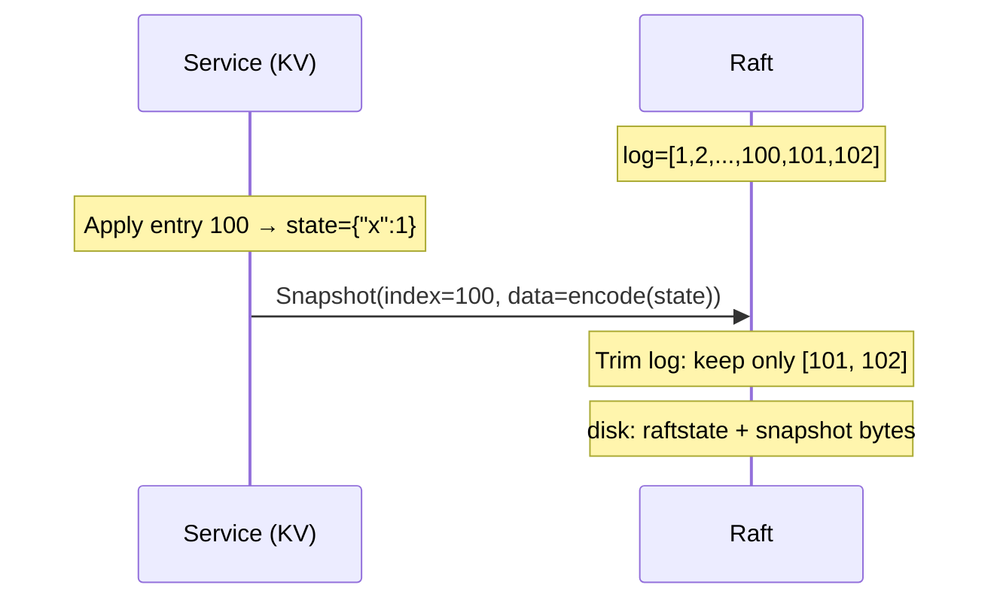

In the previous posts (Labs 3B and 3C), we built log replication and persistence. The Raft cluster can now commit entries, survive crashes, and recover to the correct state. But one serious problem remains: **the log only grows, never shrinks**.

In a service running continuously for years, the log can accumulate millions of entries. When a server restarts, it must replay the entire log from the beginning — which can take minutes or hours. Disk space will also gradually run out. Lab 3D solves this with **log compaction via snapshots**.

## 1. Why Snapshots?

### 1.1. The Lifecycle of a Log Entry

Consider a KV server using Raft as its consensus layer. The command `Set("x", 1)` is committed at index 100. From a correctness standpoint, this entry can be deleted from the log **after it has been applied to the state machine** — because the state machine itself (the dict `{"x": 1}`) already carries that information. There is no need to replay from entry 1 if we have a snapshot of the state machine at index 100.

### 1.2. What Is a Snapshot?

A snapshot is a **complete image of the state machine** at a specific point in time (at a specific log index). Once we have a snapshot at index `X`, Raft can delete all entries `<= X` from the log — that information has been "stored" in the snapshot.



### 1.3. When a Follower Falls Behind

The problem arises when a follower disconnects for an extended period. The leader has compacted the log up to index 100, but the follower only has log entries up to index 50. The leader no longer has entries 51–100 to send via `AppendEntries`. The solution: the leader sends the **entire snapshot** to the follower via a new RPC: `InstallSnapshot`.

## 2. Mental Model: Two Index Layers

Before writing code, one convention must be established: **logical index** and **physical index** are two different things.

### 2.1. Logical vs Physical Index

| Concept | Meaning |
|---------|---------|
| **Logical index** (Raft log index) | Never resets; increases from 1 to ∞. This is the `CommandIndex` in `ApplyMsg`, the `PrevLogIndex` in RPCs. |
| **Physical index** (slice index) | Position in `rf.log[]` — changes when the log is trimmed. `rf.log[0]` is always a dummy entry (term=0). |

### 2.2. Two New Fields: `snapLastIdx` and `snapLastTerm`

```go
snapLastIdx  int // highest logical index covered by the current snapshot (0 = no snapshot yet)
snapLastTerm int // term of the entry at snapLastIdx
```

Initialized to `(0, 0)` — "never compacted". This is a sentinel, not a real entry (real entries start at index 1).

### 2.3. Conversion Formulas

```
logicalIndex(k) = snapLastIdx + k          // slice k → logical
sliceIndex(L)   = L - snapLastIdx          // logical L → slice
```

**Derived helpers:**

```go
// Smallest logical index still in log
func (rf *Raft) firstLogIndex() int {
    return rf.snapLastIdx + 1
}

// Largest logical index
func (rf *Raft) lastLogIndex() int {
    if len(rf.log) == 0 {
        return rf.snapLastIdx
    }
    return rf.snapLastIdx + len(rf.log) - 1
}

// Term of the entry at logical index L
func (rf *Raft) logTerm(logical int) int {
    if logical == rf.snapLastIdx {
        return rf.snapLastTerm // entry is in the snapshot; use metadata
    }
    phy := logical - rf.snapLastIdx
    return rf.log[phy].Term
}
```

**Worked example:** Snapshotted through logical index 100 (`snapLastIdx=100`, `snapLastTerm=4`). In-memory log: `[dummy][entry101][entry102][entry103]` (len=4).

- `firstLogIndex()` = 101
- `lastLogIndex()` = 100 + 4 - 1 = 103
- `logTerm(100)` = `snapLastTerm` = 4 (no slice access needed)
- `logTerm(102)` = `rf.log[102-100]` = `rf.log[2].Term`

**Before the first compaction:** `snapLastIdx==0` → `logicalIndex(k) = k`, identical to 3B/3C behavior — no regression.

All code uses `lastLogIndex()`, `logTerm()`, and `firstLogIndex()` instead of direct slice access. This refactor is the most important baseline step: running all 3A/3B/3C tests must still pass after this change.

## 3. `Snapshot()`: Trim the Log and Persist

When the service has applied a batch of entries and produced a snapshot, it calls:

```go
Snapshot(index int, snapshot []byte)
```

- `index`: the highest logical index reflected in the snapshot.
- `snapshot`: bytes encoded by the service (state machine state).

### 3.1. Validation Before Trimming

```go
func (rf *Raft) Snapshot(index int, snapshot []byte) {
    rf.mu.Lock()
    defer rf.mu.Unlock()

    if snapshot == nil { return }
    if index < rf.snapLastIdx { return } // stale: already compacted further
    if index > rf.commitIndex || index > rf.lastApplied { return }
    if index > rf.lastLogIndex() || index < 1 { return }
    phy := index - rf.snapLastIdx
    if phy < 1 || phy >= len(rf.log) { return }

    // Same index: only refresh snapshot bytes
    if index == rf.snapLastIdx {
        rf.snapshot = append([]byte(nil), snapshot...)
        rf.persist()
        return
    }
    // ...trim...
}
```

**The condition `index <= commitIndex && index <= lastApplied`:** do not snapshot entries that have not been committed or applied — the state machine does not yet include those entries, so the snapshot would be inconsistent.

### 3.2. The Compaction Core: Trim the Slice and Free Memory

```go
newTerm := rf.log[phy].Term
trimmed := append([]LogEntry(nil), rf.log[phy+1:]...)
rf.log = append([]LogEntry{{Term: 0}}, trimmed...)
rf.snapLastIdx = index
rf.snapLastTerm = newTerm
rf.snapshot = append([]byte(nil), snapshot...)

rf.persist()
```

**Line by line:**

- `newTerm := rf.log[phy].Term`: read the term of entry `index` **before** removing it — we need it in `snapLastTerm` so that a future `AppendEntries` for entry `index+1` can verify `prevLogTerm`.
- `trimmed := append([]LogEntry(nil), rf.log[phy+1:]...)`: create a **new backing array** — no pointer to the discarded prefix, so the Go GC can reclaim it.
- `rf.log = append([]LogEntry{{Term: 0}}, trimmed...)`: restore the invariant "dummy at position 0"; remaining entries start at slice index 1.

**Worked example:** `snapLastIdx=0`, log = `[dummy, e1, e2, e3, e4, e5]`. Call `Snapshot(index=3)`:
- `phy = 3 - 0 = 3`
- `newTerm = rf.log[3].Term`
- `trimmed` = `[e4, e5]`
- New `rf.log` = `[dummy, e4, e5]`
- `snapLastIdx=3`, `firstLogIndex()=4`
- Verification: `logTerm(4) = rf.log[4-3] = rf.log[1].Term` ✓

## 4. Persist with Snapshots

### 4.1. The Problem: Never Overwrite a Snapshot on Disk

Before Lab 3D, `persist()` always called `Save(raftstate, nil)`. After a snapshot exists on disk, if `persist()` is called with `nil` (e.g., just to save a new `votedFor`), **the snapshot bytes on disk are erased**. After a crash, the service reads back snapshot = `nil` → all state is lost.

### 4.2. Updated `persist()`

```go
func (rf *Raft) persist() {
    w := new(bytes.Buffer)
    e := labgob.NewEncoder(w)
    e.Encode(rf.currentTerm)
    e.Encode(rf.votedFor)
    e.Encode(rf.log)
    e.Encode(rf.snapLastIdx)   // new
    e.Encode(rf.snapLastTerm)  // new
    raftstate := w.Bytes()

    snapshot := rf.snapshot
    if snapshot == nil {
        // Fallback: read from persister to avoid overwriting existing snapshot on disk
        snapshot = rf.persister.ReadSnapshot()
    }
    rf.persister.Save(raftstate, snapshot)
}
```

**Rule:** Every `Save()` call must include the current snapshot — the in-memory one if available, otherwise read from disk. Never call `Save(raftstate, nil)` once a snapshot exists.

### 4.3. Backward-Compatible `readPersist()`

```go
func (rf *Raft) readPersist(data []byte) {
    // ...decode term, voted, log as before...
    snapLastIdx := 0
    snapLastTerm := 0
    // Backward-compatible: old 3C blobs without these two fields still decode correctly
    if d.Decode(&snapLastIdx) != nil || d.Decode(&snapLastTerm) != nil {
        snapLastIdx = 0
        snapLastTerm = 0
    }
    rf.currentTerm = term
    rf.votedFor = voted
    rf.log = log
    rf.snapLastIdx = snapLastIdx
    rf.snapLastTerm = snapLastTerm
}
```

A server upgraded from 3C code (old blob without `snapLastIdx`) still boots with `(0, 0)` — no panic, no lost state.

## 5. Applier and ApplyMsg

### 5.1. Two Message Types on `applyCh`

Starting with Lab 3D, `ApplyMsg` has additional fields:

| Field | Meaning |
|-------|---------|
| `SnapshotValid` | `true` → service must load the snapshot |
| `Snapshot` | snapshot bytes |
| `SnapshotIndex` | logical last-included index |
| `SnapshotTerm` | last-included term |

### 5.2. `applySnapshotPending` and the Applier Goroutine

Do not send a snapshot `ApplyMsg` directly inside the `InstallSnapshot` handler (it holds `rf.mu` → deadlock if the channel is full). Instead, use a flag:

```go
rf.applySnapshotPending = true
```

The applier goroutine checks this flag **before** sending commands:

```go
func (rf *Raft) applier(applyCh chan raftapi.ApplyMsg) {
    for !rf.killed() {
        rf.mu.Lock()
        if rf.applySnapshotPending {
            msg := raftapi.ApplyMsg{
                SnapshotValid: true,
                Snapshot:      append([]byte(nil), rf.snapshot...),
                SnapshotIndex: rf.snapLastIdx,
                SnapshotTerm:  rf.snapLastTerm,
            }
            rf.applySnapshotPending = false
            rf.mu.Unlock()
            applyCh <- msg
            continue
        }
        if rf.lastApplied >= rf.commitIndex {
            rf.mu.Unlock()
            time.Sleep(applierPollSleep)
            continue
        }
        // apply command as before
        // ...
    }
}
```

**Why is snapshot prioritized before commands?** If a snapshot just arrived covering through index 100 but `lastApplied` = 80, we should not apply entries 81–100 one command at a time (they are already inside the snapshot). Send the snapshot `ApplyMsg` first; the service restores state at index 100, then the applier continues from index 101.

### 5.3. The applyCh Contract After Restart

After a server restarts and `Make()` reads back the snapshot (`snapLastIdx=100`), the **first message on `applyCh`** must be one of:

1. `SnapshotValid=true` with `SnapshotIndex > 100` (a newer snapshot), **or**
2. `CommandValid=true` with `CommandIndex == 101` (immediately after the snapshot).

There must be no "hole" (jumping from 100 to 103) and no "rollback" (sending index 90).

### 5.4. `Make()`: Synchronize `commitIndex` / `lastApplied`

```go
// After readPersist():
if rf.snapLastIdx > 0 {
    if rf.commitIndex < rf.snapLastIdx {
        rf.commitIndex = rf.snapLastIdx
    }
    if rf.lastApplied < rf.snapLastIdx {
        rf.lastApplied = rf.snapLastIdx
    }
    if len(rf.snapshot) > 0 {
        rf.applySnapshotPending = true
    }
}
```

`commitIndex` and `lastApplied` are not persisted (they are volatile), so after a restart they equal 0. But the log has already been trimmed — `firstLogIndex() = 101`. Without advancing `lastApplied` to `snapLastIdx`, the applier will try to apply from index 1 → panic, because that entry no longer exists in the log.

## 6. `InstallSnapshot`: Leader Sends, Follower Receives

### 6.1. When Does the Leader Send?

In each heartbeat round, for each follower:

```go
next := rf.nextIndex[p]
first := rf.firstLogIndex()

if next < first {
    // Follower is behind the compacted region — AppendEntries is insufficient
    // → send InstallSnapshot
} else {
    // AppendEntries as normal
}
```

**The condition `nextIndex[p] < firstLogIndex()`** is the signal: the follower needs entries that the leader has already deleted from its log. `AppendEntries` cannot help because those entries are gone. A snapshot must be sent.

### 6.2. War Story: Clamping `nextIndex` — The Most Common Design Pitfall

The idea sounds harmless: "if `nextIndex` falls below `firstLogIndex()`, pull it back up."  
In Lab 3D, that instinct is exactly what breaks recovery.

Why? Because `nextIndex < firstLogIndex()` is not an invalid state. It is the **only signal** that the follower needs `InstallSnapshot` instead of `AppendEntries`.

Think in one sentence:

- If `nextIndex >= firstLogIndex()`: follower can still catch up by log entries (`AppendEntries`).
- If `nextIndex < firstLogIndex()`: follower is behind compacted history; leader must send snapshot (`InstallSnapshot`).

When you clamp `nextIndex` upward, you erase that signal.

```go
// ❌ Don't clamp in these places:

// 1) Before selecting AE vs Install
if next < first {
    next = first // hides the Install condition
}

// 2) After AE rejection backoff
if rf.nextIndex[peer] < first {
    rf.nextIndex[peer] = first // follower is still behind, but signal is lost
}

// 3) Right after Snapshot() trim
for i := range rf.nextIndex {
    if rf.nextIndex[i] < first {
        rf.nextIndex[i] = first // forces everyone into AE path
    }
}
```

Practical failure pattern:

1. Follower is far behind.
2. Leader keeps trying `AppendEntries` with `PrevLogIndex = first-1`.
3. Follower keeps rejecting because it does not have that entry.
4. `nextIndex` gets clamped back to `first`.
5. Loop repeats forever; `InstallSnapshot` is never sent.

**Rule:** never clamp `nextIndex` to `firstLogIndex()`. Let it fall below `first`; that value is the trigger for snapshot installation.

```
nextIndex[p] < firstLogIndex()  →  send InstallSnapshot
nextIndex[p] >= firstLogIndex() →  send AppendEntries as normal
```

### 6.3. RPC Contents

```go
type InstallSnapshotArgs struct {
    Term              int
    LeaderId          int
    LastIncludedIndex int    // = leader's snapLastIdx
    LastIncludedTerm  int    // = leader's snapLastTerm
    Offset            int    // MIT lab: always 0 (no chunking)
    Data              []byte // entire snapshot bytes
    Done              bool   // MIT lab: always true
}
```

MIT simplifies: send the entire snapshot in **one RPC**, no chunking. Paper Figure 13 describes chunking but the lab omits it.

### 6.4. Follower Handles InstallSnapshot (Figure 13)

```go
func (rf *Raft) InstallSnapshot(args *InstallSnapshotArgs, reply *InstallSnapshotReply) {
    rf.mu.Lock()
    defer rf.mu.Unlock()

    reply.Term = rf.currentTerm

    // 1. Stale term: reject (do not reset timer — same as stale AE)
    if args.Term < rf.currentTerm {
        return
    }

    // 2. Valid term: update term, reset timer
    if args.Term > rf.currentTerm {
        rf.becomeFollower(args.Term)
    } else {
        rf.role = RoleFollower // candidate → follower
    }
    reply.Term = rf.currentTerm
    rf.resetElectionTimerLocked() // important!

    // 3. Follower already compacted further — discard (idempotent)
    if args.LastIncludedIndex < rf.snapLastIdx {
        return
    }

    // 4. Same index: only refresh snapshot bytes
    if args.LastIncludedIndex == rf.snapLastIdx {
        rf.snapshot = append([]byte(nil), args.Data...)
        rf.persist()
        return
    }

    // 5. Newer snapshot: Figure 13 — keep suffix if (index, term) matches
    if args.LastIncludedIndex <= rf.lastLogIndex() &&
        rf.logTerm(args.LastIncludedIndex) == args.LastIncludedTerm {
        // Matching entry still in log: keep entries after the snapshot boundary
        phy := args.LastIncludedIndex - rf.snapLastIdx
        trimmed := append([]LogEntry(nil), rf.log[phy+1:]...)
        rf.log = append([]LogEntry{{Term: 0}}, trimmed...)
    } else {
        // No match: discard the entire log
        rf.log = []LogEntry{{Term: 0}}
    }

    rf.snapLastIdx = args.LastIncludedIndex
    rf.snapLastTerm = args.LastIncludedTerm
    rf.snapshot = append([]byte(nil), args.Data...)

    if rf.commitIndex < args.LastIncludedIndex {
        rf.commitIndex = args.LastIncludedIndex
    }
    if rf.lastApplied < args.LastIncludedIndex {
        rf.lastApplied = args.LastIncludedIndex
    }
    if len(args.Data) > 0 {
        rf.applySnapshotPending = true // applier will send ApplyMsg snapshot
    }
    rf.persist()
}
```

**The key point about suffix preservation:** If the follower has an entry at logical `LastIncludedIndex` with the **same term** as `LastIncludedTerm`, then entries after that point **are consistent with the leader** — there is no need to delete them. This saves bandwidth when the follower already has most of the log and only needs the snapshot to fill in the beginning.

### 6.5. Leader Updates After Follower Accepts

```go
// After sendInstallSnapshot() succeeds:
lastIn := args.LastIncludedIndex
newNext := lastIn + 1
// Monotonic: do not roll back nextIndex on old/out-of-order replies
if newNext > rf.nextIndex[peer] {
    rf.nextIndex[peer] = newNext
}
if rf.matchIndex[peer] < lastIn {
    rf.matchIndex[peer] = lastIn
}
rf.advanceCommitIndexLocked()
```

## 7. Crash Durability

### 7.1. Comprehensive `persist()` Audit

Every place that can modify durable state (term, vote, log, snapLast*, snapshot) must call `persist()`. After compaction, every persist call must include snapshot bytes — this is guaranteed by the `ReadSnapshot()` fallback inside `persist()`.

### 7.2. The Complete `Make()` with Lab 3D

```go
func Make(...) raftapi.Raft {
    rf := &Raft{}
    // ...

    // Defaults
    rf.log = []LogEntry{{Term: 0}}
    rf.snapLastIdx = 0
    rf.snapLastTerm = 0
    rf.snapshot = persister.ReadSnapshot() // load snapshot bytes into RAM

    // Overlay durable state
    rf.readPersist(persister.ReadRaftState())

    rf.mu.Lock()
    // commitIndex / lastApplied are not persisted; after restart with a snapshot,
    // advance them to snapLastIdx so the applier does not try to apply below firstLogIndex()
    if rf.snapLastIdx > 0 {
        if rf.commitIndex < rf.snapLastIdx {
            rf.commitIndex = rf.snapLastIdx
        }
        if rf.lastApplied < rf.snapLastIdx {
            rf.lastApplied = rf.snapLastIdx
        }
        if len(rf.snapshot) > 0 {
            rf.applySnapshotPending = true // service needs to reload the snapshot
        }
    }
    rf.resetElectionTimerLocked()
    rf.mu.Unlock()

    go rf.ticker()
    go rf.applier(applyCh)

    return rf
}
```

**Initialization order:** defaults (including `rf.snapshot = ReadSnapshot()`) → `readPersist` → adjust volatile state → start goroutines.

### 7.3. Where the Log Gets Trimmed Throughout Its Lifetime

| Mechanism | Role | When |
|-----------|------|------|
| `Snapshot(index, ...)` | Leader (and all peers) | Service calls after applying enough entries |
| `AppendEntries` handler | Follower | Conflicting entry → truncate from divergence point |
| `InstallSnapshot` handler | Follower | Newer snapshot: discard log or keep suffix |
| `readPersist` in `Make()` | All peers | Reload already-compacted log from disk after restart |

The leader does **not** self-truncate via the `AppendEntries` handler; leaders compact via `Snapshot()`.

## 8. Lab 3D Test Cases

### 8.1. Test Harness Mechanics

Lab 3D tests set `snapshot=true` in `makeTest()` → the mock service `rfsrv` uses an `applierSnap` goroutine instead of the simple `applier`:

- Each time a `CommandValid=true` message is received, if `CommandIndex % SnapShotInterval == 0` (`SnapShotInterval=10`) → encode the state machine and call `rf.Snapshot()`.
- When a `SnapshotValid=true` message is received → decode the snapshot bytes to rebuild the state machine.

This creates continuous compaction pressure throughout the test.

### 8.2. TDD Pipeline: Basic → Install → Crash → Init

| Test | Disconnect | Reliable | Crash | What It Checks |
|------|-----------|---------|-------|----------------|
| `TestSnapshotBasic3D` | No | Yes | No | Compact + persist; **full quorum synchronized before snapshot** — deliberately does not require InstallSnapshot |
| `TestSnapshotInstall3D` | Yes | Yes | No | Follower disconnects → leader compacts → reconnect → **InstallSnapshot** |
| `TestSnapshotInstallUnreliable3D` | Yes | No | No | Same as Install + unreliable network |
| `TestSnapshotInstallCrash3D` | No | Yes | Yes | Shutdown instead of disconnect; crash + snapshot on disk |
| `TestSnapshotInstallUnCrash3D` | Yes | No | Yes | Crash + unreliable |
| `TestSnapshotAllCrash3D` | — | No | Yes | Shut down entire cluster → restart → index does not roll back |
| `TestSnapshotInit3D` | — | No | Yes | In-memory snapshot after crash; persist does not erase snapshot |

**Why does `TestSnapshotBasic3D` not need InstallSnapshot?** The test comment explains: before the compaction point, the test uses `ts.one(..., servers, true)` — waiting for **all 3 servers** to commit before the service calls `Snapshot()`. At that point nobody is behind, so the leader never needs to send a snapshot to a follower.

### 8.3. Full Regression

After implementing Lab 3D, all 3A/3B/3C tests must still pass:

```bash
cd src/raft1
go test -count=1 -timeout 420s -run '3A$|3B$|3C$'
go test -count=1 -timeout 600s -run '3D$'
```

## 9. Debugging Tips for Lab 3D

### 9.1. `index out of range` in the Applier

Usually caused by `lastApplied` not being advanced to `snapLastIdx` after restart. The applier tries to apply `lastApplied+1 = 1`, but `firstLogIndex() = 101` → accessing `rf.log[-99]` → panic.

Typical trace:

1. The node has compacted through `snapLastIdx = 100`, so in-memory log starts at logical index 101 (`firstLogIndex() = 101`).
2. After restart, `lastApplied` is volatile and comes back as 0.
3. The applier computes the next index as `lastApplied+1 = 1`.
4. Converting logical index to slice index gives `phy = logical - snapLastIdx = 1 - 100 = -99` (negative).
5. A negative slice index is invalid, so `rf.log[phy]` panics (`index out of range`).

Key invariant: once snapshot exists, the applier must never try to apply indices below `firstLogIndex()`.

**Fix:** in `Make()`, after `readPersist()`, if `snapLastIdx > 0` set `commitIndex = max(commitIndex, snapLastIdx)` and `lastApplied = max(lastApplied, snapLastIdx)`.

### 9.2. `TestSnapshotInstall3D` Times Out or Never Passes

The most common cause: clamping `nextIndex`. Add logging:

```go
// Debug in broadcastAppendEntries:
if next < first {
    log.Printf("peer %d: nextIndex=%d < first=%d → sending InstallSnapshot", p, next, first)
}
```

If this log line never appears but the follower is still behind → a clamp is hiding the Install condition.

### 9.3. `TestSnapshotInit3D` Fails

Cause: `persist()` calls `Save(raftstate, nil)` after a snapshot already exists on disk. After a crash, `ReadSnapshot()` returns `nil`.

**Debug:**

```go
// Add assertion inside persist():
if rf.snapshot == nil && len(rf.persister.ReadSnapshot()) > 0 {
    panic("about to wipe snapshot from disk!")
}
```

### 9.4. Checking the applyCh Contract After Restart

```go
// Debug in applier:
if msg.CommandValid && msg.CommandIndex != rf.lastApplied+1 {
    panic(fmt.Sprintf("gap in apply: expected %d, got %d", rf.lastApplied+1, msg.CommandIndex))
}
```

### 9.5. Running Multiple Times to Catch Non-Deterministic Failures

```bash
go test -run TestSnapshotInstall3D -count=20 -timeout 6000s
```

## 10. Other Common Mistakes

### 10.1. GC Leak: Holding a Reference to the Old Slice

```go
// ❌ Wrong: rf.log still shares the backing array with the discarded prefix
rf.log = rf.log[phy+1:]

// ✅ Correct: new backing array → GC can reclaim the prefix
trimmed := append([]LogEntry(nil), rf.log[phy+1:]...)
rf.log = append([]LogEntry{{Term: 0}}, trimmed...)
```

A Go slice `s = s[k:]` only moves the pointer but still holds a reference to the old backing array → the prefix is never GC'd → memory leak over time.

### 10.2. Direct Slice Access After the Index-Layer Refactor

After compaction, `rf.log[n]` must be accessed via `logTerm(n)`, not `rf.log[n].Term` directly. If you forget to refactor this in `advanceCommitIndexLocked`:

```go
// ❌ Wrong after the refactor:
if rf.log[n].Term != rf.currentTerm { continue }

// ✅ Correct:
if rf.logTerm(n) != rf.currentTerm { continue }
```

### 10.3. Forgetting to Register `InstallSnapshotArgs` with `labgob`

`labrpc` uses reflection to encode/decode RPC structs. Without:

```go
labgob.Register(InstallSnapshotArgs{})
labgob.Register(InstallSnapshotReply{})
```

The RPC call succeeds but `Data` (the `[]byte` field) may be decoded incorrectly → corrupt snapshot bytes → service crash.

## Closing Thoughts

Lab 3D completes Raft with a mechanism essential for production: log compaction. After Lab 3D, our Raft cluster can run indefinitely without worrying about disk exhaustion or slow restarts.

**Lesson 1: Two index layers are the core abstraction.** Most bugs in Lab 3D stem from confusing logical indices with slice indices. Investing early in this convention (helpers + full refactor of log access) saves enormous debugging time later.

**Lesson 2: The clamp is pitfall number one.** The instinct to "protect `nextIndex` from going below `firstLogIndex()`" sounds reasonable but destroys the entire Install mechanism. The condition `nextIndex[p] < firstLogIndex()` is not a bug to be fixed — it is a **signal** that must be preserved to trigger `InstallSnapshot`.

**Lesson 3: Snapshot and raft state must be persisted together.** `persister.Save(raftstate, snapshot)` is an atomic operation — always include snapshot bytes; never write `nil` once a snapshot exists on disk.
