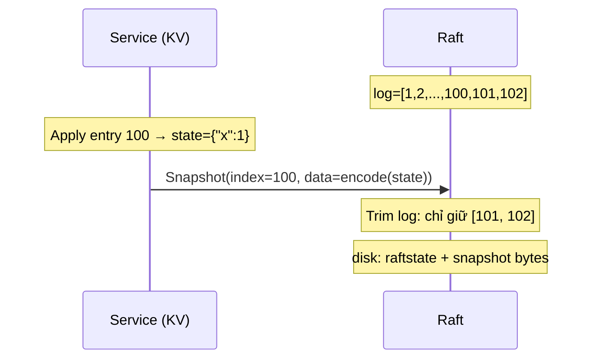

Ở các bài trước (Lab 3B và 3C), chúng ta đã xây dựng cơ chế sao chép log và persistence. Cluster Raft giờ có thể commit entries, crash và khôi phục đúng trạng thái. Tuy nhiên, vẫn còn một vấn đề nghiêm trọng: **log chỉ tăng, không bao giờ giảm**.

Trong một dịch vụ chạy liên tục nhiều năm, log có thể chứa hàng triệu entries. Khi server restart, nó phải replay toàn bộ log từ đầu — tốn hàng phút đến hàng giờ. Disk cũng sẽ cạn kiệt dần. Lab 3D giải quyết vấn đề này bằng **log compaction via snapshots**.

## 1. Tại sao cần Snapshot?

### 1.1. Vòng đời của một entry log

Xét một KV server dùng Raft làm consensus layer. Lệnh `Set("x", 1)` được commit tại index 100. Từ góc độ tính đúng đắn, entry này có thể bị xóa khỏi log **sau khi đã được apply lên state machine** — vì bản thân state machine (dict `{"x": 1}`) đã mang theo thông tin đó. Không cần replay lại từ entry 1 nếu chúng ta đã có ảnh chụp state machine tại index 100.

### 1.2. Snapshot là gì?

Snapshot là một **ảnh chụp toàn bộ state machine** tại một thời điểm xác định (tại một log index cụ thể). Sau khi có snapshot tại index `X`, Raft có thể xóa mọi entry `<= X` khỏi log — những thông tin đó đã được "cất" vào snapshot.



### 1.3. Khi follower tụt hậu

Vấn đề phát sinh khi một follower ngắt kết nối lâu. Leader đã compact log đến index 100, nhưng follower chỉ có log đến index 50. Leader không còn entries từ 51–100 để gửi qua `AppendEntries`. Giải pháp: leader gửi **toàn bộ snapshot** cho follower qua một RPC mới: `InstallSnapshot`.

## 2. Mô hình tư duy: hai lớp chỉ số

Trước khi code, cần cố định một quy ước: **chỉ số logic** và **chỉ số vật lý** là hai thứ khác nhau.

### 2.1. Chỉ số logic vs vật lý

| Khái niệm | Ý nghĩa |
|-----------|---------|
| **Chỉ số logic** (Raft log index) | Không bao giờ reset, tăng từ 1 đến ∞. Đây là số `CommandIndex` trong `ApplyMsg`, là `PrevLogIndex` trong RPC. |
| **Chỉ số vật lý** (slice index) | Vị trí trong `rf.log[]` — thay đổi khi trim. `rf.log[0]` luôn là dummy (term 0). |

### 2.2. Hai field mới: `snapLastIdx` và `snapLastTerm`

```go
snapLastIdx  int // chỉ số logic cao nhất đã nằm trong snapshot (0 = chưa compact)
snapLastTerm int // term của entry tại snapLastIdx
```

Khởi tạo `(0, 0)` — "chưa compact lần nào". Đây là sentinel, không phải entry thực tế (entry thực bắt đầu từ index 1).

### 2.3. Công thức chuyển đổi

```
logicalIndex(k) = snapLastIdx + k          // slice k → logic
sliceIndex(L)   = L - snapLastIdx          // logic L → slice
```

**Hệ quả:**

```go
// Chỉ số logic nhỏ nhất còn trong log
func (rf *Raft) firstLogIndex() int {
    return rf.snapLastIdx + 1
}

// Chỉ số logic lớn nhất
func (rf *Raft) lastLogIndex() int {
    if len(rf.log) == 0 {
        return rf.snapLastIdx
    }
    return rf.snapLastIdx + len(rf.log) - 1
}

// Term của entry tại chỉ số logic L
func (rf *Raft) logTerm(logical int) int {
    if logical == rf.snapLastIdx {
        return rf.snapLastTerm // entry nằm trong snapshot, dùng metadata
    }
    phy := logical - rf.snapLastIdx
    return rf.log[phy].Term
}
```

**Ví dụ số:** Đã snapshot tới logic 100 (`snapLastIdx=100`, `snapLastTerm=4`). Log trong RAM: `[dummy][entry101][entry102][entry103]` (len=4).

- `firstLogIndex()` = 101
- `lastLogIndex()` = 100 + 4 - 1 = 103
- `logTerm(100)` = `snapLastTerm` = 4 (không cần slice)
- `logTerm(102)` = `rf.log[102-100]` = `rf.log[2].Term`

**Trước khi compact lần đầu:** `snapLastIdx==0` → `logicalIndex(k) = k`, giống hệt code 3B/3C — không regress gì.

Toàn bộ code sử dụng `lastLogIndex()`, `logTerm()`, `firstLogIndex()` thay vì truy cập slice trực tiếp. Đây là bước refactor nền tảng quan trọng nhất: chạy lại toàn bộ 3A/3B/3C phải xanh sau bước này.

## 3. `Snapshot()`: Trim log và persist

Khi service đã apply một batch entries và tạo được snapshot, nó gọi:

```go
Snapshot(index int, snapshot []byte)
```

- `index`: chỉ số logic cao nhất đã được phản ánh trong snapshot.
- `snapshot`: bytes do service encode (state machine state).

### 3.1. Validation trước khi trim

```go
func (rf *Raft) Snapshot(index int, snapshot []byte) {
    rf.mu.Lock()
    defer rf.mu.Unlock()

    if snapshot == nil { return }
    if index < rf.snapLastIdx { return } // stale: đã compact xa hơn
    if index > rf.commitIndex || index > rf.lastApplied { return }
    if index > rf.lastLogIndex() || index < 1 { return }
    phy := index - rf.snapLastIdx
    if phy < 1 || phy >= len(rf.log) { return }

    // Same index: chỉ refresh bytes
    if index == rf.snapLastIdx {
        rf.snapshot = append([]byte(nil), snapshot...)
        rf.persist()
        return
    }
    // ...trim...
}
```

**Điều kiện `index <= commitIndex && index <= lastApplied`:** không được snapshot entry chưa commit hoặc chưa apply — state machine chưa bao gồm entry đó, snapshot sẽ không nhất quán.

### 3.2. Lõi compact: trim slice và giải phóng bộ nhớ

```go
newTerm := rf.log[phy].Term
trimmed := append([]LogEntry(nil), rf.log[phy+1:]...)
rf.log = append([]LogEntry{{Term: 0}}, trimmed...)
rf.snapLastIdx = index
rf.snapLastTerm = newTerm
rf.snapshot = append([]byte(nil), snapshot...)

rf.persist()
```

**Từng dòng:**

- `newTerm := rf.log[phy].Term`: đọc term của entry `index` **trước** khi xóa nó — cần lưu vào `snapLastTerm` để sau này `AppendEntries` cho entry `index+1` có thể xác nhận `prevLogTerm`.
- `trimmed := append([]LogEntry(nil), rf.log[phy+1:]...)`: tạo **backing array mới** — không giữ con trỏ tới phần đã bỏ, Go GC thu hồi phần cũ.
- `rf.log = append([]LogEntry{{Term: 0}}, trimmed...)`: khôi phục invariant "dummy ở đầu", các entry còn lại nằm từ slice index 1.

**Ví dụ số:** `snapLastIdx=0`, log = `[dummy, e1, e2, e3, e4, e5]`. Gọi `Snapshot(index=3)`:
- `phy = 3 - 0 = 3`
- `newTerm = rf.log[3].Term`
- `trimmed` = `[e4, e5]`
- `rf.log` mới = `[dummy, e4, e5]`
- `snapLastIdx=3`, `firstLogIndex()=4`
- Công thức: `logTerm(4) = rf.log[4-3] = rf.log[1].Term` ✓

## 4. Persist với Snapshot

### 4.1. Vấn đề: không được ghi đè snapshot trên disk

Trước 3D, `persist()` luôn gọi `Save(raftstate, nil)`. Sau khi có snapshot trên disk, nếu `persist()` được gọi với `nil` (ví dụ chỉ để lưu `votedFor` mới) thì **snapshot bytes trên disk bị xóa**. Sau crash, service đọc lại snapshot = `nil` → mất toàn bộ state.

### 4.2. `persist()` cập nhật

```go
func (rf *Raft) persist() {
    w := new(bytes.Buffer)
    e := labgob.NewEncoder(w)
    e.Encode(rf.currentTerm)
    e.Encode(rf.votedFor)
    e.Encode(rf.log)
    e.Encode(rf.snapLastIdx)   // mới
    e.Encode(rf.snapLastTerm)  // mới
    raftstate := w.Bytes()

    snapshot := rf.snapshot
    if snapshot == nil {
        // Fallback: đọc từ persister để không ghi đè snapshot đang có trên disk
        snapshot = rf.persister.ReadSnapshot()
    }
    rf.persister.Save(raftstate, snapshot)
}
```

**Rule:** Mỗi lần `Save()`, luôn kèm snapshot hiện hành — hoặc in-memory nếu có, hoặc đọc lại từ disk. Không bao giờ gọi `Save(raftstate, nil)` sau khi đã có snapshot.

### 4.3. `readPersist()` backward-compatible

```go
func (rf *Raft) readPersist(data []byte) {
    // ...decode term, voted, log như cũ...
    snapLastIdx := 0
    snapLastTerm := 0
    // Backward-compatible: blob 3C cũ không có 2 field này vẫn đọc được
    if d.Decode(&snapLastIdx) != nil || d.Decode(&snapLastTerm) != nil {
        snapLastIdx = 0
        snapLastTerm = 0
    }
    rf.currentTerm = term
    rf.votedFor = voted
    rf.log = log
    rf.snapLastIdx = snapLastIdx
    rf.snapLastTerm = snapLastTerm
}
```

Server được nâng cấp từ code 3C (blob cũ không có `snapLastIdx`) vẫn khởi động được với `(0, 0)` — không panic, không mất state.

## 5. Applier và ApplyMsg

### 5.1. Hai loại tin trên `applyCh`

Từ 3D, `ApplyMsg` có thêm các field:

| Field | Ý nghĩa |
|-------|---------|
| `SnapshotValid` | `true` → service cần load snapshot |
| `Snapshot` | bytes snapshot |
| `SnapshotIndex` | chỉ số logic last-included |
| `SnapshotTerm` | term last-included |

### 5.2. `applySnapshotPending` và goroutine applier

Không gửi `ApplyMsg` snapshot trực tiếp trong `InstallSnapshot` handler (đang giữ `rf.mu` → deadlock nếu channel đầy). Thay vào đó dùng cờ:

```go
rf.applySnapshotPending = true
```

Goroutine applier kiểm tra cờ này **trước** khi gửi command:

```go
func (rf *Raft) applier(applyCh chan raftapi.ApplyMsg) {
    for !rf.killed() {
        rf.mu.Lock()
        if rf.applySnapshotPending {
            msg := raftapi.ApplyMsg{
                SnapshotValid: true,
                Snapshot:      append([]byte(nil), rf.snapshot...),
                SnapshotIndex: rf.snapLastIdx,
                SnapshotTerm:  rf.snapLastTerm,
            }
            rf.applySnapshotPending = false
            rf.mu.Unlock()
            applyCh <- msg
            continue
        }
        if rf.lastApplied >= rf.commitIndex {
            rf.mu.Unlock()
            time.Sleep(applierPollSleep)
            continue
        }
        // apply command như cũ
        // ...
    }
}
```

**Tại sao snapshot được ưu tiên trước command?** Nếu vừa nhận snapshot đến index 100 mà `lastApplied` = 80, không nên apply entries 81–100 theo từng command (chúng đã nằm trong snapshot). Gửi `ApplyMsg` snapshot trước, service sẽ khôi phục state tại 100, sau đó applier tiếp tục từ 101.

### 5.3. Contract sau restart

Sau khi server restart và `Make()` đọc lại snapshot (`snapLastIdx=100`), **tin đầu tiên trên `applyCh`** phải là một trong:

1. `SnapshotValid=true` với `SnapshotIndex > 100` (snapshot mới hơn), **hoặc**
2. `CommandValid=true` với `CommandIndex == 101` (ngay sau snapshot).

Không được có "hole" (nhảy từ 100 lên 103) hay "lùi" (gửi index 90).

### 5.4. `Make()`: đồng bộ `commitIndex` / `lastApplied`

```go
// Sau readPersist():
if rf.snapLastIdx > 0 {
    if rf.commitIndex < rf.snapLastIdx {
        rf.commitIndex = rf.snapLastIdx
    }
    if rf.lastApplied < rf.snapLastIdx {
        rf.lastApplied = rf.snapLastIdx
    }
    if len(rf.snapshot) > 0 {
        rf.applySnapshotPending = true
    }
}
```

`commitIndex` và `lastApplied` không được persist (chúng volatile), nên sau restart chúng = 0. Nhưng log đã được trim — `firstLogIndex() = 101`. Nếu không nâng `lastApplied` lên `snapLastIdx`, applier sẽ cố apply từ index 1 → panic vì entry đó không còn trong log.

## 6. `InstallSnapshot`: leader gửi, follower nhận

### 6.1. Khi nào leader gửi?

Trong mỗi vòng heartbeat, với từng follower:

```go
next := rf.nextIndex[p]
first := rf.firstLogIndex()

if next < first {
    // Follower tụt hậu trước phần đã compact — AppendEntries không đủ
    // → gửi InstallSnapshot
} else {
    // AppendEntries như bình thường
}
```

**Điều kiện `nextIndex[p] < firstLogIndex()`** là tín hiệu: follower cần các entries mà leader đã xóa khỏi log. Không thể dùng `AppendEntries` để catch-up vì entry đó đã không còn. Phải gửi snapshot.

### 6.2. War story: clamp `nextIndex` — lỗi thiết kế phổ biến nhất

Ý tưởng nghe rất hợp lý: "`nextIndex` mà nhỏ hơn `firstLogIndex()` thì kéo nó lên cho an toàn".  
Trong Lab 3D, đúng ý tưởng này lại làm hỏng cơ chế catch-up.

Lý do cốt lõi: `nextIndex < firstLogIndex()` **không phải trạng thái lỗi**.  
Đó là **tín hiệu bắt buộc** để leader biết phải gửi `InstallSnapshot` thay vì `AppendEntries`.

Bạn chỉ cần nhớ 1 quy tắc:

- `nextIndex >= firstLogIndex()` -> follower còn bắt kịp bằng log entries (`AppendEntries`).
- `nextIndex < firstLogIndex()` -> follower đã tụt vào vùng log bị compact -> phải gửi snapshot (`InstallSnapshot`).

Clamp làm mất tín hiệu đó.

```go
// ❌ Không clamp ở ba chỗ sau:

// 1) Trước khi chọn AE hay Install
if next < first {
    next = first // làm mất điều kiện cần gửi InstallSnapshot, các lần sau sẽ chỉ cố gửi log entries cho follower
}

// 2) Sau khi AE bị reject và lùi nextIndex
if rf.nextIndex[peer] < first {
    rf.nextIndex[peer] = first // follower vẫn tụt hậu nhưng điều kiện để gửi InstallSnapshot đã mất, lần gửi sau sẽ cố gửi log entries thay vì snapshot
}

// 3) Ngay sau Snapshot() trim log
for i := range rf.nextIndex {
    if rf.nextIndex[i] < first {
        rf.nextIndex[i] = first // ép mọi peer quay lại nhánh AE
    }
}
```

Mẫu lỗi thường gặp ngoài thực tế:

1. Follower tụt rất xa.
2. Leader cứ gửi `AppendEntries` với `PrevLogIndex = first-1`.
3. Follower luôn reject vì không có entry đó.
4. `nextIndex` lại bị clamp lên `first`.
5. Vòng lặp lặp lại vô hạn, không bao giờ rơi vào `InstallSnapshot`.

**Fix:** tuyệt đối không clamp `nextIndex` về `firstLogIndex()`. Cứ để nó nhỏ hơn `first`; chính giá trị đó là trigger để gửi snapshot.

```
nextIndex[p] < firstLogIndex()  →  gửi InstallSnapshot
nextIndex[p] >= firstLogIndex() →  gửi AppendEntries như cũ
```

### 6.3. Nội dung RPC

```go
type InstallSnapshotArgs struct {
    Term              int
    LeaderId          int
    LastIncludedIndex int    // = snapLastIdx của leader
    LastIncludedTerm  int    // = snapLastTerm của leader
    Offset            int    // lab MIT: luôn 0 (không chunk)
    Data              []byte // toàn bộ snapshot bytes
    Done              bool   // lab MIT: luôn true
}
```

MIT simplifies: gửi toàn bộ snapshot trong **một RPC**, không chunk. Paper Figure 13 mô tả chunking nhưng lab bỏ qua.

### 6.4. Follower xử lý InstallSnapshot (Figure 13)

```go
func (rf *Raft) InstallSnapshot(args *InstallSnapshotArgs, reply *InstallSnapshotReply) {
    rf.mu.Lock()
    defer rf.mu.Unlock()

    reply.Term = rf.currentTerm

    // 1. Stale term: reject (không reset timer — giống AE stale)
    if args.Term < rf.currentTerm {
        return
    }

    // 2. Valid term: cập nhật term, reset timer
    if args.Term > rf.currentTerm {
        rf.becomeFollower(args.Term)
    } else {
        rf.role = RoleFollower // candidate → follower
    }
    reply.Term = rf.currentTerm
    rf.resetElectionTimerLocked() // quan trọng!

    // 3. Follower đã compact xa hơn — bỏ qua (idempotent)
    if args.LastIncludedIndex < rf.snapLastIdx {
        return
    }

    // 4. Cùng index: chỉ refresh bytes
    if args.LastIncludedIndex == rf.snapLastIdx {
        rf.snapshot = append([]byte(nil), args.Data...)
        rf.persist()
        return
    }

    // 5. Snapshot mới hơn: Figure 13 — giữ suffix nếu khớp (index, term)
    if args.LastIncludedIndex <= rf.lastLogIndex() &&
        rf.logTerm(args.LastIncludedIndex) == args.LastIncludedTerm {
        // Entry tương ứng vẫn còn trong log, giữ log sau mốc đó
        phy := args.LastIncludedIndex - rf.snapLastIdx
        trimmed := append([]LogEntry(nil), rf.log[phy+1:]...)
        rf.log = append([]LogEntry{{Term: 0}}, trimmed...)
    } else {
        // Không khớp: discard toàn bộ log
        rf.log = []LogEntry{{Term: 0}}
    }

    rf.snapLastIdx = args.LastIncludedIndex
    rf.snapLastTerm = args.LastIncludedTerm
    rf.snapshot = append([]byte(nil), args.Data...)

    if rf.commitIndex < args.LastIncludedIndex {
        rf.commitIndex = args.LastIncludedIndex
    }
    if rf.lastApplied < args.LastIncludedIndex {
        rf.lastApplied = args.LastIncludedIndex
    }
    if len(args.Data) > 0 {
        rf.applySnapshotPending = true // applier sẽ gửi ApplyMsg snapshot
    }
    rf.persist()
}
```

**Điểm quan trọng về "giữ suffix":** Nếu follower có entry tại logic `LastIncludedIndex` với **cùng term** như `LastIncludedTerm`, thì các entry sau mốc đó **vẫn nhất quán với leader** — không cần xóa chúng. Điều này tiết kiệm băng thông khi follower đã có hầu hết log, chỉ cần snapshot để fill phần đầu.

### 6.5. Leader cập nhật sau khi follower chấp nhận

```go
// Sau khi sendInstallSnapshot() thành công:
lastIn := args.LastIncludedIndex
newNext := lastIn + 1
// Monotonic: không lùi nextIndex khi có reply cũ / out-of-order
if newNext > rf.nextIndex[peer] {
    rf.nextIndex[peer] = newNext
}
if rf.matchIndex[peer] < lastIn {
    rf.matchIndex[peer] = lastIn
}
rf.advanceCommitIndexLocked()
```

## 7. Crash durability

### 7.1. Kiểm tra toàn diện `persist()`

Mọi nơi có thể thay đổi durable state (term, vote, log, snapLast*, snapshot) đều phải gọi `persist()`. Sau compact, mỗi lần persist phải kèm snapshot bytes — quy tắc này đã được đảm bảo bởi fallback `ReadSnapshot()` trong `persist()`.

### 7.2. Bức tranh hoàn chỉnh `Make()` với 3D

```go
func Make(...) raftapi.Raft {
    rf := &Raft{}
    // ...

    // Defaults
    rf.log = []LogEntry{{Term: 0}}
    rf.snapLastIdx = 0
    rf.snapLastTerm = 0
    rf.snapshot = persister.ReadSnapshot() // đọc snapshot bytes vào RAM

    // Overlay durable state
    rf.readPersist(persister.ReadRaftState())

    rf.mu.Lock()
    // commitIndex / lastApplied không persist; sau restart với snapshot,
    // nâng chúng lên snapLastIdx để applier không apply dưới firstLogIndex()
    if rf.snapLastIdx > 0 {
        if rf.commitIndex < rf.snapLastIdx {
            rf.commitIndex = rf.snapLastIdx
        }
        if rf.lastApplied < rf.snapLastIdx {
            rf.lastApplied = rf.snapLastIdx
        }
        if len(rf.snapshot) > 0 {
            rf.applySnapshotPending = true // service cần load lại snapshot
        }
    }
    rf.resetElectionTimerLocked()
    rf.mu.Unlock()

    go rf.ticker()
    go rf.applier(applyCh)

    return rf
}
```

**Thứ tự khởi tạo:** defaults (bao gồm `rf.snapshot = ReadSnapshot()`) → `readPersist` → điều chỉnh volatile state → start goroutines.

### 7.3. Các chỗ log bị cắt trong suốt vòng đời

| Cơ chế | Role | Khi nào |
|--------|------|---------|
| `Snapshot(index, ...)` | Leader (và mọi peer) | Service gọi sau khi apply đủ entries |
| `AppendEntries` handler | Follower | Entry xung đột → truncate từ điểm lệch |
| `InstallSnapshot` handler | Follower | Snapshot mới: discard log hoặc giữ suffix |
| `readPersist` trong `Make()` | Mọi peer | Nạp lại log đã compact từ disk sau restart |

Leader **không** tự truncate qua `AppendEntries` handler; leader compact qua `Snapshot()`.

## 8. Các test cases của 3D

### 8.1. Cơ chế test (harness)

Test 3D bật `snapshot=true` trong `makeTest()` → service mock `rfsrv` dùng goroutine `applierSnap` thay vì `applier` đơn giản:

- Mỗi lần nhận `CommandValid=true`, nếu `CommandIndex % SnapShotInterval == 0` (`SnapShotInterval=10`) → encode state machine và gọi `rf.Snapshot()`.
- Khi nhận `SnapshotValid=true` → decode snapshot bytes để rebuild state machine.

Điều này tạo áp lực compact liên tục trong suốt quá trình test.

### 8.2. Pipeline TDD: Basic → Install → Crash → Init

| Test | `disconnect` | `reliable` | `crash` | Kiểm tra gì |
|------|-------------|-----------|---------|-------------|
| `TestSnapshotBasic3D` | Không | Có | Không | Compact + persist; **full quorum đồng bộ trước snapshot** — cố ý không bắt buộc InstallSnapshot |
| `TestSnapshotInstall3D` | Có | Có | Không | Follower ngắt mạng → leader compact → reconnect → **InstallSnapshot** |
| `TestSnapshotInstallUnreliable3D` | Có | Không | Không | Giống Install + mạng tệ |
| `TestSnapshotInstallCrash3D` | Không | Có | Có | Tắt server thay disconnect; crash + snapshot trên disk |
| `TestSnapshotInstallUnCrash3D` | Có | Không | Có | Crash + unreliable |
| `TestSnapshotAllCrash3D` | — | Không | Có | Shutdown toàn cluster → restart → index không lùi |
| `TestSnapshotInit3D` | — | Không | Có | Khởi tạo snapshot in-memory sau crash; persist không làm mất snapshot |

**Tại sao `TestSnapshotBasic3D` không cần Install?** Comment trong `raft_test.go` nói rõ: trước đoạn compact, test dùng `ts.one(..., servers, true)` — tức là đợi **cả 3 server** commit xong trước khi service gọi `Snapshot()`. Lúc đó không ai tụt hậu, leader không cần gửi snapshot sang follower.

### 8.3. Regression toàn bộ

Sau khi implement xong 3D, toàn bộ 3A/3B/3C phải vẫn xanh:

```bash
cd src/raft1
go test -count=1 -timeout 420s -run '3A$|3B$|3C$'
go test -count=1 -timeout 600s -run '3D$'
```

## 9. Debugging Tips cho 3D

### 9.1. Lỗi `index out of range` trong applier

Thường do `lastApplied` không được nâng lên `snapLastIdx` sau restart. Applier cố apply `lastApplied+1` = 1, nhưng `firstLogIndex()` = 101 → truy cập `rf.log[-99]` → panic.

Vết chạy điển hình:

1. Đã compact đến `snapLastIdx = 100` nên log trong RAM bắt đầu từ index logic 101 (`firstLogIndex() = 101`).
2. Server restart, `lastApplied` là biến volatile nên quay về 0.
3. Applier tính entry tiếp theo là `lastApplied+1 = 1`.
4. Khi đổi từ logic index sang slice index, ta có `phy = logical - snapLastIdx = 1 - 100 = -99` (âm).
5. Slice index âm là invalid nên truy cập `rf.log[phy]` sẽ panic (`index out of range`).

Ý chính: sau khi có snapshot, applier **không được** apply bất kỳ index nào nhỏ hơn `firstLogIndex()`.

**Fix:** trong `Make()`, sau `readPersist()`, nếu `snapLastIdx > 0` thì set `commitIndex = max(commitIndex, snapLastIdx)` và `lastApplied = max(lastApplied, snapLastIdx)`.

### 9.2. `TestSnapshotInstall3D` bị timeout / không pass

Nguyên nhân phổ biến nhất: clamp `nextIndex`. Thêm log:

```go
// Debug trong broadcastAppendEntries:
if next < first {
    log.Printf("peer %d: nextIndex=%d < first=%d → sending InstallSnapshot", p, next, first)
}
```

Nếu không thấy dòng này trong log nhưng follower vẫn tụt hậu → clamp sai, dẫn đến không thể gửi snapshot install cho follower.

### 9.3. `TestSnapshotInit3D` fail

Nguyên nhân: `persist()` gọi `Save(raftstate, nil)` sau khi snapshot đã có trên disk. Sau crash, `ReadSnapshot()` trả `nil`.

**Debug:**

```go
// Thêm assert trong persist():
if rf.snapshot == nil && len(rf.persister.ReadSnapshot()) > 0 {
    panic("about to wipe snapshot from disk!")
}
```

### 9.4. Kiểm tra contract `applyCh` sau restart

```go
// Debug trong applier:
if msg.CommandValid && msg.CommandIndex != rf.lastApplied {
    panic(fmt.Sprintf("gap in apply: expected %d, got %d", rf.lastApplied+1, msg.CommandIndex))
}
```

### 9.5. Chạy nhiều lần để bắt lỗi non-deterministic

```bash
go test -run TestSnapshotInstall3D -count=20 -timeout 6000s
```

## 10. Một số lỗi thường gặp khác

### 10.1. GC leak: giữ reference tới slice cũ

```go
// ❌ Sai: rf.log vẫn share backing array với prefix đã bỏ
rf.log = rf.log[phy+1:]

// ✅ Đúng: backing array mới → GC thu hồi prefix
trimmed := append([]LogEntry(nil), rf.log[phy+1:]...)
rf.log = append([]LogEntry{{Term: 0}}, trimmed...)
```

Go slice `s = s[k:]` chỉ di chuyển pointer nhưng vẫn giữ reference tới backing array cũ → prefix không được GC → memory leak theo thời gian.

### 10.2. `commitIndex` xuất hiện trong `advanceCommitIndexLocked` với chỉ số sai

Sau compact, `rf.log[n]` cần truy cập qua `logTerm(n)`, không qua `rf.log[n].Term` trực tiếp. Nếu quên refactor chỗ này:

```go
// ❌ Sai sau bước refactor:
if rf.log[n].Term != rf.currentTerm { continue }

// ✅ Đúng:
if rf.logTerm(n) != rf.currentTerm { continue }
```

### 10.3. Quên đăng ký `InstallSnapshotArgs` với `labgob`

`labrpc` dùng reflection để encode/decode struct RPC. Nếu thiếu:

```go
labgob.Register(InstallSnapshotArgs{})
labgob.Register(InstallSnapshotReply{})
```

Thì RPC gọi thành công nhưng `Data` (field `[]byte`) có thể bị decode sai → snapshot bytes hỏng → service crash.

## Lời kết

Lab 3D hoàn thiện Raft với một cơ chế thiết yếu cho production: log compaction. Sau 3D, cluster Raft của chúng ta có thể chạy lâu dài mà không lo disk cạn kiệt hay restart chậm.

**Bài học 1: Hai lớp chỉ số là core abstraction.** Phần lớn bug trong 3D xuất phát từ nhầm lẫn giữa chỉ số logic và slice index. Tập trung làm rõ quy ước này (viết helper, refactor toàn bộ chỗ truy cập log) sẽ giúp tiết kiệm rất nhiều thời gian debug sau này.

**Bài học 2: Clamp index là 1 trong những pitfall dẫn đến sai logic.** Suy nghĩ cho rằng "luôn đảm bảo `nextIndex` không nhỏ hơn `firstLogIndex()`" nghe hợp lý nhưng làm sai toàn bộ cơ chế Install. Điều kiện `nextIndex[p] < firstLogIndex()` không phải lỗi cần sửa — đó là **điều kiện** cần được giữ nguyên để kích hoạt `InstallSnapshot`.

**Bài học 3: Snapshot và raft state phải persist cùng nhau.** `persister.Save(raftstate, snapshot)` là một thao tác nguyên tử — luôn kèm snapshot bytes, không bao giờ ghi `nil` khi đã có snapshot trên disk.