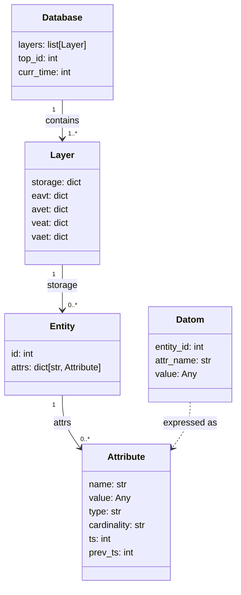

Most databases you've used store data in rows. A `users` table has columns — `id`, `name`, `email` — and each row is one user. It feels natural because it mirrors a spreadsheet. But this model has a hidden assumption baked in: **you have to decide your schema upfront**. Add a new attribute? Alter the table. Different entities need different attributes? Create separate tables, then JOIN.

circle-db takes a different approach, borrowed from a model called **EAV — Entity, Attribute, Value**. Instead of rows, the smallest unit of information is a **datom** — a single fact:

> *"Entity 42 has attribute `:name` with value `"Alice"`."*

That's it. Three fields. Every piece of data in the database is expressed as one or more of these facts. An "entity" is not a row in a table — it's just an ID that a bunch of facts happen to share.

Think of it like sticky notes on a wall. Each note says: *"[person #42] [speaks] [French]"*. You can add as many notes as you want for any person, and two people don't need the same set of notes. There's no table to alter, no schema to migrate. Want to add a new fact? Just stick another note on the wall.

This phase is about defining the vocabulary: what structures do we use to represent entities, attributes, datoms, and the database itself? No operations yet — just the nouns.

## What we built

By the end of this phase:

- A `Datom` structure that holds `(entity_id, attribute_name, value)`
- An `Attribute` structure that holds a value, its type (`:db/ref` or plain value), its cardinality (single or multiple), and timestamps (`ts`, `prev_ts`)
- An `Entity` structure with an ID and a map of attribute-name → Attribute
- A `Layer` structure representing one point in time — contains a storage map and four empty index slots (EAVT, AVET, VEAT, VAET)
- A `Database` structure holding a list of layers, a `top_id` counter (auto-incrementing entity IDs), and a `curr_time` counter

Here's how these five structures relate to each other:



## The hard parts

**Why does Layer need four empty index maps from day one?**

My first instinct was to skip the index fields for now and add them later when we actually build the indexes. But there's a problem: a `Layer` represents one complete snapshot of the database at a point in time. Think of it like a photo — a photo always has the same dimensions, whether the room was full or empty. If some layers have an `eavt` field and others don't, then every piece of code that reads a layer has to check: "does this layer have an eavt? Maybe? Let me add a special case."

That special-casing compounds fast. Much simpler to decide upfront: every Layer always has all five fields, always. Some of them just start as empty dicts. The cost is four `{}` in Phase 1. The benefit is that every layer looks identical and can be treated the same way, always.

**Why `:db/ref`, `:db/single`, `:db/multiple` instead of booleans?**

The first instinct is to use booleans — `is_ref = True`, `is_single = False`. But these values are **named constants**, not flags. When you read `cardinality = ":db/multiple"` three months later, it tells you exactly what it means. `False` does not.

The `:db/` prefix is a convention borrowed from Datomic — the `/` is a namespace separator meaning "this keyword belongs to the `db` namespace." It signals that these are database-level concepts, not user-defined values. Similar to how Python uses `_` to mark internal names — a convention, not syntax, but immediately meaningful.

They also make branching cleaner in later phases:

```python
if attr.cardinality == ":db/single":
    # replace the value
elif attr.cardinality == ":db/multiple":
    # add/remove from a set

if attr.type == ":db/ref":
    # update VAET index — value is an entity ID, not a plain value
```

If you used booleans, you'd need carefully-named variables to remember what `True` means. With string keywords, the code documents itself.

**Clojure's positional record constructor.**

`defrecord` generates two constructors: `(->RecordName field1 field2 ...)` (positional) and `(map->RecordName {:field1 val :field2 val})` (map-based). I kept reaching for the map-based one because it's explicit, then forgetting its name. The positional one is shorter but order-dependent — easy to get wrong. I settled on always using `map->` for clarity, even if it's more verbose.

## Key insight

The `prev_ts` field on `Attribute` looks like an afterthought — just metadata tracking when the value changed. But it's actually the entire time-travel mechanism in one field. Every time an attribute is updated, the new `Attribute` record stores `prev_ts = old_ts`. That creates a chain: current value → previous value → the one before that → all the way back to the first write. The data model doesn't just describe the *current* state — it encodes the *entire history* of every fact, for free, with no extra storage layer.

## Python vs Clojure

In Python, `dataclass` gives you a mutable struct by default — you have to remember not to mutate it, which is a convention, not a constraint. In Clojure, `defrecord` instances are immutable by the language: there is no setter, no field assignment. "Updating" a record means calling `assoc` to get a *new* record with one field changed, leaving the original untouched. This felt awkward at first — why can't I just set `attr.value = new_value`? But by the end of Phase 1, the pattern clicked: every "change" produces a new value, which means you always have the old one too. That's not a limitation. That's the whole design.

## The snippet

```python
from dataclasses import dataclass
from typing import Any

@dataclass
class Attribute:
    name: str
    value: Any
    type: str        # ':db/ref' or a value type
    cardinality: str # ':db/single' or ':db/multiple'
    ts: int          # timestamp when this value was written
    prev_ts: int     # timestamp of the previous version (-1 if first write)
```

`prev_ts` is the only field here that isn't obvious. It's not just "when did this change" — it's a pointer to the previous version of this fact, enabling the full history chain that powers time-travel queries later on.

## What's next

We have the nouns — next phase, we build the storage layer: a simple map from entity ID to entity, and learn why returning a new map on every write is not as wasteful as it sounds.


---

*The source code for this series is on GitHub: [minhmannh2001/circle-db](https://github.com/minhmannh2001/circle-db)*
