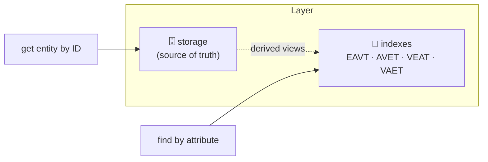
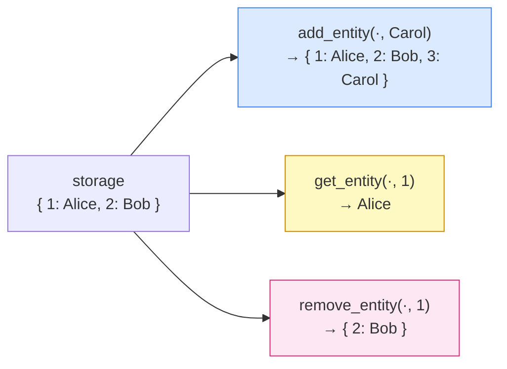
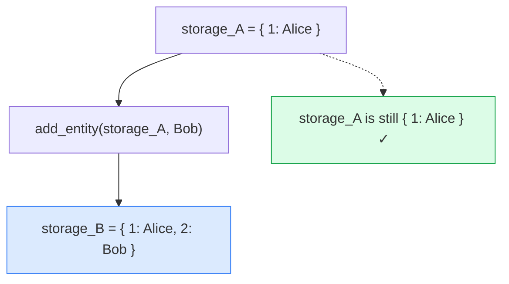

## The Shelf and the Card Catalog


Think of a library's card catalog — the old kind, with rows of wooden drawers. Each drawer holds index cards sorted a particular way (by title, by author, by subject). But the *actual books* live on the shelves, numbered by their unique call number. The card catalog is how you find books; the shelves are where the books actually live.

circle-db separates these two concerns in exactly the same way. The **storage layer** is the shelf: a map from entity ID to entity, and nothing more. It is the source of truth. The **indexes** (EAVT, AVET, VEAT, VAET) are the card catalog: derived views that make queries fast. If you want to know what entity 42 looks like, you go to storage. If you want to know which entities have the attribute `:name`, you go to an index.



This phase builds just the shelf. Three operations: put a book on the shelf, find a book by its number, take a book off the shelf. The twist is that every operation returns a *new* shelf — the old one stays exactly as it was. No cards are shuffled, no books are moved. Old state is preserved, new state is returned.

This immutability looks inefficient ("are we copying the whole dictionary on every write?"), but persistent data structures make it cheap. In Clojure, `assoc` on a persistent map shares structure with the original — only the changed path is duplicated. In Python, dict spread (`{**storage, key: value}`) does copy, but for the sizes we're working with, correctness matters far more than copying overhead.

## What We're Building

By the end of this phase:

- `add_entity(storage, entity) → new_storage` — inserts or replaces an entity by its ID, leaving the original storage unchanged
- `get_entity(storage, entity_id) → Entity | None` — retrieves an entity by ID, returning None if absent
- `remove_entity(storage, entity_id) → new_storage` — returns new storage without that entity, original unchanged
- `test_storage.py` asserting immutability and correct behavior for all three operations
- The same three functions in Clojure using `assoc`, `get`, `dissoc` on persistent maps



## What the Data Actually Looks Like

The Mermaid diagrams above say "Alice" and "Bob" as shorthand — but what does storage actually hold? An entity is not a string. It's an `Entity` object with an ID and a map of named `Attribute` values:

```python
from constructs import Entity, Attribute

alice = Entity(
    id=1,
    attrs={
        "name": Attribute(name="name", value="Alice", type=":db/string", cardinality=":db/single"),
        "age":  Attribute(name="age",  value=30,      type=":db/long",   cardinality=":db/single"),
    }
)

bob = Entity(
    id=2,
    attrs={
        "name": Attribute(name="name", value="Bob", type=":db/string", cardinality=":db/single"),
    }
)
```

Storage is a plain Python `dict` keyed by entity ID. After two `add_entity` calls, it looks like this:

```python
storage = add_entity({}, alice)
storage = add_entity(storage, bob)

# storage is now:
# {
#   1: Entity(id=1, attrs={
#         "name": Attribute(value="Alice", type=":db/string", ...),
#         "age":  Attribute(value=30,      type=":db/long",   ...),
#      }),
#   2: Entity(id=2, attrs={
#         "name": Attribute(value="Bob", type=":db/string", ...),
#      }),
# }
```

Retrieving by ID is a dict lookup:

```python
get_entity(storage, 1)   # → Entity(id=1, attrs={"name": ..., "age": ...})
get_entity(storage, 99)  # → None
```

And remove returns a new dict without that key — the original is still intact:

```python
storage2 = remove_entity(storage, 1)
# storage2 → { 2: Entity(id=2, ...) }
# storage  → { 1: Entity(id=1, ...), 2: Entity(id=2, ...) }  ← unchanged
```

Each entity can have a different set of attributes — `alice` has both `name` and `age`, `bob` only has `name`. No schema, no required columns. That's the EAV model from Phase 1 paying off.

## The Hard Parts

### Why not put these functions on `Layer` or `Database`?

My first instinct was to make `add_entity` a method on `Layer` — after all, `layer.storage` is where entities live. But that couples storage operations to the surrounding data structure. If you test `layer.add_entity(e)`, your test has to construct a full `Layer` to test what is essentially a three-line dict operation. Keeping storage as a plain dict and the functions as module-level operations means tests are trivial: `add_entity({}, entity)`. No setup, no teardown. The narrower the interface, the easier it is to test and reason about.

### The immutability test is not symmetric in Python and Clojure

In Clojure, the test `remove-entity-does-not-mutate-original` verifies something the language already guarantees. `dissoc` on a persistent map *cannot* modify the original — there's no mechanism for it. The test is still worth having (it documents intent and catches a future refactor that somehow switches to a mutable data structure), but it will never fail unless someone rewrites the function fundamentally wrong.

In Python, the test is load-bearing. Nothing stops a future implementer from writing `del storage[entity_id]; return storage` — which mutates and returns the original. The test catches that regression. Same test, very different stakes.



## Key Insight

> Storage is deliberately dumb. It has no idea what an index is, what a datom is, or what a transaction looks like. It is just a map from ID to entity, with three operations: put, get, remove. This narrowness is a feature, not a gap.

Because storage knows nothing about indexes, you can change the entire indexing strategy in future phases without touching storage at all. Each layer of the system has one job. When something breaks, you know exactly where to look.

## Python vs Clojure

In Python, writing immutable storage is a choice you enforce with your implementation: `{**storage, entity.id: entity}` instead of `storage[entity.id] = entity`. Both are valid Python; you have to pick the right one. In Clojure, `(assoc storage (:id entity) entity)` is the only way — there is no mutable map operation to accidentally reach for. This means the Clojure implementation is correct by construction: you cannot write `add-entity` in a way that mutates the input, because the language doesn't have that operation.

In Python, you rely on discipline and tests. In Clojure, the type system does the policing for free.

## The Code

```python
def add_entity(storage, entity):
    return {**storage, entity.id: entity}

def get_entity(storage, entity_id):
    return storage.get(entity_id)

def remove_entity(storage, entity_id):
    return {k: v for k, v in storage.items() if k != entity_id}
```

Three functions, three lines each. `{**storage, key: val}` creates a new dict that is a copy of `storage` with one key overwritten — the original is never touched. `remove_entity` uses a comprehension to rebuild the dict excluding the removed key. No mutation anywhere, by construction.

The Clojure version shows why the language makes this feel natural:

```clojure
(defn add-entity [storage entity]
  (assoc storage (:id entity) entity))

(defn get-entity [storage entity-id]
  (get storage entity-id))

(defn remove-entity [storage entity-id]
  (dissoc storage entity-id))
```

`assoc`, `get`, `dissoc` — the three operations that every Clojure developer uses on maps daily. The storage layer is just those three primitives, named for our domain.

## What's Next

We can store and retrieve entities — but finding *all entities with a given attribute* still requires scanning every entity in storage. Next phase builds the EAVT index: a sorted structure that makes attribute lookups instant.


---

*The source code for this series is on GitHub: [minhmannh2001/circle-db](https://github.com/minhmannh2001/circle-db)*
