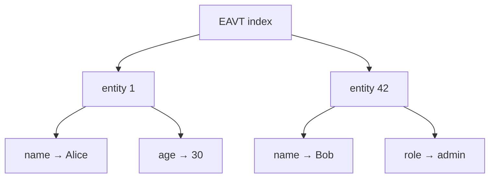
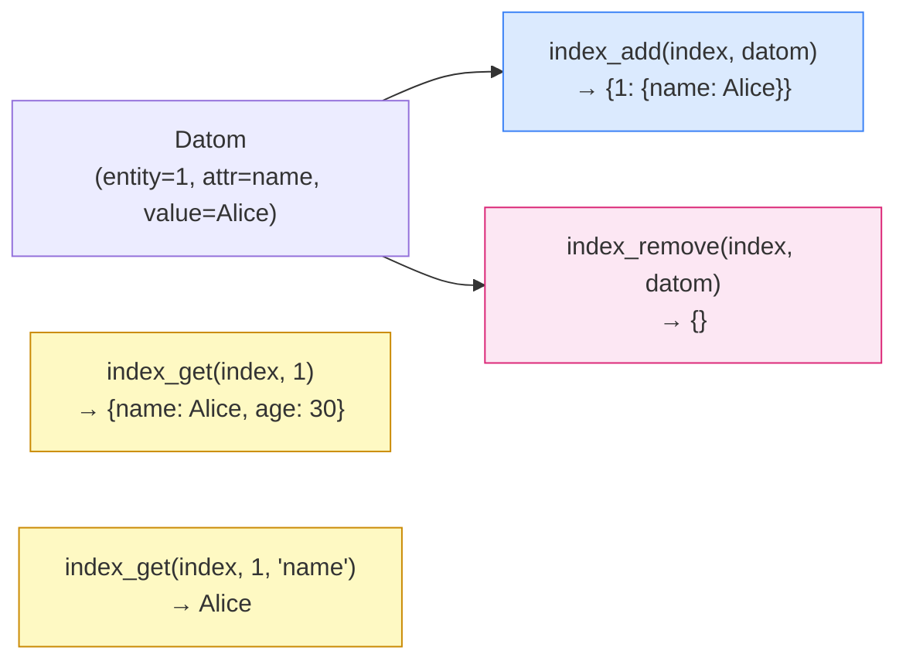
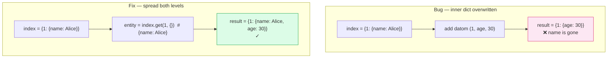
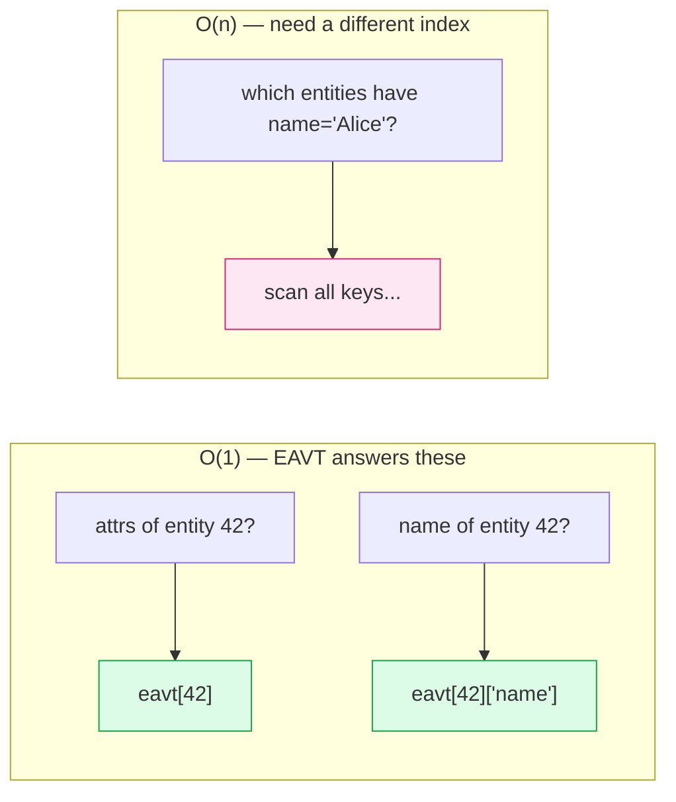

## The Phone Book Problem

Storage from Phase 2 lets you retrieve any entity instantly if you know its ID. But what if you want to find *all entities that have the attribute `:name`*? Storage can't help — you'd have to scan every entity in the map, look at each one's attributes, and filter. That's O(n) over the whole database for every query.

An **index** solves this by pre-organizing data for a specific access pattern. Think of a phone book: the underlying data is the same (name, address, number), but it's sorted by last name so that "find everyone named Smith" takes seconds instead of hours. The phone book is not the source of truth — it's a derived view optimized for one kind of lookup.

The **EAVT index** organizes facts in the order: **E**ntity → **A**ttribute → **V**alue → **T**ime. Its structure is a nested map:

```
{
  entity-id: {
    attribute-name: value
  }
}
```



With EAVT, "give me all attributes of entity 42" is a single map lookup: `eavt[42]`. That's O(1) regardless of how many entities exist. No scan, no filter — just navigate the tree.

This is the core insight of indexed databases: you trade write cost (updating the index on every write) for read speed (queries become direct lookups). circle-db will have four such indexes (EAVT, AVET, VEAT, VAET), each answering a different class of question in O(1).

## What We're Building

By the end of this phase:

- `index_add(index, datom) → new_index` — inserts a datom into the EAVT nested map, returning a new index
- `index_remove(index, datom) → new_index` — removes a datom, leaving other datoms for the same entity intact
- `index_get(index, entity_id) → {attr: value}` — returns all attributes for an entity
- `index_get(index, entity_id, attr_name) → value` — returns a single attribute's value
- `add_entity_to_layer(layer, entity) → new_layer` — writes to both `layer.storage` and `layer.eavt` in one step
- The same operations in Clojure using `assoc-in`, `get-in`, `update-in`



## The Hard Parts

### Immutable nested map updates require two levels of spreading

My first attempt at `index_add` looked like this:

```python
return {**index, datom.entity_id: {datom.attr_name: datom.value}}
```

This works for a brand-new entity, but the moment you add a *second* datom for the same entity, you lose the first one — the inner dict is constructed from scratch with only the new attribute. The fix is to read the existing inner dict first:

```python
entity = index.get(datom.entity_id, {})
return {**index, datom.entity_id: {**entity, datom.attr_name: datom.value}}
```

Both levels need to be spread. This is the price of immutability in Python: you have to explicitly manage every level of nesting.



### `add_entity_to_layer` belongs to neither module

The integration function needs to call both `add_entity` (from `storage.py`) and `index_add` (from `eavt.py`). If you put it in `storage.py`, storage gains a dependency on eavt. If you put it in `eavt.py`, the dependency goes the other way. Neither is right — each module should do one thing. The solution is a `layer.py` module that imports both and coordinates them. This pattern scales: when AVET, VEAT, and VAET are added in the next phase, `layer.py` grows, not the individual index files.

### `index_get` leaks a mutable reference

The first version of `index_get` returned the inner dict directly:

```python
def index_get(index, entity_id, attr_name=None):
    entity = index.get(entity_id, {})
    if attr_name is None:
        return entity  # ← caller gets the actual inner dict
```

A caller could do `attrs = index_get(index, 1); attrs["hacked"] = "evil"` and silently corrupt the index. In Clojure this is impossible — persistent maps can't be mutated. In Python, the fix is one word:

```python
entity = dict(index.get(entity_id, {}))  # copy, not reference
```

## Key Insight

> The nested map structure `{entity_id: {attr_name: value}}` is not just a convenient grouping — it is a direct encoding of which queries are fast.

`eavt[42]` (all attributes of entity 42) is one dict lookup: O(1). `eavt[42]["name"]` (specific attribute) is two dict lookups: still O(1). But "find all entities where name is 'Alice'" still requires scanning every key in the outer dict — that's O(n).



EAVT makes entity-first queries fast and says nothing about attribute-first queries. That's exactly why the other three indexes exist: each one pre-sorts the same facts along a different axis to make a different class of query fast.

## Python vs Clojure

The difference between `index_add` in the two languages captures the core ergonomic gap. In Python, nested immutable updates are manual: you spread the outer dict, then the inner dict, handling the missing-key case with `.get(key, {})`. In Clojure, `(assoc-in index [eid attr-name] value)` does all of this in one expression — it handles missing intermediate maps, copies all levels of structure, and is just as readable for depth 2 as it is for depth 5. Clojure was designed around the idea that immutable nested updates are common; Python was not. The `assoc-in` / `update-in` / `get-in` family is one of the places where Clojure's design feels most deliberate.

## The Code

```python
# Python — two levels of spreading required
def index_add(index, datom):
    entity = index.get(datom.entity_id, {})
    return {**index, datom.entity_id: {**entity, datom.attr_name: datom.value}}
```

```clojure
;; Clojure — one expression, arbitrary depth
(defn index-add [index datom]
  (assoc-in index [(:entity-id datom) (:attr-name datom)] (:value datom)))
```

Both do the same thing: insert one fact into a nested map without mutating the original. The Python version makes the two-level copy explicit. The Clojure version treats it as a path navigation problem — `assoc-in` follows the key path `[entity-id attr-name]` and handles everything else.

## What's Next

EAVT answers "what attributes does entity N have?" — but to answer "which entities have attribute `:name`?" we still scan everything. Next phase adds the remaining three indexes (AVET, VEAT, VAET), each pre-sorting the same facts along a different axis.


---

*The source code for this series is on GitHub: [minhmannh2001/circle-db](https://github.com/minhmannh2001/circle-db)*
