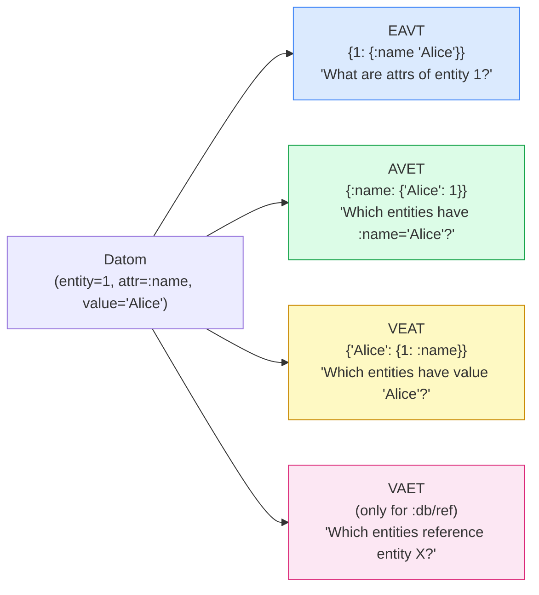
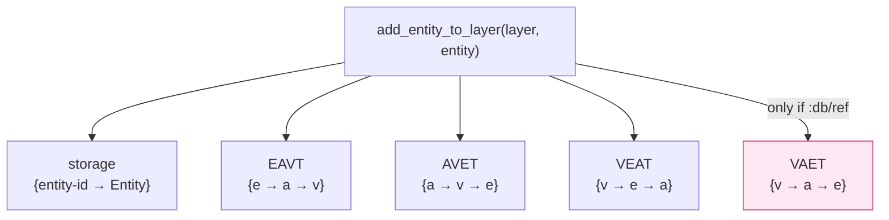
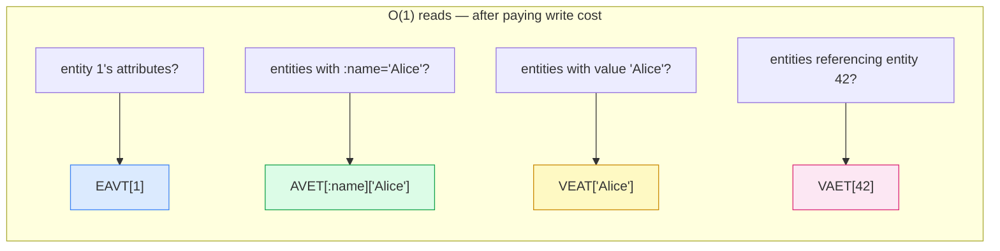

## The Same Books, Sorted Four Ways

In Phase 3, we built the EAVT index — and "give me all attributes of entity 42" became an O(1) lookup. But "give me all entities where `:name` is `'Alice'`" still required scanning every entity. EAVT doesn't help there.

The fix is simple in principle and startling in practice: **store the same data again, sorted differently**.

Imagine a library that sorts its books four different ways simultaneously: by call number (find any book instantly), by author (find all books by a given author), by subject (find all books on a topic), and by publication year. The books themselves haven't changed — just the order in which they're filed. Redundant? Yes. Useful? Enormously.

circle-db's four indexes do exactly this. Every fact is stored in all four orderings simultaneously:



VAET is the odd one out: it only indexes attributes of type `:db/ref`, where the value is another entity's ID. It answers reverse reference lookups — "who points to entity 42?" — which powers graph traversal in later phases.

The price of this arrangement is **write amplification**: every datom write hits all applicable indexes. Four indexes means roughly 4× more writes. This is a deliberate tradeoff — databases that optimise for reads pay extra on writes.

## What We're Building

By the end of this phase:

- `avet.py` — `index_add`, `index_remove`, `index_get` with key order `attr → value → entity_id`
- `veat.py` — `index_add`, `index_remove`, `index_get` with key order `value → entity_id → attr`
- `vaet.py` — `index_add`, `index_remove`, `index_get` with key order `value → attr → entity_id`
- `layer.py` updated — `add_entity_to_layer` now populates all 4 indexes; VAET only for `:db/ref` attributes
- The same in Clojure using `assoc-in` with different key paths per index



## What the Data Actually Looks Like

Say we have two entities and write them to a layer:

```python
alice = Entity(id=1, attrs={
    "name":   Attribute(name="name",   value="Alice", type=":db/string", cardinality=":db/single"),
    "age":    Attribute(name="age",    value=30,      type=":db/long",   cardinality=":db/single"),
    "friend": Attribute(name="friend", value=2,       type=":db/ref",    cardinality=":db/single"),
})
bob = Entity(id=2, attrs={
    "name": Attribute(name="name", value="Bob", type=":db/string", cardinality=":db/single"),
    "age":  Attribute(name="age",  value=25,    type=":db/long",   cardinality=":db/single"),
})

layer = add_entity_to_layer(Layer(), alice)
layer = add_entity_to_layer(layer, bob)
```

After both writes, here's what each index contains:

**EAVT** — `{ entity_id → { attr_name → value } }` — "give me everything about entity X"

```python
layer.eavt == {
    1: {"name": "Alice", "age": 30, "friend": 2},
    2: {"name": "Bob",   "age": 25},
}
```

**AVET** — `{ attr_name → { value → set of entity_ids } }` — "which entities have :name = 'Alice'?"

```python
layer.avet == {
    "name":   {"Alice": {1}, "Bob": {2}},
    "age":    {30: {1}, 25: {2}},
    "friend": {2: {1}},
}
```

The leaf is a **set**, not a scalar — multiple entities can share the same attribute value. If a third entity also had `name="Alice"`, the set becomes `{1, 3}` instead of overwriting.

**VEAT** — `{ value → { entity_id → set of attr_names } }` — "which entities have value 'Alice'?"

```python
layer.veat == {
    "Alice": {1: {"name"}},
    "Bob":   {2: {"name"}},
    30:      {1: {"age"}},
    25:      {2: {"age"}},
    2:       {1: {"friend"}},
}
```

**VAET** — `{ ref_value → { attr_name → set of entity_ids } }` — "which entities reference entity 2?" (`:db/ref` only)

```python
layer.vaet == {
    2: {"friend": {1}},   # entity 1 points to entity 2 via :friend
}
# "Alice", "Bob", 30, 25 are NOT here — plain values don't go in VAET
```

Notice: every fact from `alice` appears in EAVT, AVET, and VEAT. The `friend: 2` fact also appears in VAET because it's a `:db/ref`. Bob's plain attributes never touch VAET.

## The Hard Parts

### Where does the VAET conditional live?

VAET only indexes `:db/ref` attributes. My first instinct was to put the check inside `vaet.index_add` — let the function decide whether to index. But there's a problem: `Datom` has no type field. It's just `(entity_id, attr_name, value)`. The type lives on `Attribute`, and only `layer.py` has access to that when it iterates over `entity.attrs`.

So the check has to be in `layer.py`:

```python
if attr.type == ":db/ref":
    new_vaet = vaet_add(new_vaet, datom)
```

This keeps the modules cleanly separated: `vaet.py` knows *how* to index, `layer.py` knows *when* to index. Each module does one thing.

### Four nearly-identical files

`avet.py`, `veat.py`, and `vaet.py` are structurally identical to `eavt.py` — only the field names in `datom.*` change. A factory function could reduce this to four one-liners. I kept them explicit because each file's semantics are immediately readable without indirection:

```python
# avet.py — attr → value → entity_id
def index_add(index, datom):
    attr = index.get(datom.attr_name, {})
    return {**index, datom.attr_name: {**attr, datom.value: datom.entity_id}}

# veat.py — value → entity_id → attr_name
def index_add(index, datom):
    val = index.get(datom.value, {})
    return {**index, datom.value: {**val, datom.entity_id: datom.attr_name}}
```

The duplication is real — but so is the clarity. The refactor to a factory is a genuine option; I left it for later.

## Key Insight

> Every fact in the database is stored four times — once per index, in a different order. This is not a bug or inefficiency; it is the design. The key ordering of an index is a direct statement about which queries it serves.

EAVT says "entity lookups are fast." AVET says "attribute+value lookups are fast." VAET says "reverse reference lookups are fast." Each index is a pre-computed answer to a class of question. The price is paid on every write — four updates instead of one. The payoff is that every read is O(1), regardless of database size.



## Python vs Clojure

The Clojure `layer.clj` update shows how `cond->` composes naturally with threading:

```clojure
(-> l
    (update :eavt  e/index-add  datom)
    (update :avet  av/index-add datom)
    (update :veat  ve/index-add datom)
    (cond-> (= (:type attr) :db/ref)
      (update :vaet vae/index-add datom)))
```

`cond->` threads the value through the next form only if the condition is true — otherwise it passes through unchanged. The whole thing reads like a list of transformation rules with one optional step.

In Python, the equivalent conditional update breaks the pipeline feel:

```python
new_eavt = eavt_add(new_eavt, datom)
new_avet = avet_add(new_avet, datom)
new_veat = veat_add(new_veat, datom)
if attr.type == ":db/ref":
    new_vaet = vaet_add(new_vaet, datom)
```

Both are readable — but the Clojure version makes the conditional feel like part of the data pipeline, not an interruption to it.

## The Code

```python
# layer.py — the VAET gate
for attr_name, attr in entity.attrs.items():
    datom = Datom(entity_id=entity.id, attr_name=attr_name, value=attr.value)
    new_eavt = eavt_add(new_eavt, datom)
    new_avet = avet_add(new_avet, datom)
    new_veat = veat_add(new_veat, datom)
    if attr.type == ":db/ref":
        new_vaet = vaet_add(new_vaet, datom)
```

Every attribute goes to three indexes unconditionally. VAET gets the datom only when the attribute is a reference to another entity. The condition is a single line, but it encodes a significant semantic distinction: VAET answers graph-traversal queries, and graph edges only exist between entities, not between an entity and a plain string.

## What's Next

All four indexes are populated — but every write still creates entirely new index structures from scratch. The next phase introduces transactions and layered history: instead of replacing the whole database on every write, new layers stack on top of old ones, giving us time-travel for free.


---

*The source code for this series is on GitHub: [minhmannh2001/circle-db](https://github.com/minhmannh2001/circle-db)*
